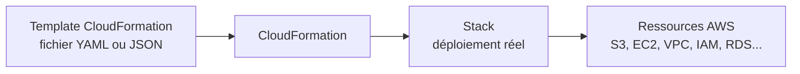
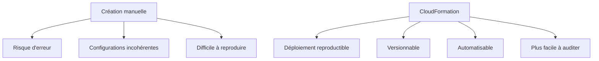
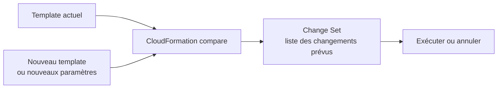
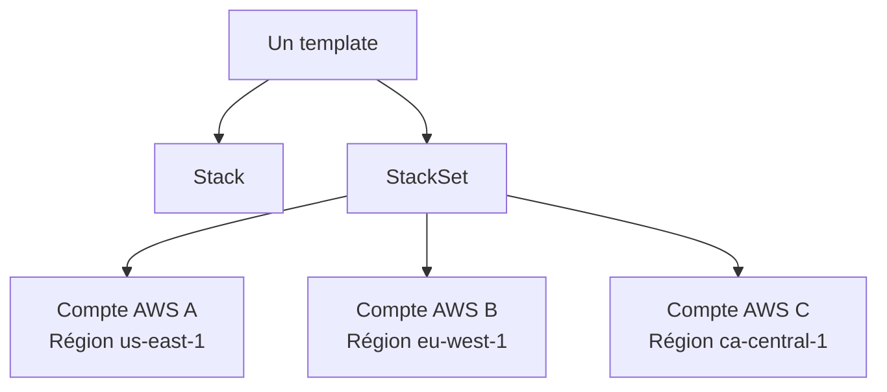
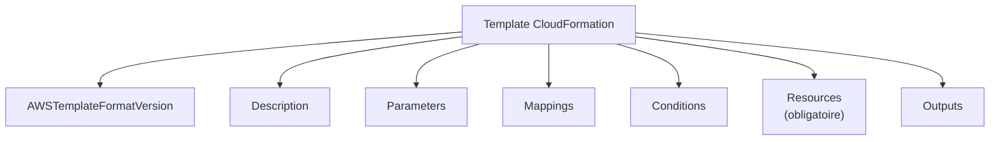
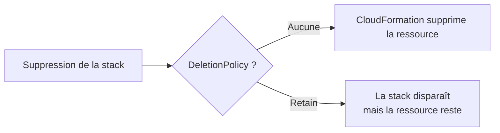
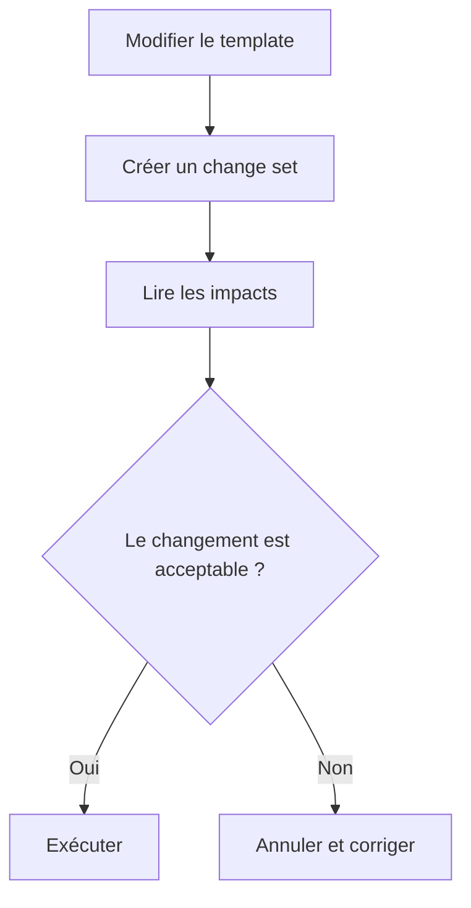
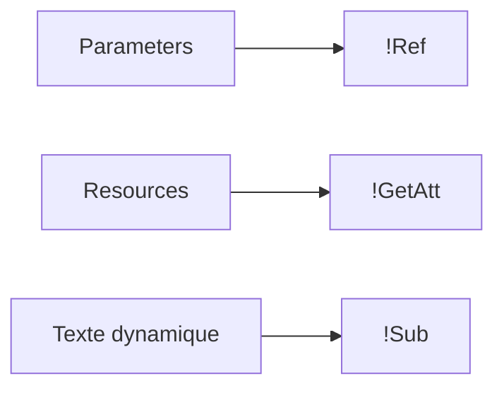
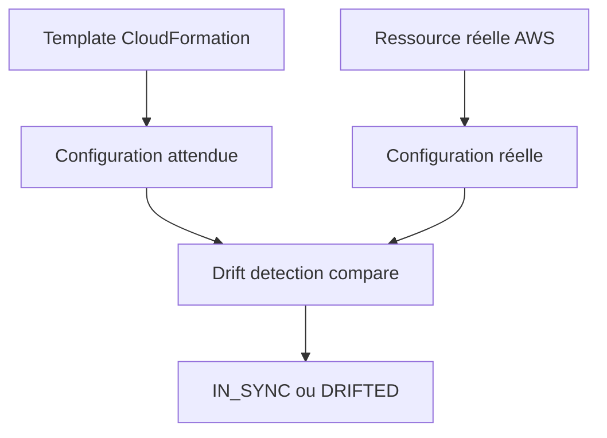
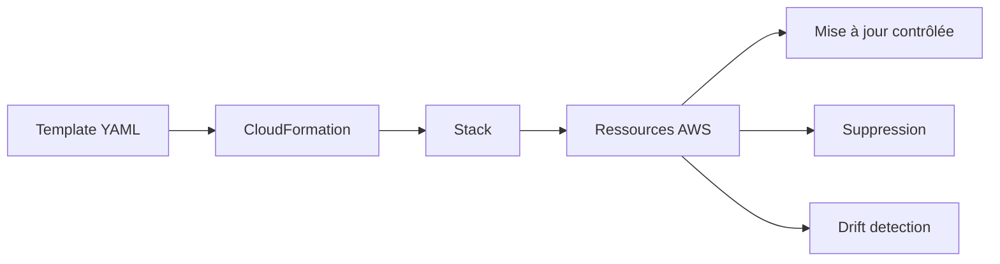

<a id="top"></a>

# AWS CloudFormation — Des bases à la pratique

## Table of Contents

| #  | Section                                                                                        |
| -- | ---------------------------------------------------------------------------------------------- |
| 1  | [Qu’est-ce qu’AWS CloudFormation ?](#section-1)                                                |
| 2  | [Pourquoi utiliser CloudFormation ?](#section-2)                                               |
| 3  | [Concepts clés : template, stack, change set, drift, StackSets](#section-3)                    |
| 4  | [Anatomie d’un template CloudFormation](#section-4)                                            |
| 4a |    ↳ [Sections principales : Resources, Parameters, Outputs, Mappings, Conditions](#section-4) |
| 5  | [Premier template YAML — créer un bucket S3](#section-5)                                       |
| 5a |    ↳ [Comprendre `AWSTemplateFormatVersion`, `Description`, `Resources`](#section-5)           |
| 5b |    ↳ [Pourquoi `DeletionPolicy` est important](#section-5)                                     |
| 6  | [Créer, mettre à jour et supprimer une stack](#section-6)                                      |
| 6a |    ↳ [Avec la console AWS](#section-6)                                                         |
| 6b |    ↳ [Avec AWS CLI](#section-6)                                                                |
| 6c |    ↳ [Pourquoi utiliser les change sets](#section-6)                                           |
| 7  | [Paramètres, références et fonctions intrinsèques](#section-7)                                 |
| 7a |    ↳ [`Ref`, `Fn::Sub`, `Fn::GetAtt`](#section-7)                                              |
| 8  | [Détection de dérive (drift) et gestion propre des ressources](#section-8)                     |
| 9  | [Bonnes pratiques pour débuter](#section-9)                                                    |
| 10 | [Exemple complet — bucket S3 paramétrable](#section-10)                                        |
| 11 | [Résumé des commandes](#section-11)                                                            |
| 12 | [Conclusion](#section-12)                                                                      |

---

<a id="section-1"></a>

<details>
<summary>1 - Qu’est-ce qu’AWS CloudFormation ?</summary>

<br/>

**AWS CloudFormation** est le service d’Infrastructure as Code (IaC) d’AWS. Il permet de **décrire l’infrastructure dans un fichier texte appelé template**, puis de laisser AWS **provisionner et configurer automatiquement** les ressources définies dans ce fichier. AWS décrit CloudFormation comme un service qui aide à modéliser et mettre en place les ressources AWS à partir d’un template, afin de réduire la gestion manuelle. ([docs.aws.amazon.com][1])

Un **template** CloudFormation définit les ressources souhaitées. Une **stack** est le déploiement concret de ce template. AWS précise qu’à partir d’un même template, on peut créer plusieurs stacks, chacune représentant un ensemble de ressources géré comme une unité. ([docs.aws.amazon.com][2])



---

### Une image simple pour comprendre

Au lieu d’ouvrir la console AWS et de créer manuellement un bucket S3, puis une instance EC2, puis un VPC, vous écrivez un fichier qui dit :

* je veux un bucket S3
* je veux une instance EC2
* je veux tel réseau
* je veux telles sorties

CloudFormation lit ce fichier et exécute la création dans le bon ordre. ([docs.aws.amazon.com][3])

---

### Pourquoi on parle d’Infrastructure as Code

Parce que l’infrastructure n’est plus créée “à la main” dans la console. Elle est :

* **déclarée dans du code**
* **versionnée dans Git**
* **reproductible**
* **automatisable dans CI/CD**

CloudFormation fait partie des outils AWS natifs pour cette approche. ([docs.aws.amazon.com][1])

---

<details>
<summary>Analogie simple pour comprendre</summary>
<br/>

CloudFormation, c'est comme une **recette de cuisine**. Au lieu de cuisiner à l'improvisation (créer des ressources à la main dans la console), vous écrivez une recette complète : les ingrédients (ressources), les quantités (configurations), l'ordre de préparation (dépendances). Ensuite, vous donnez la recette au chef (CloudFormation) et il prépare le plat exactement comme décrit. Si vous voulez refaire le même plat demain, vous réutilisez la même recette et vous obtenez le même résultat à chaque fois.

</details>

</details>

<p align="right"><a href="#top">↑ Back to top</a></p>

---

<a id="section-2"></a>

<details>
<summary>2 - Pourquoi utiliser CloudFormation ?</summary>

<br/>

CloudFormation sert à **standardiser**, **reproduire** et **sécuriser** le déploiement des ressources AWS. Plutôt que de cliquer manuellement dans la console, vous définissez l’état attendu, puis CloudFormation s’occupe de créer et mettre à jour les ressources. ([docs.aws.amazon.com][1])



---

### Avantages principaux

#### 1. Reproductibilité

Le même template peut être rejoué plusieurs fois pour recréer la même infrastructure, par exemple en dev, test et prod. AWS indique explicitement qu’un même template peut servir de base à plusieurs stacks. ([docs.aws.amazon.com][2])

#### 2. Gestion centralisée

CloudFormation gère les ressources d’une stack comme **une seule unité logique**. Cela simplifie la création, la mise à jour et la suppression. ([docs.aws.amazon.com][4])

#### 3. Mises à jour contrôlées

Lors d’une mise à jour, CloudFormation compare le template actuel avec les changements soumis et ne modifie que les ressources concernées. Certaines mises à jour peuvent interrompre ou remplacer des ressources selon les propriétés modifiées. ([docs.aws.amazon.com][4])

#### 4. Réduction du drift opérationnel

Quand les ressources sont modifiées manuellement en dehors de CloudFormation, on perd la cohérence entre le template et la réalité. AWS propose la **drift detection** pour identifier ces écarts. ([docs.aws.amazon.com][5])

#### 5. Base solide pour le DevOps

AWS recommande notamment de gérer les ressources via CloudFormation, d’utiliser le contrôle de version, le code review, les change sets et le tagging. ([docs.aws.amazon.com][6])

</details>

<p align="right"><a href="#top">↑ Back to top</a></p>

---

<a id="section-3"></a>

<details>
<summary>3 - Concepts clés : template, stack, change set, drift, StackSets</summary>

<br/>

Avant d’écrire un template, il faut maîtriser le vocabulaire de base.

---

### Template

Un **template** est un fichier YAML ou JSON qui décrit les ressources AWS et leur configuration. AWS documente les deux formats et la structure générale du template. ([docs.aws.amazon.com][7])

---

### Stack

Une **stack** est l’instance déployée du template. Elle contient les ressources créées et leur cycle de vie. AWS parle de gestion des ressources “as a single unit”. ([docs.aws.amazon.com][2])

---

### Change set

Un **change set** permet de prévisualiser les changements avant l’exécution d’une mise à jour. AWS précise qu’un change set compare la stack actuelle avec le template modifié ou de nouveaux paramètres, sans appliquer les changements immédiatement. ([docs.aws.amazon.com][8])



---

### Drift

Le **drift** signifie qu’une ressource a été modifiée en dehors de CloudFormation, donc que la configuration réelle ne correspond plus à la définition du template. AWS précise que la détection de dérive compare la configuration réelle à la configuration attendue définie dans le template et les paramètres. ([docs.aws.amazon.com][5])

---

### StackSets

Les **StackSets** étendent le principe de stack pour permettre le déploiement sur **plusieurs comptes AWS et plusieurs régions** à partir d’un seul modèle géré centralement. ([docs.aws.amazon.com][9])



---

### Résumé ultra simple

| Terme      | Signification                             |
| ---------- | ----------------------------------------- |
| Template   | Le fichier de définition                  |
| Stack      | Le déploiement réel                       |
| Change set | L’aperçu des changements                  |
| Drift      | L’écart entre le template et la réalité   |
| StackSet   | Déploiement multi-comptes / multi-régions |

---

<details>
<summary>En résumé très simple</summary>
<br/>

- Un **template**, c'est votre liste d'achats — ce que vous voulez créer
- Une **stack**, c'est le panier rempli — ce qui a été réellement créé
- Un **change set**, c'est un aperçu avant de passer à la caisse — vous vérifiez avant de valider
- Le **drift**, c'est quand quelqu'un a touché à votre panier sans vous le dire

</details>

</details>

<p align="right"><a href="#top">↑ Back to top</a></p>

---

<a id="section-4"></a>

<details>
<summary>4 - Anatomie d’un template CloudFormation</summary>

<br/>

Un template CloudFormation est structuré en sections. AWS indique que **`Resources` est la seule section obligatoire** et qu’elle constitue le cœur du template. Les autres sections, comme `Parameters`, `Mappings`, `Conditions` et `Outputs`, sont optionnelles mais très utiles. ([docs.aws.amazon.com][10])



---

### Les sections principales

#### `Resources`

C’est la section **obligatoire**. Elle déclare les ressources à créer et configurer dans la stack. Chaque ressource a un **logical ID**, un **type**, et des **properties**. ([docs.aws.amazon.com][11])

#### `Parameters`

Cette section permet de rendre le template dynamique. AWS précise que chaque paramètre reçoit une valeur au moment de l’exécution, sauf si une valeur par défaut est définie. Les paramètres peuvent être référencés dans `Resources` et `Outputs`. ([docs.aws.amazon.com][12])

#### `Outputs`

Les sorties exposent des valeurs utiles après déploiement, par exemple un nom de bucket, un ARN ou un ID de VPC. AWS indique aussi qu’elles peuvent être exportées pour être réutilisées dans d’autres stacks. ([docs.aws.amazon.com][13])

#### `Mappings`

Cette section sert à stocker des couples clé-valeur, souvent pour adapter des valeurs selon une région, un environnement ou un cas d’usage. ([docs.aws.amazon.com][14])

#### `Conditions`

Les conditions permettent de créer ou configurer des ressources selon une logique conditionnelle. AWS indique que ces conditions sont évaluées au moment de la création ou de la mise à jour. ([docs.aws.amazon.com][15])

---

### Important : logical ID vs physical ID

Dans le template, vous nommez les ressources avec un **logical ID** comme `MyBucket`. Ensuite, AWS crée une ressource réelle avec un identifiant physique ou un nom effectif selon le type de ressource. La documentation des ressources et de la section `Resources` fait cette distinction. ([docs.aws.amazon.com][11])

</details>

<p align="right"><a href="#top">↑ Back to top</a></p>

---

<a id="section-5"></a>

<details>
<summary>5 - Premier template YAML — créer un bucket S3</summary>

<br/>

Pour commencer simplement, on va créer un bucket S3 avec un template minimal. AWS documente la ressource `AWS::S3::Bucket` et précise qu’elle crée un bucket dans la même région que la stack. ([docs.aws.amazon.com][16])

---

### Template minimal

```yaml
AWSTemplateFormatVersion: '2010-09-09'
Description: Premier template CloudFormation - création d'un bucket S3 simple

Resources:
  MonBucketS3:
    Type: AWS::S3::Bucket
```

---

### Comprendre ce template

#### `AWSTemplateFormatVersion`

C’est la version du format de template. En pratique, on voit souvent `2010-09-09` dans les exemples CloudFormation. La documentation du format de template l’utilise comme référence standard. ([docs.aws.amazon.com][7])

#### `Description`

Une description lisible par humain. Elle n’est pas obligatoire, mais elle est très utile.

#### `Resources`

Ici, la ressource s’appelle `MonBucketS3`. C’est son **logical ID**.

#### `Type: AWS::S3::Bucket`

Cela indique à CloudFormation quel type de ressource créer. AWS maintient un catalogue de types supportés dans la référence des ressources. ([docs.aws.amazon.com][17])

---

### Ajouter une protection simple avec `DeletionPolicy`

Pour S3, c’est très important. AWS explique que si un bucket contient des objets, sa suppression peut échouer, et que `DeletionPolicy` permet de contrôler le comportement lors de la suppression de la stack. ([docs.aws.amazon.com][16])

```yaml
AWSTemplateFormatVersion: '2010-09-09'
Description: Bucket S3 avec politique de conservation

Resources:
  MonBucketS3:
    Type: AWS::S3::Bucket
    DeletionPolicy: Retain
```

---

### Pourquoi `DeletionPolicy: Retain` est utile

Sans `DeletionPolicy`, CloudFormation supprime les ressources par défaut lors de la suppression de la stack. AWS indique explicitement que `DeletionPolicy` permet de préserver une ressource, et que sans cet attribut, la suppression est le comportement par défaut. ([docs.aws.amazon.com][18])



---

### Point d’attention pour S3

AWS rappelle qu’un bucket S3 ne peut être supprimé que s’il est vide. Si le bucket contient des objets, la suppression échoue. ([docs.aws.amazon.com][16])

---

<details>
<summary>Analogie simple pour comprendre</summary>
<br/>

`DeletionPolicy`, c'est comme une **assurance habitation**. Sans assurance (sans `DeletionPolicy`), si vous démolissez la maison (supprimez la stack), tout disparaît. Avec `DeletionPolicy: Retain`, c'est comme dire : « même si je quitte le quartier, je garde le coffre-fort ». La stack disparaît, mais la ressource précieuse (comme un bucket avec vos données) reste intacte.

</details>

</details>

<p align="right"><a href="#top">↑ Back to top</a></p>

---

<a id="section-6"></a>

<details>
<summary>6 - Créer, mettre à jour et supprimer une stack</summary>

<br/>

Une fois le template prêt, il faut le déployer sous forme de stack.

---

### Avec la console AWS

AWS propose un parcours de démarrage via la console pour créer une première stack, suivre les événements, puis consulter les outputs. ([docs.aws.amazon.com][19])

#### Étapes générales

1. Ouvrir le service **CloudFormation**
2. Cliquer sur **Create stack**
3. Choisir un template local ou un template stocké sur S3
4. Donner un nom à la stack
5. Fournir les paramètres si nécessaire
6. Lancer la création
7. Suivre les événements de déploiement

---

### Avec AWS CLI

```bash
aws cloudformation create-stack \
  --stack-name ma-premiere-stack \
  --template-body file://bucket-simple.yaml
```

Pour mettre à jour :

```bash
aws cloudformation update-stack \
  --stack-name ma-premiere-stack \
  --template-body file://bucket-simple.yaml
```

Pour supprimer :

```bash
aws cloudformation delete-stack \
  --stack-name ma-premiere-stack
```

Les actions de drift detection existent aussi dans AWS CLI, notamment `detect-stack-drift`, `describe-stack-drift-detection-status` et `describe-stack-resource-drifts`. ([docs.aws.amazon.com][20])

---

### Pourquoi utiliser les change sets avant une mise à jour

AWS recommande de créer des **change sets** avant les mises à jour. Ils permettent de voir si une ressource sera modifiée sur place, recréée ou supprimée. ([docs.aws.amazon.com][8])



---

### Idée importante pour débutants

Une mise à jour CloudFormation n’est pas toujours “sans risque”. AWS précise que certaines propriétés peuvent entraîner une interruption ou un remplacement complet de la ressource. ([docs.aws.amazon.com][4])

</details>

<p align="right"><a href="#top">↑ Back to top</a></p>

---

<a id="section-7"></a>

<details>
<summary>7 - Paramètres, références et fonctions intrinsèques</summary>

<br/>

Les templates deviennent puissants quand ils utilisent des **paramètres** et des **fonctions intrinsèques**.

AWS explique que les fonctions intrinsèques peuvent être utilisées dans certaines parties du template, notamment dans les propriétés des ressources et dans les outputs. Parmi les plus utilisées : `Ref`, `Sub`, `GetAtt` et `Join`. ([docs.aws.amazon.com][21])

---

### Exemple avec paramètre

```yaml
AWSTemplateFormatVersion: '2010-09-09'
Description: Bucket S3 paramétrable

Parameters:
  NomDuBucket:
    Type: String
    Description: Nom du bucket S3 à créer

Resources:
  MonBucketS3:
    Type: AWS::S3::Bucket
    Properties:
      BucketName: !Ref NomDuBucket

Outputs:
  BucketCree:
    Description: Nom du bucket créé
    Value: !Ref MonBucketS3
```

AWS précise que `Ref` retourne la valeur d’un paramètre, d’une ressource ou d’une autre fonction intrinsèque selon le contexte. Pour une ressource, `Ref` retourne souvent son identifiant physique ou une valeur associée au type concerné. ([docs.aws.amazon.com][22])

---

### `Ref`

**But :** récupérer la valeur d’un paramètre ou la référence d’une ressource. ([docs.aws.amazon.com][22])

```yaml
BucketName: !Ref NomDuBucket
```

---

### `Fn::Sub` / `!Sub`

**But :** construire une chaîne de caractères dynamique avec substitution de variables. AWS indique que `Fn::Sub` remplace des variables dans une chaîne par les valeurs correspondantes. ([docs.aws.amazon.com][23])

```yaml
Description: !Sub "Bucket créé dans la stack ${AWS::StackName}"
```

---

### `Fn::GetAtt` / `!GetAtt`

**But :** récupérer un attribut précis d’une ressource. AWS documente `Fn::GetAtt` comme la fonction permettant de lire un attribut d’une ressource du template. ([docs.aws.amazon.com][24])

Exemple typique :

```yaml
Value: !GetAtt MonBucketS3.Arn
```

---

### Résumé rapide

| Fonction | Rôle                                          |
| -------- | --------------------------------------------- |
| `Ref`    | Lire un paramètre ou référencer une ressource |
| `Sub`    | Construire une chaîne dynamique               |
| `GetAtt` | Lire un attribut précis d’une ressource       |



---

<details>
<summary>En résumé très simple</summary>
<br/>

- `!Ref` = « donne-moi la valeur de ce truc » — comme demander le numéro de téléphone de quelqu'un dans votre carnet de contacts
- `!Sub` = « construis-moi une phrase avec des blancs à remplir » — comme un modèle de lettre avec des `[NOM]` à remplacer
- `!GetAtt` = « donne-moi un détail précis sur cette ressource » — comme demander non pas le numéro, mais spécifiquement l'adresse email

</details>

</details>

<p align="right"><a href="#top">↑ Back to top</a></p>

---

<a id="section-8"></a>

<details>
<summary>8 - Détection de dérive (drift) et gestion propre des ressources</summary>

<br/>

Même si vous utilisez CloudFormation, quelqu’un peut aller dans la console AWS et modifier une ressource à la main. C’est exactement le problème du **drift**. AWS explique que la drift detection sert à identifier les ressources dont la configuration réelle a changé en dehors de la gestion CloudFormation. ([docs.aws.amazon.com][5])

---

### Pourquoi c’est un problème

Si votre template dit une chose, mais que la ressource réelle en fait une autre, alors :

* la stack n’est plus fidèle au code
* les prochaines mises à jour peuvent devenir risquées
* la suppression peut échouer ou produire un résultat inattendu

AWS souligne que les changements effectués en dehors de CloudFormation compliquent les opérations de mise à jour ou de suppression. ([docs.aws.amazon.com][5])

---

### Comment détecter le drift

Console :

* ouvrir la stack
* choisir **Detect drift**

CLI :

```bash
aws cloudformation detect-stack-drift --stack-name ma-premiere-stack
```

Puis :

```bash
aws cloudformation describe-stack-drift-detection-status \
  --stack-drift-detection-id <ID_RETOURNE>
```

AWS documente précisément ce flux côté console et CLI. ([docs.aws.amazon.com][20])

---

### Limite importante

AWS précise que seules les propriétés **explicitement définies dans le template** sont vérifiées pour le drift. ([docs.aws.amazon.com][25])



</details>

<p align="right"><a href="#top">↑ Back to top</a></p>

---

<a id="section-9"></a>

<details>
<summary>9 - Bonnes pratiques pour débuter</summary>

<br/>

AWS recommande plusieurs bonnes pratiques pour CloudFormation, notamment : gérer les ressources via CloudFormation, créer des change sets avant les mises à jour, utiliser les stack policies pour protéger certaines ressources, versionner les templates, appliquer une stratégie de tags et utiliser CloudTrail pour journaliser les appels CloudFormation. ([docs.aws.amazon.com][6])

---

### Recommandations simples

#### 1. Toujours versionner les templates dans Git

Cela permet de savoir qui a changé quoi et quand.

#### 2. Préférer YAML pour l’apprentissage

CloudFormation accepte YAML et JSON, mais YAML est généralement plus lisible pour les humains. AWS documente les deux formats. ([docs.aws.amazon.com][7])

#### 3. Commencer petit

Débutez avec :

* un bucket S3
* une stack simple
* un paramètre
* un output

#### 4. Utiliser `DeletionPolicy` pour les ressources sensibles

En particulier pour les buckets S3 ou certaines bases de données. AWS précise que sans politique spécifique, les ressources sont supprimées par défaut lors de la suppression de la stack. ([docs.aws.amazon.com][18])

#### 5. Éviter les changements manuels dans la console

Sinon vous créez du drift. ([docs.aws.amazon.com][5])

#### 6. Lire les événements de stack

Quand une stack échoue, les événements donnent souvent la vraie cause : permissions IAM insuffisantes, nom déjà utilisé, propriété invalide, dépendance manquante, etc.

</details>

<p align="right"><a href="#top">↑ Back to top</a></p>

---

<a id="section-10"></a>

<details>
<summary>10 - Exemple complet — bucket S3 paramétrable</summary>

<br/>

Voici un exemple un peu plus propre, prêt à copier-coller.

```yaml
AWSTemplateFormatVersion: '2010-09-09'
Description: Exemple CloudFormation de base - bucket S3 paramétrable

Parameters:
  NomDuBucket:
    Type: String
    Description: Nom unique du bucket S3

Resources:
  MonBucketS3:
    Type: AWS::S3::Bucket
    DeletionPolicy: Retain
    Properties:
      BucketName: !Ref NomDuBucket

Outputs:
  NomBucket:
    Description: Nom du bucket créé
    Value: !Ref MonBucketS3

  ArnBucket:
    Description: ARN du bucket créé
    Value: !GetAtt MonBucketS3.Arn

  MessageInfo:
    Description: Message informatif
    Value: !Sub "Le bucket ${NomDuBucket} appartient à la stack ${AWS::StackName}"
```

---

### Ce que fait ce template

* demande un nom de bucket via `Parameters`
* crée un bucket S3
* conserve le bucket si la stack est supprimée grâce à `DeletionPolicy: Retain`
* expose le nom et l’ARN dans `Outputs`
* construit un message dynamique avec `!Sub`

Les usages de `Parameters`, `Outputs`, `Ref`, `Sub` et `GetAtt` correspondent à la documentation officielle des sections et fonctions intrinsèques CloudFormation. ([docs.aws.amazon.com][12])

---

### Lancer le déploiement avec AWS CLI

```bash
aws cloudformation create-stack \
  --stack-name bucket-s3-demo \
  --template-body file://bucket-parametrable.yaml \
  --parameters ParameterKey=NomDuBucket,ParameterValue=mon-bucket-demo-unique-12345
```

---

### Ce qu’il faut vérifier après création

* la stack passe à l’état **CREATE_COMPLETE**
* le bucket existe bien dans S3
* les `Outputs` sont visibles dans CloudFormation
* le nom du bucket est bien unique

AWS rappelle que les buckets S3 sont créés dans la région de la stack CloudFormation. ([docs.aws.amazon.com][16])

</details>

<p align="right"><a href="#top">↑ Back to top</a></p>

---

<a id="section-11"></a>

<details>
<summary>11 - Résumé des commandes</summary>

<br/>

```bash
# Vérifier que AWS CLI est installé
aws --version

# Créer une stack
aws cloudformation create-stack \
  --stack-name ma-premiere-stack \
  --template-body file://bucket-simple.yaml

# Créer une stack avec paramètres
aws cloudformation create-stack \
  --stack-name bucket-s3-demo \
  --template-body file://bucket-parametrable.yaml \
  --parameters ParameterKey=NomDuBucket,ParameterValue=mon-bucket-demo-unique-12345

# Mettre à jour une stack
aws cloudformation update-stack \
  --stack-name bucket-s3-demo \
  --template-body file://bucket-parametrable.yaml \
  --parameters ParameterKey=NomDuBucket,ParameterValue=mon-bucket-demo-unique-12345

# Supprimer une stack
aws cloudformation delete-stack \
  --stack-name bucket-s3-demo

# Détecter le drift
aws cloudformation detect-stack-drift \
  --stack-name bucket-s3-demo

# Voir l'état de détection du drift
aws cloudformation describe-stack-drift-detection-status \
  --stack-drift-detection-id <ID_RETOURNE>
```

Les opérations de drift detection et la logique de suppression de stack sont documentées par AWS dans le guide utilisateur et la référence CLI. ([docs.aws.amazon.com][20])

</details>

<p align="right"><a href="#top">↑ Back to top</a></p>

---

<a id="section-12"></a>

<details>
<summary>12 - Conclusion</summary>

<br/>

CloudFormation est la base de l’Infrastructure as Code native sur AWS. Il permet de **décrire**, **déployer**, **mettre à jour** et **contrôler** une infrastructure via des templates YAML ou JSON. AWS définit le template comme la description des ressources et la stack comme son déploiement réel. ([docs.aws.amazon.com][2])

Dans ce premier cours, on a vu :

* ce qu’est CloudFormation
* pourquoi il est utile
* les notions de template, stack, change set, drift et StackSets
* la structure d’un template
* un premier exemple concret avec un bucket S3
* les bases des paramètres et fonctions intrinsèques
* les commandes essentielles pour créer, mettre à jour et supprimer une stack



### Suite logique du prochain chapitre

Le prochain cours va porter sur :

* **les ressources CloudFormation plus avancées**
* **VPC + Subnet + Security Group**
* **EC2 avec paramètres**
* **Outputs exportés**
* **Conditions et Mappings**
* **change sets en pratique**
* **CI/CD avec CloudFormation**

</details>

<p align="right"><a href="#top">↑ Back to top</a></p>


[1]: https://docs.aws.amazon.com/AWSCloudFormation/latest/UserGuide/Welcome.html?utm_source=chatgpt.com "What is CloudFormation?"
[2]: https://docs.aws.amazon.com/AWSCloudFormation/latest/UserGuide/GettingStarted.html?utm_source=chatgpt.com "Getting started with CloudFormation - AWS Documentation"
[3]: https://docs.aws.amazon.com/AWSCloudFormation/latest/UserGuide/cloudformation-overview.html?utm_source=chatgpt.com "How CloudFormation works"
[4]: https://docs.aws.amazon.com/AWSCloudFormation/latest/UserGuide/stacks.html?utm_source=chatgpt.com "Managing AWS resources as a single unit with ..."
[5]: https://docs.aws.amazon.com/AWSCloudFormation/latest/UserGuide/using-cfn-stack-drift.html?utm_source=chatgpt.com "Detect unmanaged configuration changes to stacks and ..."
[6]: https://docs.aws.amazon.com/AWSCloudFormation/latest/UserGuide/best-practices.html?utm_source=chatgpt.com "CloudFormation best practices"
[7]: https://docs.aws.amazon.com/AWSCloudFormation/latest/UserGuide/template-formats.html?utm_source=chatgpt.com "CloudFormation template format"
[8]: https://docs.aws.amazon.com/AWSCloudFormation/latest/UserGuide/using-cfn-updating-stacks-changesets.html?utm_source=chatgpt.com "Update CloudFormation stacks using change sets"
[9]: https://docs.aws.amazon.com/AWSCloudFormation/latest/UserGuide/what-is-cfnstacksets.html?utm_source=chatgpt.com "Managing stacks across accounts and Regions with ..."
[10]: https://docs.aws.amazon.com/AWSCloudFormation/latest/UserGuide/template-anatomy.html?utm_source=chatgpt.com "CloudFormation template sections"
[11]: https://docs.aws.amazon.com/AWSCloudFormation/latest/UserGuide/resources-section-structure.html?utm_source=chatgpt.com "CloudFormation template Resources syntax"
[12]: https://docs.aws.amazon.com/AWSCloudFormation/latest/UserGuide/parameters-section-structure.html?utm_source=chatgpt.com "CloudFormation template Parameters syntax"
[13]: https://docs.aws.amazon.com/AWSCloudFormation/latest/UserGuide/outputs-section-structure.html?utm_source=chatgpt.com "CloudFormation template Outputs syntax"
[14]: https://docs.aws.amazon.com/AWSCloudFormation/latest/UserGuide/mappings-section-structure.html?utm_source=chatgpt.com "CloudFormation template Mappings syntax"
[15]: https://docs.aws.amazon.com/AWSCloudFormation/latest/TemplateReference/intrinsic-function-reference-conditions.html?utm_source=chatgpt.com "Condition functions - AWS CloudFormation"
[16]: https://docs.aws.amazon.com/AWSCloudFormation/latest/TemplateReference/aws-resource-s3-bucket.html?utm_source=chatgpt.com "AWS::S3::Bucket - AWS CloudFormation"
[17]: https://docs.aws.amazon.com/AWSCloudFormation/latest/TemplateReference/aws-template-resource-type-ref.html?utm_source=chatgpt.com "AWS resource and property types reference"
[18]: https://docs.aws.amazon.com/AWSCloudFormation/latest/TemplateReference/aws-attribute-deletionpolicy.html?utm_source=chatgpt.com "DeletionPolicy attribute - AWS CloudFormation"
[19]: https://docs.aws.amazon.com/AWSCloudFormation/latest/UserGuide/gettingstarted.walkthrough.html?utm_source=chatgpt.com "Creating your first stack - AWS CloudFormation"
[20]: https://docs.aws.amazon.com/AWSCloudFormation/latest/UserGuide/detect-drift-stack.html?utm_source=chatgpt.com "Detect drift on an entire CloudFormation stack"
[21]: https://docs.aws.amazon.com/AWSCloudFormation/latest/TemplateReference/intrinsic-function-reference.html?utm_source=chatgpt.com "Intrinsic function reference - AWS CloudFormation"
[22]: https://docs.aws.amazon.com/AWSCloudFormation/latest/TemplateReference/intrinsic-function-reference-ref.html?utm_source=chatgpt.com "Ref - AWS CloudFormation"
[23]: https://docs.aws.amazon.com/AWSCloudFormation/latest/TemplateReference/intrinsic-function-reference-sub.html?utm_source=chatgpt.com "Fn::Sub - AWS CloudFormation"
[24]: https://docs.aws.amazon.com/AWSCloudFormation/latest/TemplateReference/intrinsic-function-reference-getatt.html?utm_source=chatgpt.com "Fn::GetAtt - AWS CloudFormation"
[25]: https://docs.aws.amazon.com/AWSCloudFormation/latest/APIReference/API_DetectStackDrift.html?utm_source=chatgpt.com "DetectStackDrift - AWS CloudFormation"
