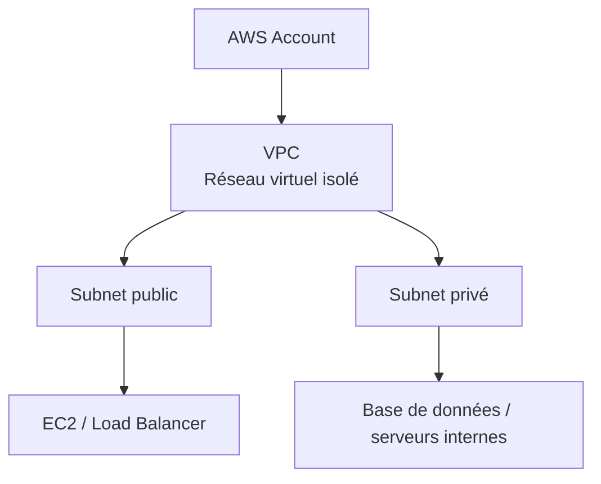
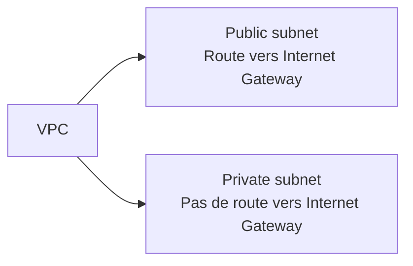
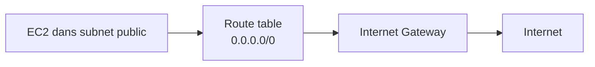
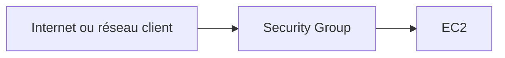
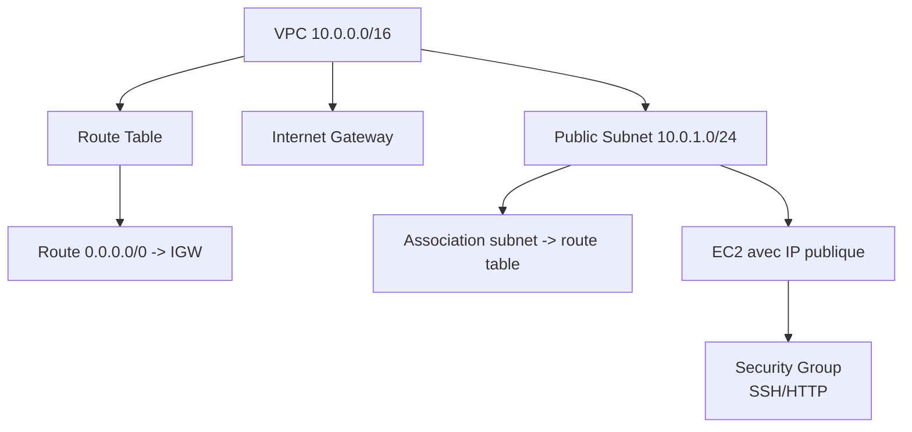
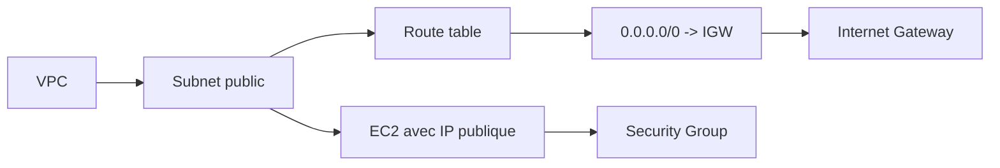

<a id="top"></a>

# AWS CloudFormation — Réseau de base avec VPC, Subnet, Internet Gateway et Security Group

## Table of Contents

| #  | Section                                                                                               |
| -- | ----------------------------------------------------------------------------------------------------- |
| 1  | [Qu’est-ce qu’un VPC dans AWS ?](#section-1)                                                          |
| 2  | [Public subnet vs private subnet](#section-2)                                                         |
| 3  | [Route tables et Internet Gateway](#section-3)                                                        |
| 4  | [Security Groups — le pare-feu de base](#section-4)                                                   |
| 5  | [Ressources CloudFormation à connaître pour le réseau](#section-5)                                    |
| 5a |    ↳ [`AWS::EC2::VPC`](#section-5)                                                                    |
| 5b |    ↳ [`AWS::EC2::Subnet`](#section-5)                                                                 |
| 5c |    ↳ [`AWS::EC2::InternetGateway`](#section-5)                                                        |
| 5d |    ↳ [`AWS::EC2::RouteTable`, `AWS::EC2::Route`, `AWS::EC2::SubnetRouteTableAssociation`](#section-5) |
| 5e |    ↳ [`AWS::EC2::SecurityGroup`](#section-5)                                                          |
| 6  | [Architecture minimale d’un réseau public](#section-6)                                                |
| 7  | [Premier template réseau complet en YAML](#section-7)                                                 |
| 7a |    ↳ [Lecture ligne par ligne](#section-7)                                                            |
| 8  | [Déployer la stack](#section-8)                                                                       |
| 8a |    ↳ [Console AWS](#section-8)                                                                        |
| 8b |    ↳ [AWS CLI](#section-8)                                                                            |
| 9  | [Erreurs fréquentes chez les débutants](#section-9)                                                   |
| 10 | [Exemple avec paramètres](#section-10)                                                                |
| 11 | [Résumé des commandes](#section-11)                                                                   |
| 12 | [Conclusion](#section-12)                                                                             |

---

<a id="section-1"></a>

<details>
<summary>1 - Qu’est-ce qu’un VPC dans AWS ?</summary>

<br/>

Un **VPC** (Virtual Private Cloud) est un réseau virtuel isolé dans AWS. C’est dans ce réseau que vous placez vos ressources, par exemple vos instances EC2, vos sous-réseaux, vos tables de routage et vos règles de sécurité. Dans CloudFormation, la ressource correspondante est `AWS::EC2::VPC`. AWS précise qu’un VPC doit avoir un bloc CIDR IPv4 associé. ([docs.aws.amazon.com][1])



---

### Pourquoi c’est important

Sans VPC, vous ne contrôlez pas correctement :

* l’adressage IP
* la séparation des sous-réseaux
* les chemins réseau
* les accès entrants et sortants

Le VPC est donc la base du réseau AWS, et CloudFormation permet de le décrire proprement dans un template. AWS documente aussi une référence dédiée aux snippets VPC avec CloudFormation. ([docs.aws.amazon.com][2])

---

### Premier exemple mental

Pense à un VPC comme à un immeuble vide.

* Le **VPC** = l’immeuble
* Les **subnets** = les étages ou les zones
* La **route table** = les panneaux de circulation
* L’**Internet Gateway** = la porte vers l’extérieur
* Le **Security Group** = le gardien qui décide qui peut entrer

---

<details>
<summary>Analogie simple pour comprendre</summary>
<br/>

Imagine que tu construis un **quartier résidentiel fermé**. Le **VPC**, c'est le terrain clôturé du quartier — tout ce qui se passe dedans est isolé de l'extérieur. Les **subnets**, ce sont les différentes rues ou zones du quartier : une zone commerciale (public) et une zone résidentielle calme (privé). L'**Internet Gateway**, c'est le portail principal qui donne sur la route publique. Et la **route table**, ce sont les panneaux qui indiquent « pour sortir, passez par le portail ». Sans panneau, même si le portail existe, personne ne sait comment sortir.

</details>

</details>

<p align="right"><a href="#top">↑ Back to top</a></p>

---

<a id="section-2"></a>

<details>
<summary>2 - Public subnet vs private subnet</summary>

<br/>

Un **subnet** est une portion du réseau du VPC. Dans CloudFormation, on utilise `AWS::EC2::Subnet`. AWS indique qu’un subnet est créé dans un VPC donné, avec un bloc CIDR IPv4 ou IPv6 selon le cas. ([docs.aws.amazon.com][3])

La différence entre **public subnet** et **private subnet** ne vient pas du subnet lui-même, mais principalement de la **table de routage associée**. AWS explique qu’un subnet est considéré comme **public** s’il est associé à une route table qui contient une route vers un internet gateway ; sinon il est **private**. ([docs.aws.amazon.com][4])



---

### Public subnet

Un subnet public sert souvent à héberger :

* une instance EC2 accessible
* un bastion host
* un load balancer public

Mais AWS précise qu’avoir une route vers un internet gateway ne suffit pas : pour communiquer sur Internet en IPv4, l’instance doit aussi avoir une **adresse IPv4 publique** ou une **Elastic IP**. ([docs.aws.amazon.com][4])

---

### Private subnet

Un subnet privé n’a pas de route directe vers l’internet gateway. Il est utilisé pour :

* les bases de données
* les services backend internes
* les composants non exposés publiquement

---

### Idée clé à retenir

Ce n’est pas parce qu’une ressource est dans AWS qu’elle est automatiquement “publique”. La combinaison décisive est :

1. subnet
2. route table
3. internet gateway
4. adresse IP publique si nécessaire

AWS l’explique explicitement dans le guide VPC sur l’accès Internet. ([docs.aws.amazon.com][4])

</details>

<p align="right"><a href="#top">↑ Back to top</a></p>

---

<a id="section-3"></a>

<details>
<summary>3 - Route tables et Internet Gateway</summary>

<br/>

Une **route table** agit comme le contrôleur du trafic d’un VPC. AWS indique qu’une route table contient des routes qui déterminent où le trafic réseau est dirigé depuis un subnet ou une gateway. Lorsqu’un VPC est créé, AWS crée aussi une **main route table**. ([docs.aws.amazon.com][5])

Dans CloudFormation, on utilise principalement :

* `AWS::EC2::RouteTable`
* `AWS::EC2::Route`
* `AWS::EC2::SubnetRouteTableAssociation`

AWS précise que `AWS::EC2::RouteTable` crée une route table pour un VPC, puis qu’on peut lui ajouter des routes et l’associer à un subnet. ([docs.aws.amazon.com][6])

---

### Internet Gateway

Un **Internet Gateway** permet aux ressources d’un subnet public de communiquer avec Internet, à condition qu’il soit attaché au VPC et que le routage soit configuré. AWS précise qu’il faut **attacher l’internet gateway au VPC** et configurer les routes pour l’utiliser. ([docs.aws.amazon.com][4])



---

### Route classique vers Internet

Pour l’IPv4, on crée souvent une route :

```text
0.0.0.0/0  -> Internet Gateway
```

AWS précise qu’un subnet public a généralement une route pour tout trafic internet (`0.0.0.0/0` pour IPv4 ou `::/0` pour IPv6) vers l’internet gateway. ([docs.aws.amazon.com][4])

---

### Association subnet ↔ route table

La ressource `AWS::EC2::SubnetRouteTableAssociation` associe un subnet à une route table. AWS indique que le subnet et la route table doivent être dans le même VPC. ([docs.aws.amazon.com][7])

---

<details>
<summary>En résumé très simple</summary>
<br/>

- Une **route table**, c'est un GPS pour le trafic réseau — elle dit « pour aller sur Internet, passe par l'Internet Gateway »
- L'**Internet Gateway**, c'est la porte de sortie de votre réseau vers le monde extérieur
- Sans route table qui pointe vers l'Internet Gateway, votre subnet est comme une pièce sans porte : isolée

</details>

</details>

<p align="right"><a href="#top">↑ Back to top</a></p>

---

<a id="section-4"></a>

<details>
<summary>4 - Security Groups — le pare-feu de base</summary>

<br/>

Un **Security Group** est un pare-feu virtuel attaché aux ressources compatibles, comme les instances EC2. AWS explique qu’il contrôle le trafic autorisé vers la ressource et qu’il agit comme un pare-feu virtuel. ([docs.aws.amazon.com][8])

Dans CloudFormation, on utilise `AWS::EC2::SecurityGroup`. AWS précise qu’il faut définir des règles **ingress** pour autoriser le trafic entrant, et que **par défaut aucun trafic entrant n’est autorisé**. ([docs.aws.amazon.com][9])



---

### Règles entrantes et sortantes

#### Ingress

Ce qui **entre** dans la ressource.

Exemple :

* autoriser SSH sur le port 22
* autoriser HTTP sur le port 80

#### Egress

Ce qui **sort** de la ressource.

AWS précise qu’à la création, si vous n’ajoutez pas de règles egress, AWS ajoute des règles qui autorisent tout le trafic sortant IPv4 et IPv6. ([docs.aws.amazon.com][9])

---

### Exemple simple

Un security group pour une instance web peut autoriser :

* TCP 22 depuis votre IP
* TCP 80 depuis `0.0.0.0/0`

---

### Attention

Un Security Group ne “rend pas public” un serveur à lui seul. Il faut aussi :

* que la ressource soit dans un subnet correctement routé
* qu’elle ait une IP publique si nécessaire
* que le Security Group ouvre le port voulu

AWS relie bien ces éléments dans sa documentation VPC et Security Groups. ([docs.aws.amazon.com][4])

---

<details>
<summary>Analogie simple pour comprendre</summary>
<br/>

Un Security Group, c'est comme le **videur d'une boîte de nuit**. Il a une liste précise : « TCP 22 depuis telle IP ? OK, tu entres. TCP 80 depuis n'importe où ? OK aussi. Tout le reste ? Dehors. » Par défaut, personne n'entre (aucun trafic entrant autorisé). Vous devez explicitement dire au videur qui a le droit de passer et par quelle porte (port). Et attention : même avec le meilleur videur du monde, si la boîte de nuit est dans une ruelle sans accès (subnet sans route Internet), personne ne pourra y arriver.

</details>

</details>

<p align="right"><a href="#top">↑ Back to top</a></p>

---

<a id="section-5"></a>

<details>
<summary>5 - Ressources CloudFormation à connaître pour le réseau</summary>

<br/>

Cette section résume les ressources de base que nous allons utiliser.

---

### `AWS::EC2::VPC`

Crée le VPC. AWS précise qu’un VPC doit avoir un bloc CIDR IPv4 associé. ([docs.aws.amazon.com][1])

```yaml
MonVPC:
  Type: AWS::EC2::VPC
  Properties:
    CidrBlock: 10.0.0.0/16
```

---

### `AWS::EC2::Subnet`

Crée un subnet dans un VPC donné. ([docs.aws.amazon.com][3])

```yaml
MonSubnetPublic:
  Type: AWS::EC2::Subnet
  Properties:
    VpcId: !Ref MonVPC
    CidrBlock: 10.0.1.0/24
```

---

### `AWS::EC2::InternetGateway`

Crée l’internet gateway. AWS précise qu’après sa création, il faut l’attacher au VPC. ([docs.aws.amazon.com][10])

```yaml
MonInternetGateway:
  Type: AWS::EC2::InternetGateway
```

L’attachement au VPC se fait avec `AWS::EC2::VPCGatewayAttachment` dans les templates CloudFormation VPC usuels d’AWS. La page de référence VPC CloudFormation fournit ces snippets réseau. ([docs.aws.amazon.com][2])

---

### `AWS::EC2::RouteTable`, `AWS::EC2::Route`, `AWS::EC2::SubnetRouteTableAssociation`

Ces trois ressources servent à :

* créer une table de routage
* ajouter une route
* associer cette table à un subnet

AWS documente chacune de ces briques séparément. ([docs.aws.amazon.com][6])

---

### `AWS::EC2::SecurityGroup`

Crée le Security Group. Par défaut, aucun trafic entrant n’est autorisé. ([docs.aws.amazon.com][9])

```yaml
MonSecurityGroupWeb:
  Type: AWS::EC2::SecurityGroup
  Properties:
    GroupDescription: Acces HTTP et SSH
    VpcId: !Ref MonVPC
```

</details>

<p align="right"><a href="#top">↑ Back to top</a></p>

---

<a id="section-6"></a>

<details>
<summary>6 - Architecture minimale d’un réseau public</summary>

<br/>

Voici l’architecture la plus simple pour héberger une machine accessible depuis Internet :



---

### Ce qu’il faut absolument

1. un VPC
2. un subnet
3. un internet gateway attaché au VPC
4. une route `0.0.0.0/0` vers l’internet gateway
5. l’association du subnet à cette route table
6. un Security Group qui ouvre les bons ports
7. une IP publique sur la ressource si elle doit être joignable depuis Internet

Les conditions 3, 4 et 7 sont bien précisées par la documentation VPC d’AWS sur l’accès Internet. ([docs.aws.amazon.com][4])

---

<details>
<summary>En résumé très simple</summary>
<br/>

- Pour qu'une machine soit accessible sur Internet, il faut **7 ingrédients** : VPC, subnet, Internet Gateway, attachement au VPC, route vers l'IGW, association subnet-route table, et une IP publique
- Si un seul maillon manque, ça ne marche pas — c'est comme une chaîne : un seul maillon cassé et tout lâche
- En CloudFormation, chaque maillon est une ressource distincte qu'il faut déclarer explicitement

</details>

</details>

<p align="right"><a href="#top">↑ Back to top</a></p>

---

<a id="section-7"></a>

<details>
<summary>7 - Premier template réseau complet en YAML</summary>

<br/>

Voici un template CloudFormation simple qui crée :

* un VPC
* un subnet public
* un internet gateway
* une route table publique
* une route vers Internet
* un Security Group

```yaml
AWSTemplateFormatVersion: '2010-09-09'
Description: Réseau public minimal avec VPC, subnet, route table, internet gateway et security group

Resources:
  MonVPC:
    Type: AWS::EC2::VPC
    Properties:
      CidrBlock: 10.0.0.0/16
      EnableDnsSupport: true
      EnableDnsHostnames: true
      Tags:
        - Key: Name
          Value: mon-vpc-demo

  MonSubnetPublic:
    Type: AWS::EC2::Subnet
    Properties:
      VpcId: !Ref MonVPC
      CidrBlock: 10.0.1.0/24
      MapPublicIpOnLaunch: true
      Tags:
        - Key: Name
          Value: mon-subnet-public

  MonInternetGateway:
    Type: AWS::EC2::InternetGateway
    Properties:
      Tags:
        - Key: Name
          Value: mon-igw-demo

  MonAttachementIGW:
    Type: AWS::EC2::VPCGatewayAttachment
    Properties:
      VpcId: !Ref MonVPC
      InternetGatewayId: !Ref MonInternetGateway

  MaRouteTablePublique:
    Type: AWS::EC2::RouteTable
    Properties:
      VpcId: !Ref MonVPC
      Tags:
        - Key: Name
          Value: route-table-publique

  MaRouteInternet:
    Type: AWS::EC2::Route
    DependsOn: MonAttachementIGW
    Properties:
      RouteTableId: !Ref MaRouteTablePublique
      DestinationCidrBlock: 0.0.0.0/0
      GatewayId: !Ref MonInternetGateway

  MonAssociationSubnetRouteTable:
    Type: AWS::EC2::SubnetRouteTableAssociation
    Properties:
      SubnetId: !Ref MonSubnetPublic
      RouteTableId: !Ref MaRouteTablePublique

  MonSecurityGroupWeb:
    Type: AWS::EC2::SecurityGroup
    Properties:
      GroupDescription: Autorise SSH et HTTP
      VpcId: !Ref MonVPC
      SecurityGroupIngress:
        - IpProtocol: tcp
          FromPort: 22
          ToPort: 22
          CidrIp: 0.0.0.0/0
        - IpProtocol: tcp
          FromPort: 80
          ToPort: 80
          CidrIp: 0.0.0.0/0
      Tags:
        - Key: Name
          Value: sg-web-demo

Outputs:
  VpcId:
    Description: ID du VPC créé
    Value: !Ref MonVPC

  PublicSubnetId:
    Description: ID du subnet public
    Value: !Ref MonSubnetPublic

  SecurityGroupId:
    Description: ID du security group
    Value: !Ref MonSecurityGroupWeb
```

Ce template s’appuie sur les types de ressources officiellement documentés par AWS pour VPC, subnet, internet gateway, route table, route, subnet association et security group. ([docs.aws.amazon.com][1])

---

### Lecture ligne par ligne

#### `EnableDnsSupport` et `EnableDnsHostnames`

Ces propriétés du VPC servent à activer les fonctionnalités DNS du VPC. Elles sont couramment utilisées dans les exemples VPC AWS. ([docs.aws.amazon.com][1])

#### `MapPublicIpOnLaunch: true`

Cela permet d’assigner automatiquement une IP publique aux instances lancées dans ce subnet. Cette propriété existe sur `AWS::EC2::Subnet`. ([docs.aws.amazon.com][3])

#### `DependsOn: MonAttachementIGW`

La route Internet dépend de l’attachement de l’internet gateway au VPC. Sans cela, le routage peut échouer au déploiement. Cette dépendance suit la logique d’AWS : l’internet gateway doit être attaché au VPC avant d’être utilisé comme cible de route. ([docs.aws.amazon.com][4])

#### `SecurityGroupIngress`

On ouvre ici :

* SSH 22
* HTTP 80

AWS précise que les règles ingress définissent le trafic entrant autorisé, et que sans elles, rien n’entre par défaut. ([docs.aws.amazon.com][9])

</details>

<p align="right"><a href="#top">↑ Back to top</a></p>

---

<a id="section-8"></a>

<details>
<summary>8 - Déployer la stack</summary>

<br/>

### Avec la console AWS

1. Ouvrir **CloudFormation**
2. Cliquer sur **Create stack**
3. Choisir **With new resources**
4. Importer le fichier YAML
5. Donner un nom à la stack
6. Lancer la création
7. Vérifier l’état `CREATE_COMPLETE`

Le parcours de démarrage CloudFormation dans la console est documenté dans le guide utilisateur AWS. ([docs.aws.amazon.com][2])

---

### Avec AWS CLI

```bash
aws cloudformation create-stack \
  --stack-name reseau-public-demo \
  --template-body file://reseau-public.yaml
```

Pour supprimer :

```bash
aws cloudformation delete-stack \
  --stack-name reseau-public-demo
```

---

### Après le déploiement

Tu dois vérifier :

* que le VPC existe
* que le subnet existe
* que l’internet gateway est bien attaché
* que la route `0.0.0.0/0` pointe vers l’IGW
* que le Security Group existe avec les bonnes règles

Ces éléments correspondent au comportement attendu des ressources VPC documentées par AWS. ([docs.aws.amazon.com][4])

</details>

<p align="right"><a href="#top">↑ Back to top</a></p>

---

<a id="section-9"></a>

<details>
<summary>9 - Erreurs fréquentes chez les débutants</summary>

<br/>

### 1. Oublier d’attacher l’Internet Gateway au VPC

Créer l’IGW ne suffit pas. Il faut aussi l’attacher au VPC. AWS le précise dans la doc de l’internet gateway. ([docs.aws.amazon.com][10])

### 2. Oublier la route `0.0.0.0/0`

Sans route vers l’IGW, le subnet n’est pas public. AWS l’explique dans la doc VPC sur l’accès Internet. ([docs.aws.amazon.com][4])

### 3. Oublier l’association subnet ↔ route table

Créer la route table ne suffit pas. Il faut l’associer au subnet avec `AWS::EC2::SubnetRouteTableAssociation`. ([docs.aws.amazon.com][7])

### 4. Ouvrir les ports dans le Security Group mais ne pas avoir d’IP publique

Même avec les bons ports ouverts, une instance ne sera pas joignable depuis Internet sans IP publique ou Elastic IP dans le cas IPv4. AWS le précise clairement. ([docs.aws.amazon.com][4])

### 5. Ouvrir SSH à `0.0.0.0/0` en production

C’est acceptable pour un labo débutant, mais ce n’est pas une bonne pratique de production.

</details>

<p align="right"><a href="#top">↑ Back to top</a></p>

---

<a id="section-10"></a>

<details>
<summary>10 - Exemple avec paramètres</summary>

<br/>

Pour rendre le template plus flexible, on peut paramétrer les blocs CIDR.

```yaml
AWSTemplateFormatVersion: '2010-09-09'
Description: Réseau public minimal paramétrable

Parameters:
  VpcCidr:
    Type: String
    Default: 10.0.0.0/16
    Description: Bloc CIDR du VPC

  PublicSubnetCidr:
    Type: String
    Default: 10.0.1.0/24
    Description: Bloc CIDR du subnet public

Resources:
  MonVPC:
    Type: AWS::EC2::VPC
    Properties:
      CidrBlock: !Ref VpcCidr
      EnableDnsSupport: true
      EnableDnsHostnames: true

  MonSubnetPublic:
    Type: AWS::EC2::Subnet
    Properties:
      VpcId: !Ref MonVPC
      CidrBlock: !Ref PublicSubnetCidr
      MapPublicIpOnLaunch: true
```

Les paramètres CloudFormation peuvent recevoir une valeur à l’exécution ou utiliser une valeur par défaut. AWS l’indique dans la doc de la section `Parameters`. ([docs.aws.amazon.com][2])

---

### Pourquoi c’est utile

Avec les paramètres, tu peux réutiliser le même template pour :

* dev
* test
* prod
* différents labs étudiants

sans recopier plusieurs fichiers presque identiques.

</details>

<p align="right"><a href="#top">↑ Back to top</a></p>

---

<a id="section-11"></a>

<details>
<summary>11 - Résumé des commandes</summary>

<br/>

```bash
# Créer la stack
aws cloudformation create-stack \
  --stack-name reseau-public-demo \
  --template-body file://reseau-public.yaml

# Décrire la stack
aws cloudformation describe-stacks \
  --stack-name reseau-public-demo

# Lister les ressources de la stack
aws cloudformation describe-stack-resources \
  --stack-name reseau-public-demo

# Mettre à jour la stack
aws cloudformation update-stack \
  --stack-name reseau-public-demo \
  --template-body file://reseau-public.yaml

# Supprimer la stack
aws cloudformation delete-stack \
  --stack-name reseau-public-demo
```

</details>

<p align="right"><a href="#top">↑ Back to top</a></p>

---

<a id="section-12"></a>

<details>
<summary>12 - Conclusion</summary>

<br/>

Dans ce chapitre, on a construit la base du réseau AWS avec CloudFormation :

* un **VPC**
* un **subnet public**
* une **route table**
* une **route Internet**
* un **internet gateway**
* un **security group**

AWS confirme la logique essentielle derrière cette architecture : un subnet public est un subnet associé à une route table contenant une route vers un internet gateway, et les ressources qui doivent communiquer sur Internet en IPv4 ont besoin d’une IP publique ou d’une Elastic IP. ([docs.aws.amazon.com][4])



### Suite logique pour le prochain chapitre

Le prochain cours peut être :

* **EC2 avec CloudFormation**
* **attacher une instance EC2 à ce réseau**
* **clé SSH**
* **AMI**
* **type d’instance**
* **outputs utiles**
* **user data de base**


[1]: https://docs.aws.amazon.com/AWSCloudFormation/latest/TemplateReference/aws-resource-ec2-vpc.html?utm_source=chatgpt.com "AWS::EC2::VPC - AWS CloudFormation"
[2]: https://docs.aws.amazon.com/AWSCloudFormation/latest/UserGuide/quickref-ec2-vpc.html?utm_source=chatgpt.com "Configure Amazon VPC resources with CloudFormation"
[3]: https://docs.aws.amazon.com/AWSCloudFormation/latest/TemplateReference/aws-resource-ec2-subnet.html?utm_source=chatgpt.com "AWS::EC2::Subnet - AWS CloudFormation"
[4]: https://docs.aws.amazon.com/vpc/latest/userguide/VPC_Internet_Gateway.html?utm_source=chatgpt.com "Enable internet access for a VPC using an internet gateway"
[5]: https://docs.aws.amazon.com/vpc/latest/userguide/VPC_Route_Tables.html?utm_source=chatgpt.com "Configure route tables - Amazon Virtual Private Cloud"
[6]: https://docs.aws.amazon.com/AWSCloudFormation/latest/TemplateReference/aws-resource-ec2-routetable.html?utm_source=chatgpt.com "AWS::EC2::RouteTable - AWS CloudFormation"
[7]: https://docs.aws.amazon.com/AWSCloudFormation/latest/TemplateReference/aws-resource-ec2-subnetroutetableassociation.html?utm_source=chatgpt.com "AWS::EC2::SubnetRouteTableAssociation"
[8]: https://docs.aws.amazon.com/vpc/latest/userguide/vpc-security-groups.html?utm_source=chatgpt.com "Control traffic to your AWS resources using security groups"
[9]: https://docs.aws.amazon.com/AWSCloudFormation/latest/TemplateReference/aws-resource-ec2-securitygroup.html?utm_source=chatgpt.com "AWS::EC2::SecurityGroup - AWS CloudFormation"
[10]: https://docs.aws.amazon.com/AWSCloudFormation/latest/TemplateReference/aws-resource-ec2-internetgateway.html?utm_source=chatgpt.com "AWS::EC2::InternetGateway - AWS CloudFormation"
