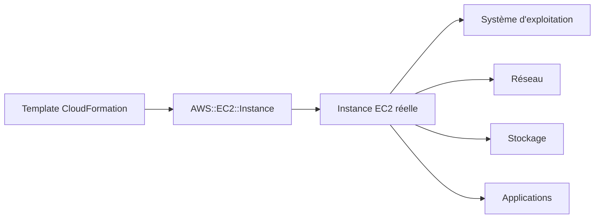
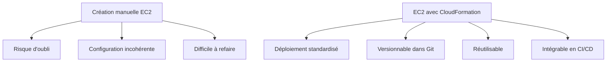
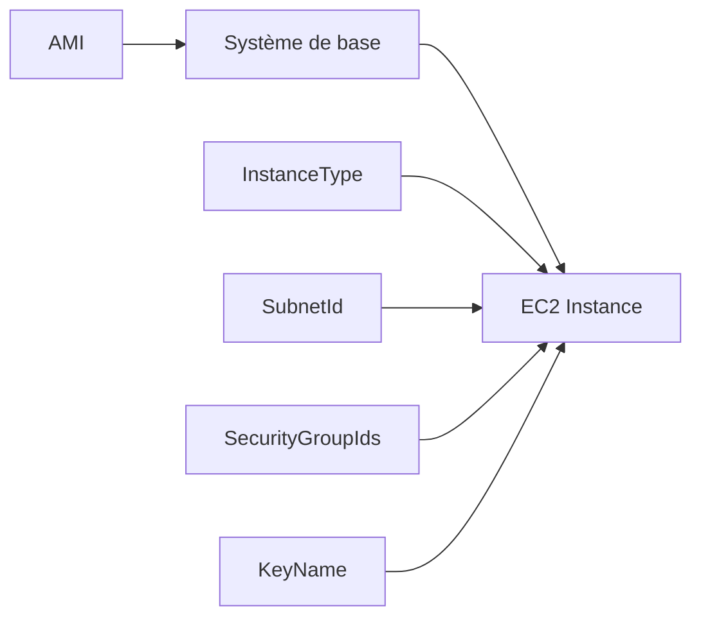
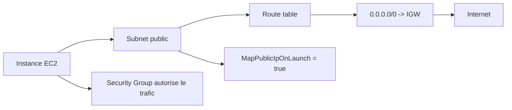
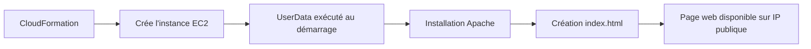
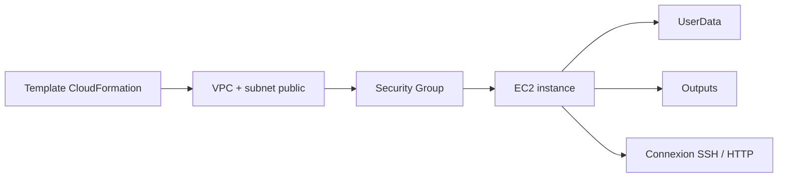

<a id="top"></a>

# AWS CloudFormation — Déployer une instance EC2 avec CloudFormation

## Table of Contents

| #  | Section                                                                                                           |
| -- | ----------------------------------------------------------------------------------------------------------------- |
| 1  | [Qu’est-ce qu’une instance EC2 dans AWS ?](#section-1)                                                            |
| 2  | [Pourquoi déployer EC2 avec CloudFormation ?](#section-2)                                                         |
| 3  | [La ressource `AWS::EC2::Instance`](#section-3)                                                                   |
| 3a |    ↳ [Propriétés essentielles : `ImageId`, `InstanceType`, `SubnetId`, `SecurityGroupIds`, `KeyName`](#section-3) |
| 3b |    ↳ [Le rôle de l’AMI](#section-3)                                                                               |
| 4  | [EC2 dans un subnet public : ce qu’il faut absolument](#section-4)                                                |
| 4a |    ↳ [IP publique et `MapPublicIpOnLaunch`](#section-4)                                                           |
| 4b |    ↳ [Pourquoi le Security Group seul ne suffit pas](#section-4)                                                  |
| 5  | [Premier template EC2 minimal](#section-5)                                                                        |
| 6  | [Template EC2 complet avec VPC, subnet public, IGW, route table et Security Group](#section-6)                    |
| 6a |    ↳ [Lecture ligne par ligne](#section-6)                                                                        |
| 7  | [UserData — automatiser la configuration au démarrage](#section-7)                                                |
| 7a |    ↳ [Pourquoi `Fn::Base64` est nécessaire](#section-7)                                                           |
| 7b |    ↳ [Exemple : page web HTML simple](#section-7)                                                                 |
| 8  | [Outputs utiles pour EC2](#section-8)                                                                             |
| 9  | [Déployer la stack](#section-9)                                                                                   |
| 9a |    ↳ [Avec la console AWS](#section-9)                                                                            |
| 9b |    ↳ [Avec AWS CLI](#section-9)                                                                                   |
| 10 | [Erreurs fréquentes chez les débutants](#section-10)                                                              |
| 11 | [Résumé des commandes](#section-11)                                                                               |
| 12 | [Conclusion](#section-12)                                                                                         |

---

<a id="section-1"></a>

<details>
<summary>1 - Qu’est-ce qu’une instance EC2 dans AWS ?</summary>

<br/>

Une **instance EC2** est une machine virtuelle fournie par le service Amazon Elastic Compute Cloud. Dans CloudFormation, on la décrit avec la ressource `AWS::EC2::Instance`. AWS indique que CloudFormation peut créer une instance EC2 à partir d’une Amazon Machine Image, d’un type d’instance, et de propriétés réseau et système associées. ([Documentation AWS][1])



---

### À quoi sert une instance EC2

Une instance EC2 peut servir à héberger :

* un serveur web
* une API
* une application métier
* un bastion SSH
* un environnement de test
* un backend interne

Dans un template CloudFormation, l’instance est généralement reliée à :

* un **subnet**
* un **Security Group**
* éventuellement une **clé SSH**
* parfois un **rôle IAM**
* parfois du **UserData**

Toutes ces propriétés sont supportées dans la ressource `AWS::EC2::Instance`. ([Documentation AWS][1])

---

<details>
<summary>Analogie simple pour comprendre</summary>
<br/>

Une instance EC2, c'est comme **louer un ordinateur dans le cloud**. Au lieu d'acheter un serveur physique, vous louez une machine virtuelle chez AWS. Vous choisissez la puissance (type d'instance = petit ou gros PC), le système d'exploitation (AMI = Windows, Linux...), le réseau où la brancher (subnet), et les règles de sécurité (Security Group = le pare-feu). Si vous n'en avez plus besoin, vous la rendez et vous arrêtez de payer.

</details>

</details>

<p align="right"><a href="#top">↑ Back to top</a></p>

---

<a id="section-2"></a>

<details>
<summary>2 - Pourquoi déployer EC2 avec CloudFormation ?</summary>

<br/>

Déployer une instance EC2 avec CloudFormation permet de rendre le serveur **reproductible**, **versionnable** et **automatisable**. AWS définit CloudFormation comme un service qui aide à modéliser et mettre en place les ressources AWS à partir d’un template, afin de réduire la gestion manuelle. ([Documentation AWS][2])



---

### Avantages concrets

#### 1. Même résultat à chaque déploiement

Le template définit exactement ce qui doit être créé.

#### 2. Moins d’erreurs humaines

Pas besoin de cliquer manuellement dans plusieurs écrans de la console.

#### 3. Déploiement rapide en environnement dev, test, prod

Le même modèle peut être rejoué avec des paramètres différents. AWS documente précisément l’usage des `Parameters` pour personnaliser les propriétés d’une stack au moment du déploiement. ([Documentation AWS][3])

#### 4. Intégration naturelle avec le reste de l’infrastructure

L’instance EC2 peut être reliée dans le même template à un VPC, un subnet, une route table, un Security Group, des outputs et du UserData. ([Documentation AWS][1])

</details>

<p align="right"><a href="#top">↑ Back to top</a></p>

---

<a id="section-3"></a>

<details>
<summary>3 - La ressource <code>AWS::EC2::Instance</code></summary>

<br/>

La ressource `AWS::EC2::Instance` est la brique principale pour créer une machine virtuelle EC2 dans CloudFormation. AWS documente de nombreuses propriétés, mais pour débuter, les plus importantes sont :

* `ImageId`
* `InstanceType`
* `SubnetId`
* `SecurityGroupIds`
* `KeyName`
* `UserData`

Ces propriétés apparaissent dans la référence officielle de la ressource. ([Documentation AWS][1])

---

### Propriétés essentielles

#### `ImageId`

C’est l’identifiant de l’image machine utilisée pour lancer l’instance. Sans `ImageId`, CloudFormation ne sait pas quel système installer. AWS le documente comme propriété standard de `AWS::EC2::Instance`. ([Documentation AWS][1])

#### `InstanceType`

Définit la taille et la capacité de la machine, par exemple `t2.micro` ou `t3.micro`. C’est aussi une propriété native de la ressource. ([Documentation AWS][1])

#### `SubnetId`

Permet de placer l’instance dans un subnet spécifique du VPC. ([Documentation AWS][1])

#### `SecurityGroupIds`

Associe un ou plusieurs Security Groups à l’instance. ([Documentation AWS][1])

#### `KeyName`

Permet d’associer une paire de clés EC2 pour se connecter en SSH à une instance Linux. Cette propriété fait partie de la ressource EC2 CloudFormation. ([Documentation AWS][1])

---

### Le rôle de l’AMI

L’**AMI** (Amazon Machine Image) représente l’image de base de l’instance :

* système d’exploitation
* certains packages
* configuration initiale

Dans un cours débutant, on met souvent l’AMI en paramètre, car sa valeur peut varier selon la région et le contexte. AWS recommande l’usage de paramètres, notamment pour personnaliser les valeurs des ressources au moment de la création de la stack. ([Documentation AWS][3])



</details>

<p align="right"><a href="#top">↑ Back to top</a></p>

---

<a id="section-4"></a>

<details>
<summary>4 - EC2 dans un subnet public : ce qu’il faut absolument</summary>

<br/>

Pour qu’une instance EC2 soit joignable depuis Internet en IPv4, plusieurs conditions doivent être réunies :

1. elle doit être dans un subnet correctement routé
2. ce subnet doit avoir une route vers un Internet Gateway
3. l’instance doit disposer d’une IPv4 publique ou d’une Elastic IP
4. le Security Group doit ouvrir le bon port

AWS l’explique dans sa documentation VPC sur l’Internet Gateway et dans la doc du subnet CloudFormation. ([Documentation AWS][4])

---

### IP publique et `MapPublicIpOnLaunch`

La propriété `MapPublicIpOnLaunch` appartient à la ressource `AWS::EC2::Subnet` et indique si les instances lancées dans ce subnet reçoivent automatiquement une IPv4 publique. AWS précise que la valeur par défaut est `false`. ([Documentation AWS][4])



---

### Pourquoi le Security Group seul ne suffit pas

Beaucoup de débutants ouvrent le port 22 ou 80 dans le Security Group et pensent que l’instance sera accessible. Ce n’est pas suffisant. Si le subnet n’est pas public, ou si l’instance n’a pas d’IP publique, la connexion n’aboutira pas. AWS précise qu’une instance doit être dans un subnet public et avoir une IP publique pour être directement joignable depuis Internet. ([Documentation AWS][5])

---

<details>
<summary>En résumé très simple</summary>
<br/>

- Pour qu'une EC2 soit accessible depuis Internet, il faut **trois choses réunies** : un subnet public (avec route vers Internet Gateway), une IP publique, et un Security Group qui ouvre le bon port
- Le Security Group seul ne suffit pas — c'est comme ouvrir la porte de votre maison alors que la rue n'existe pas encore
- `MapPublicIpOnLaunch: true` sur le subnet donne automatiquement une IP publique à chaque nouvelle instance

</details>

</details>

<p align="right"><a href="#top">↑ Back to top</a></p>

---

<a id="section-5"></a>

<details>
<summary>5 - Premier template EC2 minimal</summary>

<br/>

Voici un template EC2 très minimal. Il suppose que le subnet et le Security Group existent déjà.

```yaml
AWSTemplateFormatVersion: '2010-09-09'
Description: Instance EC2 minimale

Parameters:
  AmiId:
    Type: String
    Description: ID de l'AMI à utiliser

  InstanceTypeParam:
    Type: String
    Default: t2.micro
    Description: Type d'instance EC2

  SubnetIdParam:
    Type: AWS::EC2::Subnet::Id
    Description: ID du subnet

  SecurityGroupIdParam:
    Type: AWS::EC2::SecurityGroup::Id
    Description: ID du Security Group

  KeyPairName:
    Type: AWS::EC2::KeyPair::KeyName
    Description: Nom de la paire de clés EC2

Resources:
  MonServeurEC2:
    Type: AWS::EC2::Instance
    Properties:
      ImageId: !Ref AmiId
      InstanceType: !Ref InstanceTypeParam
      SubnetId: !Ref SubnetIdParam
      SecurityGroupIds:
        - !Ref SecurityGroupIdParam
      KeyName: !Ref KeyPairName

Outputs:
  InstanceId:
    Description: ID de l'instance EC2
    Value: !Ref MonServeurEC2
```

---

### Pourquoi ce template est intéressant

Il montre la logique minimale :

* choisir une AMI
* choisir le type de machine
* choisir le subnet
* choisir le Security Group
* choisir la clé SSH

AWS documente les types de paramètres fournis par CloudFormation, dont `AWS::EC2::Subnet::Id`, `AWS::EC2::SecurityGroup::Id` et `AWS::EC2::KeyPair::KeyName`, pour guider l’utilisateur lors de la saisie de ressources existantes. ([Documentation AWS][6])

</details>

<p align="right"><a href="#top">↑ Back to top</a></p>

---

<a id="section-6"></a>

<details>
<summary>6 - Template EC2 complet avec VPC, subnet public, IGW, route table et Security Group</summary>

<br/>

Voici maintenant un exemple plus complet, dans l’esprit du chapitre 2, avec une instance EC2 directement intégrée au réseau.

```yaml
AWSTemplateFormatVersion: '2010-09-09'
Description: Déploiement complet EC2 dans un subnet public

Parameters:
  AmiId:
    Type: String
    Description: ID de l'AMI à utiliser

  KeyPairName:
    Type: AWS::EC2::KeyPair::KeyName
    Description: Nom de la paire de clés EC2

Resources:
  MonVPC:
    Type: AWS::EC2::VPC
    Properties:
      CidrBlock: 10.0.0.0/16
      EnableDnsSupport: true
      EnableDnsHostnames: true
      Tags:
        - Key: Name
          Value: vpc-ec2-demo

  MonSubnetPublic:
    Type: AWS::EC2::Subnet
    Properties:
      VpcId: !Ref MonVPC
      CidrBlock: 10.0.1.0/24
      MapPublicIpOnLaunch: true
      Tags:
        - Key: Name
          Value: subnet-public-ec2-demo

  MonInternetGateway:
    Type: AWS::EC2::InternetGateway
    Properties:
      Tags:
        - Key: Name
          Value: igw-ec2-demo

  MonAttachementIGW:
    Type: AWS::EC2::VPCGatewayAttachment
    Properties:
      VpcId: !Ref MonVPC
      InternetGatewayId: !Ref MonInternetGateway

  MaRouteTablePublique:
    Type: AWS::EC2::RouteTable
    Properties:
      VpcId: !Ref MonVPC

  MaRouteInternet:
    Type: AWS::EC2::Route
    DependsOn: MonAttachementIGW
    Properties:
      RouteTableId: !Ref MaRouteTablePublique
      DestinationCidrBlock: 0.0.0.0/0
      GatewayId: !Ref MonInternetGateway

  MonAssociationSubnetRouteTable:
    Type: AWS::EC2::SubnetRouteTableAssociation
    Properties:
      SubnetId: !Ref MonSubnetPublic
      RouteTableId: !Ref MaRouteTablePublique

  MonSecurityGroupWeb:
    Type: AWS::EC2::SecurityGroup
    Properties:
      GroupDescription: Autorise SSH et HTTP
      VpcId: !Ref MonVPC
      SecurityGroupIngress:
        - IpProtocol: tcp
          FromPort: 22
          ToPort: 22
          CidrIp: 0.0.0.0/0
        - IpProtocol: tcp
          FromPort: 80
          ToPort: 80
          CidrIp: 0.0.0.0/0

  MonServeurEC2:
    Type: AWS::EC2::Instance
    Properties:
      ImageId: !Ref AmiId
      InstanceType: t2.micro
      KeyName: !Ref KeyPairName
      SubnetId: !Ref MonSubnetPublic
      SecurityGroupIds:
        - !Ref MonSecurityGroupWeb
      Tags:
        - Key: Name
          Value: ec2-demo-cloudformation

Outputs:
  InstanceId:
    Description: ID de l'instance
    Value: !Ref MonServeurEC2

  PublicIp:
    Description: Adresse IP publique de l'instance
    Value: !GetAtt MonServeurEC2.PublicIp

  PublicDnsName:
    Description: DNS public de l'instance
    Value: !GetAtt MonServeurEC2.PublicDnsName
```

Ce template s’appuie sur les ressources officiellement documentées par AWS pour VPC, subnet, route table, route, subnet association, internet gateway, security group et EC2. Les attributs `PublicIp` et `PublicDnsName` sont disponibles via `Fn::GetAtt` sur `AWS::EC2::Instance`. ([Documentation AWS][1])

---

### Lecture ligne par ligne

#### `MapPublicIpOnLaunch: true`

Cela permet au subnet d’assigner automatiquement une IPv4 publique aux nouvelles instances. AWS précise que la valeur par défaut est `false`, donc ici on active explicitement ce comportement. ([Documentation AWS][4])

#### `KeyName`

La propriété `KeyName` permet l’usage d’une paire de clés EC2 existante pour SSH. Elle fait partie des propriétés de `AWS::EC2::Instance`. ([Documentation AWS][1])

#### `SecurityGroupIngress`

On ouvre ici :

* SSH sur 22
* HTTP sur 80

Le Security Group contrôle le trafic entrant autorisé vers l’instance. ([Documentation AWS][1])

#### `Outputs`

La section `Outputs` est optionnelle mais très utile pour exposer l’ID de l’instance, l’IP publique ou le DNS public après déploiement. AWS documente cette section comme mécanisme pour déclarer des valeurs retournées par la stack. ([Documentation AWS][7])

</details>

<p align="right"><a href="#top">↑ Back to top</a></p>

---

<a id="section-7"></a>

<details>
<summary>7 - UserData — automatiser la configuration au démarrage</summary>

<br/>

La propriété `UserData` permet de passer un script ou des commandes à exécuter au démarrage de l’instance. AWS précise que les scripts user data sont exécutés au lancement de l’instance et que la taille maximale est de 16 KB. AWS précise aussi que la valeur doit être encodée en Base64 dans CloudFormation. ([Documentation AWS][1])

---

### Pourquoi `Fn::Base64` est nécessaire

La fonction intrinsèque `Fn::Base64` renvoie la représentation Base64 d’une chaîne. AWS indique qu’elle est typiquement utilisée pour transmettre des données à une instance EC2 via `UserData`. ([Documentation AWS][8])

```yaml
UserData:
  Fn::Base64: |
    #!/bin/bash
    echo "Bonjour depuis EC2" > /tmp/test.txt
```

---

### Exemple : page web HTML simple

Voici un exemple qui installe un serveur web Apache sur une instance Amazon Linux / environnement compatible, puis crée une petite page HTML :

```yaml
MonServeurEC2:
  Type: AWS::EC2::Instance
  Properties:
    ImageId: !Ref AmiId
    InstanceType: t2.micro
    KeyName: !Ref KeyPairName
    SubnetId: !Ref MonSubnetPublic
    SecurityGroupIds:
      - !Ref MonSecurityGroupWeb
    UserData:
      Fn::Base64: !Sub |
        #!/bin/bash
        yum update -y
        yum install -y httpd
        systemctl enable httpd
        systemctl start httpd
        echo "<h1>Bonjour depuis CloudFormation</h1>" > /var/www/html/index.html
```

AWS documente l’usage de `Fn::Sub` pour insérer des variables dans une chaîne, ce qui est très pratique avec `UserData`, et donne aussi des exemples de construction de `UserData` avec `Fn::Base64`. ([Documentation AWS][9])



---

### Attention importante

Si vous modifiez `UserData`, le comportement de mise à jour dépend du type de volume racine. AWS précise que si le volume racine est EBS, CloudFormation redémarre l’instance ; si le volume racine est un instance store, l’instance est remplacée. ([Documentation AWS][1])

---

<details>
<summary>Analogie simple pour comprendre</summary>
<br/>

`UserData`, c'est comme une **liste de courses qu'on colle sur le frigo d'un nouvel appartement**. Quand le locataire (l'instance EC2) emménage (démarre pour la première fois), il lit la liste et exécute les tâches : « installer Apache, créer une page web, démarrer le serveur ». `Fn::Base64` est juste l'enveloppe obligatoire pour envoyer cette liste — AWS exige que le message soit « emballé » dans ce format pour le transport.

</details>

</details>

<p align="right"><a href="#top">↑ Back to top</a></p>

---

<a id="section-8"></a>

<details>
<summary>8 - Outputs utiles pour EC2</summary>

<br/>

Pour EC2, les outputs les plus utiles sont souvent :

* l’ID de l’instance
* l’IP publique
* le DNS public
* éventuellement l’ID du Security Group
* éventuellement l’ID du subnet

AWS documente `Outputs` comme une section optionnelle qui permet d’exposer des valeurs utiles après création de la stack. ([Documentation AWS][7])

```yaml
Outputs:
  InstanceId:
    Description: ID de l'instance
    Value: !Ref MonServeurEC2

  PublicIp:
    Description: IP publique
    Value: !GetAtt MonServeurEC2.PublicIp

  PublicDnsName:
    Description: DNS public
    Value: !GetAtt MonServeurEC2.PublicDnsName
```

---

### Pourquoi c’est pratique

Au lieu d’aller chercher manuellement ces informations dans la console EC2, elles apparaissent directement dans les outputs de la stack CloudFormation.

---

<details>
<summary>En résumé très simple</summary>
<br/>

- Les **Outputs** sont comme un **reçu de livraison** : après la création de la stack, ils affichent les infos utiles (IP publique, DNS, ID de l'instance)
- Sans Outputs, il faudrait aller fouiller dans la console AWS pour trouver ces informations à la main
- `!Ref` donne l'ID de l'instance, `!GetAtt` donne des détails précis comme l'IP publique ou le DNS

</details>

</details>

<p align="right"><a href="#top">↑ Back to top</a></p>

---

<a id="section-9"></a>

<details>
<summary>9 - Déployer la stack</summary>

<br/>

### Avec la console AWS

1. Ouvrir **CloudFormation**
2. Cliquer sur **Create stack**
3. Importer le fichier YAML
4. Donner un nom à la stack
5. Fournir l’AMI et la clé SSH
6. Lancer la création
7. Attendre `CREATE_COMPLETE`
8. Lire les `Outputs`

CloudFormation guide l’utilisateur via les paramètres déclarés dans la section `Parameters`, dont le nom et la description apparaissent dans l’assistant de création de stack. ([Documentation AWS][3])

---

### Avec AWS CLI

```bash
aws cloudformation create-stack \
  --stack-name ec2-demo-stack \
  --template-body file://ec2-demo.yaml \
  --parameters \
    ParameterKey=AmiId,ParameterValue=ami-xxxxxxxxxxxxxxxxx \
    ParameterKey=KeyPairName,ParameterValue=ma-cle-ssh
```

Pour supprimer :

```bash
aws cloudformation delete-stack \
  --stack-name ec2-demo-stack
```

</details>

<p align="right"><a href="#top">↑ Back to top</a></p>

---

<a id="section-10"></a>

<details>
<summary>10 - Erreurs fréquentes chez les débutants</summary>

<br/>

### 1. Utiliser une AMI invalide ou non disponible dans la région

Les AMI ne sont pas universelles. Une AMI peut exister dans une région et pas dans une autre. C’est l’une des raisons pour lesquelles on met souvent l’AMI en paramètre. AWS documente les paramètres fournis par CloudFormation pour sélectionner des ressources existantes ou des références dépendantes du contexte. ([Documentation AWS][6])

### 2. Oublier `KeyName`

Sans paire de clés adaptée, vous ne pourrez pas ouvrir une session SSH classique sur une instance Linux configurée pour ce mode d’accès. La propriété `KeyName` est prévue à cet effet dans `AWS::EC2::Instance`. ([Documentation AWS][1])

### 3. Oublier l’IP publique

Même avec un subnet public et un Security Group correct, l’instance doit recevoir une IPv4 publique ou une Elastic IP pour être directement joignable depuis Internet en IPv4. AWS le précise dans la documentation VPC et la propriété `MapPublicIpOnLaunch` du subnet contrôle l’assignation automatique. ([Documentation AWS][4])

### 4. Ouvrir le Security Group mais oublier la route vers l’Internet Gateway

Sans la route `0.0.0.0/0` vers l’IGW, le subnet n’est pas réellement public. ([Documentation AWS][5])

### 5. Mettre du `UserData` sans `Fn::Base64`

AWS précise que `UserData` doit être fourni en Base64 dans CloudFormation. ([Documentation AWS][1])

### 6. Oublier que `UserData` a une limite de taille

AWS indique que `UserData` est limité à 16 KB. ([Documentation AWS][1])

</details>

<p align="right"><a href="#top">↑ Back to top</a></p>

---

<a id="section-11"></a>

<details>
<summary>11 - Résumé des commandes</summary>

<br/>

```bash
# Créer la stack EC2
aws cloudformation create-stack \
  --stack-name ec2-demo-stack \
  --template-body file://ec2-demo.yaml \
  --parameters \
    ParameterKey=AmiId,ParameterValue=ami-xxxxxxxxxxxxxxxxx \
    ParameterKey=KeyPairName,ParameterValue=ma-cle-ssh

# Décrire la stack
aws cloudformation describe-stacks \
  --stack-name ec2-demo-stack

# Lister les ressources de la stack
aws cloudformation describe-stack-resources \
  --stack-name ec2-demo-stack

# Mettre à jour la stack
aws cloudformation update-stack \
  --stack-name ec2-demo-stack \
  --template-body file://ec2-demo.yaml \
  --parameters \
    ParameterKey=AmiId,ParameterValue=ami-xxxxxxxxxxxxxxxxx \
    ParameterKey=KeyPairName,ParameterValue=ma-cle-ssh

# Supprimer la stack
aws cloudformation delete-stack \
  --stack-name ec2-demo-stack
```

</details>

<p align="right"><a href="#top">↑ Back to top</a></p>

---

<a id="section-12"></a>

<details>
<summary>12 - Conclusion</summary>

<br/>

Dans ce chapitre, on a vu comment déployer une instance EC2 avec CloudFormation en comprenant les briques essentielles :

* `AWS::EC2::Instance`
* `ImageId`
* `InstanceType`
* `SubnetId`
* `SecurityGroupIds`
* `KeyName`
* `UserData`
* `Outputs`

AWS documente précisément ces propriétés pour `AWS::EC2::Instance`, ainsi que l’usage de `Fn::Base64` pour `UserData`, la logique réseau des subnets publics, et la section `Outputs` pour récupérer les informations utiles après déploiement. ([Documentation AWS][1])



### Suite logique pour le prochain chapitre

Le prochain chapitre peut porter sur :

* **Parameters**
* **Outputs**
* **Ref**
* **Fn::GetAtt**
* **Fn::Sub**
* **templates réutilisables et dynamiques**


[1]: https://docs.aws.amazon.com/AWSCloudFormation/latest/TemplateReference/aws-resource-ec2-instance.html?utm_source=chatgpt.com "AWS::EC2::Instance - AWS CloudFormation"
[2]: https://docs.aws.amazon.com/AWSCloudFormation/latest/UserGuide/Welcome.html?utm_source=chatgpt.com "What is CloudFormation?"
[3]: https://docs.aws.amazon.com/AWSCloudFormation/latest/UserGuide/parameters-section-structure.html?utm_source=chatgpt.com "CloudFormation template Parameters syntax"
[4]: https://docs.aws.amazon.com/AWSCloudFormation/latest/TemplateReference/aws-resource-ec2-subnet.html?utm_source=chatgpt.com "AWS::EC2::Subnet - AWS CloudFormation"
[5]: https://docs.aws.amazon.com/cdk/api/v2/python/aws_cdk.aws_ec2/README.html?utm_source=chatgpt.com "Amazon EC2 Construct Library - AWS Documentation"
[6]: https://docs.aws.amazon.com/AWSCloudFormation/latest/UserGuide/cloudformation-supplied-parameter-types.html?utm_source=chatgpt.com "Specify existing resources at runtime with CloudFormation ..."
[7]: https://docs.aws.amazon.com/AWSCloudFormation/latest/UserGuide/outputs-section-structure.html?utm_source=chatgpt.com "CloudFormation template Outputs syntax"
[8]: https://docs.aws.amazon.com/AWSCloudFormation/latest/TemplateReference/intrinsic-function-reference-base64.html?utm_source=chatgpt.com "Fn::Base64 - AWS CloudFormation"
[9]: https://docs.aws.amazon.com/AWSCloudFormation/latest/TemplateReference/intrinsic-function-reference-sub.html?utm_source=chatgpt.com "Fn::Sub - AWS CloudFormation"
