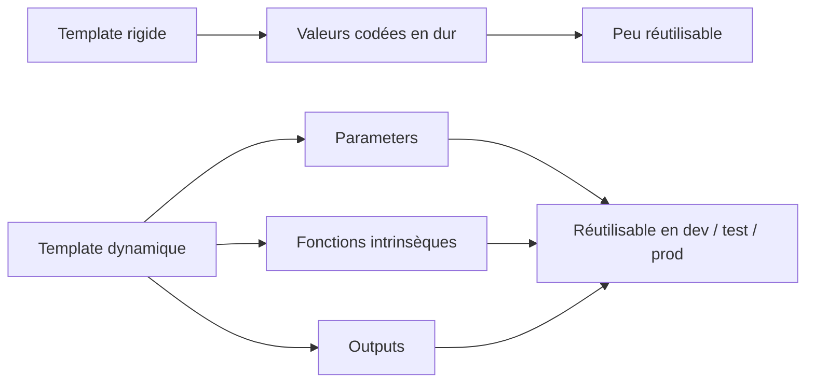
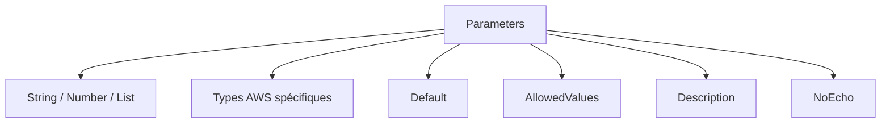
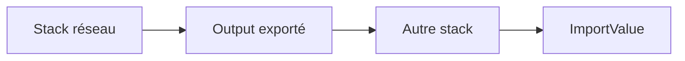
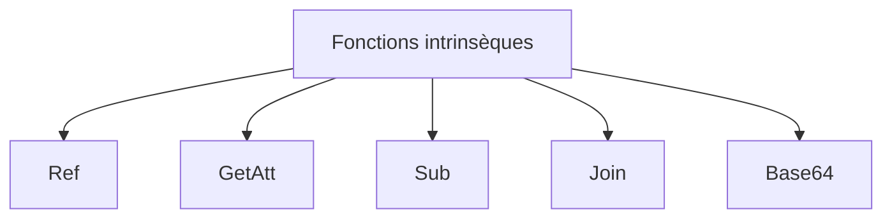
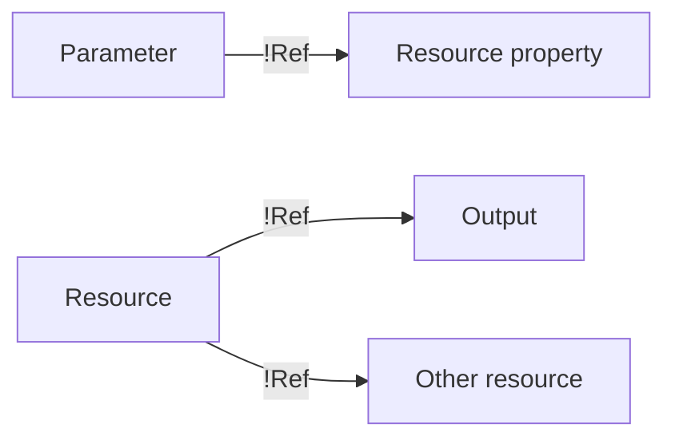
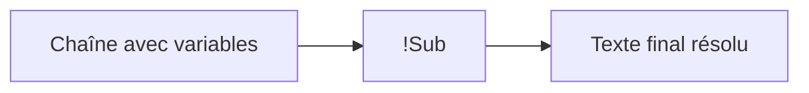
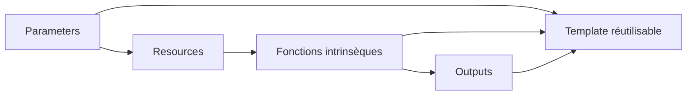

<a id="top"></a>

# AWS CloudFormation — Parameters, Outputs et fonctions intrinsèques

## Table of Contents

| #  | Section                                                                 |
| -- | ----------------------------------------------------------------------- |
| 1  | [Pourquoi rendre un template dynamique ?](#section-1)                   |
| 2  | [La section `Parameters`](#section-2)                                   |
| 2a |    ↳ [Types de paramètres CloudFormation](#section-2)                   |
| 2b |    ↳ [`Default`, `Description`, `AllowedValues`, `NoEcho`](#section-2)  |
| 3  | [La section `Outputs`](#section-3)                                      |
| 3a |    ↳ [Pourquoi les outputs sont utiles](#section-3)                     |
| 3b |    ↳ [Exports entre stacks](#section-3)                                 |
| 4  | [Qu’est-ce qu’une fonction intrinsèque ?](#section-4)                   |
| 5  | [`Ref` — la fonction la plus utilisée](#section-5)                      |
| 6  | [`Fn::GetAtt` / `!GetAtt`](#section-6)                                  |
| 7  | [`Fn::Sub` / `!Sub`](#section-7)                                        |
| 8  | [`Fn::Join` / `!Join`](#section-8)                                      |
| 9  | [`Fn::Base64` / `!Base64`](#section-9)                                  |
| 10 | [Exemple complet — template EC2 paramétrable avec outputs](#section-10) |
| 11 | [Erreurs fréquentes chez les débutants](#section-11)                    |
| 12 | [Résumé des commandes](#section-12)                                     |
| 13 | [Conclusion](#section-13)                                               |

---

<a id="section-1"></a>

<details>
<summary>1 - Pourquoi rendre un template dynamique ?</summary>

<br/>

Un template CloudFormation devient vraiment utile quand il est **réutilisable**. Si vous écrivez un template avec des valeurs fixes partout, vous devrez le modifier à la main à chaque nouveau déploiement. Avec les **parameters**, les **outputs** et les **fonctions intrinsèques**, vous pouvez transformer un simple fichier YAML en modèle flexible et réexécutable. AWS documente explicitement la section `Parameters` pour personnaliser les valeurs au moment de la création ou de la mise à jour d’une stack, et la section `Outputs` pour exposer des valeurs utiles après déploiement. ([docs.aws.amazon.com](https://docs.aws.amazon.com/AWSCloudFormation/latest/UserGuide/parameters-section-structure.html?utm_source=chatgpt.com))



---

### Exemple concret

Sans paramètres :

* AMI fixée
* type d’instance fixé
* nom de bucket fixé

Avec paramètres :

* l’utilisateur choisit l’AMI
* l’utilisateur choisit la taille de l’instance
* l’utilisateur choisit le nom du bucket

Cela suit exactement la logique documentée par AWS pour `Parameters`, qui servent à transmettre des valeurs d’entrée à un template. ([docs.aws.amazon.com](https://docs.aws.amazon.com/AWSCloudFormation/latest/UserGuide/parameters-section-structure.html?utm_source=chatgpt.com))

---

### Idée clé

Un template dynamique permet :

* de **réduire la duplication**
* de **réutiliser le même code**
* de **standardiser les déploiements**
* de **mieux intégrer CloudFormation dans un pipeline**

---

<details>
<summary>Analogie simple pour comprendre</summary>
<br/>

Les **Parameters**, c'est comme un **formulaire à remplir** avant de commander un meuble en ligne : vous choisissez la couleur, la taille, le matériau. Le template reste le même, mais le résultat change selon vos réponses. Les **Outputs**, c'est le **reçu de livraison** : une fois le meuble livré, on vous donne le numéro de suivi, la date de livraison et la référence — les infos utiles à garder. Les **fonctions intrinsèques**, ce sont les outils de l'usine qui assemblent le meuble selon vos choix.

</details>

</details>

<p align="right"><a href="#top">↑ Back to top</a></p>

---

<a id="section-2"></a>

<details>
<summary>2 - La section <code>Parameters</code></summary>

<br/>

La section `Parameters` permet de définir des valeurs d’entrée pour le template. AWS indique que ces paramètres sont fournis au moment de la création ou de la mise à jour de la stack, sauf si une valeur par défaut est définie. Ils peuvent ensuite être référencés dans `Resources` et `Outputs`. ([docs.aws.amazon.com](https://docs.aws.amazon.com/AWSCloudFormation/latest/UserGuide/parameters-section-structure.html?utm_source=chatgpt.com))

```yaml id="wlh6dq"
Parameters:
  InstanceTypeParam:
    Type: String
    Default: t2.micro
    Description: Type d'instance EC2
```

---

### Structure minimale d’un paramètre

Un paramètre comporte au moins :

* un nom
* un type

Exemple :

```yaml id="ab0d3u"
Parameters:
  NomDuBucket:
    Type: String
```

---

### Types de paramètres CloudFormation

AWS prend en charge des types génériques comme `String`, `Number`, `CommaDelimitedList`, mais aussi des types spécifiques AWS comme `AWS::EC2::Subnet::Id`, `AWS::EC2::SecurityGroup::Id` ou `AWS::EC2::KeyPair::KeyName`. Ces types permettent à la console AWS d’aider l’utilisateur à choisir des ressources existantes du bon type. ([docs.aws.amazon.com](https://docs.aws.amazon.com/AWSCloudFormation/latest/UserGuide/cloudformation-supplied-parameter-types.html?utm_source=chatgpt.com))

Exemples :

```yaml id="z5x3d8"
Parameters:
  AmiId:
    Type: String

  MonSubnet:
    Type: AWS::EC2::Subnet::Id

  MaCleSSH:
    Type: AWS::EC2::KeyPair::KeyName
```

---

### `Default`

La propriété `Default` définit une valeur par défaut si l’utilisateur n’en fournit pas une autre. AWS la documente comme option standard de la structure des paramètres. ([docs.aws.amazon.com](https://docs.aws.amazon.com/AWSCloudFormation/latest/UserGuide/parameters-section-structure.html?utm_source=chatgpt.com))

```yaml id="u8f31n"
Parameters:
  InstanceTypeParam:
    Type: String
    Default: t3.micro
```

---

### `Description`

La propriété `Description` sert à expliquer au déployeur ce que représente le paramètre.

```yaml id="mb2xjd"
Parameters:
  KeyPairName:
    Type: AWS::EC2::KeyPair::KeyName
    Description: Nom de la paire de clés EC2 pour SSH
```

---

### `AllowedValues`

AWS permet de restreindre les valeurs possibles grâce à `AllowedValues`. Cela évite des entrées invalides. ([docs.aws.amazon.com](https://docs.aws.amazon.com/AWSCloudFormation/latest/UserGuide/parameters-section-structure.html?utm_source=chatgpt.com))

```yaml id="e2m1qd"
Parameters:
  EnvironmentName:
    Type: String
    AllowedValues:
      - dev
      - test
      - prod
```

---

### `NoEcho`

La propriété `NoEcho` sert à masquer certaines valeurs sensibles dans la console et les API CloudFormation. AWS précise cependant que cela ne masque pas tout, notamment pas les valeurs exposées dans `Metadata`, `Outputs` ou les métadonnées de ressource. ([docs.aws.amazon.com](https://docs.aws.amazon.com/AWSCloudFormation/latest/UserGuide/parameters-section-structure.html?utm_source=chatgpt.com))

```yaml id="1wpkwa"
Parameters:
  DatabasePassword:
    Type: String
    NoEcho: true
```



---

<details>
<summary>En résumé très simple</summary>
<br/>

- Un **paramètre**, c'est une question posée à celui qui déploie : « quel nom veux-tu pour le bucket ? quelle taille de machine ? »
- `Default` = la réponse pré-remplie si on ne change rien
- `AllowedValues` = les choix autorisés dans un menu déroulant (pour éviter les erreurs de saisie)
- `NoEcho` = masquer la réponse (comme les `***` quand on tape un mot de passe)

</details>

</details>

<p align="right"><a href="#top">↑ Back to top</a></p>

---

<a id="section-3"></a>

<details>
<summary>3 - La section <code>Outputs</code></summary>

<br/>

La section `Outputs` permet de déclarer des valeurs renvoyées après le déploiement de la stack. AWS indique que cette section est optionnelle mais très utile pour afficher des informations comme des noms de bucket, des IDs de ressource, des adresses IP ou des ARNs. AWS précise aussi que des outputs peuvent être exportés pour être réutilisés dans d’autres stacks. ([docs.aws.amazon.com](https://docs.aws.amazon.com/AWSCloudFormation/latest/UserGuide/outputs-section-structure.html?utm_source=chatgpt.com))

```yaml id="a8v0xw"
Outputs:
  BucketName:
    Description: Nom du bucket créé
    Value: !Ref MonBucketS3
```

---

### Pourquoi les outputs sont utiles

Les outputs évitent d’aller chercher manuellement des informations dans plusieurs consoles AWS après déploiement.

Exemples typiques :

* IP publique d’une instance
* ID d’un VPC
* ARN d’un bucket
* DNS public d’une EC2

AWS documente les outputs comme mécanisme de sortie officiel des stacks. ([docs.aws.amazon.com](https://docs.aws.amazon.com/AWSCloudFormation/latest/UserGuide/outputs-section-structure.html?utm_source=chatgpt.com))

---

### Export entre stacks

Un output peut être exporté pour être importé ailleurs avec `Fn::ImportValue`. AWS documente explicitement l’export de valeurs via `Outputs` avec la clé `Export`. ([docs.aws.amazon.com](https://docs.aws.amazon.com/AWSCloudFormation/latest/UserGuide/outputs-section-structure.html?utm_source=chatgpt.com))

```yaml id="vevjez"
Outputs:
  VpcIdExport:
    Description: Export de l'ID du VPC
    Value: !Ref MonVPC
    Export:
      Name: MonVpcIdExporte
```



</details>

<p align="right"><a href="#top">↑ Back to top</a></p>

---

<a id="section-4"></a>

<details>
<summary>4 - Qu’est-ce qu’une fonction intrinsèque ?</summary>

<br/>

Les **fonctions intrinsèques** sont des fonctions intégrées à CloudFormation qui permettent de construire dynamiquement les valeurs dans un template. AWS indique qu’elles peuvent être utilisées dans différentes parties du template, par exemple dans les propriétés des ressources, les outputs, les métadonnées et les règles selon la fonction concernée. ([docs.aws.amazon.com](https://docs.aws.amazon.com/AWSCloudFormation/latest/TemplateReference/intrinsic-function-reference.html?utm_source=chatgpt.com))

Les plus utiles pour débuter sont :

* `Ref`
* `Fn::GetAtt`
* `Fn::Sub`
* `Fn::Join`
* `Fn::Base64`



---

### Deux syntaxes possibles

CloudFormation accepte :

* la syntaxe longue JSON/YAML
* la syntaxe courte YAML avec `!`

Par exemple :

```yaml id="etum3o"
Value:
  Ref: MonBucketS3
```

équivaut à :

```yaml id="syc3ba"
Value: !Ref MonBucketS3
```

AWS documente cette dualité dans la référence des fonctions intrinsèques. ([docs.aws.amazon.com](https://docs.aws.amazon.com/AWSCloudFormation/latest/TemplateReference/intrinsic-function-reference.html?utm_source=chatgpt.com))

</details>

<p align="right"><a href="#top">↑ Back to top</a></p>

---

<a id="section-5"></a>

<details>
<summary>5 - <code>Ref</code> — la fonction la plus utilisée</summary>

<br/>

`Ref` retourne la valeur d’un paramètre ou d’une ressource. AWS précise que la valeur retournée dépend de ce qui est référencé. Pour un paramètre, `Ref` retourne sa valeur. Pour une ressource, cela dépend du type de ressource : souvent un ID physique, parfois un autre identifiant logique défini par AWS pour ce type. ([docs.aws.amazon.com](https://docs.aws.amazon.com/AWSCloudFormation/latest/TemplateReference/intrinsic-function-reference-ref.html?utm_source=chatgpt.com))

---

### `Ref` sur un paramètre

```yaml id="d0j86x"
Parameters:
  NomDuBucket:
    Type: String

Resources:
  MonBucketS3:
    Type: AWS::S3::Bucket
    Properties:
      BucketName: !Ref NomDuBucket
```

Ici, `!Ref NomDuBucket` retourne la valeur entrée par l’utilisateur.

---

### `Ref` sur une ressource

```yaml id="d6cp1c"
Outputs:
  InstanceId:
    Value: !Ref MonServeurEC2
```

Pour `AWS::EC2::Instance`, `Ref` retourne l’ID de l’instance. AWS le documente dans la référence de la ressource et dans la doc de `Ref`. ([docs.aws.amazon.com](https://docs.aws.amazon.com/AWSCloudFormation/latest/TemplateReference/aws-resource-ec2-instance.html?utm_source=chatgpt.com))

---

### Idée clé

`Ref` est la liaison la plus courante entre :

* paramètres → ressources
* ressources → outputs
* ressources → autres ressources



---

<details>
<summary>Analogie simple pour comprendre</summary>
<br/>

Pensez à `Ref` comme un **raccourci clavier** : il vous donne directement la valeur principale associée à quelque chose (le nom du paramètre ou l'identifiant de la ressource). `GetAtt`, c'est comme faire un **clic droit → Propriétés** : vous accédez à un détail précis, comme l'adresse IP publique ou l'ARN. Par exemple, `!Ref MonServeur` vous donne l'ID de l'instance, mais `!GetAtt MonServeur.PublicIp` vous donne son adresse IP — un détail que `Ref` ne connaît pas.

</details>

</details>

<p align="right"><a href="#top">↑ Back to top</a></p>

---

<a id="section-6"></a>

<details>
<summary>6 - <code>Fn::GetAtt</code> / <code>!GetAtt</code></summary>

<br/>

`Fn::GetAtt` permet de récupérer un **attribut précis** d’une ressource. AWS documente cette fonction comme mécanisme pour accéder à un attribut défini par le type de ressource. ([docs.aws.amazon.com](https://docs.aws.amazon.com/AWSCloudFormation/latest/TemplateReference/intrinsic-function-reference-getatt.html?utm_source=chatgpt.com))

---

### Exemple avec une instance EC2

```yaml id="a45g8d"
Outputs:
  PublicIp:
    Description: Adresse IP publique
    Value: !GetAtt MonServeurEC2.PublicIp

  PublicDns:
    Description: DNS public
    Value: !GetAtt MonServeurEC2.PublicDnsName
```

AWS documente ces attributs pour `AWS::EC2::Instance`. ([docs.aws.amazon.com](https://docs.aws.amazon.com/AWSCloudFormation/latest/TemplateReference/aws-resource-ec2-instance.html?utm_source=chatgpt.com))

---

### Exemple avec S3

```yaml id="8g5bvd"
Outputs:
  BucketArn:
    Description: ARN du bucket
    Value: !GetAtt MonBucketS3.Arn
```

L’attribut `Arn` est documenté pour `AWS::S3::Bucket`. ([docs.aws.amazon.com](https://docs.aws.amazon.com/AWSCloudFormation/latest/TemplateReference/aws-resource-s3-bucket.html?utm_source=chatgpt.com))

---

### Différence entre `Ref` et `GetAtt`

| Fonction | Retourne                          |
| -------- | --------------------------------- |
| `Ref`    | la valeur de référence par défaut |
| `GetAtt` | un attribut précis                |

Exemple sur EC2 :

* `!Ref MonServeurEC2` → instance ID
* `!GetAtt MonServeurEC2.PublicIp` → IP publique

AWS distingue bien ces deux usages dans la doc. ([docs.aws.amazon.com](https://docs.aws.amazon.com/AWSCloudFormation/latest/TemplateReference/intrinsic-function-reference-ref.html?utm_source=chatgpt.com))

</details>

<p align="right"><a href="#top">↑ Back to top</a></p>

---

<a id="section-7"></a>

<details>
<summary>7 - <code>Fn::Sub</code> / <code>!Sub</code></summary>

<br/>

`Fn::Sub` permet de construire une chaîne dynamique en remplaçant des variables par leurs valeurs. AWS indique que `Fn::Sub` remplace les variables spécifiées par leurs valeurs effectives au moment du traitement du template. ([docs.aws.amazon.com](https://docs.aws.amazon.com/AWSCloudFormation/latest/TemplateReference/intrinsic-function-reference-sub.html?utm_source=chatgpt.com))

---

### Exemple simple

```yaml id="b9ml7a"
Outputs:
  MessageInfo:
    Value: !Sub "La stack ${AWS::StackName} a créé le bucket ${MonBucketS3}"
```

Ici :

* `${AWS::StackName}` est un pseudo parameter AWS
* `${MonBucketS3}` fait référence à la ressource comme un `Ref`

AWS documente ce comportement dans la référence de `Fn::Sub`. ([docs.aws.amazon.com](https://docs.aws.amazon.com/AWSCloudFormation/latest/TemplateReference/intrinsic-function-reference-sub.html?utm_source=chatgpt.com))

---

### Exemple avec UserData

`Fn::Sub` est très pratique pour construire du `UserData` avec des variables :

```yaml id="m8g3yq"
UserData:
  Fn::Base64: !Sub |
    #!/bin/bash
    echo "Nom de stack : ${AWS::StackName}" > /tmp/stack.txt
```

AWS donne des exemples de `Fn::Sub` combiné avec `Fn::Base64` dans les scénarios `UserData`. ([docs.aws.amazon.com](https://docs.aws.amazon.com/AWSCloudFormation/latest/TemplateReference/intrinsic-function-reference-sub.html?utm_source=chatgpt.com))



---

### Quand utiliser `Sub`

Utilisez `Sub` quand vous voulez :

* construire une URL
* construire un ARN
* écrire un message dynamique
* injecter des variables dans du `UserData`

</details>

<p align="right"><a href="#top">↑ Back to top</a></p>

---

<a id="section-8"></a>

<details>
<summary>8 - <code>Fn::Join</code> / <code>!Join</code></summary>

<br/>

`Fn::Join` assemble une liste de valeurs en une seule chaîne, en utilisant un séparateur. AWS le documente comme fonction permettant de concaténer une liste avec un délimiteur donné. ([docs.aws.amazon.com](https://docs.aws.amazon.com/AWSCloudFormation/latest/TemplateReference/intrinsic-function-reference-join.html?utm_source=chatgpt.com))

---

### Exemple simple

```yaml id="7jxg4u"
Outputs:
  BucketPath:
    Value: !Join
      - ""
      - - "s3://"
        - !Ref MonBucketS3
        - "/backup"
```

Résultat attendu :

```text id="8xf6gx"
s3://nom-du-bucket/backup
```

---

### Quand utiliser `Join`

`Join` est utile quand on veut concaténer des morceaux de chaîne, surtout dans les templates anciens ou quand la syntaxe `Sub` n’est pas la plus naturelle.

---

### `Sub` ou `Join` ?

Dans beaucoup de cas modernes, `Sub` est plus lisible. `Join` reste utile dans certains montages complexes de listes. AWS documente séparément les deux fonctions. ([docs.aws.amazon.com](https://docs.aws.amazon.com/AWSCloudFormation/latest/TemplateReference/intrinsic-function-reference-join.html?utm_source=chatgpt.com))

</details>

<p align="right"><a href="#top">↑ Back to top</a></p>

---

<a id="section-9"></a>

<details>
<summary>9 - <code>Fn::Base64</code> / <code>!Base64</code></summary>

<br/>

`Fn::Base64` retourne la représentation Base64 d’une chaîne. AWS indique que cette fonction est typiquement utilisée pour fournir des données `UserData` à une instance EC2. ([docs.aws.amazon.com](https://docs.aws.amazon.com/AWSCloudFormation/latest/TemplateReference/intrinsic-function-reference-base64.html?utm_source=chatgpt.com))

---

### Exemple minimal

```yaml id="p1ifay"
UserData:
  Fn::Base64: |
    #!/bin/bash
    echo "hello" > /tmp/hello.txt
```

---

### Version YAML courte

```yaml id="cnf1my"
UserData: !Base64 |
  #!/bin/bash
  echo "hello" > /tmp/hello.txt
```

---

### Très souvent combiné avec `Sub`

```yaml id="7rvhxu"
UserData:
  Fn::Base64: !Sub |
    #!/bin/bash
    echo "Stack = ${AWS::StackName}" > /tmp/info.txt
```

AWS documente explicitement ces usages combinés. ([docs.aws.amazon.com](https://docs.aws.amazon.com/AWSCloudFormation/latest/TemplateReference/intrinsic-function-reference-base64.html?utm_source=chatgpt.com))

---

<details>
<summary>En résumé très simple</summary>
<br/>

- `Fn::Base64` est un **emballage obligatoire** pour envoyer des scripts à une instance EC2 via `UserData` — sans cet emballage, AWS refuse le colis
- On le combine presque toujours avec `!Sub` pour injecter des variables (nom de stack, références...) dans le script
- En YAML, la syntaxe courte `!Base64` est aussi acceptée, mais la combinaison `Fn::Base64: !Sub |` est la plus courante en pratique

</details>

</details>

<p align="right"><a href="#top">↑ Back to top</a></p>

---

<a id="section-10"></a>

<details>
<summary>10 - Exemple complet — template EC2 paramétrable avec outputs</summary>

<br/>

Voici un exemple synthétique qui combine :

* `Parameters`
* `Ref`
* `GetAtt`
* `Sub`
* `Base64`
* `Outputs`

```yaml id="z3lcq8"
AWSTemplateFormatVersion: '2010-09-09'
Description: Exemple EC2 paramétrable avec outputs et fonctions intrinsèques

Parameters:
  AmiId:
    Type: String
    Description: ID de l'AMI

  KeyPairName:
    Type: AWS::EC2::KeyPair::KeyName
    Description: Nom de la paire de clés SSH

  InstanceTypeParam:
    Type: String
    Default: t2.micro
    AllowedValues:
      - t2.micro
      - t3.micro
    Description: Type d'instance autorisé

Resources:
  MonVPC:
    Type: AWS::EC2::VPC
    Properties:
      CidrBlock: 10.0.0.0/16
      EnableDnsSupport: true
      EnableDnsHostnames: true

  MonSubnetPublic:
    Type: AWS::EC2::Subnet
    Properties:
      VpcId: !Ref MonVPC
      CidrBlock: 10.0.1.0/24
      MapPublicIpOnLaunch: true

  MonInternetGateway:
    Type: AWS::EC2::InternetGateway

  MonAttachementIGW:
    Type: AWS::EC2::VPCGatewayAttachment
    Properties:
      VpcId: !Ref MonVPC
      InternetGatewayId: !Ref MonInternetGateway

  MaRouteTablePublique:
    Type: AWS::EC2::RouteTable
    Properties:
      VpcId: !Ref MonVPC

  MaRouteInternet:
    Type: AWS::EC2::Route
    DependsOn: MonAttachementIGW
    Properties:
      RouteTableId: !Ref MaRouteTablePublique
      DestinationCidrBlock: 0.0.0.0/0
      GatewayId: !Ref MonInternetGateway

  MonAssociationSubnetRouteTable:
    Type: AWS::EC2::SubnetRouteTableAssociation
    Properties:
      SubnetId: !Ref MonSubnetPublic
      RouteTableId: !Ref MaRouteTablePublique

  MonSecurityGroupWeb:
    Type: AWS::EC2::SecurityGroup
    Properties:
      GroupDescription: Autorise SSH et HTTP
      VpcId: !Ref MonVPC
      SecurityGroupIngress:
        - IpProtocol: tcp
          FromPort: 22
          ToPort: 22
          CidrIp: 0.0.0.0/0
        - IpProtocol: tcp
          FromPort: 80
          ToPort: 80
          CidrIp: 0.0.0.0/0

  MonServeurEC2:
    Type: AWS::EC2::Instance
    Properties:
      ImageId: !Ref AmiId
      InstanceType: !Ref InstanceTypeParam
      KeyName: !Ref KeyPairName
      SubnetId: !Ref MonSubnetPublic
      SecurityGroupIds:
        - !Ref MonSecurityGroupWeb
      UserData:
        Fn::Base64: !Sub |
          #!/bin/bash
          yum update -y
          yum install -y httpd
          systemctl enable httpd
          systemctl start httpd
          echo "<h1>Bienvenue depuis la stack ${AWS::StackName}</h1>" > /var/www/html/index.html

Outputs:
  InstanceId:
    Description: ID de l'instance EC2
    Value: !Ref MonServeurEC2

  InstancePublicIp:
    Description: Adresse IP publique de l'instance
    Value: !GetAtt MonServeurEC2.PublicIp

  InstancePublicDns:
    Description: DNS public de l'instance
    Value: !GetAtt MonServeurEC2.PublicDnsName

  MessageInfo:
    Description: Message informatif
    Value: !Sub "La stack ${AWS::StackName} a déployé l'instance ${MonServeurEC2}"
```

Toutes les briques utilisées ici sont documentées par AWS : paramètres, outputs, `Ref`, `GetAtt`, `Sub`, `Base64`, ainsi que les ressources VPC, subnet, route table, security group et EC2. ([docs.aws.amazon.com](https://docs.aws.amazon.com/AWSCloudFormation/latest/UserGuide/parameters-section-structure.html?utm_source=chatgpt.com))

---

### Ce que fait ce template

* demande l’AMI
* demande la clé SSH
* limite les types d’instance à deux valeurs
* crée un petit réseau public
* déploie une instance EC2
* installe Apache via `UserData`
* affiche les outputs utiles
* construit un message dynamique avec `Sub`

</details>

<p align="right"><a href="#top">↑ Back to top</a></p>

---

<a id="section-11"></a>

<details>
<summary>11 - Erreurs fréquentes chez les débutants</summary>

<br/>

### 1. Confondre `Ref` et `GetAtt`

`Ref` ne retourne pas toujours ce que vous imaginez. Il retourne la valeur de référence par défaut du type. Pour un attribut précis comme une IP publique ou un ARN, utilisez `GetAtt`. AWS documente cette distinction explicitement. ([docs.aws.amazon.com](https://docs.aws.amazon.com/AWSCloudFormation/latest/TemplateReference/intrinsic-function-reference-ref.html?utm_source=chatgpt.com))

### 2. Mettre des valeurs sensibles dans `Outputs`

Même avec `NoEcho`, AWS précise que les sorties et certaines autres zones ne masquent pas les valeurs sensibles. Évitez donc d’exposer des secrets dans `Outputs`. ([docs.aws.amazon.com](https://docs.aws.amazon.com/AWSCloudFormation/latest/UserGuide/parameters-section-structure.html?utm_source=chatgpt.com))

### 3. Oublier `AllowedValues`

Sans contrainte, l’utilisateur peut entrer une valeur invalide.

### 4. Utiliser `UserData` sans `Base64`

AWS précise que `UserData` doit être encodé en Base64 dans CloudFormation. ([docs.aws.amazon.com](https://docs.aws.amazon.com/AWSCloudFormation/latest/TemplateReference/intrinsic-function-reference-base64.html?utm_source=chatgpt.com))

### 5. Utiliser `Join` quand `Sub` serait plus clair

Dans beaucoup de cas, `Sub` est plus lisible et plus simple à maintenir. AWS documente les deux fonctions, mais `Sub` convient souvent mieux aux chaînes avec variables. ([docs.aws.amazon.com](https://docs.aws.amazon.com/AWSCloudFormation/latest/TemplateReference/intrinsic-function-reference-sub.html?utm_source=chatgpt.com))

</details>

<p align="right"><a href="#top">↑ Back to top</a></p>

---

<a id="section-12"></a>

<details>
<summary>12 - Résumé des commandes</summary>

<br/>

```bash id="ozkwr3"
# Créer la stack
aws cloudformation create-stack \
  --stack-name ec2-param-demo \
  --template-body file://ec2-param-demo.yaml \
  --parameters \
    ParameterKey=AmiId,ParameterValue=ami-xxxxxxxxxxxxxxxxx \
    ParameterKey=KeyPairName,ParameterValue=ma-cle-ssh \
    ParameterKey=InstanceTypeParam,ParameterValue=t2.micro

# Décrire la stack
aws cloudformation describe-stacks \
  --stack-name ec2-param-demo

# Voir les ressources de la stack
aws cloudformation describe-stack-resources \
  --stack-name ec2-param-demo

# Mettre à jour la stack
aws cloudformation update-stack \
  --stack-name ec2-param-demo \
  --template-body file://ec2-param-demo.yaml \
  --parameters \
    ParameterKey=AmiId,ParameterValue=ami-xxxxxxxxxxxxxxxxx \
    ParameterKey=KeyPairName,ParameterValue=ma-cle-ssh \
    ParameterKey=InstanceTypeParam,ParameterValue=t3.micro

# Supprimer la stack
aws cloudformation delete-stack \
  --stack-name ec2-param-demo
```

</details>

<p align="right"><a href="#top">↑ Back to top</a></p>

---

<a id="section-13"></a>

<details>
<summary>13 - Conclusion</summary>

<br/>

Dans ce chapitre, on a vu comment rendre un template CloudFormation **réutilisable** et **plus intelligent** grâce à :

* `Parameters`
* `Outputs`
* `Ref`
* `GetAtt`
* `Sub`
* `Join`
* `Base64`

AWS documente ces sections et fonctions comme les briques de base pour construire des templates dynamiques, paramétrables et réutilisables à travers plusieurs environnements et plusieurs stacks. ([docs.aws.amazon.com](https://docs.aws.amazon.com/AWSCloudFormation/latest/TemplateReference/intrinsic-function-reference.html?utm_source=chatgpt.com))



### Suite logique du prochain chapitre

Le chapitre 5 peut porter sur :

* `Mappings`
* `Conditions`
* pseudo parameters AWS
* logique conditionnelle
* adaptation selon environnement et région

