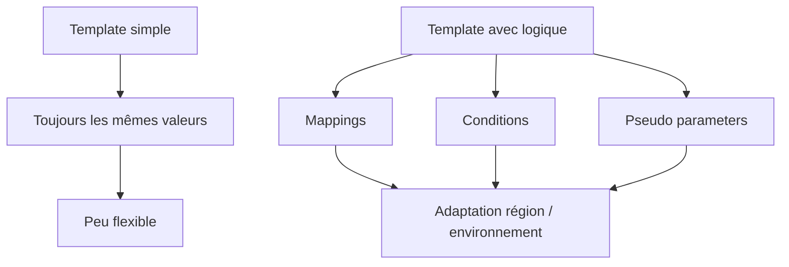
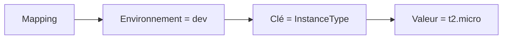
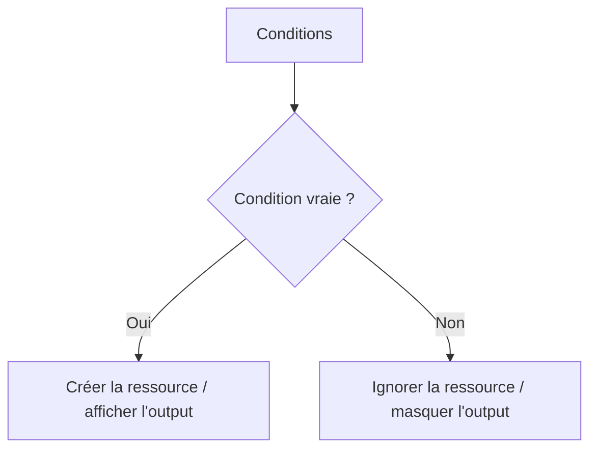
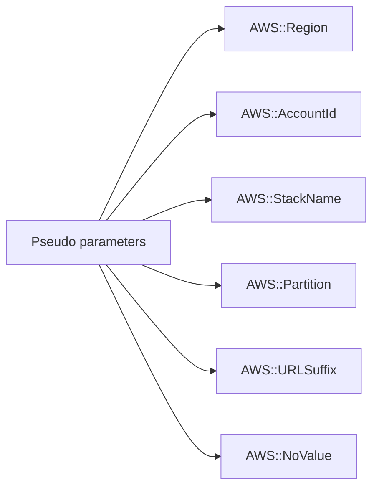
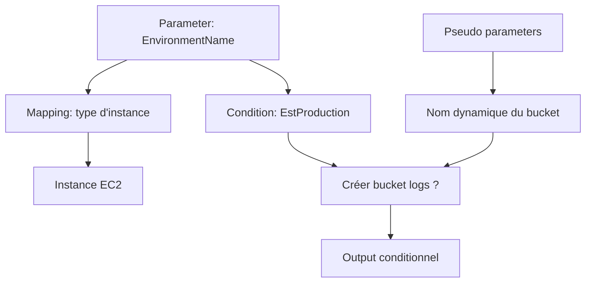
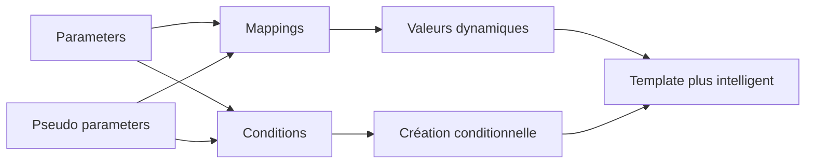

<a id="top"></a>

# AWS CloudFormation — Mappings, Conditions et pseudo parameters

## Table of Contents

| #  | Section                                                                        |
| -- | ------------------------------------------------------------------------------ |
| 1  | [Pourquoi ajouter de la logique dans un template ?](#section-1)                |
| 2  | [La section `Mappings`](#section-2)                                            |
| 2a |    ↳ [Quand utiliser un mapping au lieu d’un parameter](#section-2)            |
| 2b |    ↳ [`Fn::FindInMap` / `!FindInMap`](#section-2)                              |
| 3  | [La section `Conditions`](#section-3)                                          |
| 3a |    ↳ [Comment une condition est évaluée](#section-3)                           |
| 3b |    ↳ [Associer une condition à une ressource ou à un output](#section-3)       |
| 4  | [Les fonctions conditionnelles principales](#section-4)                        |
| 4a |    ↳ [`Fn::Equals`](#section-4)                                                |
| 4b |    ↳ [`Fn::If`](#section-4)                                                    |
| 4c |    ↳ [`Fn::And`, `Fn::Or`, `Fn::Not`](#section-4)                              |
| 5  | [Les pseudo parameters AWS](#section-5)                                        |
| 5a |    ↳ [`AWS::Region`, `AWS::AccountId`, `AWS::StackName`](#section-5)           |
| 5b |    ↳ [`AWS::Partition`, `AWS::URLSuffix`, `AWS::NoValue`](#section-5)          |
| 6  | [Exemple simple — choisir une valeur selon l’environnement](#section-6)        |
| 7  | [Exemple simple — choisir une AMI selon la région avec un mapping](#section-7) |
| 8  | [Exemple complet — EC2 conditionnelle selon l’environnement](#section-8)       |
| 9  | [Erreurs fréquentes chez les débutants](#section-9)                            |
| 10 | [Résumé des commandes](#section-10)                                            |
| 11 | [Conclusion](#section-11)                                                      |

---

<a id="section-1"></a>

<details>
<summary>1 - Pourquoi ajouter de la logique dans un template ?</summary>

<br/>

Dans les chapitres précédents, les templates étaient surtout **déclaratifs** : on décrivait des ressources et leurs propriétés. Mais, très vite, on rencontre des besoins plus réalistes :

* une valeur différente selon l’environnement
* une AMI différente selon la région
* une ressource créée uniquement en production
* un output affiché seulement dans certains cas

AWS indique que les **parameters** permettent déjà de personnaliser un template, mais précise aussi que certaines valeurs sont dépendantes de la région, ou trop complexes à demander directement à l’utilisateur. Dans ce cas, AWS recommande d’ajouter de la logique dans le template, par exemple avec des **mappings**. ([Documentation AWS][1])



---

### Idée clé

Les sections **`Mappings`** et **`Conditions`**, ainsi que les **pseudo parameters**, servent à rendre un template :

* plus intelligent
* plus portable
* plus réutilisable
* plus proche des besoins réels

AWS documente les sections de template et confirme que `Mappings` et `Conditions` sont des sections de premier niveau optionnelles, alors que `Resources` reste la seule section obligatoire. ([Documentation AWS][2])

</details>

<p align="right"><a href="#top">↑ Back to top</a></p>

---

<a id="section-2"></a>

<details>
<summary>2 - La section <code>Mappings</code></summary>

<br/>

La section `Mappings` permet de créer des **paires clé-valeur** dans le template. AWS explique que cette section optionnelle sert à spécifier des valeurs en fonction de certaines conditions ou dépendances, par exemple une région ou un environnement. ([Documentation AWS][3])

---

### Structure générale

Un mapping ressemble à un dictionnaire à deux niveaux :

```yaml
Mappings:
  NomDuMapping:
    CleNiveau1:
      CleNiveau2: valeur
```

AWS documente cette structure comme la syntaxe officielle de la section `Mappings`. ([Documentation AWS][3])

---

### Exemple simple

```yaml
Mappings:
  EnvironmentToSize:
    dev:
      InstanceType: t2.micro
    test:
      InstanceType: t3.micro
    prod:
      InstanceType: t3.small
```

Ici, le mapping associe chaque environnement à un type d’instance. C’est typiquement le genre de logique qu’AWS recommande de garder dans le template au lieu de la faire porter à l’utilisateur sous forme de calcul manuel. ([Documentation AWS][1])

---

### Quand utiliser un mapping au lieu d’un parameter

Utilisez un **parameter** quand vous voulez que l’utilisateur fournisse directement une valeur. Utilisez un **mapping** quand la valeur doit être **déduite automatiquement** à partir d’une autre information, comme une région ou un environnement. AWS formule exactement cette idée dans sa documentation sur les parameters, en indiquant que les mappings sont utiles lorsque certains choix dépendent de la région ou d’autres contraintes internes au template. ([Documentation AWS][1])

---

### `Fn::FindInMap` / `!FindInMap`

Pour lire une valeur dans un mapping, on utilise `Fn::FindInMap`. Cette fonction fait partie des fonctions intrinsèques CloudFormation et permet de récupérer une valeur en donnant :

1. le nom du mapping
2. la clé du premier niveau
3. la clé du second niveau

AWS documente cette logique dans la référence des fonctions intrinsèques et la section mappings. ([Documentation AWS][4])

Exemple :

```yaml
InstanceType: !FindInMap [EnvironmentToSize, dev, InstanceType]
```



---

<details>
<summary>Analogie simple pour comprendre</summary>
<br/>

Imaginez le **menu d'un restaurant qui change selon le jour**. Le lundi, le plat du jour est une soupe ; le mardi, c'est une salade ; le vendredi, c'est un steak. Vous ne choisissez pas le plat du jour vous-même, c'est le restaurant qui le décide en fonction du jour. Un **Mapping** fonctionne exactement pareil : vous dites « je suis en dev », et le template décide tout seul quel type d'instance utiliser, sans vous demander de faire le calcul.

</details>

</details>

<p align="right"><a href="#top">↑ Back to top</a></p>

---

<a id="section-3"></a>

<details>
<summary>3 - La section <code>Conditions</code></summary>

<br/>

La section `Conditions` permet de déclarer des **conditions logiques** dans le template. AWS indique que chaque déclaration de condition contient un identifiant logique et une ou plusieurs fonctions intrinsèques, et que ces conditions sont évaluées lors de la création ou de la mise à jour de la stack. ([Documentation AWS][5])

---

### Exemple simple

```yaml
Conditions:
  EstProduction: !Equals [!Ref EnvironmentName, prod]
```

Ici, la condition `EstProduction` vaut vrai si le paramètre `EnvironmentName` vaut `prod`. AWS documente `Fn::Equals` comme une fonction conditionnelle standard pour comparer deux valeurs. ([Documentation AWS][6])

---

### Comment une condition est évaluée

AWS précise que les conditions sont évaluées au moment de la création ou de la mise à jour de la stack. Une fois définies, elles peuvent être associées à des ressources, à certaines propriétés ou à des outputs. ([Documentation AWS][6])

---

### Associer une condition à une ressource

On peut utiliser le mot-clé `Condition` dans une ressource :

```yaml
MaRessource:
  Type: AWS::S3::Bucket
  Condition: EstProduction
```

Si la condition est vraie, la ressource est créée. Sinon, elle ne l’est pas. AWS précise que les conditions peuvent être associées à des ressources dans la section `Resources`. ([Documentation AWS][6])

---

### Associer une condition à un output

AWS documente aussi que les outputs peuvent être conditionnels. La syntaxe de la section `Outputs` permet d’associer une condition à une sortie définie dans `Conditions`. ([Documentation AWS][7])

```yaml
Outputs:
  UrlProduction:
    Condition: EstProduction
    Description: URL de production
    Value: https://example.com
```



---

<details>
<summary>En résumé très simple</summary>
<br/>

- Une **condition** est une question oui/non posée au moment du déploiement (ex. : « est-ce qu'on est en production ? »)
- Si la réponse est **oui**, CloudFormation crée la ressource ou affiche l'output concerné
- Si la réponse est **non**, il l'ignore complètement — comme si la ligne n'existait pas dans le template

</details>

</details>

<p align="right"><a href="#top">↑ Back to top</a></p>

---

<a id="section-4"></a>

<details>
<summary>4 - Les fonctions conditionnelles principales</summary>

<br/>

AWS documente plusieurs fonctions intrinsèques spécialement dédiées aux conditions : `Fn::If`, `Fn::Equals`, `Fn::And`, `Fn::Or` et `Fn::Not`. Elles servent à créer et configurer les ressources en fonction d’une logique conditionnelle. ([Documentation AWS][6])

---

### `Fn::Equals`

Cette fonction compare deux valeurs et retourne vrai si elles sont égales. AWS la présente comme la fonction la plus simple pour déclarer une condition de base. ([Documentation AWS][6])

```yaml
Conditions:
  EstProd: !Equals [!Ref EnvironmentName, prod]
```

---

### `Fn::If`

`Fn::If` permet de choisir entre deux valeurs selon qu’une condition soit vraie ou fausse. AWS précise qu’elle peut être utilisée dans les propriétés de ressource, les outputs, les métadonnées et les update policies. ([Documentation AWS][6])

```yaml
InstanceType: !If [EstProd, t3.small, t2.micro]
```

---

### `Fn::And`, `Fn::Or`, `Fn::Not`

Ces fonctions permettent de combiner plusieurs tests. AWS les documente comme opérateurs logiques de composition dans les conditions. ([Documentation AWS][6])

```yaml
Conditions:
  EstProdEtUsEast1: !And
    - !Equals [!Ref EnvironmentName, prod]
    - !Equals [!Ref "AWS::Region", us-east-1]
```

```yaml
Conditions:
  PasProd: !Not [!Equals [!Ref EnvironmentName, prod]]
```

```yaml
Conditions:
  EstDevOuTest: !Or
    - !Equals [!Ref EnvironmentName, dev]
    - !Equals [!Ref EnvironmentName, test]
```

---

### Important : où utiliser ces fonctions

AWS rappelle que les fonctions intrinsèques ne peuvent être utilisées que dans certaines parties du template, notamment les propriétés de ressource, les outputs, les métadonnées et certains attributs. ([Documentation AWS][4])

</details>

<p align="right"><a href="#top">↑ Back to top</a></p>

---

<a id="section-5"></a>

<details>
<summary>5 - Les pseudo parameters AWS</summary>

<br/>

Les **pseudo parameters** sont des variables intégrées fournies automatiquement par CloudFormation. AWS explique qu’ils donnent accès à des informations importantes sur l’environnement AWS courant, comme le compte, la région ou le nom de la stack. Ils permettent d’éviter les valeurs codées en dur et rendent les templates plus portables. ([Documentation AWS][8])

---

### Exemples classiques

#### `AWS::Region`

Retourne la région AWS dans laquelle la stack est déployée. ([Documentation AWS][8])

```yaml
Value: !Ref AWS::Region
```

#### `AWS::AccountId`

Retourne l’ID du compte AWS courant. ([Documentation AWS][8])

```yaml
Value: !Ref AWS::AccountId
```

#### `AWS::StackName`

Retourne le nom de la stack. AWS note aussi que certaines opérations de refactorisation ne supportent pas les ressources qui dépendent de pseudo parameters dont la valeur changerait, comme `AWS::StackName`, ce qui montre bien qu’il s’agit d’une valeur de contexte dynamique. ([Documentation AWS][8])

```yaml
Value: !Ref AWS::StackName
```

---

### `AWS::Partition`

Retourne la partition AWS, par exemple `aws`, `aws-cn` ou `aws-us-gov`. Cela aide à construire des ARN portables sans supposer une seule partition. AWS le documente dans la référence des pseudo parameters. ([Documentation AWS][8])

---

### `AWS::URLSuffix`

Retourne le suffixe DNS selon la partition, par exemple `amazonaws.com`. Très pratique pour construire certaines URL de service sans les coder en dur. AWS le documente également dans la référence des pseudo parameters. ([Documentation AWS][8])

---

### `AWS::NoValue`

`AWS::NoValue` est un pseudo parameter spécial. Utilisé avec `Fn::If`, il permet de **retirer une propriété** au lieu de lui attribuer une valeur. AWS le documente comme mécanisme pour supprimer une propriété quand une condition ne s’applique pas. ([Documentation AWS][8])

Exemple :

```yaml
KeyName: !If [UseKeyPair, !Ref KeyPairName, !Ref AWS::NoValue]
```



---

<details>
<summary>Analogie simple pour comprendre</summary>
<br/>

Les pseudo parameters, c'est comme un **GPS intégré dans votre voiture qui sait déjà où vous êtes**. Vous n'avez pas besoin de taper votre position manuellement : le GPS connaît votre pays, votre ville, votre rue. De la même façon, `AWS::Region` sait dans quelle région vous déployez, `AWS::AccountId` connaît votre compte, et `AWS::StackName` connaît le nom de votre stack. Vous n'avez rien à configurer, ces informations sont disponibles automatiquement.

</details>

</details>

<p align="right"><a href="#top">↑ Back to top</a></p>

---

<a id="section-6"></a>

<details>
<summary>6 - Exemple simple — choisir une valeur selon l’environnement</summary>

<br/>

Voici un exemple simple où le type d’instance dépend de l’environnement sélectionné.

```yaml
AWSTemplateFormatVersion: '2010-09-09'
Description: Exemple simple avec mapping par environnement

Parameters:
  EnvironmentName:
    Type: String
    AllowedValues:
      - dev
      - test
      - prod
    Default: dev

Mappings:
  EnvironmentToInstanceType:
    dev:
      InstanceType: t2.micro
    test:
      InstanceType: t3.micro
    prod:
      InstanceType: t3.small

Resources:
  MonServeurEC2:
    Type: AWS::EC2::Instance
    Properties:
      ImageId: ami-xxxxxxxxxxxxxxxxx
      InstanceType: !FindInMap [EnvironmentToInstanceType, !Ref EnvironmentName, InstanceType]
```

Ce pattern correspond exactement à l’usage recommandé par AWS quand certaines valeurs dépendent d’un contexte logique interne au template plutôt que d’une saisie utilisateur directe. ([Documentation AWS][1])

---

### Pourquoi cet exemple est intéressant

L’utilisateur choisit seulement :

* `dev`
* `test`
* `prod`

Le template décide lui-même du type d’instance précis. Cela simplifie l’usage et réduit les erreurs. ([Documentation AWS][1])

</details>

<p align="right"><a href="#top">↑ Back to top</a></p>

---

<a id="section-7"></a>

<details>
<summary>7 - Exemple simple — choisir une AMI selon la région avec un mapping</summary>

<br/>

Comme les identifiants d’AMI varient souvent selon la région, les mappings sont particulièrement adaptés à ce cas.

```yaml
AWSTemplateFormatVersion: '2010-09-09'
Description: Exemple de mapping AMI par région

Mappings:
  RegionToAmi:
    us-east-1:
      AmiId: ami-11111111111111111
    ca-central-1:
      AmiId: ami-22222222222222222
    eu-west-1:
      AmiId: ami-33333333333333333

Resources:
  MonServeurEC2:
    Type: AWS::EC2::Instance
    Properties:
      ImageId: !FindInMap [RegionToAmi, !Ref AWS::Region, AmiId]
      InstanceType: t2.micro
```

AWS indique que les pseudo parameters comme `AWS::Region` servent précisément à rendre les templates portables entre régions, et que les mappings permettent de traduire ce contexte en valeurs concrètes. ([Documentation AWS][8])

---

### Ce que fait ce template

* lit la région courante avec `AWS::Region`
* cherche l’AMI correspondante dans le mapping
* injecte cette AMI dans l’instance EC2

C’est un très bon exemple de combinaison entre **mapping** et **pseudo parameter**. ([Documentation AWS][8])

</details>

<p align="right"><a href="#top">↑ Back to top</a></p>

---

<a id="section-8"></a>

<details>
<summary>8 - Exemple complet — EC2 conditionnelle selon l’environnement</summary>

<br/>

Voici un exemple plus complet où :

* l’environnement est choisi par paramètre
* le type d’instance dépend d’un mapping
* une seconde ressource n’est créée qu’en production
* un output n’apparaît qu’en production

```yaml
AWSTemplateFormatVersion: '2010-09-09'
Description: Exemple complet avec mappings, conditions et pseudo parameters

Parameters:
  EnvironmentName:
    Type: String
    AllowedValues:
      - dev
      - test
      - prod
    Default: dev
    Description: Environnement de déploiement

Mappings:
  EnvironmentToInstanceType:
    dev:
      InstanceType: t2.micro
    test:
      InstanceType: t3.micro
    prod:
      InstanceType: t3.small

Conditions:
  EstProduction: !Equals [!Ref EnvironmentName, prod]

Resources:
  MonServeurPrincipal:
    Type: AWS::EC2::Instance
    Properties:
      ImageId: ami-xxxxxxxxxxxxxxxxx
      InstanceType: !FindInMap [EnvironmentToInstanceType, !Ref EnvironmentName, InstanceType]

  MonBucketLogsProd:
    Type: AWS::S3::Bucket
    Condition: EstProduction
    Properties:
      BucketName: !Sub "logs-${AWS::StackName}-${AWS::AccountId}"

Outputs:
  EnvironmentDeploye:
    Description: Environnement sélectionné
    Value: !Ref EnvironmentName

  RegionCourante:
    Description: Région AWS courante
    Value: !Ref AWS::Region

  BucketLogsProdName:
    Condition: EstProduction
    Description: Nom du bucket de logs créé uniquement en prod
    Value: !Ref MonBucketLogsProd
```

Cette structure est conforme à la documentation AWS sur `Mappings`, `Conditions`, les pseudo parameters, la section `Outputs` et l’usage des conditions sur les ressources et les sorties. ([Documentation AWS][3])

---

### Ce qu’il faut retenir

* `EnvironmentName` pilote la logique du template
* `Mappings` décide du type d’instance
* `Conditions` décide si le bucket de logs est créé
* `AWS::StackName`, `AWS::AccountId` et `AWS::Region` évitent les valeurs codées en dur



---

<details>
<summary>En résumé très simple</summary>
<br/>

- L'utilisateur choisit juste **un environnement** (dev, test ou prod) — le template fait tout le reste
- Le **Mapping** décide automatiquement de la taille du serveur selon l'environnement choisi
- La **Condition** décide si un bucket de logs est créé (uniquement en prod), et les **pseudo parameters** génèrent un nom de bucket unique sans rien coder en dur

</details>

</details>

<p align="right"><a href="#top">↑ Back to top</a></p>

---

<a id="section-9"></a>

<details>
<summary>9 - Erreurs fréquentes chez les débutants</summary>

<br/>

### 1. Utiliser un mapping pour tout

Les mappings sont utiles, mais pas pour toutes les données. AWS suggère de les employer surtout quand certaines valeurs dépendent d’une logique interne comme la région ou une dépendance contextuelle. Si la valeur doit être choisie librement par l’utilisateur, un parameter est souvent plus adapté. ([Documentation AWS][1])

### 2. Oublier `Fn::FindInMap`

Déclarer un mapping ne fait rien tout seul. Il faut ensuite le lire avec `Fn::FindInMap`. Cette fonction fait partie des fonctions intrinsèques de CloudFormation. ([Documentation AWS][4])

### 3. Croire qu’une condition agit partout automatiquement

Une condition doit être **rattachée explicitement** à une ressource, à une propriété via `Fn::If`, ou à un output. AWS précise que les conditions sont d’abord déclarées, puis associées aux endroits voulus. ([Documentation AWS][6])

### 4. Mettre des valeurs sensibles dans `NoEcho` puis les réutiliser en sortie

AWS précise clairement que `NoEcho` ne masque pas les données exposées dans `Outputs`, dans `Metadata` ou dans certains identifiants de ressources. ([Documentation AWS][1])

### 5. Oublier `AWS::NoValue`

Quand une propriété doit disparaître complètement selon une condition, `AWS::NoValue` est souvent la bonne solution. Sinon, on se retrouve à forcer une valeur vide ou incorrecte. AWS le documente comme pseudo parameter dédié à ce cas. ([Documentation AWS][8])

</details>

<p align="right"><a href="#top">↑ Back to top</a></p>

---

<a id="section-10"></a>

<details>
<summary>10 - Résumé des commandes</summary>

<br/>

```bash
# Créer la stack
aws cloudformation create-stack \
  --stack-name chapitre5-demo \
  --template-body file://chapitre5-mappings-conditions.yaml \
  --parameters ParameterKey=EnvironmentName,ParameterValue=dev

# Décrire la stack
aws cloudformation describe-stacks \
  --stack-name chapitre5-demo

# Voir les ressources créées
aws cloudformation describe-stack-resources \
  --stack-name chapitre5-demo

# Mettre à jour la stack en prod
aws cloudformation update-stack \
  --stack-name chapitre5-demo \
  --template-body file://chapitre5-mappings-conditions.yaml \
  --parameters ParameterKey=EnvironmentName,ParameterValue=prod

# Supprimer la stack
aws cloudformation delete-stack \
  --stack-name chapitre5-demo
```

Ces commandes suivent le cycle standard CloudFormation documenté par AWS : création, description, mise à jour et suppression de stack. ([Documentation AWS][9])

</details>

<p align="right"><a href="#top">↑ Back to top</a></p>

---

<a id="section-11"></a>

<details>
<summary>11 - Conclusion</summary>

<br/>

Dans ce chapitre, on a ajouté une vraie couche de logique au template grâce à :

* `Mappings`
* `Fn::FindInMap`
* `Conditions`
* `Fn::Equals`
* `Fn::If`
* `Fn::And`, `Fn::Or`, `Fn::Not`
* les pseudo parameters comme `AWS::Region`, `AWS::AccountId`, `AWS::StackName` et `AWS::NoValue`

AWS documente ces briques comme les mécanismes standard pour adapter un template selon la région, le compte, l’environnement ou des règles logiques internes. Elles permettent de construire des templates plus portables, plus intelligents et plus propres. ([Documentation AWS][3])



### Suite logique du prochain chapitre

Le chapitre 6 peut porter sur :

* S3 avec CloudFormation
* bucket naming
* versioning
* tags
* outputs
* `DeletionPolicy`
* bonnes pratiques de suppression


[1]: https://docs.aws.amazon.com/AWSCloudFormation/latest/UserGuide/parameters-section-structure.html?utm_source=chatgpt.com "CloudFormation template Parameters syntax"
[2]: https://docs.aws.amazon.com/AWSCloudFormation/latest/UserGuide/template-anatomy.html?utm_source=chatgpt.com "CloudFormation template sections"
[3]: https://docs.aws.amazon.com/AWSCloudFormation/latest/UserGuide/mappings-section-structure.html?utm_source=chatgpt.com "CloudFormation template Mappings syntax"
[4]: https://docs.aws.amazon.com/AWSCloudFormation/latest/TemplateReference/intrinsic-function-reference.html?utm_source=chatgpt.com "Intrinsic function reference - AWS CloudFormation"
[5]: https://docs.aws.amazon.com/AWSCloudFormation/latest/UserGuide/conditions-section-structure.html?utm_source=chatgpt.com "CloudFormation template Conditions syntax"
[6]: https://docs.aws.amazon.com/AWSCloudFormation/latest/TemplateReference/intrinsic-function-reference-conditions.html?utm_source=chatgpt.com "Condition functions - AWS CloudFormation"
[7]: https://docs.aws.amazon.com/AWSCloudFormation/latest/UserGuide/outputs-section-structure.html?utm_source=chatgpt.com "CloudFormation template Outputs syntax"
[8]: https://docs.aws.amazon.com/AWSCloudFormation/latest/UserGuide/pseudo-parameter-reference.html?utm_source=chatgpt.com "Get AWS values using pseudo parameters"
[9]: https://docs.aws.amazon.com/AWSCloudFormation/latest/UserGuide/Welcome.html?utm_source=chatgpt.com "What is CloudFormation?"
