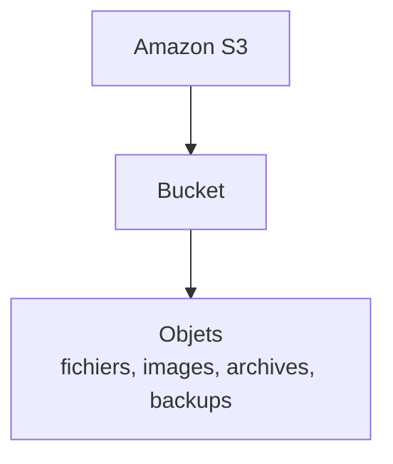
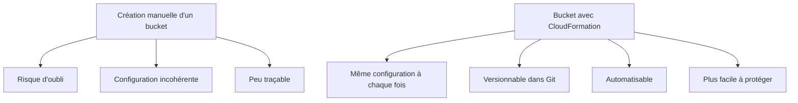
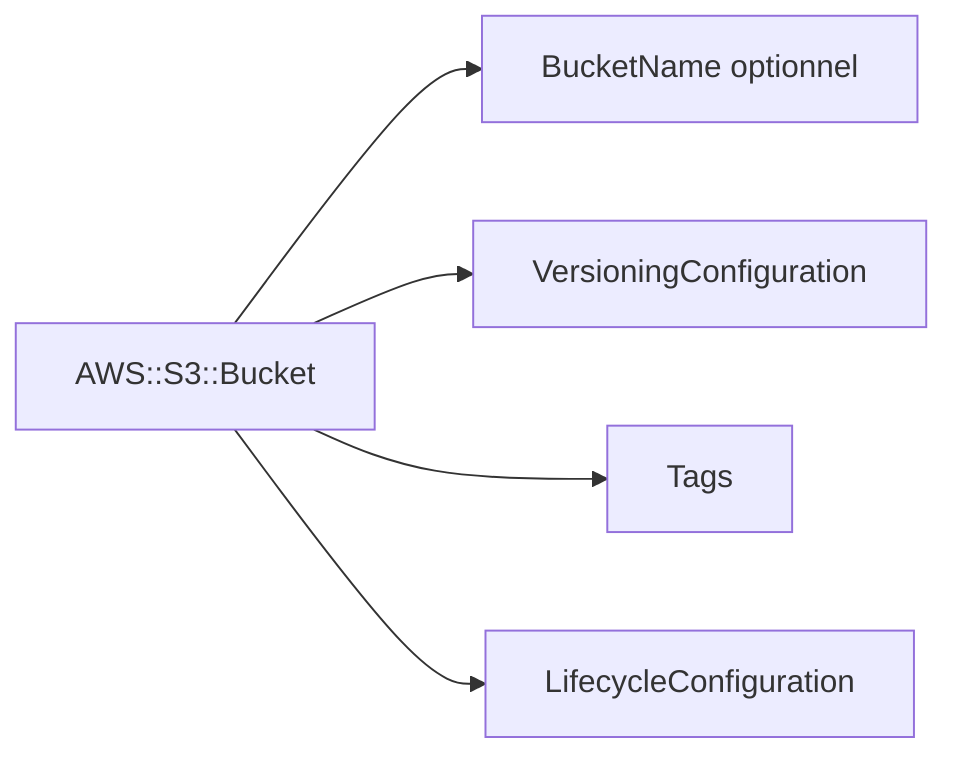
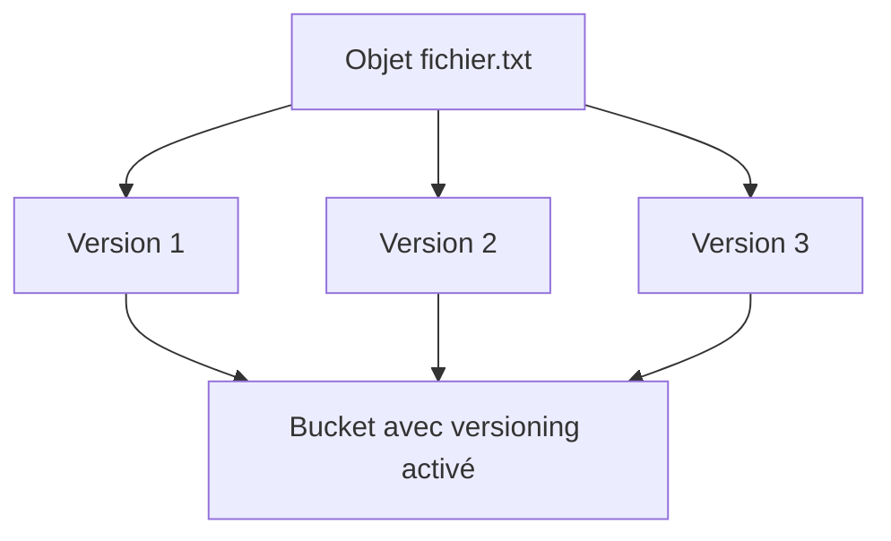
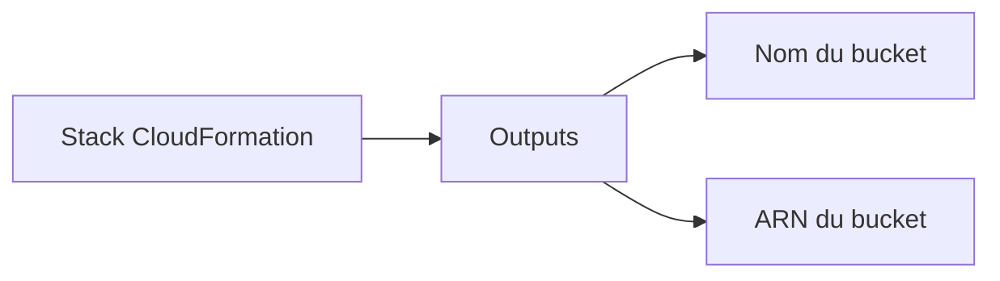
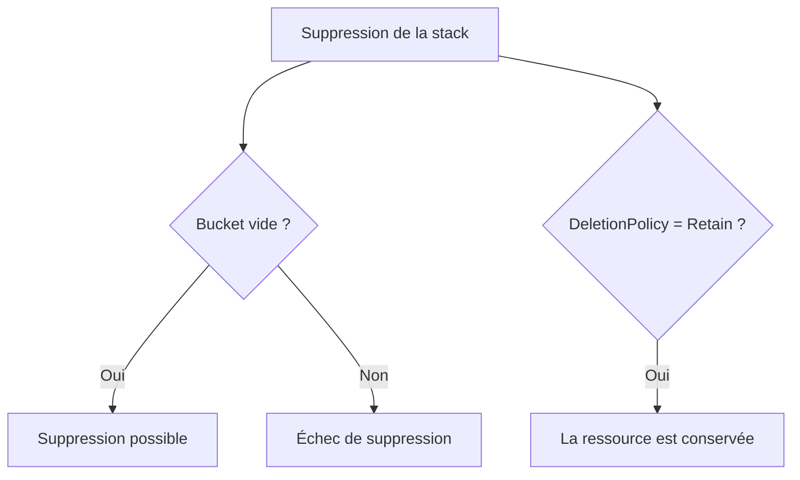
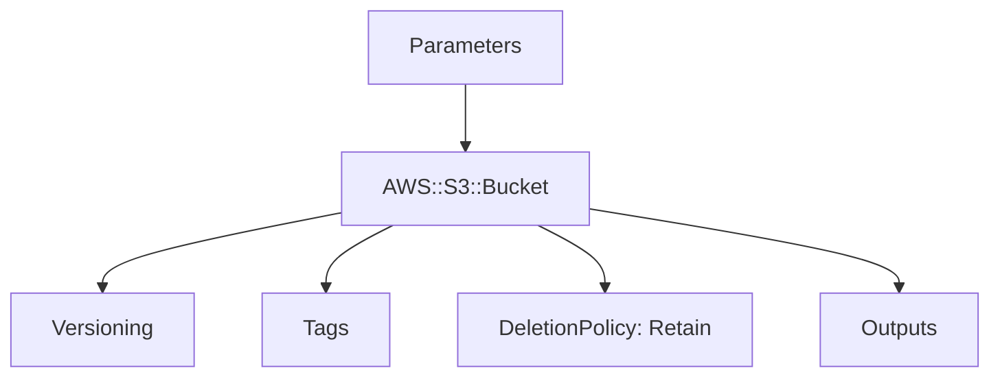
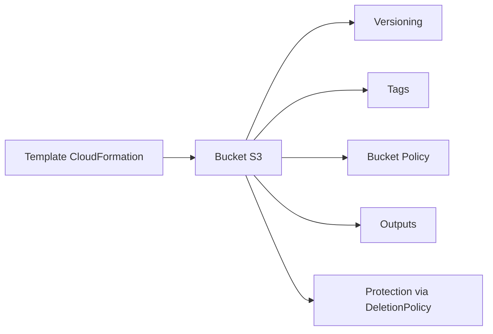

<a id="top"></a>

# AWS CloudFormation — S3 avec CloudFormation : buckets, versioning, outputs et protections

## Table of Contents

| #  | Section                                                                                              |
| -- | ---------------------------------------------------------------------------------------------------- |
| 1  | [Qu’est-ce qu’un bucket S3 ?](#section-1)                                                            |
| 2  | [Pourquoi gérer S3 avec CloudFormation ?](#section-2)                                                |
| 3  | [La ressource `AWS::S3::Bucket`](#section-3)                                                         |
| 3a |    ↳ [Nom du bucket, région et logique de création](#section-3)                                      |
| 3b |    ↳ [Pourquoi le nom d’un bucket demande de l’attention](#section-3)                                |
| 4  | [Premier template S3 minimal](#section-4)                                                            |
| 5  | [Activer le versioning du bucket](#section-5)                                                        |
| 6  | [Ajouter des tags au bucket](#section-6)                                                             |
| 7  | [Exposer les informations utiles avec `Outputs`](#section-7)                                         |
| 8  | [`DeletionPolicy` — protéger un bucket contre une suppression involontaire](#section-8)              |
| 8a |    ↳ [Pourquoi la suppression d’un bucket peut échouer](#section-8)                                  |
| 8b |    ↳ [`DeletionPolicy` vs `UpdateReplacePolicy`](#section-8)                                         |
| 9  | [Bucket policy — donner des permissions au bucket](#section-9)                                       |
| 10 | [Exemple complet — bucket S3 paramétrable avec versioning, tags, outputs et protection](#section-10) |
| 11 | [Erreurs fréquentes chez les débutants](#section-11)                                                 |
| 12 | [Résumé des commandes](#section-12)                                                                  |
| 13 | [Conclusion](#section-13)                                                                            |

---

<a id="section-1"></a>

<details>
<summary>1 - Qu’est-ce qu’un bucket S3 ?</summary>

<br/>

Amazon S3 est un service de stockage objet d’AWS. AWS le décrit comme un service de stockage objet offrant une très forte scalabilité, disponibilité des données, sécurité et performance. Un **bucket S3** est le conteneur logique dans lequel on stocke les objets. ([AWS Documentation][1])



---

### À quoi sert un bucket

Un bucket peut servir à :

* stocker des documents
* héberger des sauvegardes
* stocker des fichiers statiques
* conserver des logs
* servir de point d’entrée pour des traitements de données

AWS rappelle qu’avant de pouvoir envoyer des données dans S3, il faut d’abord créer un bucket dans une région AWS. ([AWS Documentation][2])

---

<details>
<summary>Analogie simple pour comprendre</summary>
<br/>

Un **bucket S3**, c'est comme un **coffre-fort numérique** ou un **grand classeur** dans lequel vous rangez tous vos fichiers. Imaginez un classeur à tiroirs dans un bureau : chaque tiroir peut contenir des documents, des photos, des archives. Le classeur lui-même, c'est le bucket. Les documents à l'intérieur, ce sont les objets. Vous pouvez avoir plusieurs classeurs (buckets) pour différents projets, et chacun a son propre nom unique.

</details>

</details>

<p align="right"><a href="#top">↑ Back to top</a></p>

---

<a id="section-2"></a>

<details>
<summary>2 - Pourquoi gérer S3 avec CloudFormation ?</summary>

<br/>

Gérer un bucket S3 avec CloudFormation permet de le créer de façon **reproductible**, **versionnée** et **contrôlée**. AWS décrit CloudFormation comme un service qui modélise et déploie les ressources AWS à partir d’un template, ce qui réduit la gestion manuelle. ([AWS Documentation][3])



---

### Avantages concrets

* le même template peut être rejoué dans plusieurs environnements
* les propriétés du bucket sont visibles dans le code
* les protections comme `DeletionPolicy` peuvent être définies dès le départ
* les outputs peuvent exposer automatiquement le nom ou l’ARN du bucket après déploiement

AWS documente à la fois la ressource `AWS::S3::Bucket`, la section `Outputs` et l’attribut `DeletionPolicy` pour ces usages. ([AWS Documentation][4])

</details>

<p align="right"><a href="#top">↑ Back to top</a></p>

---

<a id="section-3"></a>

<details>
<summary>3 - La ressource <code>AWS::S3::Bucket</code></summary>

<br/>

Dans CloudFormation, un bucket S3 se crée avec la ressource `AWS::S3::Bucket`. AWS précise que cette ressource crée un bucket S3 dans la **même région** que celle où la stack CloudFormation est créée. ([AWS Documentation][4])

```yaml
Resources:
  MonBucketS3:
    Type: AWS::S3::Bucket
```

---

### Nom du bucket, région et logique de création

Si vous ne fournissez pas explicitement un nom de bucket, AWS peut en générer un. Si vous fournissez un nom, il doit être compatible avec les règles S3 et rester disponible. La ressource est créée dans la région de la stack CloudFormation. ([AWS Documentation][4])

---

### Pourquoi le nom d’un bucket demande de l’attention

Le nom d’un bucket doit être pensé avec soin, car les conflits de nommage arrivent vite lorsqu’on impose un nom fixe dans les templates. En pratique, on ajoute souvent un suffixe dynamique ou un paramètre de contexte pour réduire le risque de collision. Cette précaution découle du fait que le bucket est une ressource S3 nommée et que CloudFormation permet de définir explicitement ce nom via `BucketName`. ([AWS Documentation][4])



</details>

<p align="right"><a href="#top">↑ Back to top</a></p>

---

<a id="section-4"></a>

<details>
<summary>4 - Premier template S3 minimal</summary>

<br/>

Voici le template S3 le plus simple possible :

```yaml
AWSTemplateFormatVersion: '2010-09-09'
Description: Bucket S3 minimal

Resources:
  MonBucketS3:
    Type: AWS::S3::Bucket
```

AWS documente `AWS::S3::Bucket` comme ressource standard de CloudFormation pour créer un bucket S3. ([AWS Documentation][4])

---

### Ce que fait ce template

* crée un bucket S3
* ne fixe pas explicitement son nom
* ne configure ni versioning, ni tags, ni policy

C’est un bon point de départ pour comprendre la logique de la ressource avant d’ajouter des propriétés avancées. ([AWS Documentation][4])

</details>

<p align="right"><a href="#top">↑ Back to top</a></p>

---

<a id="section-5"></a>

<details>
<summary>5 - Activer le versioning du bucket</summary>

<br/>

Le versioning permet de conserver plusieurs versions d’un même objet dans le bucket. Dans CloudFormation, cela se configure avec `VersioningConfiguration` sur la ressource `AWS::S3::Bucket`. AWS documente cette propriété dans la référence de la ressource. ([AWS Documentation][4])

```yaml
AWSTemplateFormatVersion: '2010-09-09'
Description: Bucket S3 avec versioning

Resources:
  MonBucketS3:
    Type: AWS::S3::Bucket
    Properties:
      VersioningConfiguration:
        Status: Enabled
```

---

### Pourquoi c’est utile

Le versioning aide à :

* conserver l’historique des objets
* limiter les effets d’un écrasement accidentel
* améliorer certains scénarios de récupération

Comme CloudFormation traite cette configuration comme une propriété du bucket, elle devient automatiquement reproductible à chaque déploiement. ([AWS Documentation][4])



---

<details>
<summary>En résumé très simple</summary>
<br/>

- Le **versioning**, c'est comme un historique automatique : chaque fois que vous modifiez un fichier, l'ancienne version est conservée
- Si vous écrasez un fichier par erreur, vous pouvez revenir à une version précédente
- C'est une ligne de configuration dans le template, et ça s'active à chaque déploiement automatiquement

</details>

</details>

<p align="right"><a href="#top">↑ Back to top</a></p>

---

<a id="section-6"></a>

<details>
<summary>6 - Ajouter des tags au bucket</summary>

<br/>

Les buckets S3 peuvent recevoir des tags via la propriété `Tags`, comme beaucoup d’autres ressources CloudFormation. Cela permet de classer les ressources par projet, environnement, centre de coût ou usage. La propriété `Tags` est documentée dans la ressource `AWS::S3::Bucket`. ([AWS Documentation][4])

```yaml
AWSTemplateFormatVersion: '2010-09-09'
Description: Bucket S3 avec tags

Resources:
  MonBucketS3:
    Type: AWS::S3::Bucket
    Properties:
      Tags:
        - Key: Environment
          Value: dev
        - Key: Application
          Value: demo-cloudformation
```

---

### Pourquoi les tags sont importants

Les tags servent à :

* mieux organiser les ressources
* retrouver rapidement les buckets
* améliorer le suivi opérationnel

CloudFormation permet donc d’inclure cette organisation directement dans le template au lieu de l’ajouter manuellement après coup. ([AWS Documentation][4])

</details>

<p align="right"><a href="#top">↑ Back to top</a></p>

---

<a id="section-7"></a>

<details>
<summary>7 - Exposer les informations utiles avec <code>Outputs</code></summary>

<br/>

La section `Outputs` est optionnelle, mais très utile pour afficher les informations importantes d’un bucket après déploiement. AWS précise que les outputs servent à déclarer les valeurs retournées par la stack et qu’ils peuvent contenir des identifiants de ressource ou d’autres informations opérationnelles. ([AWS Documentation][5])

```yaml
Outputs:
  BucketName:
    Description: Nom du bucket créé
    Value: !Ref MonBucketS3

  BucketArn:
    Description: ARN du bucket
    Value: !GetAtt MonBucketS3.Arn
```

---

### Pourquoi c’est pratique

Grâce aux outputs :

* vous voyez immédiatement le nom du bucket
* vous récupérez son ARN sans aller dans la console S3
* vous pouvez réutiliser ces valeurs ailleurs

AWS documente aussi les références croisées entre stacks via les outputs exportés, ce qui rend cette section très importante dans les architectures modulaires. ([AWS Documentation][6])



</details>

<p align="right"><a href="#top">↑ Back to top</a></p>

---

<a id="section-8"></a>

<details>
<summary>8 - <code>DeletionPolicy</code> — protéger un bucket contre une suppression involontaire</summary>

<br/>

`DeletionPolicy` permet de contrôler ce que CloudFormation fait d’une ressource quand la stack est supprimée. AWS indique que, sans `DeletionPolicy`, CloudFormation supprime la ressource par défaut. Pour un bucket S3, cela demande une attention particulière. ([AWS Documentation][7])

```yaml
AWSTemplateFormatVersion: '2010-09-09'
Description: Bucket S3 protégé

Resources:
  MonBucketS3:
    Type: AWS::S3::Bucket
    DeletionPolicy: Retain
```

---

### Pourquoi la suppression d’un bucket peut échouer

AWS précise explicitement qu’un bucket S3 ne peut être supprimé que s’il est **vide**. Si le bucket contient des objets, la suppression échoue. ([AWS Documentation][4])

Cela veut dire que :

* supprimer la stack peut échouer si le bucket contient encore des fichiers
* `DeletionPolicy: Retain` est souvent une bonne protection pour éviter une suppression accidentelle



---

### `DeletionPolicy` vs `UpdateReplacePolicy`

AWS distingue `DeletionPolicy` et `UpdateReplacePolicy`. `DeletionPolicy` s’applique quand une ressource est supprimée lors de la suppression de la stack ou retirée du template, tandis que `UpdateReplacePolicy` s’applique aux remplacements pendant une mise à jour. ([AWS Documentation][8])

Pour un bucket important, on pense souvent d’abord à `DeletionPolicy`, puis éventuellement à `UpdateReplacePolicy` selon le scénario. ([AWS Documentation][8])

---

<details>
<summary>Analogie simple pour comprendre</summary>
<br/>

`DeletionPolicy`, c'est comme mettre un **cadenas sur votre coffre-fort**. Sans cadenas (sans `DeletionPolicy`), si quelqu'un supprime la stack, le coffre-fort et tout son contenu disparaissent. Avec `Retain`, c'est comme dire « même si on démolit le bureau, le coffre-fort reste en place ». Vous protégez vos données contre une suppression accidentelle.

</details>

</details>

<p align="right"><a href="#top">↑ Back to top</a></p>

---

<a id="section-9"></a>

<details>
<summary>9 - Bucket policy — donner des permissions au bucket</summary>

<br/>

La ressource CloudFormation `AWS::S3::BucketPolicy` permet de créer, mettre à jour et supprimer une policy attachée à un bucket S3. AWS documente cette ressource séparément de `AWS::S3::Bucket`. ([AWS Documentation][9])

Une bucket policy S3 est une **resource-based policy** qui permet de définir qui peut accéder au bucket et aux objets. AWS précise que seule la personne ou le compte propriétaire du bucket peut lui associer une telle policy. ([AWS Documentation][10])

---

### Exemple simple

```yaml
Resources:
  MonBucketS3:
    Type: AWS::S3::Bucket

  MaBucketPolicy:
    Type: AWS::S3::BucketPolicy
    Properties:
      Bucket: !Ref MonBucketS3
      PolicyDocument:
        Version: '2012-10-17'
        Statement:
          - Sid: ExampleStatement
            Effect: Allow
            Principal: "*"
            Action:
              - s3:GetObject
            Resource: !Sub "${MonBucketS3.Arn}/*"
```

---

### Attention pédagogique

Dans un cours débutant, on montre souvent la bucket policy comme mécanisme de permissions, mais on évite d’ouvrir un bucket publiquement sans expliquer les risques. L’essentiel ici est de comprendre la séparation :

* `AWS::S3::Bucket` = le bucket lui-même
* `AWS::S3::BucketPolicy` = les permissions attachées au bucket

AWS illustre cette séparation dans sa documentation CloudFormation et S3. ([AWS Documentation][9])

---

<details>
<summary>En résumé très simple</summary>
<br/>

- Une **bucket policy** définit **qui a le droit** de lire, écrire ou supprimer des fichiers dans le bucket — c'est comme une liste de personnes autorisées à ouvrir le classeur
- Le bucket et sa policy sont **deux ressources séparées** dans CloudFormation : l'une crée le classeur, l'autre définit les règles d'accès
- Attention à ne pas donner l'accès à tout le monde par erreur — c'est comme laisser la porte du bureau grande ouverte

</details>

</details>

<p align="right"><a href="#top">↑ Back to top</a></p>

---

<a id="section-10"></a>

<details>
<summary>10 - Exemple complet — bucket S3 paramétrable avec versioning, tags, outputs et protection</summary>

<br/>

Voici un exemple complet et propre, prêt à être repris dans un projet :

```yaml
AWSTemplateFormatVersion: '2010-09-09'
Description: Bucket S3 paramétrable avec versioning, tags, outputs et protection

Parameters:
  BucketNameParam:
    Type: String
    Description: Nom du bucket S3

  EnvironmentName:
    Type: String
    AllowedValues:
      - dev
      - test
      - prod
    Default: dev
    Description: Environnement de déploiement

Resources:
  MonBucketS3:
    Type: AWS::S3::Bucket
    DeletionPolicy: Retain
    Properties:
      BucketName: !Ref BucketNameParam
      VersioningConfiguration:
        Status: Enabled
      Tags:
        - Key: Environment
          Value: !Ref EnvironmentName
        - Key: ManagedBy
          Value: CloudFormation
        - Key: Project
          Value: demo-s3

Outputs:
  BucketName:
    Description: Nom du bucket créé
    Value: !Ref MonBucketS3

  BucketArn:
    Description: ARN du bucket
    Value: !GetAtt MonBucketS3.Arn

  MessageInfo:
    Description: Message informatif
    Value: !Sub "Le bucket ${MonBucketS3} a été créé dans la stack ${AWS::StackName}"
```

Cet exemple repose sur des fonctionnalités officiellement documentées par AWS : la ressource `AWS::S3::Bucket`, la section `Parameters`, la section `Outputs`, `Ref`, `GetAtt`, `Sub` et `DeletionPolicy`. ([AWS Documentation][4])

---

### Ce que fait ce template

* demande un nom de bucket
* active le versioning
* ajoute des tags
* protège le bucket avec `DeletionPolicy: Retain`
* expose le nom, l’ARN et un message en sortie



</details>

<p align="right"><a href="#top">↑ Back to top</a></p>

---

<a id="section-11"></a>

<details>
<summary>11 - Erreurs fréquentes chez les débutants</summary>

<br/>

### 1. Donner un nom de bucket trop rigide

Quand on impose un nom fixe dans un template, le déploiement peut échouer si ce nom ne peut pas être utilisé dans le contexte voulu. Il vaut souvent mieux paramétrer le nom ou ajouter une logique de suffixe.

### 2. Oublier `DeletionPolicy` sur un bucket important

AWS indique que, sans `DeletionPolicy`, les ressources sont supprimées par défaut lorsque la stack est supprimée. Sur des ressources de stockage, cette omission peut être coûteuse. ([AWS Documentation][7])

### 3. Oublier que la suppression échoue si le bucket contient des objets

AWS le précise clairement : seuls les buckets vides peuvent être supprimés. ([AWS Documentation][4])

### 4. Exposer des permissions trop larges dans une bucket policy

Une bucket policy mal pensée peut ouvrir trop d’accès. AWS documente les bucket policies comme des resource-based policies qui contrôlent l’accès au bucket et aux objets. ([AWS Documentation][10])

### 5. Ne pas utiliser `Outputs`

Sans outputs, on perd du temps à chercher manuellement le nom exact ou l’ARN du bucket après déploiement. AWS explique que les outputs servent justement à récupérer ces informations opérationnelles. ([AWS Documentation][5])

</details>

<p align="right"><a href="#top">↑ Back to top</a></p>

---

<a id="section-12"></a>

<details>
<summary>12 - Résumé des commandes</summary>

<br/>

```bash
# Créer la stack
aws cloudformation create-stack \
  --stack-name s3-demo-stack \
  --template-body file://s3-demo.yaml \
  --parameters \
    ParameterKey=BucketNameParam,ParameterValue=mon-bucket-demo-unique-12345 \
    ParameterKey=EnvironmentName,ParameterValue=dev

# Décrire la stack
aws cloudformation describe-stacks \
  --stack-name s3-demo-stack

# Voir les ressources de la stack
aws cloudformation describe-stack-resources \
  --stack-name s3-demo-stack

# Mettre à jour la stack
aws cloudformation update-stack \
  --stack-name s3-demo-stack \
  --template-body file://s3-demo.yaml \
  --parameters \
    ParameterKey=BucketNameParam,ParameterValue=mon-bucket-demo-unique-12345 \
    ParameterKey=EnvironmentName,ParameterValue=prod

# Supprimer la stack
aws cloudformation delete-stack \
  --stack-name s3-demo-stack
```

Ces commandes suivent le cycle standard de gestion des stacks CloudFormation documenté par AWS. ([AWS Documentation][3])

</details>

<p align="right"><a href="#top">↑ Back to top</a></p>

---

<a id="section-13"></a>

<details>
<summary>13 - Conclusion</summary>

<br/>

Dans ce chapitre, on a vu comment gérer S3 proprement avec CloudFormation grâce à :

* `AWS::S3::Bucket`
* `VersioningConfiguration`
* `Tags`
* `Outputs`
* `DeletionPolicy`
* `AWS::S3::BucketPolicy`

AWS documente ces briques comme les mécanismes standards pour créer, configurer, protéger et exposer les informations d’un bucket S3 dans un template CloudFormation. ([AWS Documentation][4])



### Suite logique du prochain chapitre

Le chapitre 7 peut porter sur :

* IAM Roles
* policies
* instance profiles
* permissions minimales
* EC2 + rôle IAM


[1]: https://docs.aws.amazon.com/AmazonS3/latest/userguide/Welcome.html?utm_source=chatgpt.com "What is Amazon S3? - Amazon Simple Storage Service"
[2]: https://docs.aws.amazon.com/AmazonS3/latest/userguide/UsingBucket.html?utm_source=chatgpt.com "General purpose buckets overview"
[3]: https://docs.aws.amazon.com/AWSCloudFormation/latest/UserGuide/Welcome.html?utm_source=chatgpt.com "What is CloudFormation?"
[4]: https://docs.aws.amazon.com/AWSCloudFormation/latest/TemplateReference/aws-resource-s3-bucket.html?utm_source=chatgpt.com "AWS::S3::Bucket - AWS CloudFormation"
[5]: https://docs.aws.amazon.com/AWSCloudFormation/latest/UserGuide/outputs-section-structure.html?utm_source=chatgpt.com "CloudFormation template Outputs syntax"
[6]: https://docs.aws.amazon.com/AWSCloudFormation/latest/UserGuide/walkthrough-crossstackref.html?utm_source=chatgpt.com "Refer to resource outputs in another CloudFormation stack"
[7]: https://docs.aws.amazon.com/AWSCloudFormation/latest/TemplateReference/aws-attribute-deletionpolicy.html?utm_source=chatgpt.com "DeletionPolicy attribute - AWS CloudFormation"
[8]: https://docs.aws.amazon.com/AWSCloudFormation/latest/TemplateReference/aws-attribute-updatereplacepolicy.html?utm_source=chatgpt.com "UpdateReplacePolicy attribute - AWS CloudFormation"
[9]: https://docs.aws.amazon.com/AWSCloudFormation/latest/TemplateReference/aws-resource-s3-bucketpolicy.html?utm_source=chatgpt.com "AWS::S3::BucketPolicy - AWS CloudFormation"
[10]: https://docs.aws.amazon.com/AmazonS3/latest/userguide/bucket-policies.html?utm_source=chatgpt.com "Bucket policies for Amazon S3"
