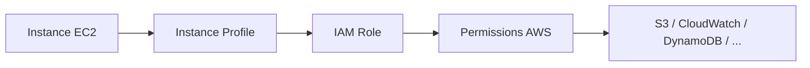
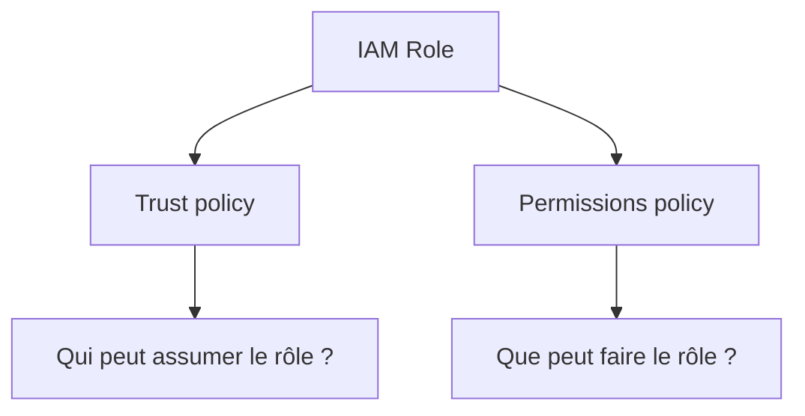
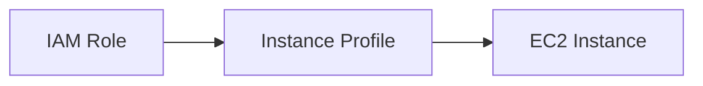
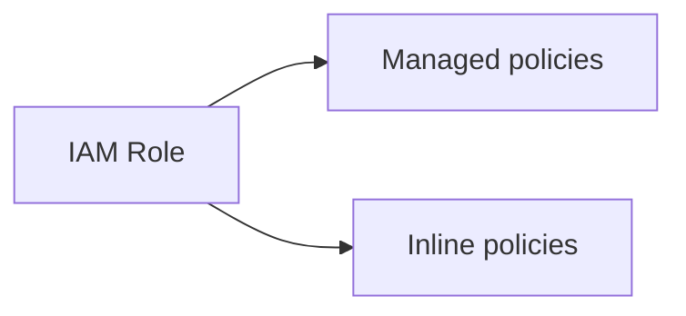
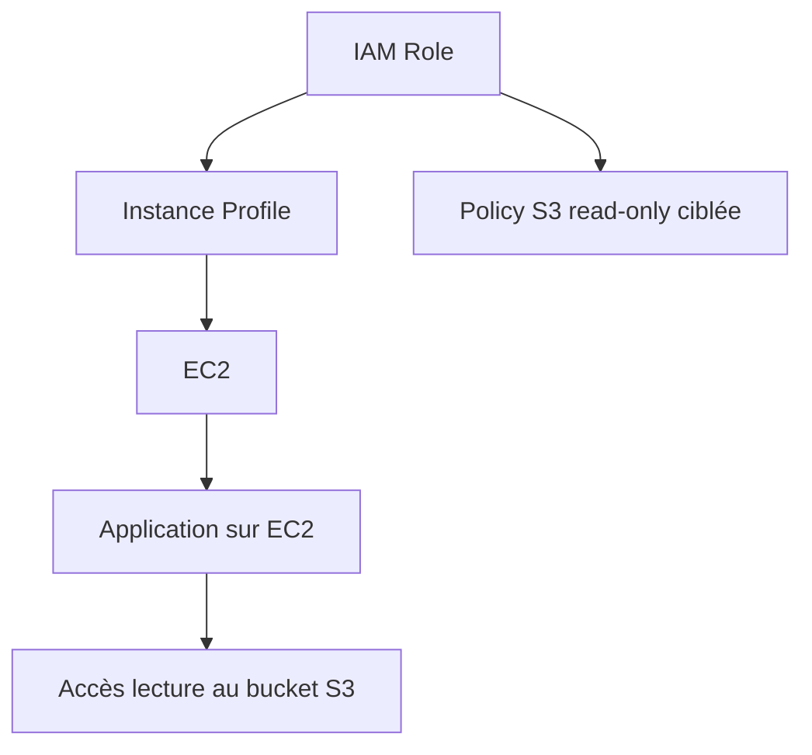
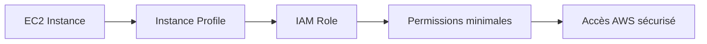

<a id="top"></a>

# AWS CloudFormation — IAM Roles, Instance Profiles et permissions de base

## Table of Contents

| #  | Section                                                                       |
| -- | ----------------------------------------------------------------------------- |
| 1  | [Pourquoi parler d’IAM dans CloudFormation ?](#section-1)                     |
| 2  | [Qu’est-ce qu’un IAM Role ?](#section-2)                                      |
| 2a |    ↳ [Trust policy vs permissions policy](#section-2)                         |
| 2b |    ↳ [Pourquoi un rôle est préférable à des clés d’accès sur EC2](#section-2) |
| 3  | [La ressource `AWS::IAM::Role`](#section-3)                                   |
| 3a |    ↳ [`AssumeRolePolicyDocument`](#section-3)                                 |
| 3b |    ↳ [`ManagedPolicyArns`, `Policies`, `RoleName`, `Tags`](#section-3)        |
| 4  | [Qu’est-ce qu’un Instance Profile ?](#section-4)                              |
| 4a |    ↳ [Pourquoi EC2 a besoin d’un Instance Profile](#section-4)                |
| 4b |    ↳ [La ressource `AWS::IAM::InstanceProfile`](#section-4)                   |
| 5  | [Associer un rôle IAM à une instance EC2](#section-5)                         |
| 6  | [Managed policy vs inline policy](#section-6)                                 |
| 7  | [Principe du moindre privilège](#section-7)                                   |
| 8  | [Exemple simple — EC2 qui lit un bucket S3](#section-8)                       |
| 9  | [Exemple complet — rôle IAM + instance profile + EC2](#section-9)             |
| 10 | [Erreurs fréquentes chez les débutants](#section-10)                          |
| 11 | [Résumé des commandes](#section-11)                                           |
| 12 | [Conclusion](#section-12)                                                     |

---

<a id="section-1"></a>

<details>
<summary>1 - Pourquoi parler d’IAM dans CloudFormation ?</summary>

<br/>

Quand une instance EC2 doit accéder à un service AWS, par exemple S3, CloudWatch ou DynamoDB, il faut lui donner des permissions. La bonne approche n’est pas de copier des clés d’accès AWS dans la machine, mais d’utiliser un **rôle IAM** attaché à l’instance. AWS recommande explicitement d’exiger des charges de travail humaines et machine l’usage de **credentials temporaires** plutôt que des credentials de longue durée, et documente l’usage d’un rôle IAM pour les applications tournant sur EC2. ([AWS Documentation][1])



---

### Pourquoi c’est important

Avec IAM dans CloudFormation, vous rendez les permissions :

* **reproductibles**
* **visibles dans le code**
* **révisables**
* **plus sûres**

AWS documente CloudFormation comme un outil de modélisation des ressources AWS, et IAM comme le mécanisme de contrôle d’accès associé aux identités et aux rôles. ([AWS Documentation][2])

</details>

<p align="right"><a href="#top">↑ Back to top</a></p>

---

<a id="section-2"></a>

<details>
<summary>2 - Qu’est-ce qu’un IAM Role ?</summary>

<br/>

Un **IAM Role** est une identité AWS dotée d’autorisations, mais qui n’est pas liée à une personne fixe comme un utilisateur IAM classique. Dans CloudFormation, la ressource correspondante est `AWS::IAM::Role`, que la documentation décrit comme une ressource qui crée un nouveau rôle IAM dans votre compte AWS. ([AWS Documentation][3])

---

### Trust policy vs permissions policy

Un rôle IAM repose sur deux idées différentes :

#### 1. La trust policy

La **trust policy** dit **qui a le droit d’assumer le rôle**. Dans CloudFormation, cette politique est fournie via `AssumeRolePolicyDocument`. AWS précise que cette trust policy définit quelles entités peuvent assumer le rôle, et qu’un rôle ne peut avoir qu’une seule trust policy. ([AWS Documentation][3])

#### 2. La permissions policy

La **permissions policy** dit **ce que le rôle a le droit de faire** une fois assumé. Dans `AWS::IAM::Role`, cela peut être fourni via des **managed policies** (`ManagedPolicyArns`) ou des **inline policies** (`Policies`). AWS documente les deux mécanismes dans la ressource du rôle. ([AWS Documentation][3])



---

### Pourquoi un rôle est préférable à des clés d’accès sur EC2

AWS recommande de ne pas stocker de credentials de longue durée dans les workloads. Pour les applications qui tournent sur des instances EC2, AWS documente explicitement l’usage d’un rôle IAM attribué à l’instance afin de fournir des credentials temporaires aux applications via les mécanismes AWS prévus à cet effet. ([AWS Documentation][1])

---

<details>
<summary>Analogie simple pour comprendre</summary>
<br/>

Un **IAM Role**, c'est comme un **badge d'accès temporaire** dans un immeuble de bureaux. Quand un visiteur arrive, on ne lui donne pas les clés permanentes du bâtiment : on lui prête un badge qui lui ouvre certaines portes pendant une durée limitée. De la même façon, un rôle IAM donne à une instance EC2 des permissions temporaires pour accéder à certains services AWS, sans jamais stocker de mot de passe permanent sur la machine.

</details>

</details>

<p align="right"><a href="#top">↑ Back to top</a></p>

---

<a id="section-3"></a>

<details>
<summary>3 - La ressource <code>AWS::IAM::Role</code></summary>

<br/>

La ressource `AWS::IAM::Role` crée un rôle IAM. AWS documente sa syntaxe YAML avec plusieurs propriétés importantes, notamment `AssumeRolePolicyDocument`, `ManagedPolicyArns`, `Policies`, `PermissionsBoundary`, `RoleName` et `Tags`. ([AWS Documentation][3])

```yaml id="gpsp9w"
MonRoleIAM:
  Type: AWS::IAM::Role
  Properties:
    AssumeRolePolicyDocument: {}
```

---

### `AssumeRolePolicyDocument`

C’est la propriété **obligatoire** d’un rôle IAM dans CloudFormation. AWS précise qu’elle contient la trust policy du rôle et qu’elle définit quelles entités peuvent l’assumer. Pour une instance EC2, la trust policy utilise en général le principal de service `ec2.amazonaws.com`. AWS fournit d’ailleurs un exemple officiel avec ce service principal dans la doc de `AWS::IAM::Role`. ([AWS Documentation][3])

```yaml id="dcuw4f"
MonRoleEC2:
  Type: AWS::IAM::Role
  Properties:
    AssumeRolePolicyDocument:
      Version: "2012-10-17"
      Statement:
        - Effect: Allow
          Principal:
            Service:
              - ec2.amazonaws.com
          Action:
            - sts:AssumeRole
```

---

### `ManagedPolicyArns`

Cette propriété permet d’attacher une ou plusieurs **managed policies** à un rôle. AWS précise qu’il s’agit d’une liste d’ARN de policies IAM gérées. ([AWS Documentation][3])

```yaml id="jsrhex"
ManagedPolicyArns:
  - arn:aws:iam::aws:policy/AmazonS3ReadOnlyAccess
```

---

### `Policies`

Cette propriété permet d’ajouter des **inline policies** directement dans le rôle. AWS indique qu’une inline policy embarquée fait partie de la policy d’accès du rôle. ([AWS Documentation][3])

```yaml id="q1d3xg"
Policies:
  - PolicyName: LireUnBucketPrecis
    PolicyDocument:
      Version: "2012-10-17"
      Statement:
        - Effect: Allow
          Action:
            - s3:ListBucket
          Resource: arn:aws:s3:::mon-bucket-demo
```

---

### `RoleName`

`RoleName` est optionnel. AWS précise que si vous ne fournissez pas de nom, CloudFormation génère un identifiant physique unique. Si vous fournissez un nom explicite, vous devez reconnaître la capacité `CAPABILITY_NAMED_IAM` lors du déploiement. AWS avertit aussi que nommer explicitement une ressource IAM peut poser des problèmes si le même template est réutilisé dans plusieurs régions, et recommande alors d’intégrer la région dans le nom. ([AWS Documentation][3])

---

### `Tags`

Les rôles IAM peuvent être tagués avec la propriété `Tags`. AWS documente cette propriété directement dans la ressource `AWS::IAM::Role`. ([AWS Documentation][3])

</details>

<p align="right"><a href="#top">↑ Back to top</a></p>

---

<a id="section-4"></a>

<details>
<summary>4 - Qu’est-ce qu’un Instance Profile ?</summary>

<br/>

Un **Instance Profile** est l’objet qu’EC2 utilise pour recevoir un rôle IAM. En pratique, on n’attache pas directement le rôle “nu” à l’instance EC2 dans CloudFormation : on passe par `AWS::IAM::InstanceProfile`. AWS documente cette ressource comme le mécanisme qui crée un instance profile pouvant contenir un rôle. ([AWS Documentation][4])

---

### Pourquoi EC2 a besoin d’un Instance Profile

Dans `AWS::EC2::Instance`, la propriété utilisée pour attacher des permissions IAM est `IamInstanceProfile`. AWS documente cette propriété comme le nom d’un **instance profile IAM existant** associé à l’instance. Cela montre bien que l’EC2 s’appuie sur l’instance profile, et non directement sur le rôle seul. ([AWS Documentation][5])



---

### La ressource `AWS::IAM::InstanceProfile`

AWS documente `AWS::IAM::InstanceProfile` comme une ressource ayant notamment les propriétés `Roles`, `Path`, `InstanceProfileName` et `Tags`. Elle permet de référencer un ou plusieurs rôles dans la structure, mais dans l’usage EC2 classique on attache un seul rôle. ([AWS Documentation][4])

```yaml id="vc73na"
MonInstanceProfile:
  Type: AWS::IAM::InstanceProfile
  Properties:
    Roles:
      - !Ref MonRoleEC2
```

---

<details>
<summary>En résumé très simple</summary>
<br/>

- Un **Instance Profile** est un « porte-badge » : c'est l'objet qui permet d'attacher un rôle IAM à une instance EC2
- On ne branche pas le rôle directement sur l'instance — on passe toujours par l'Instance Profile
- Dans CloudFormation, c'est une ressource séparée (`AWS::IAM::InstanceProfile`) qui référence le rôle

</details>

</details>

<p align="right"><a href="#top">↑ Back to top</a></p>

---

<a id="section-5"></a>

<details>
<summary>5 - Associer un rôle IAM à une instance EC2</summary>

<br/>

Pour associer un rôle IAM à une instance EC2, la chaîne complète est :

1. créer le rôle IAM
2. créer l’instance profile
3. référencer l’instance profile dans la propriété `IamInstanceProfile` de `AWS::EC2::Instance`

AWS documente séparément le rôle IAM, l’instance profile et la propriété `IamInstanceProfile` côté EC2. ([AWS Documentation][3])

```yaml id="cth0pi"
MonServeurEC2:
  Type: AWS::EC2::Instance
  Properties:
    ImageId: ami-xxxxxxxxxxxxxxxxx
    InstanceType: t2.micro
    IamInstanceProfile: !Ref MonInstanceProfile
```

---

### Ce que cela permet

Une fois le rôle correctement attaché, les applications exécutées sur l’instance peuvent obtenir des credentials temporaires liés à ce rôle pour appeler les services AWS autorisés. C’est précisément l’usage décrit par AWS pour les applications tournant sur EC2. ([AWS Documentation][6])

</details>

<p align="right"><a href="#top">↑ Back to top</a></p>

---

<a id="section-6"></a>

<details>
<summary>6 - Managed policy vs inline policy</summary>

<br/>

AWS distingue deux grandes façons de donner des permissions à un rôle :

### Managed policy

Une **managed policy** est une policy gérée séparément, référencée par ARN. Dans `AWS::IAM::Role`, on l’attache via `ManagedPolicyArns`. AWS documente cette propriété comme une liste d’ARN de policies IAM gérées. ([AWS Documentation][3])

### Inline policy

Une **inline policy** est intégrée directement dans le rôle via la propriété `Policies`. AWS précise qu’elle est embarquée dans le rôle lui-même. ([AWS Documentation][3])



---

### Comment choisir

Pour un cours débutant :

* utilisez une **managed policy AWS** pour aller vite et montrer le mécanisme
* utilisez une **inline policy** pour illustrer un contrôle plus fin sur un bucket ou une action précise

AWS documente les deux modes directement dans la ressource `AWS::IAM::Role`. ([AWS Documentation][3])

</details>

<p align="right"><a href="#top">↑ Back to top</a></p>

---

<a id="section-7"></a>

<details>
<summary>7 - Principe du moindre privilège</summary>

<br/>

Le **principe du moindre privilège** consiste à donner seulement les permissions nécessaires, et pas davantage. AWS le recommande explicitement dans ses bonnes pratiques IAM : accorder un accès minimum cohérent avec la tâche à accomplir, et utiliser des credentials temporaires autant que possible. ([AWS Documentation][1])

---

### Exemple

Si une instance doit seulement lire un bucket S3 spécifique, il vaut mieux :

* autoriser `s3:GetObject` sur les objets de ce bucket
* éventuellement `s3:ListBucket` sur ce bucket
* éviter `s3:*` sur `*`

Cette logique suit directement la bonne pratique AWS de moindre privilège. ([AWS Documentation][1])

---

<details>
<summary>Analogie simple pour comprendre</summary>
<br/>

Le moindre privilège, c'est comme **donner la clé de la cuisine à un cuisinier, pas la clé de tout l'immeuble**. Si quelqu'un a besoin de préparer le repas, on lui donne accès à la cuisine et au frigo — pas au coffre-fort du directeur, ni au parking, ni aux bureaux. En IAM, c'est pareil : si une instance doit lire un seul bucket S3, on autorise uniquement la lecture de ce bucket, et rien d'autre.

</details>

</details>

<p align="right"><a href="#top">↑ Back to top</a></p>

---

<a id="section-8"></a>

<details>
<summary>8 - Exemple simple — EC2 qui lit un bucket S3</summary>

<br/>

Voici un exemple minimal d’un rôle permettant à une instance EC2 de lire un bucket S3 spécifique :

```yaml id="wkng2j"
MonRoleLectureS3:
  Type: AWS::IAM::Role
  Properties:
    AssumeRolePolicyDocument:
      Version: "2012-10-17"
      Statement:
        - Effect: Allow
          Principal:
            Service:
              - ec2.amazonaws.com
          Action:
            - sts:AssumeRole
    Policies:
      - PolicyName: LireBucketPrecis
        PolicyDocument:
          Version: "2012-10-17"
          Statement:
            - Effect: Allow
              Action:
                - s3:ListBucket
              Resource: arn:aws:s3:::mon-bucket-demo
            - Effect: Allow
              Action:
                - s3:GetObject
              Resource: arn:aws:s3:::mon-bucket-demo/*
```

AWS documente la trust policy pour EC2 avec `ec2.amazonaws.com`, et les inline policies via la propriété `Policies` du rôle. ([AWS Documentation][3])

---

### Ce que fait cette policy

* l’instance peut **lister** le bucket
* l’instance peut **lire les objets**
* l’instance ne peut pas écrire, supprimer ou accéder à d’autres buckets

Cela illustre bien le moindre privilège recommandé par AWS. ([AWS Documentation][1])

</details>

<p align="right"><a href="#top">↑ Back to top</a></p>

---

<a id="section-9"></a>

<details>
<summary>9 - Exemple complet — rôle IAM + instance profile + EC2</summary>

<br/>

Voici un exemple complet, simple et pédagogique :

```yaml id="3d78p2"
AWSTemplateFormatVersion: '2010-09-09'
Description: EC2 avec IAM Role et Instance Profile

Parameters:
  AmiId:
    Type: String
    Description: ID de l'AMI

  KeyPairName:
    Type: AWS::EC2::KeyPair::KeyName
    Description: Nom de la paire de clés EC2

Resources:
  MonRoleEC2:
    Type: AWS::IAM::Role
    Properties:
      AssumeRolePolicyDocument:
        Version: "2012-10-17"
        Statement:
          - Effect: Allow
            Principal:
              Service:
                - ec2.amazonaws.com
            Action:
              - sts:AssumeRole
      Policies:
        - PolicyName: LectureS3Specifique
          PolicyDocument:
            Version: "2012-10-17"
            Statement:
              - Effect: Allow
                Action:
                  - s3:ListBucket
                Resource: arn:aws:s3:::mon-bucket-demo
              - Effect: Allow
                Action:
                  - s3:GetObject
                Resource: arn:aws:s3:::mon-bucket-demo/*

  MonInstanceProfile:
    Type: AWS::IAM::InstanceProfile
    Properties:
      Roles:
        - !Ref MonRoleEC2

  MonServeurEC2:
    Type: AWS::EC2::Instance
    Properties:
      ImageId: !Ref AmiId
      InstanceType: t2.micro
      KeyName: !Ref KeyPairName
      IamInstanceProfile: !Ref MonInstanceProfile

Outputs:
  RoleName:
    Description: Nom du rôle IAM
    Value: !Ref MonRoleEC2

  RoleArn:
    Description: ARN du rôle IAM
    Value: !GetAtt MonRoleEC2.Arn

  InstanceProfileName:
    Description: Nom de l'instance profile
    Value: !Ref MonInstanceProfile

  InstanceId:
    Description: ID de l'instance EC2
    Value: !Ref MonServeurEC2
```

La structure de cet exemple est directement alignée sur la documentation AWS de `AWS::IAM::Role`, `AWS::IAM::InstanceProfile` et `AWS::EC2::Instance`. AWS fournit aussi des exemples officiels de rôle avec policy embarquée et instance profile dans la page de référence du rôle IAM. ([AWS Documentation][3])

---

### Ce que fait ce template

* crée un rôle IAM assumable par EC2
* y attache une policy inline de lecture S3 ciblée
* crée l’instance profile
* attache cet instance profile à l’instance EC2
* expose les informations utiles en `Outputs`

AWS documente aussi que `Ref` sur un rôle retourne le **nom du rôle**, tandis que `Fn::GetAtt` avec `Arn` retourne l’ARN du rôle. ([AWS Documentation][3])



---

<details>
<summary>En résumé très simple</summary>
<br/>

- On crée un **rôle IAM** (le badge), un **Instance Profile** (le porte-badge), puis on attache le tout à l'**instance EC2**
- La **policy** du rôle définit exactement ce que l'instance a le droit de faire (ex. : lire un bucket S3 précis)
- Les **Outputs** permettent de voir le nom et l'ARN du rôle après déploiement, sans aller fouiller dans la console AWS

</details>

</details>

<p align="right"><a href="#top">↑ Back to top</a></p>

---

<a id="section-10"></a>

<details>
<summary>10 - Erreurs fréquentes chez les débutants</summary>

<br/>

### 1. Confondre rôle IAM et instance profile

Dans CloudFormation, EC2 utilise `IamInstanceProfile`, pas directement le rôle seul. AWS documente explicitement cette propriété de l’instance EC2, ainsi que la ressource `AWS::IAM::InstanceProfile`. ([AWS Documentation][5])

### 2. Mettre des permissions trop larges

Donner `Action: "*"` et `Resource: "*"` est facile, mais contraire au moindre privilège recommandé par AWS. ([AWS Documentation][1])

### 3. Oublier la trust policy

Sans `AssumeRolePolicyDocument`, le rôle n’est pas correctement défini. AWS indique que cette propriété est obligatoire pour `AWS::IAM::Role`. ([AWS Documentation][3])

### 4. Nommer explicitement les ressources IAM sans réfléchir

AWS avertit que fixer un `RoleName` peut provoquer des problèmes de réutilisation multi-région et nécessite `CAPABILITY_NAMED_IAM` au déploiement. ([AWS Documentation][3])

### 5. Mettre des clés d’accès sur l’instance au lieu d’un rôle

AWS recommande l’usage de credentials temporaires pour les workloads et documente le cas EC2 comme cas standard d’usage d’un rôle IAM. ([AWS Documentation][1])

</details>

<p align="right"><a href="#top">↑ Back to top</a></p>

---

<a id="section-11"></a>

<details>
<summary>11 - Résumé des commandes</summary>

<br/>

```bash id="qrqax8"
# Créer la stack
aws cloudformation create-stack \
  --stack-name iam-ec2-demo \
  --template-body file://iam-ec2-demo.yaml \
  --capabilities CAPABILITY_IAM \
  --parameters \
    ParameterKey=AmiId,ParameterValue=ami-xxxxxxxxxxxxxxxxx \
    ParameterKey=KeyPairName,ParameterValue=ma-cle-ssh

# Si vous donnez un nom explicite au rôle IAM, utilisez CAPABILITY_NAMED_IAM
aws cloudformation create-stack \
  --stack-name iam-ec2-demo \
  --template-body file://iam-ec2-demo.yaml \
  --capabilities CAPABILITY_NAMED_IAM \
  --parameters \
    ParameterKey=AmiId,ParameterValue=ami-xxxxxxxxxxxxxxxxx \
    ParameterKey=KeyPairName,ParameterValue=ma-cle-ssh

# Décrire la stack
aws cloudformation describe-stacks \
  --stack-name iam-ec2-demo

# Voir les ressources de la stack
aws cloudformation describe-stack-resources \
  --stack-name iam-ec2-demo

# Supprimer la stack
aws cloudformation delete-stack \
  --stack-name iam-ec2-demo
```

AWS précise que les templates contenant certaines ressources IAM demandent l’accusé de réception des capacités IAM, et qu’un nom explicite sur une ressource IAM implique `CAPABILITY_NAMED_IAM`. ([AWS Documentation][3])

</details>

<p align="right"><a href="#top">↑ Back to top</a></p>

---

<a id="section-12"></a>

<details>
<summary>12 - Conclusion</summary>

<br/>

Dans ce chapitre, on a vu comment donner des permissions propres à une instance EC2 avec CloudFormation grâce à :

* `AWS::IAM::Role`
* `AssumeRolePolicyDocument`
* `ManagedPolicyArns`
* `Policies`
* `AWS::IAM::InstanceProfile`
* `IamInstanceProfile` sur `AWS::EC2::Instance`

AWS documente ces briques comme le mécanisme standard pour permettre à des applications sur EC2 d’obtenir des credentials temporaires et d’accéder proprement aux services AWS autorisés, tout en suivant les bonnes pratiques IAM de sécurité. ([AWS Documentation][3])



### Suite logique du prochain chapitre

Le **chapitre 8** peut porter sur :

* **RDS avec CloudFormation**
* subnet group
* security group base de données
* paramètres sensibles
* protections et outputs


[1]: https://docs.aws.amazon.com/IAM/latest/UserGuide/best-practices.html "Security best practices in IAM - AWS Identity and Access Management"
[2]: https://docs.aws.amazon.com/AWSCloudFormation/latest/UserGuide/control-access-with-iam.html "Control CloudFormation access with AWS Identity and Access Management - AWS CloudFormation"
[3]: https://docs.aws.amazon.com/AWSCloudFormation/latest/TemplateReference/aws-resource-iam-role.html "AWS::IAM::Role - AWS CloudFormation"
[4]: https://docs.aws.amazon.com/AWSCloudFormation/latest/TemplateReference/aws-resource-iam-instanceprofile.html "AWS::IAM::InstanceProfile - AWS CloudFormation"
[5]: https://docs.aws.amazon.com/AWSCloudFormation/latest/TemplateReference/aws-resource-ec2-instance.html "AWS::EC2::Instance - AWS CloudFormation"
[6]: https://docs.aws.amazon.com/IAM/latest/UserGuide/id_roles_use_switch-role-ec2.html "Use an IAM role to grant permissions to applications running on Amazon EC2 instances - AWS Identity and Access Management"
