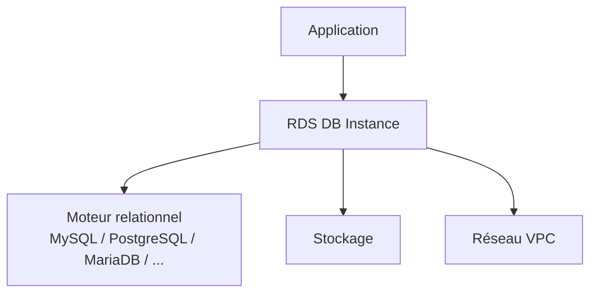
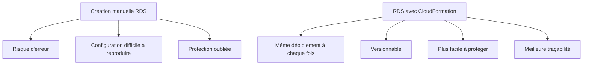
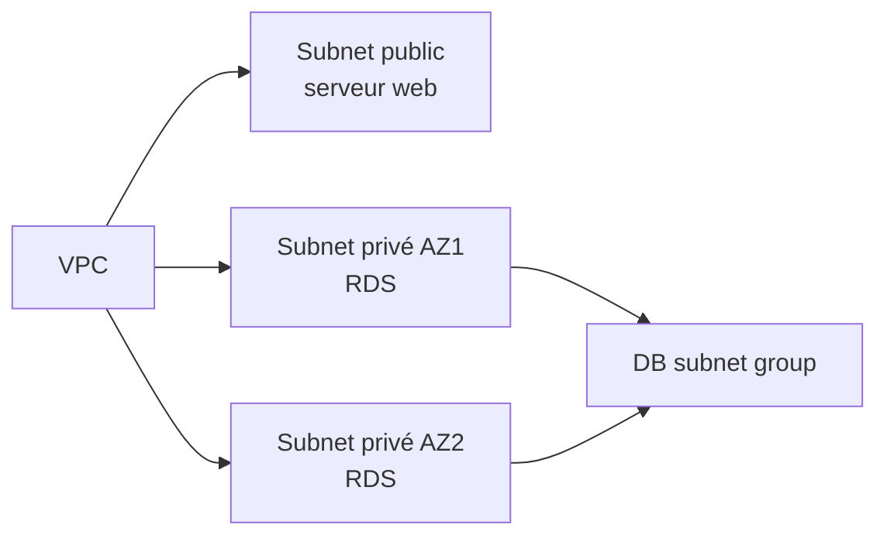
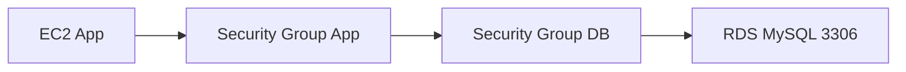
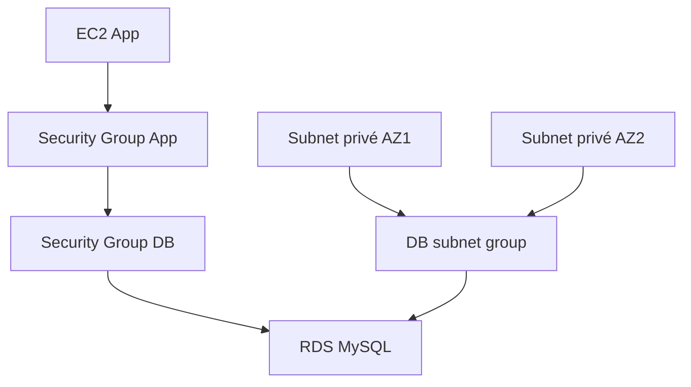
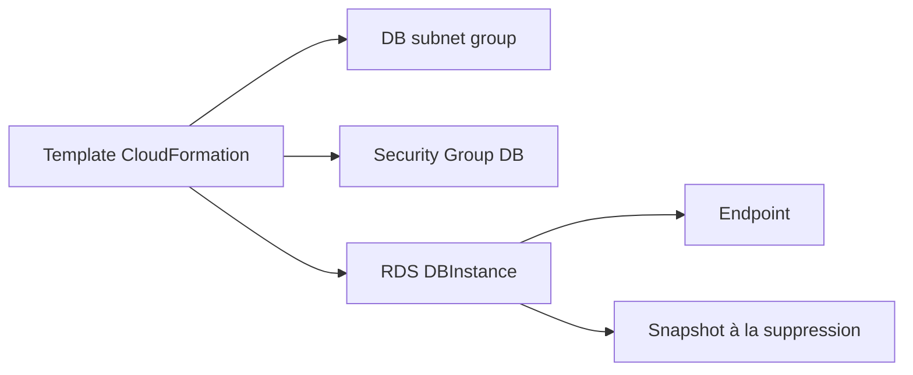

<a id="top"></a>

# AWS CloudFormation — Déployer une base de données RDS avec CloudFormation

## Table of Contents

| #  | Section                                                                             |
| -- | ----------------------------------------------------------------------------------- |
| 1  | [Qu’est-ce qu’Amazon RDS ?](#section-1)                                             |
| 2  | [Pourquoi déployer RDS avec CloudFormation ?](#section-2)                           |
| 3  | [La ressource `AWS::RDS::DBInstance`](#section-3)                                   |
| 3a |    ↳ [Propriétés importantes : moteur, classe, stockage, identifiants](#section-3)  |
| 3b |    ↳ [Quand un DB subnet group est obligatoire](#section-3)                         |
| 4  | [Le DB subnet group](#section-4)                                                    |
| 4a |    ↳ [Pourquoi il faut plusieurs subnets](#section-4)                               |
| 4b |    ↳ [Pourquoi on choisit généralement des subnets privés](#section-4)              |
| 5  | [Le Security Group de la base de données](#section-5)                               |
| 5a |    ↳ [Pourquoi on évite d’ouvrir la base à tout Internet](#section-5)               |
| 5b |    ↳ [Autoriser seulement le serveur applicatif](#section-5)                        |
| 6  | [Premier template RDS minimal](#section-6)                                          |
| 7  | [Paramètres sensibles : nom d’utilisateur, mot de passe, port](#section-7)          |
| 7a |    ↳ [`NoEcho` et ses limites](#section-7)                                          |
| 8  | [Protéger la base : `DeletionPolicy` et snapshots](#section-8)                      |
| 8a |    ↳ [Pourquoi `Snapshot` est souvent le bon choix pour RDS](#section-8)            |
| 9  | [Exemple complet — RDS dans un VPC avec subnet group et security group](#section-9) |
| 10 | [Erreurs fréquentes chez les débutants](#section-10)                                |
| 11 | [Résumé des commandes](#section-11)                                                 |
| 12 | [Conclusion](#section-12)                                                           |

---

<a id="section-1"></a>

<details>
<summary>1 - Qu’est-ce qu’Amazon RDS ?</summary>

<br/>

Amazon RDS est le service de bases de données relationnelles managées d’AWS. Avec RDS, AWS gère une partie importante de l’exploitation de la base, tandis que vous définissez les paramètres de l’instance et du réseau. Dans CloudFormation, la ressource principale pour une base classique est `AWS::RDS::DBInstance`. ([AWS Documentation][1])



---

### À quoi sert une DB instance RDS

Une DB instance RDS sert à héberger une base relationnelle pour :

* une application web
* une API
* un backend métier
* un environnement de test
* une application interne

Dans CloudFormation, cette instance est souvent reliée à un **DB subnet group**, à un **VPC security group**, et à des paramètres comme le moteur, la classe d’instance, le stockage et les identifiants. AWS documente ces propriétés dans `AWS::RDS::DBInstance`. ([AWS Documentation][1])

---

<details>
<summary>Analogie simple pour comprendre</summary>
<br/>

Amazon RDS, c'est comme **louer un appartement meublé au lieu de construire sa propre maison**. Quand vous louez un appartement, le propriétaire s'occupe de la plomberie, de l'électricité et de l'entretien général — vous, vous vous concentrez sur y habiter. Avec RDS, AWS gère les mises à jour du moteur, les sauvegardes, la réplication — vous, vous vous concentrez sur votre application et vos données. Vous choisissez la taille de l'appartement (la classe d'instance) et le quartier (le VPC), mais vous ne touchez jamais à la tuyauterie.

</details>

</details>

<p align="right"><a href="#top">↑ Back to top</a></p>

---

<a id="section-2"></a>

<details>
<summary>2 - Pourquoi déployer RDS avec CloudFormation ?</summary>

<br/>

Déployer RDS avec CloudFormation permet de rendre la base **reproductible**, **versionnée** et **plus sûre à gérer**. CloudFormation permet de décrire la base, le subnet group, le security group et les protections de suppression dans un template unique, ce qui réduit les manipulations manuelles et améliore la cohérence des environnements. ([AWS Documentation][1])



---

### Avantages concrets

Avec CloudFormation, vous pouvez standardiser :

* le moteur de base de données
* la taille de l’instance
* les subnets autorisés
* les règles réseau
* la stratégie de suppression et de snapshot

AWS documente explicitement la prise en charge de ces propriétés dans `AWS::RDS::DBInstance`, `AWS::RDS::DBSubnetGroup` et l’attribut `DeletionPolicy`. ([AWS Documentation][1])

</details>

<p align="right"><a href="#top">↑ Back to top</a></p>

---

<a id="section-3"></a>

<details>
<summary>3 - La ressource <code>AWS::RDS::DBInstance</code></summary>

<br/>

La ressource `AWS::RDS::DBInstance` crée une instance de base de données RDS. AWS documente pour cette ressource de nombreuses propriétés, notamment le moteur (`Engine`), la classe (`DBInstanceClass`), le stockage (`AllocatedStorage`), les identifiants d’administration (`MasterUsername`, `MasterUserPassword`), le subnet group (`DBSubnetGroupName`) et les security groups VPC (`VPCSecurityGroups`). ([AWS Documentation][1])

---

### Propriétés importantes

Voici les propriétés les plus fréquentes pour débuter :

* `Engine`
* `DBInstanceClass`
* `AllocatedStorage`
* `MasterUsername`
* `MasterUserPassword`
* `DBName`
* `DBSubnetGroupName`
* `VPCSecurityGroups`
* `PubliclyAccessible`

AWS les documente toutes dans la référence de `AWS::RDS::DBInstance`. ([AWS Documentation][1])

```yaml id="f6q9gm"
Resources:
  MaBaseRDS:
    Type: AWS::RDS::DBInstance
    Properties:
      Engine: mysql
      DBInstanceClass: db.t3.micro
      AllocatedStorage: 20
      MasterUsername: admin
      MasterUserPassword: motdepasse123
```

---

### Quand un DB subnet group est obligatoire

AWS précise que si vous ne spécifiez pas `DBSubnetGroupName`, RDS utilise le DB subnet group par défaut s’il existe ; sinon, la création échoue. En pratique, dans un VPC non trivial, on définit explicitement le subnet group pour garder le contrôle du réseau de la base. ([AWS Documentation][1])

</details>

<p align="right"><a href="#top">↑ Back to top</a></p>

---

<a id="section-4"></a>

<details>
<summary>4 - Le DB subnet group</summary>

<br/>

Le **DB subnet group** est la ressource CloudFormation `AWS::RDS::DBSubnetGroup`. AWS indique qu’un DB subnet group est un groupe de subnets qui détermine dans quel VPC et quels sous-réseaux la base RDS peut être créée. AWS précise aussi que ce groupe doit contenir **au moins deux subnets dans deux Availability Zones différentes** de la même région. ([AWS Documentation][2])

```yaml id="q8ax4p"
MonDbSubnetGroup:
  Type: AWS::RDS::DBSubnetGroup
  Properties:
    DBSubnetGroupDescription: Subnets pour la base RDS
    SubnetIds:
      - subnet-aaaa1111
      - subnet-bbbb2222
```

---

### Pourquoi il faut plusieurs subnets

AWS précise qu’un DB subnet group doit couvrir plusieurs Availability Zones afin que le service puisse placer correctement la base et gérer ses exigences réseau. Cette exigence apparaît dans la doc CloudFormation du `DBSubnetGroup` et dans le guide RDS sur les DB subnet groups. ([AWS Documentation][2])

---

### Pourquoi on choisit généralement des subnets privés

AWS décrit les DB subnet groups comme des groupes de subnets **typiquement privés**. En pratique, on met souvent la base dans des subnets privés pour éviter une exposition inutile, tandis que les serveurs applicatifs ou bastions résident dans des zones mieux contrôlées du VPC. ([AWS Documentation][3])



---

<details>
<summary>En résumé très simple</summary>
<br/>

- Un **DB subnet group** dit à RDS « tu as le droit de vivre dans ces sous-réseaux du VPC »
- Il faut obligatoirement **au moins 2 subnets dans 2 zones différentes** pour que RDS puisse fonctionner correctement
- En pratique, on met la base dans des **subnets privés** pour la protéger — comme on mettrait un coffre-fort dans une pièce fermée plutôt que dans le hall d'entrée

</details>

</details>

<p align="right"><a href="#top">↑ Back to top</a></p>

---

<a id="section-5"></a>

<details>
<summary>5 - Le Security Group de la base de données</summary>

<br/>

L’accès réseau à une instance RDS dans un VPC est contrôlé par des **VPC security groups**. AWS précise que, par défaut, l’accès réseau est désactivé pour une DB instance et qu’il faut donc définir explicitement des règles appropriées. ([AWS Documentation][4])

```yaml id="27q40x"
MonSecurityGroupDB:
  Type: AWS::EC2::SecurityGroup
  Properties:
    GroupDescription: Autorise l'acces MySQL depuis le serveur applicatif
    VpcId: !Ref MonVPC
```

---

### Pourquoi on évite d’ouvrir la base à tout Internet

Une base RDS n’est généralement pas faite pour être exposée directement au monde entier. AWS explique que les security groups servent à autoriser l’accès depuis une plage IP, un port, ou un autre security group, et que ces règles doivent être choisies avec soin. ([AWS Documentation][4])

---

### Autoriser seulement le serveur applicatif

Une bonne pratique consiste à autoriser le port de la base uniquement depuis le **security group du serveur applicatif**. AWS documente cette logique dans ses exemples réseau RDS et dans son guide sur les security groups RDS. ([AWS Documentation][4])

```yaml id="gsk9ik"
SecurityGroupIngress:
  - IpProtocol: tcp
    FromPort: 3306
    ToPort: 3306
    SourceSecurityGroupId: !Ref MonSecurityGroupApp
```



---

<details>
<summary>Analogie simple pour comprendre</summary>
<br/>

Le Security Group de la base de données, c'est comme une **porte blindée avec un interphone**. Seul le serveur applicatif (qui est sur la liste autorisée) peut sonner et entrer. Tout le reste du monde est bloqué dehors. On ne donne pas l'accès à la base à n'importe qui : on autorise uniquement le serveur app sur le bon port (ex. : 3306 pour MySQL), et c'est tout.

</details>

</details>

<p align="right"><a href="#top">↑ Back to top</a></p>

---

<a id="section-6"></a>

<details>
<summary>6 - Premier template RDS minimal</summary>

<br/>

Voici un exemple très simple pour comprendre la structure d’une DB instance. Il reste volontairement minimal et omet le réseau détaillé.

```yaml id="dc4l8k"
AWSTemplateFormatVersion: '2010-09-09'
Description: Exemple RDS minimal

Resources:
  MaBaseRDS:
    Type: AWS::RDS::DBInstance
    Properties:
      Engine: mysql
      DBInstanceClass: db.t3.micro
      AllocatedStorage: 20
      MasterUsername: admin
      MasterUserPassword: motdepasse123
```

AWS documente cette ressource et ces propriétés dans la référence CloudFormation de `AWS::RDS::DBInstance`. ([AWS Documentation][1])

---

### Pourquoi cet exemple n’est pas encore idéal

Ce template est utile pour comprendre la forme générale, mais en pratique il manque plusieurs éléments essentiels :

* un DB subnet group
* un security group VPC
* des paramètres au lieu de valeurs sensibles codées en dur
* une protection à la suppression

AWS documente tous ces mécanismes et ils sont recommandés dès qu’on quitte le stade du simple test local ou du laboratoire minimal. ([AWS Documentation][1])

</details>

<p align="right"><a href="#top">↑ Back to top</a></p>

---

<a id="section-7"></a>

<details>
<summary>7 - Paramètres sensibles : nom d’utilisateur, mot de passe, port</summary>

<br/>

Pour une base RDS, certaines valeurs doivent être fournies via `Parameters`, notamment le nom d’utilisateur, le mot de passe administrateur ou parfois le port. AWS documente la section `Parameters` comme mécanisme de personnalisation d’un template lors de la création ou de la mise à jour de la stack. ([AWS Documentation][1])

```yaml id="d3ntv2"
Parameters:
  DbUsername:
    Type: String
    Description: Nom d'utilisateur administrateur

  DbPassword:
    Type: String
    NoEcho: true
    Description: Mot de passe administrateur

  DbPort:
    Type: Number
    Default: 3306
    Description: Port de la base
```

---

### `NoEcho` et ses limites

`NoEcho: true` masque la valeur lors de certaines affichages CloudFormation, mais ce n’est pas une protection absolue. AWS précise que `NoEcho` ne masque pas les valeurs exposées dans `Metadata`, `Outputs` ou certaines métadonnées de ressource. Il faut donc éviter de renvoyer des secrets dans les sorties. ([AWS Documentation][5])

</details>

<p align="right"><a href="#top">↑ Back to top</a></p>

---

<a id="section-8"></a>

<details>
<summary>8 - Protéger la base : <code>DeletionPolicy</code> et snapshots</summary>

<br/>

CloudFormation permet de contrôler le devenir d’une ressource lors de la suppression de la stack grâce à `DeletionPolicy`. AWS indique que, sans `DeletionPolicy`, la ressource est supprimée par défaut. Pour certaines ressources, dont RDS, `Snapshot` est une option particulièrement utile. ([AWS Documentation][5])

```yaml id="igbf84"
MaBaseRDS:
  Type: AWS::RDS::DBInstance
  DeletionPolicy: Snapshot
  Properties:
    Engine: mysql
    DBInstanceClass: db.t3.micro
    AllocatedStorage: 20
```

---

### Pourquoi `Snapshot` est souvent le bon choix pour RDS

Pour une base de données, `DeletionPolicy: Snapshot` permet de prendre une sauvegarde finale avant suppression de la ressource, ce qui constitue une protection très pratique contre la perte de données lors de la suppression d’une stack. AWS documente explicitement que `DeletionPolicy` peut préserver ou sauvegarder certaines ressources lors de la suppression. ([AWS Documentation][5])

---

### `DeletionPolicy` et suppression prudente

Pour un environnement de test jetable, on peut parfois préférer une suppression simple. Pour une base contenant des données importantes, une stratégie de snapshot est généralement beaucoup plus prudente. CloudFormation fournit le mécanisme, mais c’est à l’architecte de choisir la politique adaptée au contexte. ([AWS Documentation][5])

---

<details>
<summary>En résumé très simple</summary>
<br/>

- Sans `DeletionPolicy`, supprimer la stack = supprimer la base et toutes ses données, sans retour possible
- Avec `DeletionPolicy: Snapshot`, CloudFormation prend une **photo de sauvegarde** de la base avant de la supprimer — comme faire une copie de vos documents avant de vider un classeur
- Pour une base de test jetable, la suppression simple peut suffire ; pour une base de production, le snapshot est presque toujours le bon choix

</details>

</details>

<p align="right"><a href="#top">↑ Back to top</a></p>

---

<a id="section-9"></a>

<details>
<summary>9 - Exemple complet — RDS dans un VPC avec subnet group et security group</summary>

<br/>

Voici un exemple pédagogique complet avec :

* deux subnets privés
* un DB subnet group
* un security group base de données
* une instance RDS MySQL
* des paramètres pour les identifiants
* un snapshot à la suppression

```yaml id="ro40lf"
AWSTemplateFormatVersion: '2010-09-09'
Description: Exemple RDS MySQL dans un VPC avec DB subnet group et security group

Parameters:
  DbUsername:
    Type: String
    Description: Nom d'utilisateur administrateur

  DbPassword:
    Type: String
    NoEcho: true
    Description: Mot de passe administrateur

Resources:
  MonVPC:
    Type: AWS::EC2::VPC
    Properties:
      CidrBlock: 10.0.0.0/16

  MonSubnetPriveAZ1:
    Type: AWS::EC2::Subnet
    Properties:
      VpcId: !Ref MonVPC
      CidrBlock: 10.0.1.0/24

  MonSubnetPriveAZ2:
    Type: AWS::EC2::Subnet
    Properties:
      VpcId: !Ref MonVPC
      CidrBlock: 10.0.2.0/24

  MonSecurityGroupApp:
    Type: AWS::EC2::SecurityGroup
    Properties:
      GroupDescription: SG du serveur applicatif
      VpcId: !Ref MonVPC

  MonSecurityGroupDB:
    Type: AWS::EC2::SecurityGroup
    Properties:
      GroupDescription: SG de la base MySQL
      VpcId: !Ref MonVPC
      SecurityGroupIngress:
        - IpProtocol: tcp
          FromPort: 3306
          ToPort: 3306
          SourceSecurityGroupId: !Ref MonSecurityGroupApp

  MonDbSubnetGroup:
    Type: AWS::RDS::DBSubnetGroup
    Properties:
      DBSubnetGroupDescription: Subnets prives pour RDS
      SubnetIds:
        - !Ref MonSubnetPriveAZ1
        - !Ref MonSubnetPriveAZ2

  MaBaseRDS:
    Type: AWS::RDS::DBInstance
    DeletionPolicy: Snapshot
    Properties:
      Engine: mysql
      DBInstanceClass: db.t3.micro
      AllocatedStorage: 20
      MasterUsername: !Ref DbUsername
      MasterUserPassword: !Ref DbPassword
      DBName: appdb
      DBSubnetGroupName: !Ref MonDbSubnetGroup
      VPCSecurityGroups:
        - !Ref MonSecurityGroupDB
      PubliclyAccessible: false

Outputs:
  DbInstanceIdentifier:
    Description: Identifiant de la DB instance
    Value: !Ref MaBaseRDS

  DbEndpointAddress:
    Description: Adresse de connexion de la base
    Value: !GetAtt MaBaseRDS.Endpoint.Address

  DbEndpointPort:
    Description: Port de la base
    Value: !GetAtt MaBaseRDS.Endpoint.Port
```

AWS documente `AWS::RDS::DBInstance`, `AWS::RDS::DBSubnetGroup`, l’usage des VPC security groups pour RDS, et les attributs `Endpoint.Address` et `Endpoint.Port` sur la ressource RDS. AWS documente aussi que le DB subnet group doit contenir au moins deux subnets dans deux AZ différentes, et que `PubliclyAccessible` contrôle l’accessibilité publique de l’instance. ([AWS Documentation][1])

---

### Ce que fait ce template

* crée un VPC
* crée deux subnets privés
* crée un security group applicatif
* crée un security group base de données qui n’accepte que le trafic MySQL depuis l’application
* crée un DB subnet group
* crée une instance RDS MySQL non publique
* prend un snapshot lors de la suppression
* expose l’adresse et le port de connexion

Tout cela correspond au modèle réseau recommandé par AWS pour des DB instances dans un VPC. ([AWS Documentation][3])



</details>

<p align="right"><a href="#top">↑ Back to top</a></p>

---

<a id="section-10"></a>

<details>
<summary>10 - Erreurs fréquentes chez les débutants</summary>

<br/>

### 1. Oublier le DB subnet group

AWS précise que si aucun DB subnet group utilisable n’existe et que vous n’en fournissez pas, la DB instance peut échouer à la création. ([AWS Documentation][1])

### 2. Ne fournir qu’un seul subnet

AWS documente que le DB subnet group doit contenir au moins deux subnets dans deux Availability Zones différentes. ([AWS Documentation][2])

### 3. Ouvrir le port de la base à tout le monde

AWS précise que, par défaut, l’accès réseau est fermé et que les VPC security groups doivent être configurés explicitement. Ouvrir la base à `0.0.0.0/0` est rarement une bonne idée. ([AWS Documentation][4])

### 4. Mettre le mot de passe en dur dans le template

Pour éviter d’exposer des secrets dans le code, utilisez au minimum des paramètres avec `NoEcho`, tout en gardant à l’esprit les limites documentées par AWS. ([AWS Documentation][5])

### 5. Oublier la stratégie de suppression

Sans `DeletionPolicy`, CloudFormation supprime la ressource par défaut. Pour une base RDS, `Snapshot` est souvent beaucoup plus prudent. ([AWS Documentation][5])

</details>

<p align="right"><a href="#top">↑ Back to top</a></p>

---

<a id="section-11"></a>

<details>
<summary>11 - Résumé des commandes</summary>

<br/>

```bash id="w3p3iy"
# Créer la stack
aws cloudformation create-stack \
  --stack-name rds-demo-stack \
  --template-body file://rds-demo.yaml \
  --parameters \
    ParameterKey=DbUsername,ParameterValue=admin \
    ParameterKey=DbPassword,ParameterValue=motdepasse123

# Décrire la stack
aws cloudformation describe-stacks \
  --stack-name rds-demo-stack

# Voir les ressources de la stack
aws cloudformation describe-stack-resources \
  --stack-name rds-demo-stack

# Mettre à jour la stack
aws cloudformation update-stack \
  --stack-name rds-demo-stack \
  --template-body file://rds-demo.yaml \
  --parameters \
    ParameterKey=DbUsername,ParameterValue=admin \
    ParameterKey=DbPassword,ParameterValue=motdepasse123

# Supprimer la stack
aws cloudformation delete-stack \
  --stack-name rds-demo-stack
```

Ces commandes correspondent au cycle standard CloudFormation pour créer, décrire, mettre à jour et supprimer une stack. ([AWS Documentation][1])

</details>

<p align="right"><a href="#top">↑ Back to top</a></p>

---

<a id="section-12"></a>

<details>
<summary>12 - Conclusion</summary>

<br/>

Dans ce chapitre, on a vu comment déployer une base RDS avec CloudFormation en structurant correctement :

* `AWS::RDS::DBInstance`
* `AWS::RDS::DBSubnetGroup`
* les VPC security groups
* les paramètres sensibles
* `DeletionPolicy: Snapshot`
* les outputs de connexion

AWS documente toutes ces briques comme la base d’un déploiement RDS propre dans un VPC, avec un DB subnet group multi-AZ, des règles réseau explicites et une stratégie de suppression adaptée aux données. ([AWS Documentation][1])



### Suite logique du prochain chapitre

Le **chapitre 9** peut porter sur :

* **Load Balancer**
* **Target Groups**
* **Launch Template**
* **Auto Scaling Group**
* **architecture scalable**


[1]: https://docs.aws.amazon.com/AWSCloudFormation/latest/TemplateReference/aws-resource-rds-dbinstance.html?utm_source=chatgpt.com "AWS::RDS::DBInstance - AWS CloudFormation"
[2]: https://docs.aws.amazon.com/AWSCloudFormation/latest/TemplateReference/aws-resource-rds-dbsubnetgroup.html?utm_source=chatgpt.com "AWS::RDS::DBSubnetGroup - AWS CloudFormation"
[3]: https://docs.aws.amazon.com/AmazonRDS/latest/UserGuide/USER_VPC.WorkingWithRDSInstanceinaVPC.html?utm_source=chatgpt.com "Working with a DB instance in a VPC - AWS Documentation"
[4]: https://docs.aws.amazon.com/AmazonRDS/latest/UserGuide/Overview.RDSSecurityGroups.html?utm_source=chatgpt.com "Controlling access with security groups"
[5]: https://docs.aws.amazon.com/AWSCloudFormation/latest/TemplateReference/aws-attribute-deletionpolicy.html?utm_source=chatgpt.com "DeletionPolicy attribute - AWS CloudFormation"
