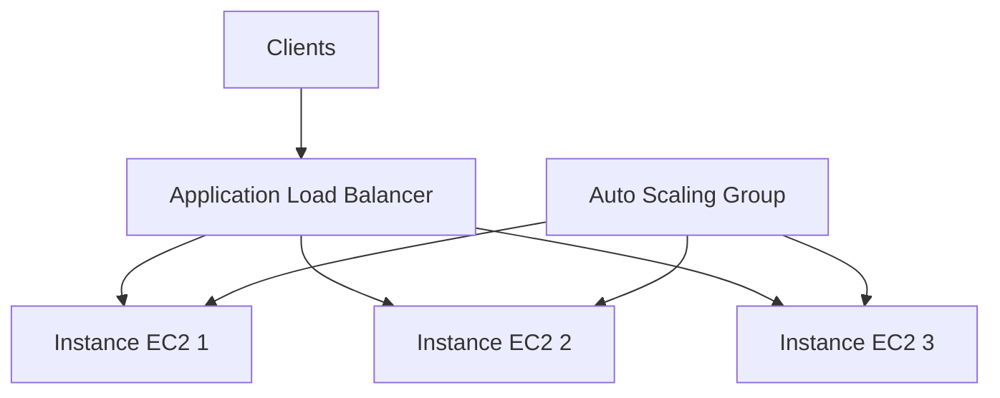
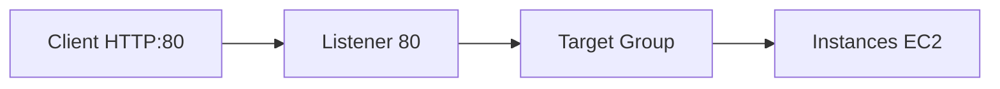
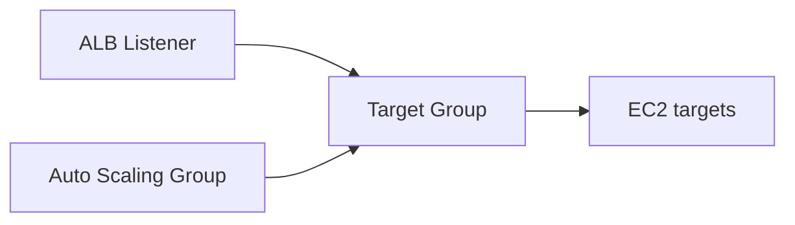
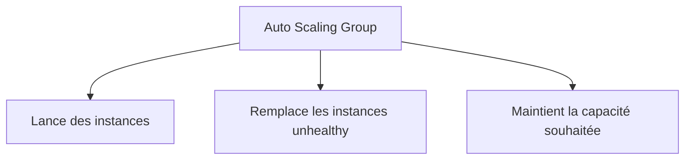
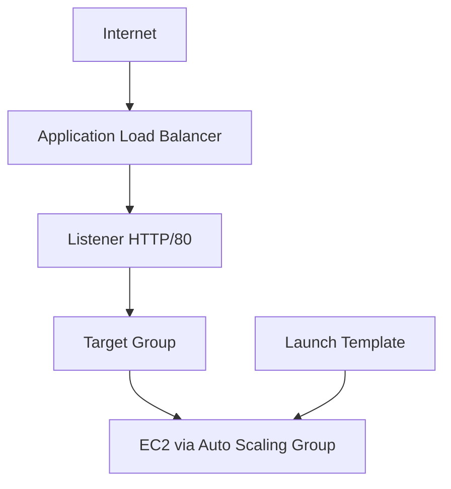
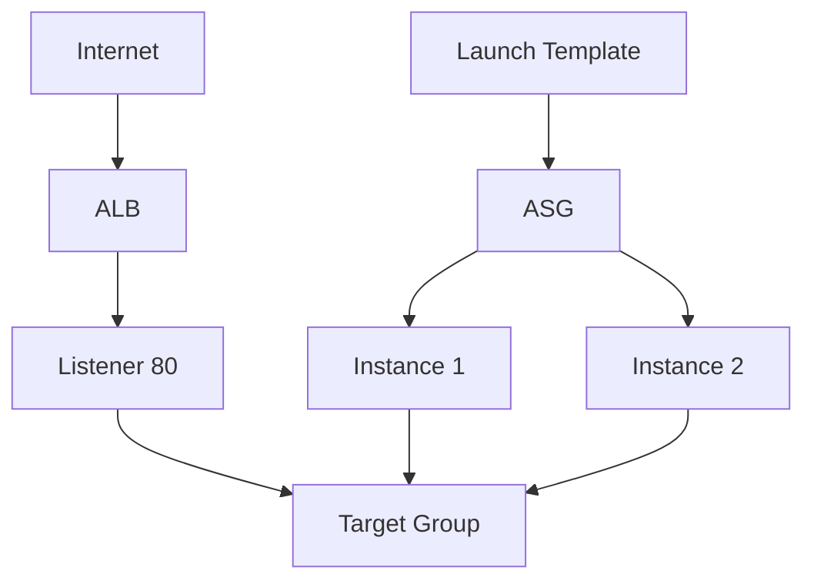
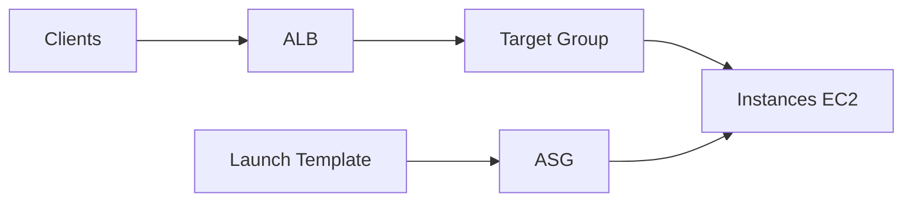

<a id="top"></a>

# AWS CloudFormation — Load Balancer, Target Group, Launch Template et Auto Scaling

## Table of Contents

| #  | Section                                                                          |
| -- | -------------------------------------------------------------------------------- |
| 1  | [Pourquoi une architecture scalable ?](#section-1)                               |
| 2  | [Qu’est-ce qu’un Application Load Balancer ?](#section-2)                        |
| 2a |    ↳ [Internet-facing vs internal](#section-2)                                   |
| 2b |    ↳ [Pourquoi l’ALB a besoin d’un listener](#section-2)                         |
| 3  | [Qu’est-ce qu’un Target Group ?](#section-3)                                     |
| 3a |    ↳ [Port, protocole et health checks](#section-3)                              |
| 3b |    ↳ [Pourquoi l’Auto Scaling Group se connecte au Target Group](#section-3)     |
| 4  | [Qu’est-ce qu’un Launch Template ?](#section-4)                                  |
| 4a |    ↳ [Pourquoi AWS recommande le Launch Template](#section-4)                    |
| 5  | [Qu’est-ce qu’un Auto Scaling Group ?](#section-5)                               |
| 5a |    ↳ [`MinSize`, `MaxSize`, `DesiredCapacity`](#section-5)                       |
| 5b |    ↳ [`HealthCheckType` et `HealthCheckGracePeriod`](#section-5)                 |
| 6  | [Architecture complète : ALB + Target Group + Launch Template + ASG](#section-6) |
| 7  | [Règles réseau et Security Groups](#section-7)                                   |
| 7a |    ↳ [Le SG du Load Balancer](#section-7)                                        |
| 7b |    ↳ [Le SG des instances](#section-7)                                           |
| 8  | [Premier template minimal — ALB + Target Group + Listener](#section-8)           |
| 9  | [Exemple complet — application web scalable](#section-9)                         |
| 10 | [Scaling policy — première approche](#section-10)                                |
| 11 | [Erreurs fréquentes chez les débutants](#section-11)                             |
| 12 | [Résumé des commandes](#section-12)                                              |
| 13 | [Conclusion](#section-13)                                                        |

---

<a id="section-1"></a>

<details>
<summary>1 - Pourquoi une architecture scalable ?</summary>

<br/>

Une seule instance EC2 suffit pour un laboratoire simple, mais devient vite une limite en cas d’augmentation du trafic, de panne, ou de maintenance. AWS propose une architecture classique composée d’un **Application Load Balancer** devant plusieurs instances, avec un **Auto Scaling Group** pour lancer ou remplacer automatiquement les machines selon la charge et l’état de santé. AWS fournit même un walkthrough CloudFormation qui crée une application “scaled and load-balanced” avec un ALB et un Auto Scaling Group. ([AWS Documentation][1])



---

### Objectif

L’idée est simple :

* le **Load Balancer** reçoit le trafic
* le **Target Group** sait vers quelles instances envoyer ce trafic
* le **Launch Template** définit comment lancer une instance
* l’**Auto Scaling Group** maintient le bon nombre d’instances

AWS documente chacune de ces briques comme ressources CloudFormation distinctes : `AWS::ElasticLoadBalancingV2::LoadBalancer`, `AWS::ElasticLoadBalancingV2::TargetGroup`, `AWS::EC2::LaunchTemplate` et `AWS::AutoScaling::AutoScalingGroup`. ([AWS Documentation][2])

</details>

<p align="right"><a href="#top">↑ Back to top</a></p>

---

<a id="section-2"></a>

<details>
<summary>2 - Qu’est-ce qu’un Application Load Balancer ?</summary>

<br/>

La ressource CloudFormation `AWS::ElasticLoadBalancingV2::LoadBalancer` permet de créer un load balancer de génération ELBv2, notamment un **Application Load Balancer**. AWS précise qu’après avoir créé le load balancer, il faut lui ajouter un listener avec `AWS::ElasticLoadBalancingV2::Listener`. ([AWS Documentation][2])

```yaml
MonALB:
  Type: AWS::ElasticLoadBalancingV2::LoadBalancer
  Properties:
    Scheme: internet-facing
    Type: application
```

---

### Internet-facing vs internal

AWS documente deux grands schémas pour ce type d’équilibreur : **internet-facing** et **internal**. Un load balancer internet-facing reçoit du trafic depuis Internet ; un load balancer internal distribue du trafic privé à l’intérieur du réseau. ([AWS Documentation][3])

---

### Pourquoi l’ALB a besoin d’un listener

Un load balancer sans listener ne peut pas recevoir le trafic client. AWS précise qu’un listener écoute sur un protocole et un port donnés, puis applique des règles pour transférer les requêtes vers les cibles appropriées. ([AWS Documentation][4])



<details>
<summary>Analogie simple pour comprendre</summary>
<br/>

Imaginez un **réceptionniste d'hôtel** : quand des clients arrivent, il ne les envoie pas tous dans la même chambre. Il regarde quelles chambres sont disponibles et distribue les clients équitablement. L'ALB fait exactement la même chose avec les requêtes web : il reçoit le trafic des utilisateurs et le répartit entre les serveurs disponibles. Sans réceptionniste, tout le monde se retrouverait à la même porte.

</details>

</details>

<p align="right"><a href="#top">↑ Back to top</a></p>

---

<a id="section-3"></a>

<details>
<summary>3 - Qu’est-ce qu’un Target Group ?</summary>

<br/>

La ressource `AWS::ElasticLoadBalancingV2::TargetGroup` représente l’ensemble des cibles vers lesquelles le load balancer envoie le trafic. AWS indique qu’un target group peut être utilisé avec un Application Load Balancer, un Network Load Balancer ou un Gateway Load Balancer. ([AWS Documentation][5])

```yaml
MonTargetGroup:
  Type: AWS::ElasticLoadBalancingV2::TargetGroup
  Properties:
    Port: 80
    Protocol: HTTP
    VpcId: !Ref MonVPC
```

---

### Port, protocole et health checks

Le target group définit en général :

* le **port** des instances cibles
* le **protocole**
* les paramètres de **health check**

Le rôle du target group est donc central : c’est lui qui fait le lien entre le listener de l’ALB et les instances réellement capables de répondre. AWS précise aussi que les target groups reçoivent le trafic entrant et le routent vers une ou plusieurs cibles enregistrées. ([AWS Documentation][5])

---

### Pourquoi l’Auto Scaling Group se connecte au Target Group

Dans CloudFormation, l’Auto Scaling Group peut recevoir la liste des ARN de target groups via `TargetGroupARNs`. AWS précise que les instances du groupe sont alors enregistrées comme targets dans ces target groups. ([AWS Documentation][6])



</details>

<p align="right"><a href="#top">↑ Back to top</a></p>

---

<a id="section-4"></a>

<details>
<summary>4 - Qu’est-ce qu’un Launch Template ?</summary>

<br/>

La ressource `AWS::EC2::LaunchTemplate` définit comment une instance EC2 doit être lancée : AMI, type d’instance, security groups, clé SSH, user data, etc. AWS précise qu’il faut au minimum fournir des propriétés dans `LaunchTemplateData`, et qu’on peut éventuellement donner un nom au launch template. ([AWS Documentation][7])

```yaml
MonLaunchTemplate:
  Type: AWS::EC2::LaunchTemplate
  Properties:
    LaunchTemplateData:
      ImageId: ami-xxxxxxxxxxxxxxxxx
      InstanceType: t3.micro
```

---

### Pourquoi AWS recommande le Launch Template

AWS indique, dans la documentation de `AWS::AutoScaling::AutoScalingGroup`, qu’un Auto Scaling Group peut encore utiliser une launch configuration, mais recommande fortement de **ne pas utiliser** les launch configurations et de préférer les **launch templates**. ([AWS Documentation][6])

---

### Ce qu’on met généralement dedans

Pour ce chapitre, le launch template contiendra souvent :

* `ImageId`
* `InstanceType`
* `SecurityGroupIds`
* `KeyName`
* `UserData`

Ces éléments correspondent aux propriétés classiques de configuration d’instance EC2 que l’ASG réutilisera pour lancer plusieurs machines identiques. ([AWS Documentation][7])

<details>
<summary>Analogie simple pour comprendre</summary>
<br/>

Le Launch Template, c'est comme une **photocopieuse**. Vous définissez le modèle original une seule fois (quel système, quelle taille, quels logiciels installer), puis vous faites autant de copies identiques que nécessaire. Chaque nouvelle instance EC2 lancée par l'Auto Scaling Group sera une copie conforme de ce modèle. Pas besoin de tout reconfigurer à chaque fois.

</details>

</details>

<p align="right"><a href="#top">↑ Back to top</a></p>

---

<a id="section-5"></a>

<details>
<summary>5 - Qu’est-ce qu’un Auto Scaling Group ?</summary>

<br/>

La ressource `AWS::AutoScaling::AutoScalingGroup` gère un groupe d’instances EC2 lancé automatiquement à partir d’un launch template ou d’un autre mécanisme pris en charge. AWS précise qu’il faut spécifier soit un `LaunchTemplate`, soit un `MixedInstancesPolicy`, soit d’autres anciens mécanismes, et recommande clairement le launch template. ([AWS Documentation][6])

```yaml
MonAutoScalingGroup:
  Type: AWS::AutoScaling::AutoScalingGroup
  Properties:
    MinSize: "1"
    MaxSize: "3"
    DesiredCapacity: "2"
```

---

### `MinSize`, `MaxSize`, `DesiredCapacity`

Ces trois propriétés définissent :

* le nombre minimum d’instances à conserver
* le nombre maximum autorisé
* le nombre souhaité au moment du déploiement

AWS les documente comme propriétés standard de l’Auto Scaling Group. ([AWS Documentation][6])

---

### `HealthCheckType` et `HealthCheckGracePeriod`

AWS documente `HealthCheckType` avec des valeurs possibles comme `EC2`, `EBS`, `ELB` et `VPC_LATTICE`, et précise que `EC2` est le contrôle de santé par défaut. AWS documente aussi `HealthCheckGracePeriod` comme le délai d’attente avant de considérer une instance comme potentiellement défaillante après sa mise en service. ([AWS Documentation][6])



---

### Point très important sur les mises à jour

AWS précise que lorsqu’on met à jour le launch template d’un Auto Scaling Group, les **nouvelles** instances utiliseront la nouvelle configuration, mais les **anciennes** continuent de tourner avec l’ancienne tant qu’on ne force pas un rolling update ou un instance refresh. ([AWS Documentation][6])

<details>
<summary>En résumé très simple</summary>
<br/>

- **Quand il y a beaucoup de monde, on ouvre plus de caisses. Quand c'est calme, on en ferme.** C'est exactement ce que fait l'Auto Scaling Group avec les serveurs.
- `MinSize` = le nombre minimum de caisses toujours ouvertes, `MaxSize` = le maximum qu'on peut ouvrir, `DesiredCapacity` = le nombre qu'on veut en temps normal.
- Si un serveur tombe en panne, l'ASG en relance un automatiquement pour maintenir le service.

</details>

</details>

<p align="right"><a href="#top">↑ Back to top</a></p>

---

<a id="section-6"></a>

<details>
<summary>6 - Architecture complète : ALB + Target Group + Launch Template + ASG</summary>

<br/>

L’architecture standard documentée par AWS pour une application scalable comprend un Application Load Balancer devant un Auto Scaling Group d’instances, avec un target group pour enregistrer ces instances et distribuer le trafic. AWS propose un walkthrough CloudFormation complet pour ce scénario. ([AWS Documentation][1])



---

### Ce qu’il faut au minimum

* deux subnets publics pour l’ALB
* un VPC
* un security group pour l’ALB
* un security group pour les instances
* un launch template
* un Auto Scaling Group
* un target group
* un listener

Ces briques correspondent exactement aux ressources et concepts présentés dans les références CloudFormation AWS concernées. ([AWS Documentation][2])

</details>

<p align="right"><a href="#top">↑ Back to top</a></p>

---

<a id="section-7"></a>

<details>
<summary>7 - Règles réseau et Security Groups</summary>

<br/>

Pour un Application Load Balancer, AWS précise que le security group du load balancer contrôle le trafic autorisé en entrée et en sortie, et qu’il faut veiller à autoriser la communication entre le load balancer et les cibles sur le port d’écoute et le port de health check. ([AWS Documentation][8])

---

### Le SG du Load Balancer

Le SG de l’ALB autorise en général :

* HTTP 80 depuis Internet
* ou HTTPS 443 depuis Internet

C’est lui qui reçoit les connexions clientes. AWS documente ce rôle dans le guide sur les security groups des Application Load Balancers. ([AWS Documentation][8])

---

### Le SG des instances

AWS recommande que les targets n’acceptent le trafic qu’en provenance du security group du load balancer, afin que les instances ne soient pas exposées directement au trafic client. Le guide AWS sur les security groups d’ALB le dit explicitement. ([AWS Documentation][8])


</details>

<p align="right"><a href="#top">↑ Back to top</a></p>

---

<a id="section-8"></a>

<details>
<summary>8 - Premier template minimal — ALB + Target Group + Listener</summary>

<br/>

Voici un exemple minimal centré sur les ressources ELBv2 :

```yaml
AWSTemplateFormatVersion: '2010-09-09'
Description: ALB minimal avec listener et target group

Resources:
  MonALB:
    Type: AWS::ElasticLoadBalancingV2::LoadBalancer
    Properties:
      Scheme: internet-facing
      Type: application
      Subnets:
        - subnet-aaaa1111
        - subnet-bbbb2222
      SecurityGroups:
        - sg-aaaa1111

  MonTargetGroup:
    Type: AWS::ElasticLoadBalancingV2::TargetGroup
    Properties:
      Port: 80
      Protocol: HTTP
      VpcId: vpc-aaaa1111
      HealthCheckPath: /

  MonListenerHTTP:
    Type: AWS::ElasticLoadBalancingV2::Listener
    Properties:
      LoadBalancerArn: !Ref MonALB
      Port: 80
      Protocol: HTTP
      DefaultActions:
        - Type: forward
          TargetGroupArn: !Ref MonTargetGroup
```

AWS documente la création d’un load balancer ELBv2, d’un target group et d’un listener comme les briques de base d’un ALB. Le listener exige des `DefaultActions`, et pour un ALB les protocoles HTTP et HTTPS sont pris en charge. ([AWS Documentation][2])

</details>

<p align="right"><a href="#top">↑ Back to top</a></p>

---

<a id="section-9"></a>

<details>
<summary>9 - Exemple complet — application web scalable</summary>

<br/>

Voici un exemple pédagogique complet qui assemble VPC existant supposé déjà connu conceptuellement, ALB, target group, launch template et Auto Scaling Group :

```yaml
AWSTemplateFormatVersion: '2010-09-09'
Description: Application web scalable avec ALB et Auto Scaling Group

Parameters:
  VpcIdParam:
    Type: AWS::EC2::VPC::Id
    Description: ID du VPC

  PublicSubnetA:
    Type: AWS::EC2::Subnet::Id
    Description: Premier subnet public

  PublicSubnetB:
    Type: AWS::EC2::Subnet::Id
    Description: Deuxieme subnet public

  AmiId:
    Type: String
    Description: AMI des instances web

  KeyPairName:
    Type: AWS::EC2::KeyPair::KeyName
    Description: Cle SSH

Resources:
  LoadBalancerSG:
    Type: AWS::EC2::SecurityGroup
    Properties:
      GroupDescription: Autorise HTTP depuis Internet vers l ALB
      VpcId: !Ref VpcIdParam
      SecurityGroupIngress:
        - IpProtocol: tcp
          FromPort: 80
          ToPort: 80
          CidrIp: 0.0.0.0/0

  InstanceSG:
    Type: AWS::EC2::SecurityGroup
    Properties:
      GroupDescription: Autorise HTTP seulement depuis l ALB
      VpcId: !Ref VpcIdParam
      SecurityGroupIngress:
        - IpProtocol: tcp
          FromPort: 80
          ToPort: 80
          SourceSecurityGroupId: !Ref LoadBalancerSG

  MonALB:
    Type: AWS::ElasticLoadBalancingV2::LoadBalancer
    Properties:
      Name: alb-demo-cfn
      Scheme: internet-facing
      Type: application
      Subnets:
        - !Ref PublicSubnetA
        - !Ref PublicSubnetB
      SecurityGroups:
        - !Ref LoadBalancerSG

  MonTargetGroup:
    Type: AWS::ElasticLoadBalancingV2::TargetGroup
    Properties:
      Port: 80
      Protocol: HTTP
      VpcId: !Ref VpcIdParam
      HealthCheckPath: /
      TargetType: instance

  MonListenerHTTP:
    Type: AWS::ElasticLoadBalancingV2::Listener
    Properties:
      LoadBalancerArn: !Ref MonALB
      Port: 80
      Protocol: HTTP
      DefaultActions:
        - Type: forward
          TargetGroupArn: !Ref MonTargetGroup

  MonLaunchTemplate:
    Type: AWS::EC2::LaunchTemplate
    Properties:
      LaunchTemplateData:
        ImageId: !Ref AmiId
        InstanceType: t3.micro
        KeyName: !Ref KeyPairName
        SecurityGroupIds:
          - !Ref InstanceSG
        UserData:
          Fn::Base64: !Sub |
            #!/bin/bash
            yum update -y
            yum install -y httpd
            systemctl enable httpd
            systemctl start httpd
            echo "<h1>Bonjour depuis l Auto Scaling Group</h1>" > /var/www/html/index.html

  MonAutoScalingGroup:
    Type: AWS::AutoScaling::AutoScalingGroup
    Properties:
      MinSize: "2"
      MaxSize: "4"
      DesiredCapacity: "2"
      VPCZoneIdentifier:
        - !Ref PublicSubnetA
        - !Ref PublicSubnetB
      LaunchTemplate:
        LaunchTemplateId: !Ref MonLaunchTemplate
        Version: !GetAtt MonLaunchTemplate.LatestVersionNumber
      TargetGroupARNs:
        - !Ref MonTargetGroup
      HealthCheckType: ELB
      HealthCheckGracePeriod: 120

Outputs:
  LoadBalancerDNS:
    Description: DNS public de l ALB
    Value: !GetAtt MonALB.DNSName

  TargetGroupArn:
    Description: ARN du target group
    Value: !Ref MonTargetGroup

  AutoScalingGroupName:
    Description: Nom de l Auto Scaling Group
    Value: !Ref MonAutoScalingGroup
```

AWS documente que le load balancer ELBv2 utilise des listeners et des target groups, que l’Auto Scaling Group peut utiliser un launch template et des `TargetGroupARNs`, et que `HealthCheckType` peut inclure `ELB`. AWS documente aussi le walkthrough “scaled and load-balanced application” qui illustre exactement ce type d’architecture. ([AWS Documentation][2])

---

### Ce que fait ce template

* crée un ALB public
* crée un target group HTTP
* crée un listener HTTP 80
* crée un launch template d’instances web Apache
* crée un Auto Scaling Group avec 2 à 4 instances
* enregistre automatiquement les instances dans le target group
* expose le DNS public de l’ALB en output

Toutes ces étapes sont cohérentes avec les ressources CloudFormation et les walkthroughs AWS correspondants. ([AWS Documentation][1])



</details>

<p align="right"><a href="#top">↑ Back to top</a></p>

---

<a id="section-10"></a>

<details>
<summary>10 - Scaling policy — première approche</summary>

<br/>

Pour ajouter un comportement de scaling automatique, on utilise généralement `AWS::AutoScaling::ScalingPolicy`. AWS documente cette ressource pour les politiques de **target tracking**, **step scaling** ou **simple scaling**, et précise qu’avec des alarmes CloudWatch on peut déclencher certaines politiques. ([AWS Documentation][9])

Exemple simple de target tracking :

```yaml
MaScalingPolicyCPU:
  Type: AWS::AutoScaling::ScalingPolicy
  Properties:
    AutoScalingGroupName: !Ref MonAutoScalingGroup
    PolicyType: TargetTrackingScaling
    TargetTrackingConfiguration:
      PredefinedMetricSpecification:
        PredefinedMetricType: ASGAverageCPUUtilization
      TargetValue: 50.0
```

AWS documente les exemples de scaling policy dans la référence CloudFormation et dans les snippets Auto Scaling. ([AWS Documentation][9])

---

### Ce que cela signifie

Cette politique cherche à maintenir l’utilisation CPU moyenne du groupe autour de 50 %. Si la charge monte, l’ASG peut lancer plus d’instances ; si elle baisse, il peut en réduire le nombre. Cette logique est conforme au modèle de target tracking documenté par AWS. ([AWS Documentation][9])

</details>

<p align="right"><a href="#top">↑ Back to top</a></p>

---

<a id="section-11"></a>

<details>
<summary>11 - Erreurs fréquentes chez les débutants</summary>

<br/>

### 1. Utiliser encore une launch configuration

AWS précise dans la doc de `AWS::AutoScaling::AutoScalingGroup` qu’une launch configuration reste possible, mais recommande fortement de ne pas l’utiliser et de préférer les launch templates. ([AWS Documentation][6])

### 2. Oublier le listener de l’ALB

Un ALB sans listener ne reçoit pas de trafic client. AWS le dit explicitement dans la documentation des listeners ALB. ([AWS Documentation][4])

### 3. Ouvrir les instances directement à Internet

AWS recommande que les targets ne reçoivent le trafic qu’à travers le security group du load balancer, afin de limiter l’exposition directe. ([AWS Documentation][8])

### 4. Penser qu’une mise à jour du launch template modifie automatiquement toutes les instances existantes

AWS précise que les nouvelles instances utilisent la nouvelle configuration, mais pas les anciennes, sauf si l’on effectue un rolling update ou un instance refresh. ([AWS Documentation][6])

### 5. Oublier le health check adapté

AWS documente `HealthCheckType` et `HealthCheckGracePeriod` comme éléments importants du comportement de remplacement des instances dans l’ASG. ([AWS Documentation][6])

</details>

<p align="right"><a href="#top">↑ Back to top</a></p>

---

<a id="section-12"></a>

<details>
<summary>12 - Résumé des commandes</summary>

<br/>

```bash
# Créer la stack
aws cloudformation create-stack \
  --stack-name asg-alb-demo \
  --template-body file://asg-alb-demo.yaml \
  --parameters \
    ParameterKey=VpcIdParam,ParameterValue=vpc-xxxxxxxx \
    ParameterKey=PublicSubnetA,ParameterValue=subnet-aaaaaaaa \
    ParameterKey=PublicSubnetB,ParameterValue=subnet-bbbbbbbb \
    ParameterKey=AmiId,ParameterValue=ami-xxxxxxxxxxxxxxxxx \
    ParameterKey=KeyPairName,ParameterValue=ma-cle-ssh

# Décrire la stack
aws cloudformation describe-stacks \
  --stack-name asg-alb-demo

# Voir les ressources
aws cloudformation describe-stack-resources \
  --stack-name asg-alb-demo

# Mettre à jour la stack
aws cloudformation update-stack \
  --stack-name asg-alb-demo \
  --template-body file://asg-alb-demo.yaml \
  --parameters \
    ParameterKey=VpcIdParam,ParameterValue=vpc-xxxxxxxx \
    ParameterKey=PublicSubnetA,ParameterValue=subnet-aaaaaaaa \
    ParameterKey=PublicSubnetB,ParameterValue=subnet-bbbbbbbb \
    ParameterKey=AmiId,ParameterValue=ami-xxxxxxxxxxxxxxxxx \
    ParameterKey=KeyPairName,ParameterValue=ma-cle-ssh

# Supprimer la stack
aws cloudformation delete-stack \
  --stack-name asg-alb-demo
```

Ces commandes suivent le cycle classique de gestion de stack CloudFormation, et les ressources utilisées correspondent aux types CloudFormation officiels pour ELBv2, EC2 Launch Template et Auto Scaling. ([AWS Documentation][2])

</details>

<p align="right"><a href="#top">↑ Back to top</a></p>

---

<a id="section-13"></a>

<details>
<summary>13 - Conclusion</summary>

<br/>

Dans ce chapitre, on a construit la logique d’une **application scalable** avec CloudFormation grâce à :

* `AWS::ElasticLoadBalancingV2::LoadBalancer`
* `AWS::ElasticLoadBalancingV2::Listener`
* `AWS::ElasticLoadBalancingV2::TargetGroup`
* `AWS::EC2::LaunchTemplate`
* `AWS::AutoScaling::AutoScalingGroup`
* `AWS::AutoScaling::ScalingPolicy`

AWS documente cette architecture comme le socle d’une application “scaled and load-balanced”, et recommande en particulier l’usage de **launch templates** avec les Auto Scaling Groups. ([AWS Documentation][1])



### Suite logique du prochain chapitre

Le **chapitre 10** peut porter sur :

* organisation des gros projets CloudFormation
* séparation réseau / calcul / base de données
* nested stacks
* modularité
* structure professionnelle de templates


[1]: https://docs.aws.amazon.com/AWSCloudFormation/latest/UserGuide/walkthrough-autoscaling.html?utm_source=chatgpt.com "Create a scaled and load-balanced application"
[2]: https://docs.aws.amazon.com/AWSCloudFormation/latest/TemplateReference/aws-resource-elasticloadbalancingv2-loadbalancer.html?utm_source=chatgpt.com "AWS::ElasticLoadBalancingV2::LoadBalancer"
[3]: https://docs.aws.amazon.com/elasticloadbalancing/latest/application/create-application-load-balancer.html?utm_source=chatgpt.com "Create an Application Load Balancer - AWS Documentation"
[4]: https://docs.aws.amazon.com/elasticloadbalancing/latest/application/load-balancer-listeners.html?utm_source=chatgpt.com "Listeners for your Application Load Balancers"
[5]: https://docs.aws.amazon.com/AWSCloudFormation/latest/TemplateReference/aws-resource-elasticloadbalancingv2-targetgroup.html?utm_source=chatgpt.com "AWS::ElasticLoadBalancingV2::TargetGroup"
[6]: https://docs.aws.amazon.com/AWSCloudFormation/latest/TemplateReference/aws-resource-autoscaling-autoscalinggroup.html?utm_source=chatgpt.com "AWS::AutoScaling::AutoScalingGroup - AWS CloudFormation"
[7]: https://docs.aws.amazon.com/AWSCloudFormation/latest/TemplateReference/aws-resource-ec2-launchtemplate.html?utm_source=chatgpt.com "AWS::EC2::LaunchTemplate - AWS CloudFormation"
[8]: https://docs.aws.amazon.com/elasticloadbalancing/latest/application/load-balancer-update-security-groups.html?utm_source=chatgpt.com "Security groups for your Application Load Balancer"
[9]: https://docs.aws.amazon.com/AWSCloudFormation/latest/TemplateReference/aws-resource-autoscaling-scalingpolicy.html?utm_source=chatgpt.com "AWS::AutoScaling::ScalingPolicy - AWS CloudFormation"
