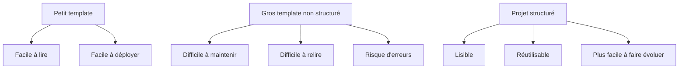
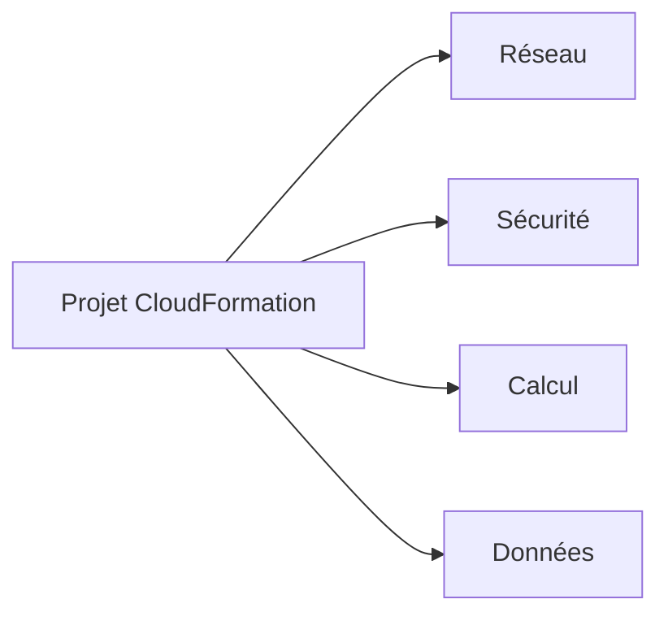
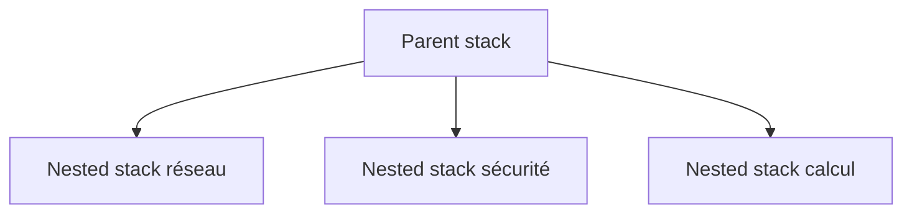
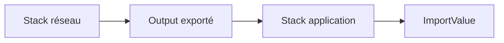
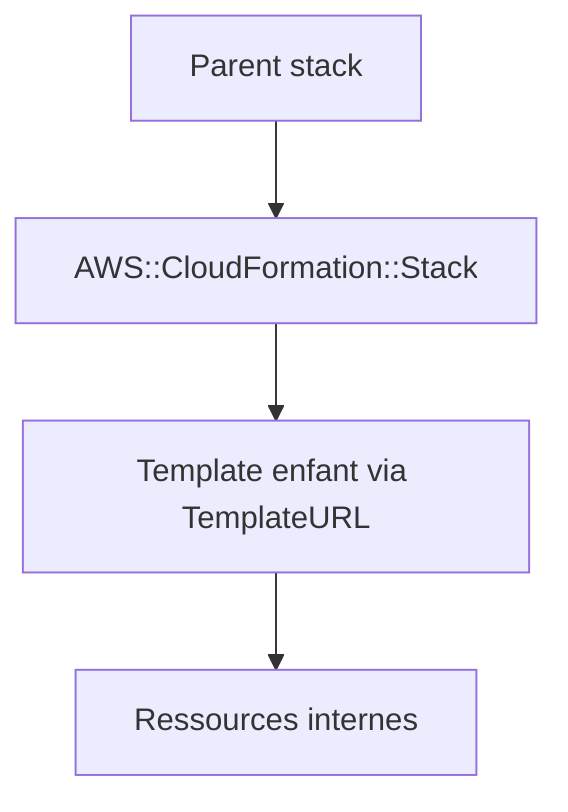
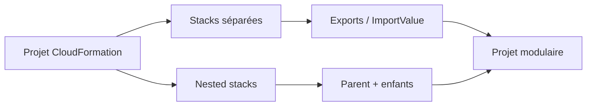

<a id="top"></a>

# AWS CloudFormation — Structurer les projets CloudFormation : organisation, modularité et nested stacks

## Table of Contents

| #  | Section                                                                    |
| -- | -------------------------------------------------------------------------- |
| 1  | [Pourquoi organiser un gros projet CloudFormation ?](#section-1)           |
| 2  | [Quand une stack devient trop grosse](#section-2)                          |
| 3  | [Principes de base pour découper un projet](#section-3)                    |
| 3a |    ↳ [Découper par cycle de vie](#section-3)                               |
| 3b |    ↳ [Découper par ownership / équipe](#section-3)                         |
| 3c |    ↳ [Découper par domaine fonctionnel](#section-3)                        |
| 4  | [Une structure professionnelle de projet](#section-4)                      |
| 5  | [Stacks séparées vs nested stacks](#section-5)                             |
| 5a |    ↳ [Qu’est-ce qu’une nested stack ?](#section-5)                         |
| 5b |    ↳ [La ressource `AWS::CloudFormation::Stack`](#section-5)               |
| 5c |    ↳ [Quand préférer des stacks séparées](#section-5)                      |
| 6  | [Références croisées entre stacks](#section-6)                             |
| 6a |    ↳ [`Export` et `Fn::ImportValue`](#section-6)                           |
| 6b |    ↳ [Limites importantes des exports](#section-6)                         |
| 7  | [Organisation recommandée : réseau, sécurité, calcul, données](#section-7) |
| 8  | [Exemple de structure de dossiers](#section-8)                             |
| 9  | [Exemple simple — parent stack + nested stack](#section-9)                 |
| 10 | [Bonnes pratiques pour maintenir un projet propre](#section-10)            |
| 11 | [Erreurs fréquentes chez les débutants](#section-11)                       |
| 12 | [Résumé des commandes](#section-12)                                        |
| 13 | [Conclusion](#section-13)                                                  |

---

<a id="section-1"></a>

<details>
<summary>1 - Pourquoi organiser un gros projet CloudFormation ?</summary>

<br/>

Quand un projet CloudFormation grandit, le principal problème n’est plus seulement “comment créer une ressource”, mais **comment garder le projet lisible, maintenable et réutilisable**. AWS recommande explicitement, dans ses bonnes pratiques CloudFormation, de planifier et organiser les stacks, notamment en **découpant les stacks monolithiques**, en **consolidant les ressources liées quand c’est pertinent**, et en **extrayant des composants réutilisables** dans des modules ou des nested stacks. ([AWS Documentation][1])



---

### Le vrai enjeu

Dans un petit laboratoire, un seul fichier YAML peut suffire. Mais dans un vrai projet, on finit souvent avec :

* du réseau
* des security groups
* des instances EC2
* des bases de données
* du stockage
* des rôles IAM
* parfois plusieurs environnements

AWS souligne justement que les gros templates deviennent difficiles à gérer et recommande de les réorganiser en unités plus petites et plus structurées. ([AWS Documentation][1])

<details>
<summary>Analogie simple pour comprendre</summary>
<br/>

Imaginez un **livre entier écrit sur une seule page** : tout le texte est là, mais c'est illisible et impossible à maintenir. Les **nested stacks**, c'est comme organiser ce même contenu en **chapitres** dans un vrai livre. Chaque chapitre traite d'un sujet précis (réseau, sécurité, serveurs), et la table des matières (la stack parente) relie le tout. Résultat : on peut relire, modifier ou réutiliser un chapitre sans toucher aux autres.

</details>

</details>

<p align="right"><a href="#top">↑ Back to top</a></p>

---

<a id="section-2"></a>

<details>
<summary>2 - Quand une stack devient trop grosse</summary>

<br/>

Une stack devient “trop grosse” quand elle commence à poser des problèmes de compréhension, de maintenance ou de gouvernance. AWS parle dans ses bonnes pratiques de **monolithic stacks** à scinder en composants plus petits et plus faciles à gérer. ([AWS Documentation][1])

---

### Signes typiques

* le fichier devient très long
* plusieurs équipes modifient le même template
* le réseau et l’application évoluent à des rythmes différents
* certains composants doivent être réutilisés dans plusieurs projets
* les mises à jour deviennent risquées

---

### Un bon signal d’alerte

Quand tu dois scroller plusieurs écrans pour retrouver une ressource précise, ou quand une modification sur la partie application te fait relire toute la partie réseau, c’est souvent le moment de découper.

AWS recommande justement de découper selon le **cycle de vie**, la **propriété de l’équipe** ou le **besoin de réutilisation**. ([AWS Documentation][1])

</details>

<p align="right"><a href="#top">↑ Back to top</a></p>

---

<a id="section-3"></a>

<details>
<summary>3 - Principes de base pour découper un projet</summary>

<br/>

AWS recommande plusieurs axes d’organisation des stacks dans ses bonnes pratiques. Le plus utile pour un débutant est de raisonner selon trois angles :

* le cycle de vie
* l’ownership
* le domaine fonctionnel

([AWS Documentation][1])

---

### Découper par cycle de vie

Certaines ressources changent rarement, d’autres évoluent souvent.

Exemple :

* le **VPC** change rarement
* l’**application EC2** change souvent
* la **base de données** change prudemment

Il est donc logique de séparer ces blocs pour éviter que chaque changement applicatif touche toute l’infrastructure.

---

### Découper par ownership / équipe

Si une équipe gère le réseau et une autre gère l’application, il est souvent plus propre de séparer les stacks. AWS cite explicitement l’organisation par ownership comme approche utile dans la planification des stacks. ([AWS Documentation][1])

---

### Découper par domaine fonctionnel

Exemple classique :

* stack réseau
* stack sécurité
* stack calcul
* stack données

Cette logique est simple, lisible, et très adaptée à la pédagogie.



</details>

<p align="right"><a href="#top">↑ Back to top</a></p>

---

<a id="section-4"></a>

<details>
<summary>4 - Une structure professionnelle de projet</summary>

<br/>

Une organisation professionnelle consiste à séparer les templates, la documentation, les paramètres d’environnement et les scripts de déploiement.

Exemple simple :

```text id="gp6y6t"
cloudformation-project/
├── README.md
├── templates/
│   ├── network.yaml
│   ├── security.yaml
│   ├── compute.yaml
│   ├── database.yaml
│   └── app-parent.yaml
├── parameters/
│   ├── dev.json
│   ├── test.json
│   └── prod.json
└── scripts/
    ├── deploy-dev.sh
    └── deploy-prod.sh
```

---

### Pourquoi c’est utile

Cette structure permet :

* de savoir où se trouve chaque composant
* de séparer les valeurs d’environnement des templates
* de faciliter la revue Git
* de clarifier les responsabilités

AWS recommande de versionner les templates, de structurer les stacks proprement et de favoriser les composants réutilisables. ([AWS Documentation][1])

</details>

<p align="right"><a href="#top">↑ Back to top</a></p>

---

<a id="section-5"></a>

<details>
<summary>5 - Stacks séparées vs nested stacks</summary>

<br/>

CloudFormation permet deux grandes approches de modularité :

* plusieurs **stacks séparées**
* une **stack parente** qui référence des **nested stacks**

AWS documente explicitement la ressource `AWS::CloudFormation::Stack` pour les nested stacks, et fournit un guide dédié pour découper un gros template en morceaux réutilisables grâce à ce mécanisme. ([AWS Documentation][2])

---

### Qu’est-ce qu’une nested stack ?

Une nested stack est une stack déclarée comme ressource à l’intérieur d’une autre stack. Elle permet de prendre un gros template et de le diviser en sous-templates plus petits. AWS montre précisément cette logique dans son guide “split a template into reusable pieces using nested stacks”. ([AWS Documentation][2])



---

### La ressource `AWS::CloudFormation::Stack`

Une nested stack utilise la ressource `AWS::CloudFormation::Stack`, avec notamment la propriété `TemplateURL` pour référencer le template enfant. AWS montre cette syntaxe dans ses snippets et ses guides. ([AWS Documentation][3])

```yaml id="bp7dba"
MonSousProjet:
  Type: AWS::CloudFormation::Stack
  Properties:
    TemplateURL: https://example-bucket.s3.amazonaws.com/templates/network.yaml
```

---

### Quand préférer des stacks séparées

Les stacks séparées sont souvent préférables quand :

* les équipes sont différentes
* le cycle de vie est différent
* on veut déployer indépendamment
* on veut faire des références croisées entre composants stables

AWS documente les références inter-stacks via `Export` et `Fn::ImportValue`, ce qui rend cette stratégie très naturelle pour des stacks distinctes. ([AWS Documentation][4])

</details>

<p align="right"><a href="#top">↑ Back to top</a></p>

---

<a id="section-6"></a>

<details>
<summary>6 - Références croisées entre stacks</summary>

<br/>

Quand plusieurs stacks sont séparées, elles doivent parfois partager des informations. AWS documente ce mécanisme via :

* `Export` dans `Outputs`
* `Fn::ImportValue` dans la stack consommatrice

([AWS Documentation][4])

---

### `Export` et `Fn::ImportValue`

Dans la stack réseau :

```yaml id="smjxx6"
Outputs:
  VpcIdExport:
    Description: ID du VPC
    Value: !Ref MonVPC
    Export:
      Name: MonProjet-VpcId
```

Dans la stack application :

```yaml id="x9wfae"
Parameters:
  Dummy:
    Type: String
    Default: ok

Resources:
  MonSecurityGroup:
    Type: AWS::EC2::SecurityGroup
    Properties:
      GroupDescription: SG app
      VpcId: !ImportValue MonProjet-VpcId
```

AWS explique que pour créer une cross-stack reference, il faut exporter une valeur depuis une stack puis l’importer dans une autre avec `Fn::ImportValue`. ([AWS Documentation][4])

---

### Limites importantes des exports

AWS précise plusieurs restrictions importantes :

* les noms d’export doivent être **uniques dans une région** pour un compte donné
* on ne peut pas faire de cross-stack references **entre régions**
* la valeur du nom d’export ne peut pas utiliser certains `Ref` ou `GetAtt` dépendant d’une ressource

([AWS Documentation][5])



<details>
<summary>En résumé très simple</summary>
<br/>

- **Export** = mettre une étiquette avec un numéro de téléphone sur une ressource, pour que les autres stacks puissent « appeler » cette ressource et l'utiliser.
- **ImportValue** = lire cette étiquette depuis une autre stack pour récupérer l'information partagée (ex. : l'ID du VPC).
- Les noms d'export doivent être uniques dans votre région, et ça ne marche pas entre régions différentes.

</details>

</details>

<p align="right"><a href="#top">↑ Back to top</a></p>

---

<a id="section-7"></a>

<details>
<summary>7 - Organisation recommandée : réseau, sécurité, calcul, données</summary>

<br/>

Pour un cours ou un projet professionnel, une structure très naturelle est la suivante :

* **network**
* **security**
* **compute**
* **data**

Cette séparation est alignée avec les bonnes pratiques AWS qui recommandent de découper les stacks selon les responsabilités, le cycle de vie et la réutilisation. ([AWS Documentation][1])

---

### Exemple logique

#### Stack réseau

Contient :

* VPC
* subnets
* route tables
* gateways

#### Stack sécurité

Contient :

* security groups communs
* rôles IAM communs
* policies transverses

#### Stack calcul

Contient :

* EC2
* Launch Templates
* Auto Scaling Groups
* Load Balancers

#### Stack données

Contient :

* RDS
* buckets S3 de données
* éventuels composants persistants

---

### Pourquoi cette approche marche bien

Elle rend les projets :

* plus lisibles
* plus faciles à faire évoluer
* plus proches d’une vraie architecture d’entreprise

<details>
<summary>En résumé très simple</summary>
<br/>

- **Petit projet** = un seul fichier YAML suffit, pas besoin de compliquer.
- **Gros projet** = un fichier par domaine (réseau, sécurité, serveurs, base de données), chacun avec sa propre stack.
- La règle d’or : si vous devez scroller longtemps pour retrouver une ressource, c’est qu’il est temps de découper.

</details>

</details>

<p align="right"><a href="#top">↑ Back to top</a></p>

---

<a id="section-8"></a>

<details>
<summary>8 - Exemple de structure de dossiers</summary>

<br/>

Voici un exemple plus structuré, adapté à une vraie série de templates :

```text id="p7auon"
cloudformation-app/
├── README.md
├── templates/
│   ├── parent.yaml
│   ├── network.yaml
│   ├── security.yaml
│   ├── compute.yaml
│   └── data.yaml
├── parameters/
│   ├── dev.json
│   ├── test.json
│   └── prod.json
├── scripts/
│   ├── deploy-network.sh
│   ├── deploy-app.sh
│   └── delete-app.sh
└── docs/
    └── architecture.md
```

---

### Variante pédagogique

Pour un cours, on peut simplifier :

```text id="6vtc5m"
mon-cours-cloudformation/
├── 01-network.yaml
├── 02-security.yaml
├── 03-compute.yaml
├── 04-database.yaml
└── 05-parent.yaml
```

L’important n’est pas le nom exact des fichiers, mais la **cohérence** du découpage.

</details>

<p align="right"><a href="#top">↑ Back to top</a></p>

---

<a id="section-9"></a>

<details>
<summary>9 - Exemple simple — parent stack + nested stack</summary>

<br/>

Voici un exemple très simple de parent stack qui appelle une nested stack réseau.

### Parent stack

```yaml id="3jxq2k"
AWSTemplateFormatVersion: '2010-09-09'
Description: Parent stack simple

Resources:
  NetworkNestedStack:
    Type: AWS::CloudFormation::Stack
    Properties:
      TemplateURL: https://example-bucket.s3.amazonaws.com/templates/network.yaml

Outputs:
  NestedStackId:
    Description: ID de la nested stack réseau
    Value: !Ref NetworkNestedStack
```

AWS montre ce pattern dans ses snippets CloudFormation et dans son guide sur les nested stacks. Le parent crée une ressource de type `AWS::CloudFormation::Stack` et référence le template enfant via `TemplateURL`. ([AWS Documentation][3])

---

### Nested stack réseau

```yaml id="u5xdze"
AWSTemplateFormatVersion: '2010-09-09'
Description: Nested stack réseau

Resources:
  MonBucketS3:
    Type: AWS::S3::Bucket

Outputs:
  BucketName:
    Description: Nom du bucket créé dans la nested stack
    Value: !Ref MonBucketS3
```

AWS montre aussi qu’un parent peut lire les outputs d’une nested stack à travers l’objet ressource imbriqué. ([AWS Documentation][3])

---

### Pourquoi cet exemple est utile

Il montre la mécanique minimale :

* un parent
* un template enfant
* un `TemplateURL`
* des outputs

C’est la base de la composition de gros projets avec nested stacks. AWS précise aussi qu’on peut fournir des paramètres à la nested stack via la propriété `Parameters` de `AWS::CloudFormation::Stack`. ([AWS Documentation][3])



</details>

<p align="right"><a href="#top">↑ Back to top</a></p>

---

<a id="section-10"></a>

<details>
<summary>10 - Bonnes pratiques pour maintenir un projet propre</summary>

<br/>

AWS regroupe plusieurs bonnes pratiques CloudFormation qui s’appliquent très bien à l’organisation des gros projets. Parmi les plus utiles ici :

* découper les stacks monolithiques
* extraire les composants réutilisables
* versionner les templates
* privilégier les pratiques sûres de gestion de secrets
* utiliser des change sets avant les mises à jour risquées

([AWS Documentation][1])

---

### 1. Ne pas mettre tous les secrets dans le template

AWS recommande de **ne pas intégrer les credentials directement dans les templates**, et d’utiliser des **dynamic references** quand c’est pertinent. ([AWS Documentation][6])

---

### 2. Versionner chaque template

Même pour les nested stacks, chaque sous-template doit être versionné proprement.

---

### 3. Séparer les paramètres d’environnement

Un template ne doit pas contenir en dur toutes les valeurs de dev, test et prod.

---

### 4. Prévisualiser les changements complexes

AWS documente les **change sets for nested stacks**, qui permettent de prévisualiser les changements à travers toute la hiérarchie imbriquée avant exécution. ([AWS Documentation][7])

---

### 5. Éviter la duplication

Si un motif se répète souvent, AWS recommande de l’extraire dans des **nested stacks** ou des **modules** pour favoriser la réutilisation et la cohérence. ([AWS Documentation][1])

</details>

<p align="right"><a href="#top">↑ Back to top</a></p>

---

<a id="section-11"></a>

<details>
<summary>11 - Erreurs fréquentes chez les débutants</summary>

<br/>

### 1. Faire un seul énorme template

AWS cite explicitement le problème des **monolithic stacks** et recommande de les découper quand elles deviennent trop complexes. ([AWS Documentation][1])

### 2. Découper trop tôt et trop finement

Tout séparer en dizaines de stacks minuscules peut rendre le projet difficile à suivre. AWS rappelle aussi qu’il faut parfois **consolider des ressources liées** au lieu de les éclater excessivement. ([AWS Documentation][1])

### 3. Confondre nested stack et cross-stack reference

Une nested stack est **incluse** dans une stack parente via `AWS::CloudFormation::Stack`. Une cross-stack reference relie **deux stacks séparées** via `Export` et `Fn::ImportValue`. AWS documente clairement ces deux mécanismes comme distincts. ([AWS Documentation][2])

### 4. Oublier les limites des exports

AWS précise qu’on ne peut pas importer une valeur exportée depuis une autre région, et que les noms d’export doivent être uniques par compte et région. ([AWS Documentation][5])

### 5. Laisser les templates enfants sans documentation

Même si CloudFormation peut les exécuter, un projet devient vite difficile à maintenir sans README, conventions de nommage et structure claire.

</details>

<p align="right"><a href="#top">↑ Back to top</a></p>

---

<a id="section-12"></a>

<details>
<summary>12 - Résumé des commandes</summary>

<br/>

```bash id="agx0pi"
# Déployer une stack réseau séparée
aws cloudformation create-stack \
  --stack-name network-stack \
  --template-body file://templates/network.yaml

# Déployer une stack application séparée qui importe des outputs
aws cloudformation create-stack \
  --stack-name app-stack \
  --template-body file://templates/compute.yaml

# Déployer une parent stack utilisant des nested stacks
aws cloudformation create-stack \
  --stack-name parent-stack \
  --template-body file://templates/parent.yaml

# Décrire les stacks
aws cloudformation describe-stacks --stack-name network-stack
aws cloudformation describe-stacks --stack-name app-stack
aws cloudformation describe-stacks --stack-name parent-stack

# Voir les exports disponibles
aws cloudformation list-exports

# Supprimer les stacks
aws cloudformation delete-stack --stack-name app-stack
aws cloudformation delete-stack --stack-name network-stack
aws cloudformation delete-stack --stack-name parent-stack
```

Les commandes de cycle de vie des stacks sont standard dans CloudFormation, et AWS documente aussi `list-exports` pour consulter les valeurs exportées par les stacks déployées. ([AWS Documentation][8])

</details>

<p align="right"><a href="#top">↑ Back to top</a></p>

---

<a id="section-13"></a>

<details>
<summary>13 - Conclusion</summary>

<br/>

Dans ce chapitre, on a vu comment faire passer un projet CloudFormation d’un simple fichier unique à une structure plus professionnelle grâce à :

* la séparation par domaine ou cycle de vie
* les stacks séparées
* les **nested stacks** avec `AWS::CloudFormation::Stack`
* les références croisées via `Export` et `Fn::ImportValue`
* une organisation claire des dossiers

AWS recommande explicitement ce type d’organisation dans ses bonnes pratiques, en insistant sur le découpage des stacks monolithiques, l’extraction de composants réutilisables et la gestion modulaire des ressources. ([AWS Documentation][1])



### Suite logique du prochain chapitre

Le **chapitre 11** peut porter sur :

* **Change Sets**
* **Drift Detection**
* **Stack Policies**
* sécurisation des mises à jour
* gestion prudente des changements


[1]: https://docs.aws.amazon.com/AWSCloudFormation/latest/UserGuide/best-practices.html?utm_source=chatgpt.com "CloudFormation best practices"
[2]: https://docs.aws.amazon.com/AWSCloudFormation/latest/UserGuide/using-cfn-nested-stacks.html?utm_source=chatgpt.com "Split a template into reusable pieces using nested stacks"
[3]: https://docs.aws.amazon.com/AWSCloudFormation/latest/UserGuide/quickref-cloudformation.html?utm_source=chatgpt.com "CloudFormation template snippets"
[4]: https://docs.aws.amazon.com/AWSCloudFormation/latest/UserGuide/walkthrough-crossstackref.html?utm_source=chatgpt.com "Refer to resource outputs in another CloudFormation stack"
[5]: https://docs.aws.amazon.com/AWSCloudFormation/latest/TemplateReference/intrinsic-function-reference-importvalue.html?utm_source=chatgpt.com "Fn::ImportValue - AWS CloudFormation"
[6]: https://docs.aws.amazon.com/AWSCloudFormation/latest/UserGuide/security-best-practices.html?utm_source=chatgpt.com "Security best practices for CloudFormation"
[7]: https://docs.aws.amazon.com/AWSCloudFormation/latest/UserGuide/change-sets-for-nested-stacks.html?utm_source=chatgpt.com "Change sets for nested stacks - AWS CloudFormation"
[8]: https://docs.aws.amazon.com/AWSCloudFormation/latest/UserGuide/using-cfn-stack-exports.html?utm_source=chatgpt.com "Get exported outputs from a deployed CloudFormation stack"
