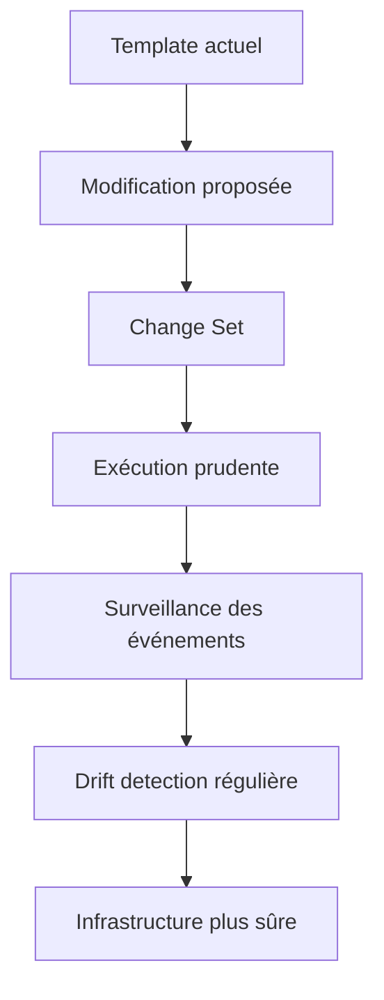
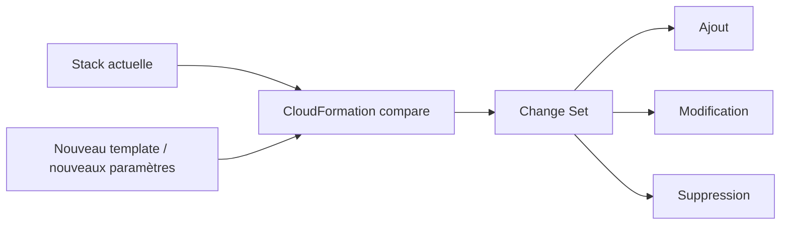
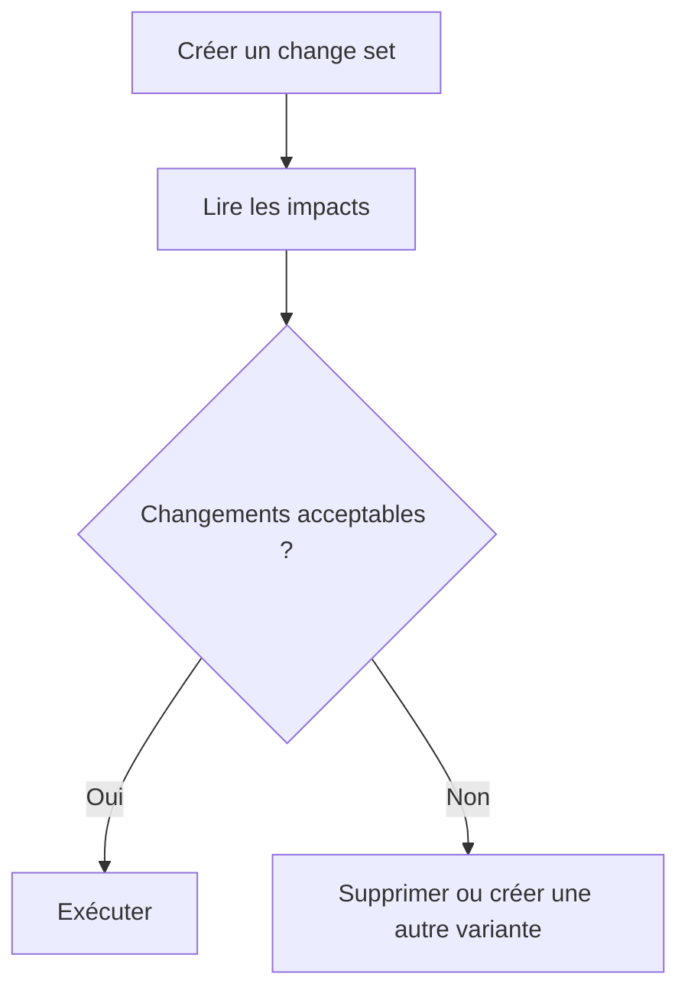
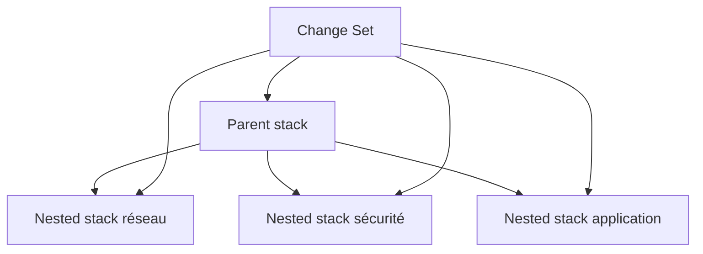
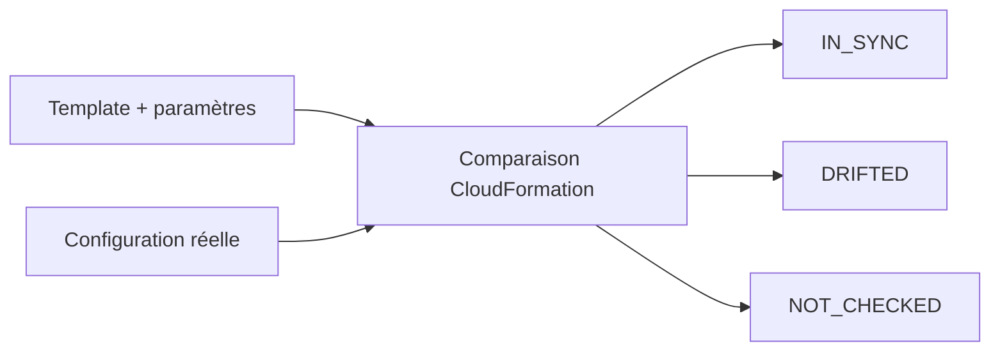
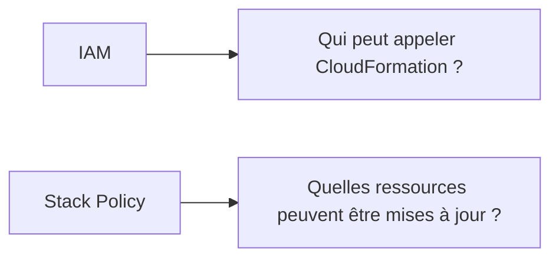
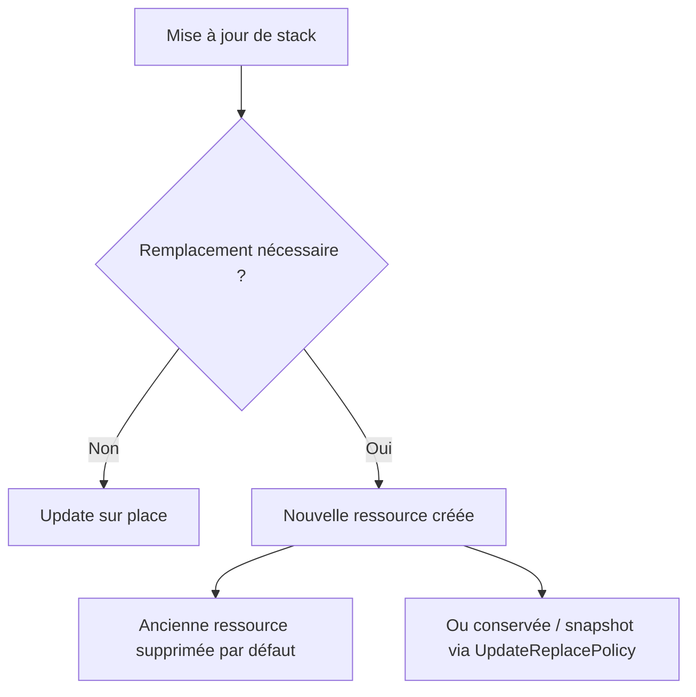
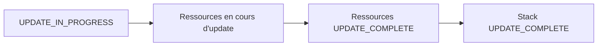
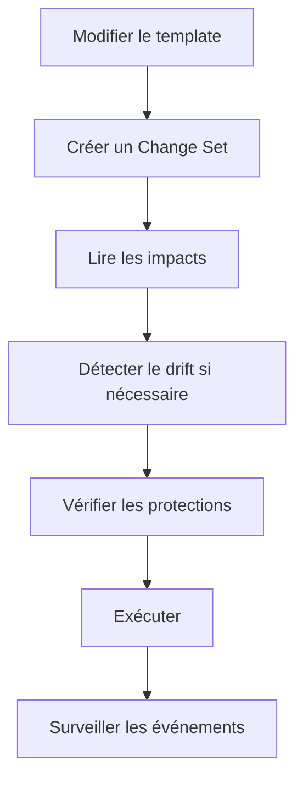
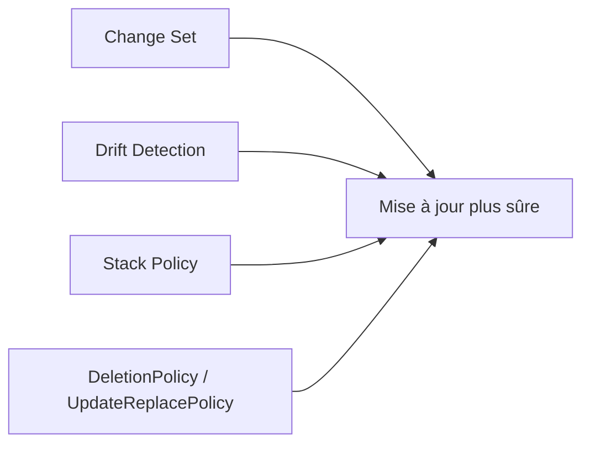

<a id="top"></a>

# AWS CloudFormation — Change Sets, Drift Detection et Stack Policies

## Table of Contents

| #  | Section                                                                                 |
| -- | --------------------------------------------------------------------------------------- |
| 1  | [Pourquoi sécuriser les mises à jour d’une stack ?](#section-1)                         |
| 2  | [Qu’est-ce qu’un Change Set ?](#section-2)                                              |
| 2a |    ↳ [Ce qu’un change set montre réellement](#section-2)                                |
| 2b |    ↳ [Ce qu’un change set ne garantit pas](#section-2)                                  |
| 3  | [Cycle de vie d’un Change Set](#section-3)                                              |
| 3a |    ↳ [Créer](#section-3)                                                                |
| 3b |    ↳ [Lire](#section-3)                                                                 |
| 3c |    ↳ [Exécuter ou supprimer](#section-3)                                                |
| 4  | [Change Sets pour nested stacks](#section-4)                                            |
| 5  | [Qu’est-ce que la Drift Detection ?](#section-5)                                        |
| 5a |    ↳ [Stack drift vs resource drift](#section-5)                                        |
| 5b |    ↳ [Statuts importants : `IN_SYNC`, `DRIFTED`, `NOT_CHECKED`](#section-5)             |
| 5c |    ↳ [Limites importantes de la drift detection](#section-5)                            |
| 6  | [Quand utiliser la drift detection ?](#section-6)                                       |
| 7  | [Qu’est-ce qu’une Stack Policy ?](#section-7)                                           |
| 7a |    ↳ [À quoi sert une stack policy](#section-7)                                         |
| 7b |    ↳ [Ce qu’une stack policy ne remplace pas](#section-7)                               |
| 8  | [Exemples de stack policies](#section-8)                                                |
| 8a |    ↳ [Protéger une ressource critique par logical ID](#section-8)                       |
| 8b |    ↳ [Protéger tous les RDS et EC2](#section-8)                                         |
| 9  | [`DeletionPolicy` et `UpdateReplacePolicy` dans la stratégie de protection](#section-9) |
| 10 | [Surveiller une mise à jour de stack](#section-10)                                      |
| 11 | [Exemple de workflow sûr avant mise à jour](#section-11)                                |
| 12 | [Erreurs fréquentes chez les débutants](#section-12)                                    |
| 13 | [Résumé des commandes](#section-13)                                                     |
| 14 | [Conclusion](#section-14)                                                               |

---

<a id="section-1"></a>

<details>
<summary>1 - Pourquoi sécuriser les mises à jour d’une stack ?</summary>

<br/>

Créer une stack est une chose. La **faire évoluer sans casser des ressources critiques** en est une autre. AWS recommande explicitement de **créer des change sets avant de mettre à jour les stacks**, d’**utiliser régulièrement la drift detection** et d’**employer des stack policies pour protéger les ressources sensibles**. ([AWS Documentation][1])



---

### Pourquoi c’est nécessaire

Lors d’une mise à jour, certaines ressources peuvent être **modifiées sur place**, d’autres **interrompues**, et d’autres encore **remplacées**, ce qui peut créer un nouvel identifiant physique. AWS explique aussi qu’une stack policy peut empêcher des mises à jour ou suppressions accidentelles pendant un update. ([AWS Documentation][2])

</details>

<p align="right"><a href="#top">↑ Back to top</a></p>

---

<a id="section-2"></a>

<details>
<summary>2 - Qu’est-ce qu’un Change Set ?</summary>

<br/>

Un **Change Set** est un aperçu des changements qu’une mise à jour proposée apporterait à une stack. AWS précise qu’il permet de voir comment les changements proposés peuvent impacter les ressources en cours d’exécution, y compris les propriétés et attributs modifiés, et que CloudFormation n’applique rien tant que vous n’exécutez pas explicitement le change set. ([AWS Documentation][3])

---

### Ce qu’un change set montre réellement

AWS indique qu’un change set compare la stack actuelle avec le **template modifié** et/ou les **nouveaux paramètres**, puis affiche les ressources qui seront **ajoutées, modifiées ou supprimées**, ainsi qu’une comparaison avant/après de certaines propriétés. ([AWS Documentation][3])



---

### Ce qu’un change set ne garantit pas

AWS souligne un point très important : un change set **n’indique pas** si la mise à jour réussira réellement. Il ne vérifie pas, par exemple, les quotas de compte, certaines limitations de mise à jour de ressources, ni toutes les permissions nécessaires. En cas d’échec, CloudFormation tente un rollback. ([AWS Documentation][3])

<details>
<summary>Analogie simple pour comprendre</summary>
<br/>

Un Change Set, c’est comme un **devis avant des travaux** dans votre maison. Avant de casser un mur ou de refaire la plomberie, l’entrepreneur vous montre exactement ce qui va changer, ce qui sera ajouté et ce qui sera supprimé. Vous regardez le devis, et seulement si tout vous convient, vous donnez le feu vert. Sans devis, vous découvririez les surprises une fois les travaux commencés.

</details>

</details>

<p align="right"><a href="#top">↑ Back to top</a></p>

---

<a id="section-3"></a>

<details>
<summary>3 - Cycle de vie d’un Change Set</summary>

<br/>

AWS décrit le flux standard d’un change set en quatre temps : **création**, **lecture**, éventuellement **comparaison avec d’autres change sets**, puis **exécution**. Après exécution, les autres change sets liés à cette stack sont supprimés car ils ne correspondent plus à l’état courant de la stack. ([AWS Documentation][3])

---

### Créer

On crée un change set à partir :

* d’un template modifié
* de nouveaux paramètres
* ou des deux

CloudFormation compare alors l’état actuel de la stack et la proposition, sans appliquer immédiatement les changements. ([AWS Documentation][3])

---

### Lire

La lecture du change set sert à identifier :

* ce qui sera ajouté
* ce qui sera modifié
* ce qui sera supprimé
* ce qui risque d’être remplacé

C’est l’étape qui permet d’éviter les surprises avant exécution. ([AWS Documentation][3])

---

### Exécuter ou supprimer

Une fois relu, le change set peut être :

* **exécuté** si les changements sont acceptables
* **supprimé** s’il ne doit pas être appliqué

AWS précise qu’on peut aussi créer plusieurs change sets pour comparer plusieurs variantes d’évolution d’une même stack. ([AWS Documentation][3])



</details>

<p align="right"><a href="#top">↑ Back to top</a></p>

---

<a id="section-4"></a>

<details>
<summary>4 - Change Sets pour nested stacks</summary>

<br/>

AWS documente aussi les **change sets pour nested stacks**. L’intérêt est de pouvoir prévisualiser les changements **sur toute la hiérarchie imbriquée**, pas seulement sur la stack parente. Cela permet de voir comment les modifications se propagent à travers les sous-stacks réseau, sécurité, application, etc. ([AWS Documentation][4])



---

### Pourquoi c’est utile

Quand un projet est modulaire, un simple diff sur la stack parente ne suffit pas toujours à comprendre l’effet réel d’une mise à jour. AWS explique que les change sets pour nested stacks élargissent justement la portée du preview à toute la hiérarchie. ([AWS Documentation][4])

</details>

<p align="right"><a href="#top">↑ Back to top</a></p>

---

<a id="section-5"></a>

<details>
<summary>5 - Qu’est-ce que la Drift Detection ?</summary>

<br/>

La **drift detection** sert à détecter si la configuration réelle d’une stack ou d’une ressource a divergé de ce que CloudFormation attend d’après le template et les paramètres. AWS explique que des utilisateurs peuvent modifier des ressources directement via le service sous-jacent, ce qui complique ensuite les mises à jour ou suppressions de stack. ([AWS Documentation][5])

---

### Stack drift vs resource drift

AWS précise qu’une **ressource** est considérée comme drifted si une ou plusieurs propriétés réelles diffèrent de la définition attendue. Une **stack** est drifted si au moins une de ses ressources a drifté. CloudFormation peut aussi fournir des détails sur chaque ressource en dérive. ([AWS Documentation][5])

---

### Statuts importants : `IN_SYNC`, `DRIFTED`, `NOT_CHECKED`

AWS documente plusieurs statuts de drift :

* `IN_SYNC` : la configuration correspond au template
* `DRIFTED` : il existe une divergence
* `NOT_CHECKED` : CloudFormation n’a pas vérifié, ou la ressource ne prend pas en charge la drift detection

Pour les ressources, AWS documente aussi `DELETED` et `MODIFIED`. ([AWS Documentation][5])



---

### Limites importantes de la drift detection

AWS donne plusieurs limites importantes :

* la drift detection ne fonctionne que sur les types de ressources qui la prennent en charge
* elle **ne détecte que les propriétés explicitement définies** dans le template ou via paramètres
* elle **ne détecte pas automatiquement le drift des nested stacks** lorsqu’on lance la détection au niveau de la stack parente ; il faut déclencher l’opération directement sur la nested stack concernée

([AWS Documentation][5])

<details>
<summary>Analogie simple pour comprendre</summary>
<br/>

Le drift, c’est comme si **quelqu’un avait déplacé les meubles sans prévenir**. Vous aviez un plan précis de votre salon (le template CloudFormation), mais quelqu’un est passé et a bougé le canapé, retiré une chaise ou ajouté une table. La drift detection, c’est comparer le plan original avec l’état actuel de la pièce pour repérer tout ce qui a changé sans votre accord.

</details>

</details>

<p align="right"><a href="#top">↑ Back to top</a></p>

---

<a id="section-6"></a>

<details>
<summary>6 - Quand utiliser la drift detection ?</summary>

<br/>

AWS recommande d’utiliser régulièrement la drift detection. En pratique, elle est particulièrement utile :

* après des interventions manuelles urgentes
* avant une mise à jour importante
* lorsqu’une stack se comporte différemment du template attendu
* après une longue période sans mise à jour

Cette recommandation s’inscrit directement dans les bonnes pratiques CloudFormation publiées par AWS. ([AWS Documentation][1])

---

### Cas concret

Si quelqu’un modifie un security group, une instance, ou certains paramètres de ressource via la console AWS au lieu de passer par CloudFormation, la drift detection permet d’identifier cette divergence avant qu’une mise à jour ultérieure ne se passe mal. AWS explique explicitement que ces changements hors CloudFormation peuvent compliquer les updates et deletes. ([AWS Documentation][5])

</details>

<p align="right"><a href="#top">↑ Back to top</a></p>

---

<a id="section-7"></a>

<details>
<summary>7 - Qu’est-ce qu’une Stack Policy ?</summary>

<br/>

Une **stack policy** est un document JSON qui définit quelles actions de mise à jour sont autorisées ou refusées sur certaines ressources d’une stack. AWS explique qu’elle sert à empêcher les mises à jour ou suppressions accidentelles pendant une opération d’update. ([AWS Documentation][2])

---

### À quoi sert une stack policy

Par défaut, quand une stack est créée, toutes les actions d’update sont autorisées sur toutes les ressources. AWS précise qu’une stack policy agit comme un **fail-safe mechanism** pour éviter des mises à jour accidentelles sur des ressources critiques. ([AWS Documentation][2])

---

### Ce qu’une stack policy ne remplace pas

AWS insiste sur le fait qu’une stack policy :

* s’applique **seulement pendant les mises à jour de stack**
* **ne remplace pas IAM**
* ne sert pas à gérer l’accès général aux ressources

Autrement dit, IAM contrôle **qui peut faire quoi**, alors que la stack policy protège **ce qui peut être mis à jour dans la stack**, même si l’utilisateur a le droit général de lancer un update. ([AWS Documentation][2])



<details>
<summary>En résumé très simple</summary>
<br/>

- **Stack policy** = panneau « Ne pas toucher » sur certaines ressources pendant les mises à jour.
- Elle empêche les modifications accidentelles sur des ressources critiques (comme une base de données de production).
- Attention : elle ne remplace pas IAM. IAM contrôle *qui* peut agir, la stack policy contrôle *quoi* peut être modifié.

</details>

</details>

<p align="right"><a href="#top">↑ Back to top</a></p>

---

<a id="section-8"></a>

<details>
<summary>8 - Exemples de stack policies</summary>

<br/>

AWS documente plusieurs façons de cibler les ressources dans une stack policy :

* par **logical ID**
* par **wildcard sur logical ID**
* par **type de ressource** grâce à une condition sur `ResourceType`

AWS précise aussi qu’une stack policy ne supporte que `Principal: "*"`, c’est-à-dire qu’elle s’applique à tous les utilisateurs CloudFormation qui tentent la mise à jour de cette stack. ([AWS Documentation][2])

---

### Protéger une ressource critique par logical ID

Exemple : protéger une base critique appelée `ProductionDatabase`.

```json
{
  "Statement": [
    {
      "Effect": "Allow",
      "Action": "Update:*",
      "Principal": "*",
      "NotResource": "LogicalResourceId/ProductionDatabase"
    }
  ]
}
```

AWS documente explicitement l’usage de `NotResource` pour autoriser les updates partout sauf sur une ressource précise. ([AWS Documentation][2])

---

### Protéger tous les RDS et EC2

AWS montre aussi qu’on peut utiliser une condition sur `ResourceType` pour bloquer, par exemple, toutes les ressources `AWS::EC2::Instance` et `AWS::RDS::DBInstance`. ([AWS Documentation][2])

```json
{
  "Statement": [
    {
      "Effect": "Deny",
      "Principal": "*",
      "Action": "Update:*",
      "Resource": "*",
      "Condition": {
        "StringEquals": {
          "ResourceType": [
            "AWS::EC2::Instance",
            "AWS::RDS::DBInstance"
          ]
        }
      }
    },
    {
      "Effect": "Allow",
      "Principal": "*",
      "Action": "Update:*",
      "Resource": "*"
    }
  ]
}
```

AWS précise aussi qu’un `Deny` l’emporte sur un `Allow`, ce qui est essentiel pour bien lire ces policies. ([AWS Documentation][2])

</details>

<p align="right"><a href="#top">↑ Back to top</a></p>

---

<a id="section-9"></a>

<details>
<summary>9 - <code>DeletionPolicy</code> et <code>UpdateReplacePolicy</code> dans la stratégie de protection</summary>

<br/>

Même si ce chapitre est centré sur change sets, drift et stack policies, il faut relier ces mécanismes à deux attributs très utiles :

* `DeletionPolicy`
* `UpdateReplacePolicy`

AWS explique que `DeletionPolicy` contrôle ce qu’il advient d’une ressource quand elle est supprimée de la stack ou quand la stack elle-même est supprimée, tandis que `UpdateReplacePolicy` contrôle le sort de l’ancienne ressource lorsqu’un update provoque un **replacement**. ([AWS Documentation][6])

---

### Différence essentielle

* `DeletionPolicy` agit lors d’une **suppression**
* `UpdateReplacePolicy` agit lors d’un **remplacement pendant une mise à jour**

AWS précise aussi qu’en l’absence de `DeletionPolicy`, la ressource est supprimée par défaut, avec une exception notable : certaines ressources RDS ont par défaut une politique `Snapshot`. ([AWS Documentation][6])

---

### Pourquoi c’est lié à ce chapitre

Une bonne stratégie de mise à jour sûre, ce n’est pas seulement “faire un change set”. C’est aussi :

* previewer les changements
* protéger certaines ressources avec une stack policy
* décider si l’ancienne ressource doit être conservée, supprimée ou snapshotée en cas de remplacement

AWS documente précisément cette logique dans `UpdateReplacePolicy`. ([AWS Documentation][7])



</details>

<p align="right"><a href="#top">↑ Back to top</a></p>

---

<a id="section-10"></a>

<details>
<summary>10 - Surveiller une mise à jour de stack</summary>

<br/>

AWS recommande de surveiller la progression d’une mise à jour via les **événements de stack**. Le panneau `Events` affiche chaque étape majeure de la création ou de la mise à jour, avec les événements les plus récents en haut. Lors d’un update réussi, on voit notamment `UPDATE_IN_PROGRESS` puis `UPDATE_COMPLETE` pour la stack et pour les ressources modifiées. ([AWS Documentation][8])



---

### Pourquoi c’est important

Quand une mise à jour échoue, les événements donnent souvent la ressource précise et l’étape où le problème s’est produit. AWS consacre une page spécifique au suivi des mises à jour et aux événements observables dans le flux de déploiement. ([AWS Documentation][8])

</details>

<p align="right"><a href="#top">↑ Back to top</a></p>

---

<a id="section-11"></a>

<details>
<summary>11 - Exemple de workflow sûr avant mise à jour</summary>

<br/>

Voici une séquence simple et prudente, cohérente avec les bonnes pratiques AWS :

1. valider le template
2. créer un change set
3. lire soigneusement l’impact
4. vérifier s’il existe du drift
5. confirmer la présence des protections utiles (`DeletionPolicy`, `UpdateReplacePolicy`, stack policy)
6. exécuter la mise à jour
7. surveiller les événements

AWS recommande explicitement de créer des change sets avant mise à jour, d’utiliser la drift detection régulièrement et d’employer des stack policies pour protéger les ressources critiques. ([AWS Documentation][1])



</details>

<p align="right"><a href="#top">↑ Back to top</a></p>

---

<a id="section-12"></a>

<details>
<summary>12 - Erreurs fréquentes chez les débutants</summary>

<br/>

### 1. Croire qu’un change set garantit le succès

AWS précise explicitement qu’un change set ne garantit pas que l’update réussira ; des quotas, permissions ou contraintes de ressource peuvent encore faire échouer la mise à jour. ([AWS Documentation][3])

### 2. Oublier que le drift ne couvre pas tout

AWS indique que certaines ressources ne supportent pas la drift detection et reçoivent le statut `NOT_CHECKED`, et que seules les propriétés **explicitement définies** sont prises en compte. ([AWS Documentation][5])

### 3. Penser que la drift detection de la stack parente vérifie automatiquement les nested stacks

AWS précise que ce n’est pas le cas : il faut lancer l’opération directement sur la nested stack concernée. ([AWS Documentation][5])

### 4. Utiliser une stack policy comme si c’était une IAM policy

AWS rappelle qu’une stack policy ne remplace pas IAM et ne sert que pendant les updates de stack. ([AWS Documentation][2])

### 5. Oublier `UpdateReplacePolicy` sur une ressource sensible

AWS documente clairement que lors d’un remplacement, l’ancienne ressource est supprimée par défaut sauf si `UpdateReplacePolicy` indique autre chose. ([AWS Documentation][7])

</details>

<p align="right"><a href="#top">↑ Back to top</a></p>

---

<a id="section-13"></a>

<details>
<summary>13 - Résumé des commandes</summary>

<br/>

```bash
# Créer un change set
aws cloudformation create-change-set \
  --stack-name mon-projet \
  --change-set-name preview-update-1 \
  --template-body file://template.yaml

# Décrire le change set
aws cloudformation describe-change-set \
  --stack-name mon-projet \
  --change-set-name preview-update-1

# Exécuter le change set
aws cloudformation execute-change-set \
  --stack-name mon-projet \
  --change-set-name preview-update-1

# Supprimer un change set
aws cloudformation delete-change-set \
  --stack-name mon-projet \
  --change-set-name preview-update-1

# Détecter le drift d'une stack
aws cloudformation detect-stack-drift \
  --stack-name mon-projet

# Décrire le statut de détection du drift
aws cloudformation describe-stack-drift-detection-status \
  --stack-drift-detection-id <ID_RETOURNE>

# Voir le drift des ressources
aws cloudformation describe-stack-resource-drifts \
  --stack-name mon-projet
```

Ces commandes correspondent directement aux opérations documentées par AWS pour les change sets et la drift detection. ([AWS Documentation][3])

</details>

<p align="right"><a href="#top">↑ Back to top</a></p>

---

<a id="section-14"></a>

<details>
<summary>14 - Conclusion</summary>

<br/>

Dans ce chapitre, on a vu comment rendre les mises à jour CloudFormation beaucoup plus sûres grâce à :

* **Change Sets** pour prévisualiser les impacts
* **Drift Detection** pour repérer les divergences entre template et réalité
* **Stack Policies** pour empêcher des updates accidentels sur des ressources critiques
* **DeletionPolicy** et **UpdateReplacePolicy** pour contrôler le sort des ressources sensibles

AWS recommande précisément cet ensemble de pratiques dans ses guides et bonnes pratiques CloudFormation. ([AWS Documentation][1])



### Suite logique du prochain chapitre

Le **chapitre 12** peut porter sur :

* bonnes pratiques générales
* validation des templates
* debugging
* troubleshooting
* lecture des erreurs CloudFormation
* conventions de nommage
* stratégies de test


[1]: https://docs.aws.amazon.com/AWSCloudFormation/latest/UserGuide/best-practices.html "CloudFormation best practices - AWS CloudFormation"
[2]: https://docs.aws.amazon.com/AWSCloudFormation/latest/UserGuide/protect-stack-resources.html "Prevent updates to stack resources - AWS CloudFormation"
[3]: https://docs.aws.amazon.com/AWSCloudFormation/latest/UserGuide/using-cfn-updating-stacks-changesets.html "Update CloudFormation stacks using change sets - AWS CloudFormation"
[4]: https://docs.aws.amazon.com/AWSCloudFormation/latest/UserGuide/change-sets-for-nested-stacks.html "Change sets for nested stacks - AWS CloudFormation"
[5]: https://docs.aws.amazon.com/AWSCloudFormation/latest/UserGuide/using-cfn-stack-drift.html "Detect unmanaged configuration changes to stacks and resources with drift detection - AWS CloudFormation"
[6]: https://docs.aws.amazon.com/AWSCloudFormation/latest/TemplateReference/aws-attribute-deletionpolicy.html "DeletionPolicy attribute - AWS CloudFormation"
[7]: https://docs.aws.amazon.com/AWSCloudFormation/latest/TemplateReference/aws-attribute-updatereplacepolicy.html "UpdateReplacePolicy attribute - AWS CloudFormation"
[8]: https://docs.aws.amazon.com/AWSCloudFormation/latest/UserGuide/using-cfn-updating-stacks-monitor-stack.html "Monitor the progress of a stack update - AWS CloudFormation"
