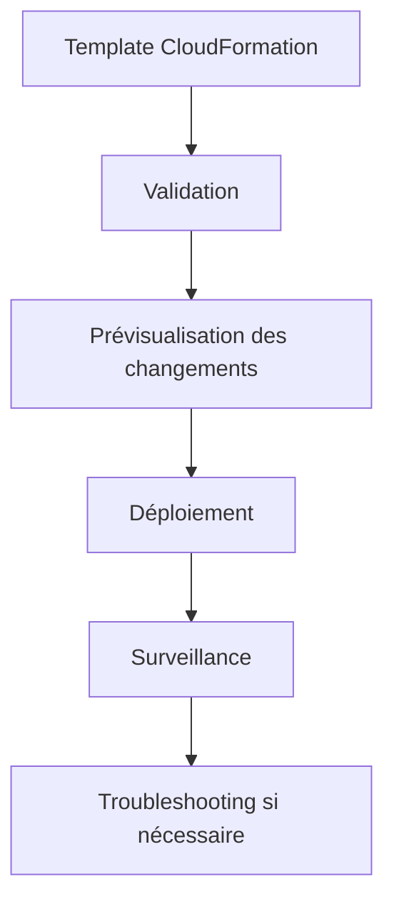
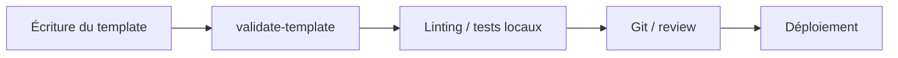
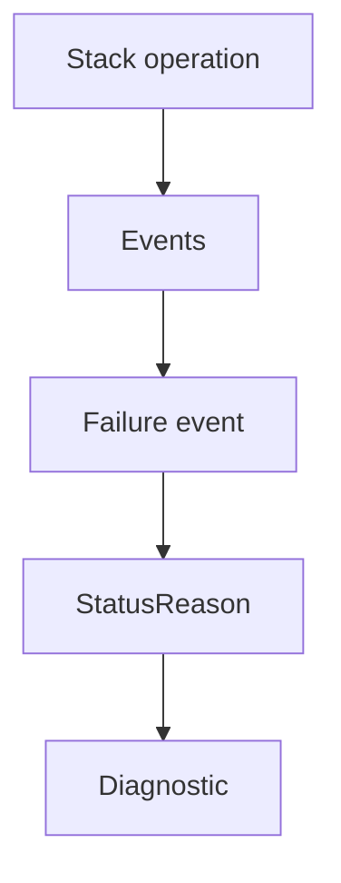
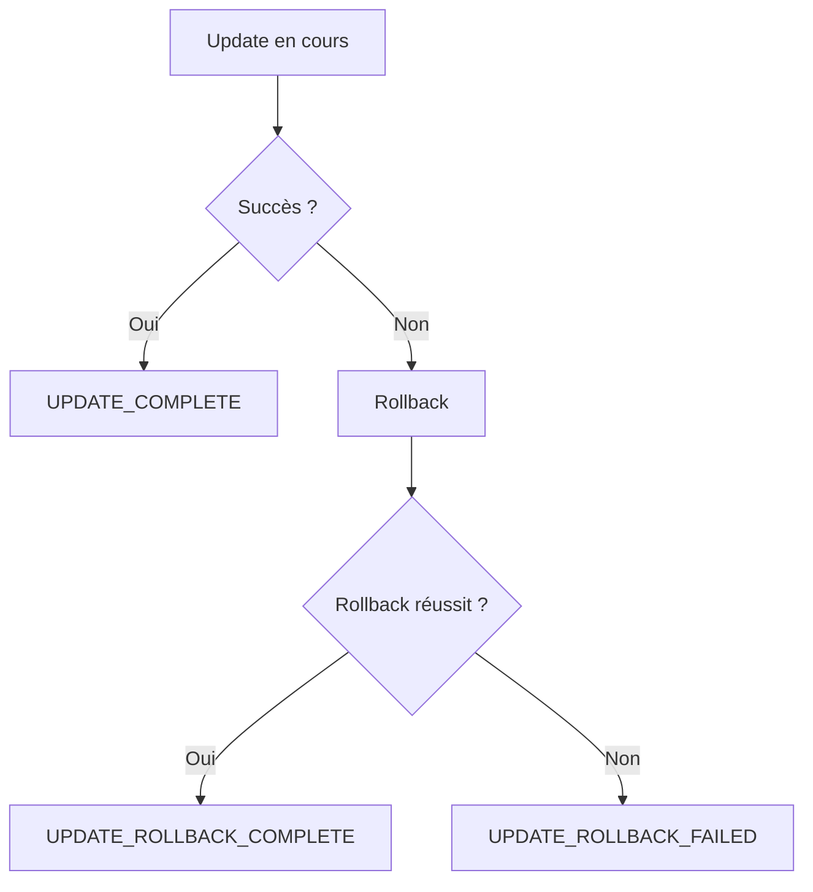
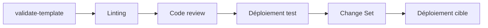
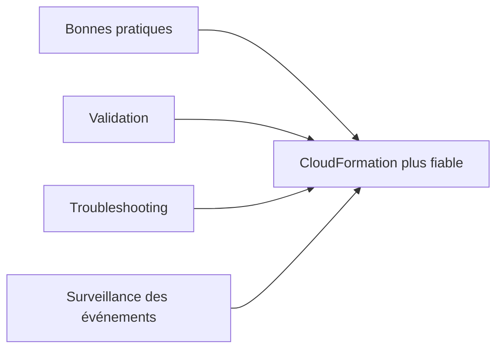

<a id="top"></a>

# AWS CloudFormation — Bonnes pratiques, validation, debugging et troubleshooting

## Table of Contents

| #  | Section                                                                                       |
| -- | --------------------------------------------------------------------------------------------- |
| 1  | [Pourquoi une discipline de qualité est indispensable avec CloudFormation ?](#section-1)      |
| 2  | [Bonnes pratiques générales AWS pour CloudFormation](#section-2)                              |
| 2a |    ↳ [Traiter les templates comme du code](#section-2)                                        |
| 2b |    ↳ [Organiser les stacks par cycle de vie et ownership](#section-2)                         |
| 2c |    ↳ [Ne pas intégrer de secrets dans les templates](#section-2)                              |
| 2d |    ↳ [Utiliser les parameter types AWS, les contraintes et les pseudo parameters](#section-2) |
| 3  | [Valider un template avant déploiement](#section-3)                                           |
| 3a |    ↳ [`aws cloudformation validate-template`](#section-3)                                     |
| 3b |    ↳ [Linting précoce et fail-fast](#section-3)                                               |
| 4  | [Lire correctement les événements de stack](#section-4)                                       |
| 5  | [Troubleshooting des erreurs CloudFormation les plus fréquentes](#section-5)                  |
| 5a |    ↳ [`DELETE_FAILED`](#section-5)                                                            |
| 5b |    ↳ [Dependency error](#section-5)                                                           |
| 5c |    ↳ [Quota exceeded](#section-5)                                                             |
| 5d |    ↳ [`UPDATE_ROLLBACK_FAILED`](#section-5)                                                   |
| 5e |    ↳ [`No updates to perform`](#section-5)                                                    |
| 6  | [Comprendre la logique de rollback](#section-6)                                               |
| 7  | [Déboguer les problèmes liés à EC2 et UserData](#section-7)                                   |
| 8  | [Conventions de nommage, tags et structure de projet](#section-8)                             |
| 9  | [Stratégie de test recommandée](#section-9)                                                   |
| 10 | [Exemple de workflow professionnel de validation](#section-10)                                |
| 11 | [Résumé des commandes](#section-11)                                                           |
| 12 | [Conclusion](#section-12)                                                                     |

---

<a id="section-1"></a>

<details>
<summary>1 - Pourquoi une discipline de qualité est indispensable avec CloudFormation ?</summary>

<br/>

CloudFormation permet d’automatiser l’infrastructure, mais cette automatisation amplifie aussi les erreurs : une petite faute dans un template, un mauvais paramètre, une dépendance oubliée ou une mise à jour mal préparée peuvent affecter plusieurs ressources à la fois. AWS insiste justement sur l’importance de raccourcir la boucle de feedback, de valider les templates avant usage, de créer des change sets avant mise à jour, et d’utiliser régulièrement la drift detection pour garder l’infrastructure fiable. ([AWS Documentation][1])



---

### Idée centrale

Un bon usage de CloudFormation ne consiste pas seulement à “écrire du YAML”, mais à appliquer une méthode :

* valider avant de déployer
* relire les changements
* surveiller les événements
* diagnostiquer rapidement les erreurs
* corriger sans casser les ressources déjà en place

AWS regroupe exactement ces recommandations dans ses bonnes pratiques CloudFormation et dans son guide de troubleshooting. ([AWS Documentation][1])

<details>
<summary>Analogie simple pour comprendre</summary>
<br/>

Valider un template, c’est comme **vérifier la recette avant de cuisiner** : on s’assure que tous les ingrédients sont là et que les étapes sont cohérentes. Débugger, c’est **goûter en cours de cuisson** : on surveille l’avancement et on ajuste si quelque chose ne va pas. Sans ces deux réflexes, on risque de servir un plat immangeable (ou de casser son infrastructure).

</details>

</details>

<p align="right"><a href="#top">↑ Back to top</a></p>

---

<a id="section-2"></a>

<details>
<summary>2 - Bonnes pratiques générales AWS pour CloudFormation</summary>

<br/>

AWS publie une page de bonnes pratiques CloudFormation qui couvre l’organisation des stacks, la création des templates, la gestion des stacks, les outils d’authoring et la sécurité. On y retrouve notamment : organiser les stacks par cycle de vie et ownership, réutiliser les templates entre environnements, vérifier les quotas, ne pas embarquer de credentials, valider les templates avant usage, créer des change sets avant les mises à jour, utiliser les stack policies, utiliser la drift detection régulièrement, et appliquer le moindre privilège. ([AWS Documentation][1])

---

### Traiter les templates comme du code

AWS recommande explicitement d’adopter les pratiques **Infrastructure as Code** : stocker les templates dans un système de versionnement, faire des revues de code, et utiliser des tests automatisés pour valider les changements. AWS recommande aussi d’envisager des pipelines CI/CD pour les templates CloudFormation. ([AWS Documentation][1])

---

### Organiser les stacks par cycle de vie et ownership

AWS recommande d’organiser les stacks selon le **cycle de vie** et l’**ownership** des ressources. L’idée est que les composants qui évoluent à des rythmes différents, ou qui appartiennent à des équipes différentes, ne devraient pas forcément vivre dans la même stack. ([AWS Documentation][1])

---

### Ne pas intégrer de secrets dans les templates

AWS recommande explicitement de **ne pas embarquer d’identifiants sensibles** dans les templates. À la place, AWS recommande l’usage de **dynamic references** vers Systems Manager Parameter Store ou Secrets Manager, afin que CloudFormation récupère la valeur au moment voulu sans stocker la valeur sensible directement dans le template. ([AWS Documentation][1])

---

### Utiliser les parameter types AWS, les contraintes et les pseudo parameters

AWS recommande aussi d’utiliser :

* les **AWS-specific parameter types** pour mieux valider les entrées,
* les **parameter constraints** pour restreindre les valeurs autorisées,
* les **pseudo parameters** pour améliorer la portabilité des templates.

Ces recommandations apparaissent explicitement dans les bonnes pratiques officielles. ([AWS Documentation][1])

</details>

<p align="right"><a href="#top">↑ Back to top</a></p>

---

<a id="section-3"></a>

<details>
<summary>3 - Valider un template avant déploiement</summary>

<br/>

Valider un template avant déploiement est une recommandation explicite d’AWS. AWS recommande de raccourcir la boucle de feedback avec du linting et des tests précoces, afin de détecter les problèmes avant même d’envoyer le template vers des environnements formels. AWS cite notamment `cfn-lint` comme outil de validation contre la spécification CloudFormation, avec prise en compte des valeurs valides et de certaines bonnes pratiques. ([AWS Documentation][1])

---

### `aws cloudformation validate-template`

AWS CLI fournit la commande `validate-template`. AWS précise que cette commande valide un template en vérifiant d’abord s’il est en JSON valide, puis en YAML valide, et renvoie une erreur de validation si les deux vérifications échouent. ([AWS Documentation][2])

```bash id="b8amk8"
aws cloudformation validate-template \
  --template-body file://template.yaml
```

---

### Linting précoce et fail-fast

AWS recommande une approche **fail-fast** : faire du linting et des tests très tôt sur le poste de travail pour découvrir les erreurs de syntaxe et de configuration avant le dépôt du code. AWS cite `cfn-lint` et `TaskCat` comme outils utiles pour cette stratégie. ([AWS Documentation][1])



</details>

<p align="right"><a href="#top">↑ Back to top</a></p>

---

<a id="section-4"></a>

<details>
<summary>4 - Lire correctement les événements de stack</summary>

<br/>

Quand une stack est créée, mise à jour ou supprimée, la première source de vérité est la liste des **événements**. AWS explique qu’il faut utiliser la console CloudFormation pour voir le statut de la stack et la liste des événements, et qu’on peut s’appuyer sur l’operation ID pour se concentrer sur un groupe d’événements lié à une opération donnée. AWS recommande aussi de trouver l’événement de défaillance et d’en lire le `StatusReason`. ([AWS Documentation][3])

---

### Pourquoi c’est le réflexe numéro 1

La plupart des erreurs CloudFormation ont une explication lisible dans les événements :

* permission manquante
* quota dépassé
* propriété invalide
* ressource non stabilisée
* dépendance mal déclarée

AWS consacre son guide de troubleshooting à ces cas courants et commence justement par le fait que des problèmes peuvent survenir lors des créations, mises à jour ou suppressions de stack. ([AWS Documentation][3])



<details>
<summary>En résumé très simple</summary>
<br/>

- Quand ça plante, les **événements CloudFormation** sont votre journal de bord. Lisez-les de bas en haut pour trouver la cause.
- Cherchez l’événement avec le statut `FAILED` et lisez son `StatusReason` : c’est là que se cache l’explication.
- C’est toujours le premier réflexe à avoir avant de chercher ailleurs.

</details>

</details>

<p align="right"><a href="#top">↑ Back to top</a></p>

---

<a id="section-5"></a>

<details>
<summary>5 - Troubleshooting des erreurs CloudFormation les plus fréquentes</summary>

<br/>

AWS documente un ensemble de problèmes courants dans son guide de troubleshooting, notamment les échecs de suppression, les erreurs de dépendance, les quotas dépassés, les rollbacks échoués, les permissions IAM insuffisantes, et le message `No updates to perform`. ([AWS Documentation][3])

---

### `DELETE_FAILED`

AWS indique qu’un échec de suppression peut venir du fait que certaines ressources doivent être vides avant de pouvoir être supprimées. AWS donne explicitement l’exemple d’un bucket S3 qui doit être vidé avant suppression, ou d’un security group EC2 qui doit être libéré de certaines références. AWS recommande aussi, si nécessaire, d’utiliser `RetainResources` pour supprimer la stack sans supprimer la ressource problématique. ([AWS Documentation][3])

---

### Dependency error

AWS explique qu’en cas de **dependency error**, il peut être nécessaire d’ajouter explicitement `DependsOn` pour que CloudFormation crée ou supprime les ressources dans le bon ordre. AWS donne notamment l’exemple d’une Elastic IP qui doit dépendre de l’attachement d’un Internet Gateway dans un VPC. ([AWS Documentation][3])

---

### Quota exceeded

AWS indique qu’une stack peut échouer si vous atteignez un quota de service, et précise aussi qu’une mise à jour peut temporairement dépasser un quota lorsqu’une ressource est remplacée, car CloudFormation crée la nouvelle ressource avant de supprimer l’ancienne. AWS recommande alors soit de libérer des ressources inutiles, soit de demander une augmentation de quota. ([AWS Documentation][3])

---

### `UPDATE_ROLLBACK_FAILED`

AWS explique que ce statut apparaît quand une ressource dépendante ne peut pas revenir à son état initial pendant le rollback. AWS donne l’exemple d’une ancienne base de données supprimée manuellement en dehors de CloudFormation, ce qui empêche CloudFormation de revenir à l’état attendu. AWS recommande alors de corriger le problème, puis de **continuer le rollback**, voire de sauter certaines ressources avec `ResourcesToSkip` en dernier recours, tout en rappelant qu’il faudra ensuite réaligner la réalité et le template. ([AWS Documentation][3])

---

### `No updates to perform`

AWS précise que certains changements ne sont **pas reconnus** comme de vraies mises à jour de stack, par exemple des changements sur une `DeletionPolicy`, une `UpdatePolicy`, une déclaration de condition ou une déclaration d’output. AWS indique qu’en pareil cas, on peut forcer une vraie différence en ajoutant ou modifiant un attribut `Metadata` sur une ressource. ([AWS Documentation][3])

</details>

<p align="right"><a href="#top">↑ Back to top</a></p>

---

<a id="section-6"></a>

<details>
<summary>6 - Comprendre la logique de rollback</summary>

<br/>

Quand une opération CloudFormation échoue, le service tente en général un **rollback** vers l’état précédent. AWS précise cependant que certains cas peuvent conduire à un `UPDATE_ROLLBACK_FAILED`, notamment quand une ressource d’origine a été modifiée ou supprimée en dehors de CloudFormation. AWS insiste aussi sur un point très important : **ne pas modifier les ressources en dehors de CloudFormation**, car cela peut rendre la stack incohérente, voire irrécupérable. ([AWS Documentation][3])



---

### Bon réflexe

Quand une update échoue :

1. lire les événements
2. identifier la ressource fautive
3. corriger la cause
4. reprendre proprement le rollback ou l’update

Ce flux correspond directement à l’approche préconisée par AWS dans son guide de troubleshooting et de monitoring des mises à jour. ([AWS Documentation][3])

<details>
<summary>Analogie simple pour comprendre</summary>
<br/>

Le rollback, c’est le **Ctrl+Z automatique** de CloudFormation. Si une mise à jour échoue en cours de route, CloudFormation annule automatiquement tout ce qui a été fait et remet l’infrastructure dans l’état précédent. C’est un filet de sécurité intégré : même si quelque chose se passe mal, vous ne restez pas avec une infrastructure à moitié cassée.

</details>

</details>

<p align="right"><a href="#top">↑ Back to top</a></p>

---

<a id="section-7"></a>

<details>
<summary>7 - Déboguer les problèmes liés à EC2 et UserData</summary>

<br/>

AWS documente plusieurs conseils utiles quand une ressource EC2 ne signale pas correctement son état ou quand un wait condition / signal échoue. AWS recommande notamment de vérifier que l’AMI contient bien les helper scripts CloudFormation, de vérifier l’exécution de `cfn-signal`, et de consulter les logs comme `/var/log/cloud-init.log` ou `/var/log/cfn-init.log`. AWS précise aussi qu’il peut être utile de désactiver le rollback sur échec pour pouvoir inspecter l’instance avant qu’elle ne soit supprimée automatiquement. ([AWS Documentation][3])

---

### Pourquoi c’est important

Dans beaucoup de projets, le template CloudFormation est correct, mais c’est le **UserData**, le script d’installation, ou la logique d’initialisation de l’instance qui pose problème. Sans accès aux logs, on peut croire à tort que “CloudFormation ne marche pas”, alors que le vrai problème est dans le bootstrap de l’instance. AWS documente précisément cette situation dans sa section sur les wait conditions et les signaux EC2. ([AWS Documentation][3])

</details>

<p align="right"><a href="#top">↑ Back to top</a></p>

---

<a id="section-8"></a>

<details>
<summary>8 - Conventions de nommage, tags et structure de projet</summary>

<br/>

AWS recommande une stratégie de **tagging** complète, l’usage de **pseudo parameters** pour améliorer la portabilité, et l’organisation des stacks selon le cycle de vie et l’ownership. Cela se traduit très bien dans des conventions simples :

* nom logique clair pour chaque ressource
* tags cohérents (`Environment`, `Project`, `ManagedBy`)
* séparation des stacks par domaine
* paramètres distincts pour dev, test et prod

Ces recommandations apparaissent dans les bonnes pratiques officielles CloudFormation. ([AWS Documentation][1])

---

### Pourquoi cela aide au troubleshooting

Quand les noms logiques, les tags et la structure sont cohérents, il devient beaucoup plus simple de :

* lire les événements CloudFormation
* savoir quelle ressource a échoué
* retrouver rapidement la bonne stack
* comprendre l’impact d’une modification

AWS relie explicitement cette logique à l’organisation des stacks, aux tags, et à la réutilisation propre des templates entre environnements. ([AWS Documentation][1])

</details>

<p align="right"><a href="#top">↑ Back to top</a></p>

---

<a id="section-9"></a>

<details>
<summary>9 - Stratégie de test recommandée</summary>

<br/>

Une stratégie simple et solide consiste à tester les templates en plusieurs étapes :

1. validation syntaxique
2. linting local
3. revue Git
4. déploiement en environnement de test
5. change set avant environnement critique
6. surveillance des événements pendant l’update

AWS recommande explicitement de raccourcir la boucle de feedback, de faire du linting et des tests précoces, puis d’utiliser les change sets avant les mises à jour. ([AWS Documentation][1])



---

### Pourquoi tester d’abord hors production

AWS recommande de réutiliser les templates dans plusieurs environnements, précisément pour pouvoir tester les changements avant de les introduire en production. ([AWS Documentation][1])

</details>

<p align="right"><a href="#top">↑ Back to top</a></p>

---

<a id="section-10"></a>

<details>
<summary>10 - Exemple de workflow professionnel de validation</summary>

<br/>

Voici un workflow simple, réaliste et aligné avec les recommandations AWS :

1. modifier le template
2. lancer `validate-template`
3. faire du linting local
4. vérifier les quotas si une ressource lourde est ajoutée
5. déployer ou mettre à jour dans un environnement de test
6. créer un change set pour l’environnement sensible
7. relire les événements et les impacts
8. exécuter la mise à jour
9. surveiller les événements jusqu’au statut final
10. utiliser la drift detection régulièrement

AWS recommande explicitement la validation préalable, la vérification des quotas, les change sets, le monitoring des événements, et la drift detection régulière. ([AWS Documentation][1])

</details>

<p align="right"><a href="#top">↑ Back to top</a></p>

---

<a id="section-11"></a>

<details>
<summary>11 - Résumé des commandes</summary>

<br/>

```bash id="kx0p8l"
# Valider un template
aws cloudformation validate-template \
  --template-body file://template.yaml

# Décrire une stack
aws cloudformation describe-stacks \
  --stack-name mon-projet

# Voir les ressources d'une stack
aws cloudformation describe-stack-resources \
  --stack-name mon-projet

# Créer un change set
aws cloudformation create-change-set \
  --stack-name mon-projet \
  --change-set-name preview-1 \
  --template-body file://template.yaml

# Décrire un change set
aws cloudformation describe-change-set \
  --stack-name mon-projet \
  --change-set-name preview-1

# Exécuter un change set
aws cloudformation execute-change-set \
  --stack-name mon-projet \
  --change-set-name preview-1

# Détecter le drift
aws cloudformation detect-stack-drift \
  --stack-name mon-projet

# Voir les drifts des ressources
aws cloudformation describe-stack-resource-drifts \
  --stack-name mon-projet
```

AWS documente directement `validate-template` dans la référence CLI, ainsi que les opérations de change set et de drift detection dans le guide utilisateur CloudFormation. ([AWS Documentation][2])

</details>

<p align="right"><a href="#top">↑ Back to top</a></p>

---

<a id="section-12"></a>

<details>
<summary>12 - Conclusion</summary>

<br/>

Dans ce chapitre, on a consolidé la partie “opérations sûres” de CloudFormation avec :

* les bonnes pratiques AWS
* la validation des templates
* la lecture des événements de stack
* le troubleshooting des erreurs fréquentes
* la logique de rollback
* le débogage des problèmes EC2 / UserData
* une stratégie de test progressive

AWS présente ces pratiques comme essentielles pour utiliser CloudFormation efficacement et en sécurité dans des workflows réels. ([AWS Documentation][1])



### Suite logique de la série

Il reste maintenant la partie plus “plateforme et industrialisation”, par exemple :

* **chapitre 13 : intégrer CloudFormation dans une logique CI/CD**
* **chapitre 14 : CloudFormation vs AWS SAM vs AWS CDK**
* **chapitre 15 : projet final complet**


[1]: https://docs.aws.amazon.com/AWSCloudFormation/latest/UserGuide/best-practices.html "CloudFormation best practices - AWS CloudFormation"
[2]: https://docs.aws.amazon.com/cli/latest/reference/cloudformation/validate-template.html "validate-template — AWS CLI 2.34.0 Command Reference"
[3]: https://docs.aws.amazon.com/AWSCloudFormation/latest/UserGuide/troubleshooting.html "Troubleshooting CloudFormation - AWS CloudFormation"
