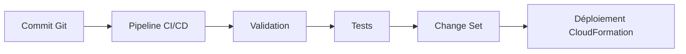
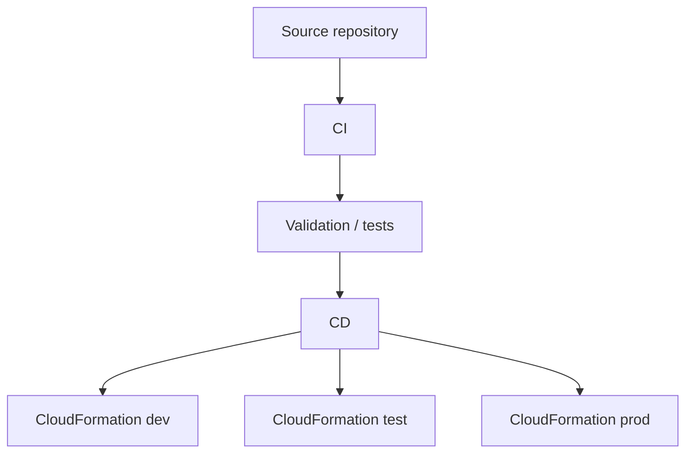
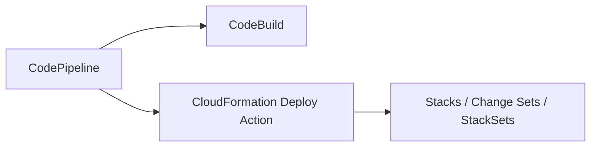
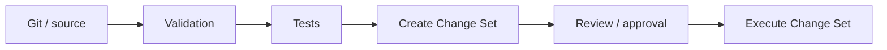
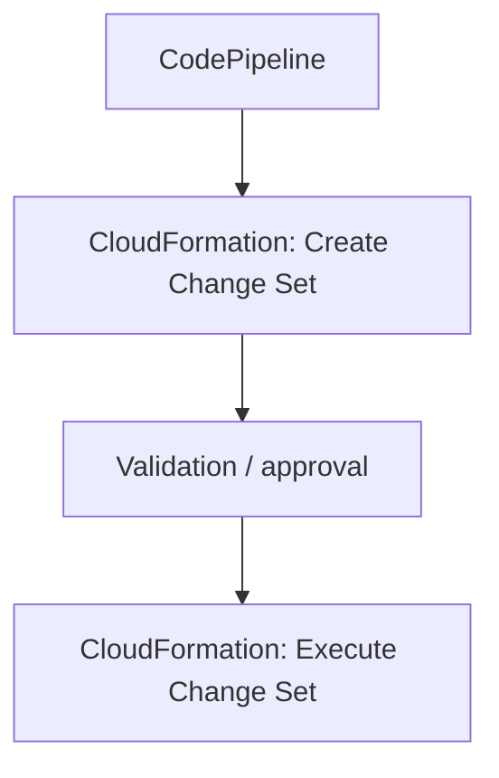
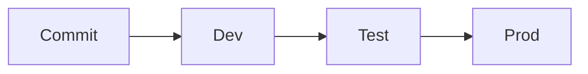
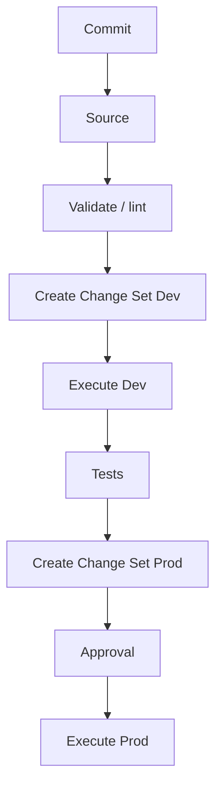
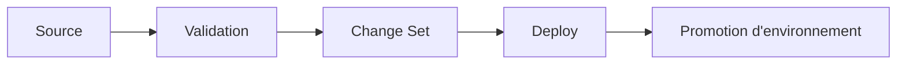

<a id="top"></a>

# AWS CloudFormation — Intégrer CloudFormation dans une logique CI/CD

## Table of Contents

| #  | Section                                                                                |
| -- | -------------------------------------------------------------------------------------- |
| 1  | [Pourquoi intégrer CloudFormation dans un pipeline CI/CD ?](#section-1)                |
| 2  | [Qu’est-ce qu’un pipeline CI/CD pour l’infrastructure ?](#section-2)                   |
| 3  | [Services AWS les plus utilisés pour ce scénario](#section-3)                          |
| 3a |    ↳ [CodePipeline](#section-3)                                                        |
| 3b |    ↳ [CodeBuild](#section-3)                                                           |
| 3c |    ↳ [CloudFormation comme étape de déploiement](#section-3)                           |
| 4  | [Architecture type d’un pipeline CloudFormation](#section-4)                           |
| 5  | [Étapes recommandées dans le pipeline](#section-5)                                     |
| 5a |    ↳ [Source](#section-5)                                                              |
| 5b |    ↳ [Validation / linting](#section-5)                                                |
| 5c |    ↳ [Tests](#section-5)                                                               |
| 5d |    ↳ [Change Set](#section-5)                                                          |
| 5e |    ↳ [Exécution vers dev / test / prod](#section-5)                                    |
| 6  | [CodePipeline + CloudFormation : le mode de déploiement le plus classique](#section-6) |
| 6a |    ↳ [Créer un change set dans le pipeline](#section-6)                                |
| 6b |    ↳ [Exécuter le change set après validation](#section-6)                             |
| 7  | [Séparer les environnements dans la chaîne CI/CD](#section-7)                          |
| 8  | [Sécurité dans le pipeline](#section-8)                                                |
| 8a |    ↳ [Ne pas mettre de secrets dans les templates](#section-8)                         |
| 8b |    ↳ [Utiliser un service role CloudFormation](#section-8)                             |
| 8c |    ↳ [Comptes séparés par environnement](#section-8)                                   |
| 9  | [Exemple de workflow professionnel](#section-9)                                        |
| 10 | [Exemple simple de `buildspec.yml` pour valider un template](#section-10)              |
| 11 | [Exemple conceptuel de pipeline CloudFormation](#section-11)                           |
| 12 | [Erreurs fréquentes chez les débutants](#section-12)                                   |
| 13 | [Résumé des commandes](#section-13)                                                    |
| 14 | [Conclusion](#section-14)                                                              |

---

<a id="section-1"></a>

<details>
<summary>1 - Pourquoi intégrer CloudFormation dans un pipeline CI/CD ?</summary>

<br/>

AWS recommande d’envisager des pipelines **CI/CD** pour l’infrastructure as code afin d’automatiser les tests et les déploiements des templates CloudFormation. AWS cite explicitement **CodePipeline**, **CodeBuild** et **CodeDeploy** comme outils possibles pour construire ces workflows, et renvoie aussi vers la documentation “Continuous delivery with CodePipeline” pour CloudFormation. ([AWS Documentation][1])

L’idée est simple : au lieu de modifier un template puis de lancer manuellement une mise à jour depuis la console, on déclenche une chaîne contrôlée qui valide le template, exécute les tests utiles, prépare un déploiement et ne pousse en environnement sensible que les changements acceptés. AWS décrit précisément CodePipeline comme un service qui modélise, visualise et automatise les étapes nécessaires à la publication logicielle et infrastructurelle. ([AWS Documentation][2])



<details>
<summary>Analogie simple pour comprendre</summary>
<br/>

Le CI/CD, c'est comme une **chaîne de montage automatisée** dans une usine. Le développeur pousse du code (il dépose la pièce sur le tapis roulant), et la machine se charge de tester, valider et déployer toute seule. Plus besoin de porter chaque pièce à la main d'un poste à l'autre : tout est automatisé, contrôlé et reproductible. Si une pièce est défectueuse, la chaîne s'arrête avant qu'elle n'arrive en production.

</details>

</details>

<p align="right"><a href="#top">↑ Back to top</a></p>

---

<a id="section-2"></a>

<details>
<summary>2 - Qu’est-ce qu’un pipeline CI/CD pour l’infrastructure ?</summary>

<br/>

Dans un contexte CloudFormation, un pipeline CI/CD est une chaîne qui traite les **templates** comme du code : le pipeline récupère la source depuis un dépôt, exécute des contrôles, puis déploie les changements vers une ou plusieurs stacks AWS. AWS explique qu’avec CloudFormation et CodePipeline, on peut automatiser la construction, les tests et la promotion des changements d’infrastructure avant publication vers la production. ([AWS Documentation][2])

En d’autres termes, au lieu de cliquer manuellement sur “Update stack”, on fait passer le template dans un processus reproductible, traçable et revu. C’est exactement le principe de l’Infrastructure as Code combinée à la CI/CD que met en avant AWS dans ses bonnes pratiques. ([AWS Documentation][1])



</details>

<p align="right"><a href="#top">↑ Back to top</a></p>

---

<a id="section-3"></a>

<details>
<summary>3 - Services AWS les plus utilisés pour ce scénario</summary>

<br/>

AWS recommande notamment **CodePipeline** pour orchestrer la chaîne et **CodeBuild** pour lancer des phases de validation ou de test dans un job contrôlé. CloudFormation peut ensuite être utilisé comme **action de déploiement** à l’intérieur du pipeline. ([AWS Documentation][1])

---

### CodePipeline

AWS présente CodePipeline comme le service qui modélise visuellement et automatise les étapes d’un pipeline, avec des stages et des actions. Il prend aussi explicitement en charge des actions de déploiement CloudFormation. ([AWS Documentation][3])

---

### CodeBuild

AWS cite CodeBuild parmi les services à utiliser pour automatiser les workflows CI/CD autour des templates CloudFormation. Dans une pratique courante, CodeBuild sert à faire du linting, de la validation, ou des tests avant le déploiement. ([AWS Documentation][1])

---

### CloudFormation comme étape de déploiement

AWS documente une **CloudFormation deploy action** dans CodePipeline, ainsi que les actions possibles comme la création ou l’exécution de change sets. AWS mentionne aussi que CodePipeline peut effectuer des opérations CloudFormation StackSets dans un processus CI/CD. ([AWS Documentation][3])



</details>

<p align="right"><a href="#top">↑ Back to top</a></p>

---

<a id="section-4"></a>

<details>
<summary>4 - Architecture type d’un pipeline CloudFormation</summary>

<br/>

L’architecture la plus simple et la plus classique suit cette logique :

* un dépôt source
* un stage de validation
* un stage de test
* un stage CloudFormation pour créer un change set
* un stage CloudFormation pour exécuter ce change set
* éventuellement une promotion vers des environnements successifs

AWS décrit précisément l’usage de CodePipeline avec CloudFormation pour construire un workflow de livraison continue des templates, y compris dans un walkthrough qui automatise les actions CloudFormation pour des stacks de test et de production. ([AWS Documentation][2])



---

### Variante multi-environnements

AWS recommande aussi, dans ses bonnes pratiques CI/CD, de créer des environnements distincts, voire des **comptes séparés par environnement**, afin de mieux isoler dev, test et prod. ([AWS Documentation][4])

</details>

<p align="right"><a href="#top">↑ Back to top</a></p>

---

<a id="section-5"></a>

<details>
<summary>5 - Étapes recommandées dans le pipeline</summary>

<br/>

AWS recommande de traiter les templates comme du code et de raccourcir la boucle de feedback. Dans cette logique, un pipeline CloudFormation professionnel contient souvent les étapes suivantes : **source**, **validation**, **tests**, **change set**, puis **déploiement**. ([AWS Documentation][1])

---

### Source

Le pipeline démarre à partir d’un dépôt source. AWS documente des exemples avec CodeCommit, mais indique aussi que CodePipeline peut intégrer des fournisseurs tiers comme GitHub ou Jenkins selon les cas. ([AWS Documentation][5])

---

### Validation / linting

AWS recommande explicitement le linting et les tests précoces pour les templates CloudFormation. Cette étape se fait souvent dans CodeBuild avec `validate-template` et éventuellement d’autres vérifications. ([AWS Documentation][1])

---

### Tests

Selon le niveau de maturité, on peut ajouter des tests sur les templates, ou des vérifications fonctionnelles sur une stack déployée en environnement de test. AWS indique que la livraison continue avec CodePipeline permet justement de construire et tester les changements avant promotion vers la production. ([AWS Documentation][2])

---

### Change Set

AWS recommande de créer des **change sets** avant les mises à jour, et la CloudFormation deploy action de CodePipeline prend justement en charge cette logique. ([AWS Documentation][1])

---

### Exécution vers dev / test / prod

Une fois le change set validé, il peut être exécuté vers l’environnement cible. AWS documente aussi des walkthroughs de pipelines qui automatisent des stacks de test puis de production. ([AWS Documentation][6])

</details>

<p align="right"><a href="#top">↑ Back to top</a></p>

---

<a id="section-6"></a>

<details>
<summary>6 - CodePipeline + CloudFormation : le mode de déploiement le plus classique</summary>

<br/>

AWS documente **CodePipeline** comme l’un des moyens les plus directs pour orchestrer des déploiements CloudFormation. Dans cette approche, on utilise souvent deux actions CloudFormation dans le pipeline :

1. créer un **change set**
2. exécuter ce **change set**

AWS mentionne explicitement que CodePipeline peut effectuer des actions comme créer, exécuter ou supprimer des change sets via les déploiements CloudFormation. ([AWS Documentation][3])

---

### Créer un change set dans le pipeline

Cette étape sert à produire un aperçu contrôlé des changements à venir, ce qui est cohérent avec les bonnes pratiques CloudFormation d’AWS. ([AWS Documentation][1])

---

### Exécuter le change set après validation

Cette seconde étape permet de garder une séparation claire entre :

* la préparation du changement
* l’application effective du changement

AWS documente cette logique dans la page “Continuous delivery with CodePipeline” et dans la référence des actions CloudFormation de CodePipeline. ([AWS Documentation][2])



<details>
<summary>Analogie simple pour comprendre</summary>
<br/>

CodePipeline, c'est comme un **tapis roulant d'usine**. Le template CloudFormation est posé sur le tapis et passe automatiquement par chaque poste : d'abord on le récupère (Source), puis on le vérifie (Validation), et enfin on le met en place (Déploiement). Chaque étape est un poste de travail sur le tapis roulant, et si une étape échoue, la pièce n'avance pas.

</details>

</details>

<p align="right"><a href="#top">↑ Back to top</a></p>

---

<a id="section-7"></a>

<details>
<summary>7 - Séparer les environnements dans la chaîne CI/CD</summary>

<br/>

AWS recommande de garder des environnements synchronisés mais distincts, et va jusqu’à recommander des **comptes séparés par environnement** dans les bonnes pratiques CI/CD, afin de simplifier la sécurité et l’isolation. ([AWS Documentation][4])

---

### Pourquoi c’est utile

Cette séparation permet :

* de tester sans toucher la prod
* d’appliquer des permissions plus strictes sur la prod
* de garder une meilleure traçabilité
* de limiter les erreurs de déploiement inter-environnements

AWS met en avant la sécurisation de l’environnement de production et la séparation des comptes comme bonnes pratiques pour les pipelines CI/CD. ([AWS Documentation][4])



---

### Variante simple pour un cours

Dans une série pédagogique, on peut commencer par :

* un pipeline vers **dev**
* puis une variante avec promotion vers **test**
* enfin une étape contrôlée vers **prod**

AWS documente justement des pipelines CloudFormation pour des stacks de test et de production dans son walkthrough de base. ([AWS Documentation][6])

</details>

<p align="right"><a href="#top">↑ Back to top</a></p>

---

<a id="section-8"></a>

<details>
<summary>8 - Sécurité dans le pipeline</summary>

<br/>

AWS rappelle dans ses bonnes pratiques de sécurité CloudFormation qu’il faut utiliser IAM pour contrôler l’accès, ne pas intégrer de credentials dans les templates, et journaliser les appels CloudFormation avec CloudTrail. ([AWS Documentation][7])

---

### Ne pas mettre de secrets dans les templates

AWS recommande explicitement de **ne pas embarquer de credentials** dans les templates. C’est particulièrement important dans un pipeline, car le template voyage alors dans plusieurs étapes automatisées. ([AWS Documentation][7])

---

### Utiliser un service role CloudFormation

Dans les bonnes pratiques CI/CD AWS, il est indiqué que lorsqu’on déploie de l’IaC via CloudFormation, l’utilisateur humain ou le pipeline a besoin de permissions limitées, et que la majorité des permissions peut être portée par le **service role CloudFormation**. ([AWS Documentation][4])

---

### Comptes séparés par environnement

AWS recommande également de sécuriser la production et de limiter l’accès console et programmatique, précisément parce qu’avec l’IaC presque tout peut être fait par pipeline. Cela renforce l’intérêt d’un modèle “peu d’accès directs, plus d’automatisation contrôlée”. ([AWS Documentation][4])

</details>

<p align="right"><a href="#top">↑ Back to top</a></p>

---

<a id="section-9"></a>

<details>
<summary>9 - Exemple de workflow professionnel</summary>

<br/>

Voici un workflow simple, réaliste et aligné avec les recommandations AWS :

1. commit sur la branche principale ou de release
2. CodePipeline récupère la source
3. CodeBuild lance les validations
4. CloudFormation crée un change set en dev
5. le pipeline exécute le change set
6. tests éventuels sur l’environnement dev
7. promotion vers test
8. approbation manuelle avant prod si nécessaire
9. exécution du change set prod

AWS documente à la fois la livraison continue avec CodePipeline pour CloudFormation et les bonnes pratiques de pipelines CI/CD sécurisés. ([AWS Documentation][2])



</details>

<p align="right"><a href="#top">↑ Back to top</a></p>

---

<a id="section-10"></a>

<details>
<summary>10 - Exemple simple de <code>buildspec.yml</code> pour valider un template</summary>

<br/>

Dans un projet simple, CodeBuild peut servir à valider un template CloudFormation avant qu’il soit proposé au déploiement. AWS recommande le linting et les tests précoces pour raccourcir la boucle de feedback sur les templates. ([AWS Documentation][1])

```yaml id="g3l7m6"
version: 0.2

phases:
  install:
    commands:
      - echo "Installation des outils"
  build:
    commands:
      - echo "Validation du template CloudFormation"
      - aws cloudformation validate-template --template-body file://template.yaml
artifacts:
  files:
    - template.yaml
```

---

### Ce que fait ce fichier

* lance une validation CloudFormation
* échoue immédiatement si le template n’est pas valide
* produit l’artefact à réutiliser dans l’étape suivante

AWS documente la commande `validate-template` comme outil CLI de validation syntaxique des templates. ([AWS Documentation][1])

</details>

<p align="right"><a href="#top">↑ Back to top</a></p>

---

<a id="section-11"></a>

<details>
<summary>11 - Exemple conceptuel de pipeline CloudFormation</summary>

<br/>

Voici une version conceptuelle très simple d’un pipeline centré sur l’infrastructure :

```text id="8r9a10"
Stage 1 - Source
  - dépôt Git / CodeCommit / autre source

Stage 2 - Validation
  - validate-template
  - linting éventuel

Stage 3 - Preview
  - create change set

Stage 4 - Deploy
  - execute change set

Stage 5 - Promotion
  - test -> prod
```

AWS documente ce type de logique dans “Continuous delivery with CodePipeline”, ainsi que dans ses tutoriels CodePipeline et CloudFormation. ([AWS Documentation][2])

---

### Variante avancée

AWS documente aussi des cas plus avancés comme :

* déploiement avec **StackSets** dans plusieurs comptes/régions
* pipelines standardisés avec des accélérateurs DevOps
* intégration avec des systèmes tiers

([AWS Documentation][8])

</details>

<p align="right"><a href="#top">↑ Back to top</a></p>

---

<a id="section-12"></a>

<details>
<summary>12 - Erreurs fréquentes chez les débutants</summary>

<br/>

### 1. Déployer directement en production sans étape de validation

AWS recommande explicitement d’automatiser les tests et validations des templates avant promotion vers la production. ([AWS Documentation][1])

### 2. Oublier les change sets

AWS recommande de créer des change sets pour comprendre l’impact d’une mise à jour avant de l’appliquer. ([AWS Documentation][1])

### 3. Donner trop de permissions au pipeline

Les bonnes pratiques AWS CI/CD indiquent qu’il vaut mieux limiter les permissions du pipeline et laisser CloudFormation utiliser un service role dédié pour les actions réelles de déploiement. ([AWS Documentation][4])

### 4. Mélanger dev, test et prod sans isolation

AWS recommande des environnements distincts, idéalement des comptes séparés, pour garder une bonne isolation et une sécurité propre à chaque niveau. ([AWS Documentation][4])

### 5. Mettre des secrets dans le dépôt ou dans le template

AWS déconseille explicitement d’embarquer des credentials dans les templates CloudFormation. ([AWS Documentation][7])

<details>
<summary>En résumé très simple</summary>
<br/>

- **Toujours** mettre le template dans Git (versionné, traçable).
- **Toujours** faire un change set avant de déployer en prod (pour voir les changements avant de les appliquer).
- **Toujours** séparer les environnements (dev, test, prod ne doivent jamais se mélanger).

</details>

</details>

<p align="right"><a href="#top">↑ Back to top</a></p>

---

<a id="section-13"></a>

<details>
<summary>13 - Résumé des commandes</summary>

<br/>

```bash id="eg0u4t"
# Valider un template avant pipeline
aws cloudformation validate-template \
  --template-body file://template.yaml

# Créer un change set
aws cloudformation create-change-set \
  --stack-name mon-projet \
  --change-set-name pipeline-preview \
  --template-body file://template.yaml

# Décrire le change set
aws cloudformation describe-change-set \
  --stack-name mon-projet \
  --change-set-name pipeline-preview

# Exécuter le change set
aws cloudformation execute-change-set \
  --stack-name mon-projet \
  --change-set-name pipeline-preview
```

Ces commandes correspondent aux opérations CloudFormation de base qu’un pipeline peut automatiser, en particulier autour de la validation et des change sets. AWS documente `validate-template` dans la CLI officielle et l’usage des change sets dans la documentation CloudFormation. ([AWS Documentation][1])

</details>

<p align="right"><a href="#top">↑ Back to top</a></p>

---

<a id="section-14"></a>

<details>
<summary>14 - Conclusion</summary>

<br/>

Dans ce chapitre, on a vu comment intégrer CloudFormation dans une logique CI/CD grâce à :

* **CodePipeline** pour orchestrer
* **CodeBuild** pour valider et tester
* **CloudFormation deploy actions** pour créer et exécuter des change sets
* une séparation claire des environnements
* des pratiques de sécurité cohérentes avec l’IaC

AWS recommande explicitement cette approche pour automatiser la livraison continue de l’infrastructure et rendre les déploiements plus rapides, plus fiables et plus traçables. ([AWS Documentation][1])



### Suite logique

Il reste maintenant les deux derniers grands blocs de la série :

* **chapitre 14 : CloudFormation vs AWS SAM vs AWS CDK**
* **chapitre 15 : projet final complet**


[1]: https://docs.aws.amazon.com/AWSCloudFormation/latest/UserGuide/best-practices.html?utm_source=chatgpt.com "CloudFormation best practices"
[2]: https://docs.aws.amazon.com/AWSCloudFormation/latest/UserGuide/continuous-delivery-codepipeline.html?utm_source=chatgpt.com "Continuous delivery with CodePipeline"
[3]: https://docs.aws.amazon.com/codepipeline/latest/userguide/action-reference-CloudFormation.html?utm_source=chatgpt.com "CloudFormation deploy action reference"
[4]: https://docs.aws.amazon.com/prescriptive-guidance/latest/strategy-cicd-litmus/cicd-best-practices.html?utm_source=chatgpt.com "Best practices for CI/CD pipelines"
[5]: https://docs.aws.amazon.com/codepipeline/latest/userguide/tutorials-cloudformation-codecommit.html?utm_source=chatgpt.com "Example 1: Create an AWS CodeCommit pipeline with AWS ..."
[6]: https://docs.aws.amazon.com/AWSCloudFormation/latest/UserGuide/continuous-delivery-codepipeline-basic-walkthrough.html?utm_source=chatgpt.com "Walkthrough: Building a pipeline for test and production stacks"
[7]: https://docs.aws.amazon.com/AWSCloudFormation/latest/UserGuide/security-best-practices.html?utm_source=chatgpt.com "Security best practices for CloudFormation"
[8]: https://docs.aws.amazon.com/codepipeline/latest/userguide/action-reference-StackSets.html?utm_source=chatgpt.com "CloudFormation StackSets deploy action reference"
