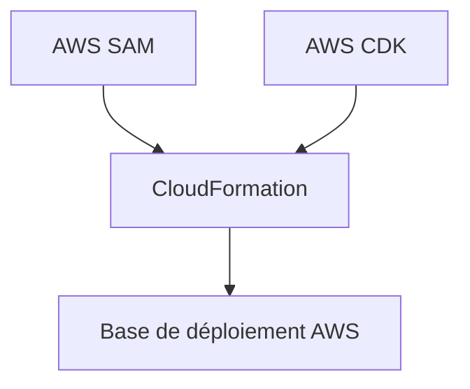
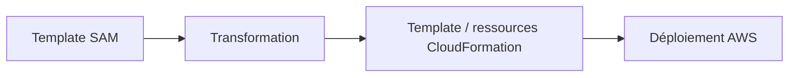
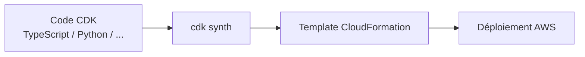
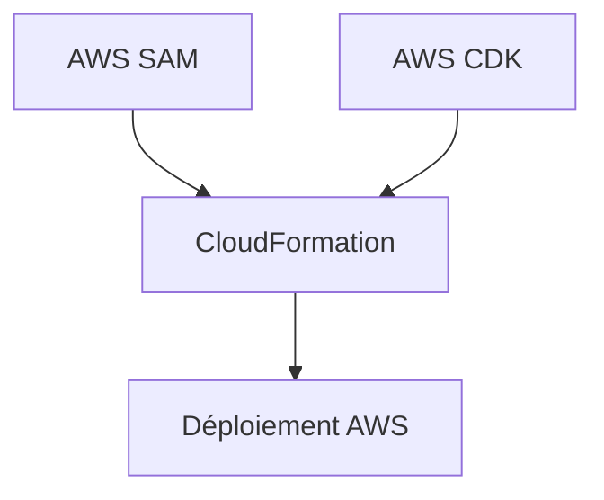
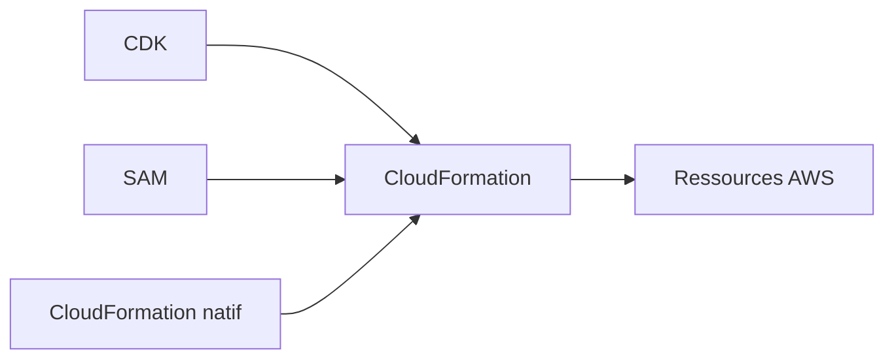
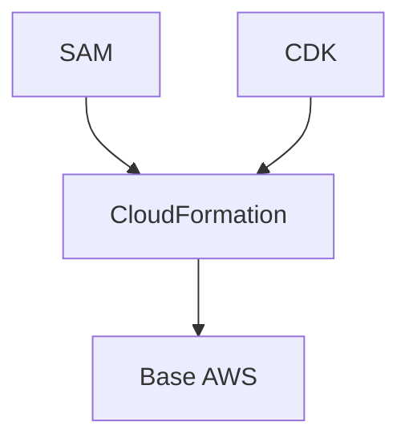

<a id="top"></a>

# AWS CloudFormation — CloudFormation vs AWS SAM vs AWS CDK

## Table of Contents

| #  | Section                                                               |
| -- | --------------------------------------------------------------------- |
| 1  | [Pourquoi comparer CloudFormation, SAM et CDK ?](#section-1)          |
| 2  | [CloudFormation — la base native](#section-2)                         |
| 2a |    ↳ [Ce que CloudFormation fait très bien](#section-2)               |
| 2b |    ↳ [Ses limites quand les projets grossissent](#section-2)          |
| 3  | [AWS SAM — le raccourci orienté serverless](#section-3)               |
| 3a |    ↳ [Ce que SAM ajoute par rapport à CloudFormation](#section-3)     |
| 3b |    ↳ [Pourquoi SAM reste lié à CloudFormation](#section-3)            |
| 4  | [AWS CDK — l’approche “infrastructure en vrai code”](#section-4)      |
| 4a |    ↳ [Constructs, stacks et synthèse](#section-4)                     |
| 4b |    ↳ [Pourquoi CDK reste lui aussi lié à CloudFormation](#section-4)  |
| 5  | [Relation entre les trois outils](#section-5)                         |
| 6  | [Comparaison simple : syntaxe, public cible, cas d’usage](#section-6) |
| 7  | [Quand choisir CloudFormation ?](#section-7)                          |
| 8  | [Quand choisir AWS SAM ?](#section-8)                                 |
| 9  | [Quand choisir AWS CDK ?](#section-9)                                 |
| 10 | [Peut-on combiner ces outils ?](#section-10)                          |
| 11 | [Exemples de workflow selon le type de projet](#section-11)           |
| 12 | [Erreurs fréquentes chez les débutants](#section-12)                  |
| 13 | [Résumé des commandes](#section-13)                                   |
| 14 | [Conclusion](#section-14)                                             |

---

<a id="section-1"></a>

<details>
<summary>1 - Pourquoi comparer CloudFormation, SAM et CDK ?</summary>

<br/>

Quand on apprend l’Infrastructure as Code sur AWS, on croise très vite trois noms : **CloudFormation**, **AWS SAM** et **AWS CDK**. Ils ne sont pas concurrents au sens strict. En réalité, **CloudFormation est la base**, **SAM est une couche orientée serverless**, et **CDK est un framework de développement qui génère des templates CloudFormation**. AWS décrit CloudFormation comme le service qui permet de modéliser et provisionner des ressources AWS à partir de templates, SAM comme un framework open source pour les applications serverless avec une syntaxe raccourcie, et CDK comme un framework de développement qui définit l’infrastructure en code et la provisionne via CloudFormation. ([AWS Documentation][1])



---

### Idée centrale

Le bon outil dépend surtout de la nature du projet :

* infrastructure AWS “classique” et très explicite
* application serverless
* projet d’ingénierie où l’on veut coder l’infrastructure avec des langages généralistes

AWS présente justement ces outils avec des positionnements différents dans leurs documentations respectives. ([AWS Documentation][1])

</details>

<p align="right"><a href="#top">↑ Back to top</a></p>

---

<a id="section-2"></a>

<details>
<summary>2 - CloudFormation — la base native</summary>

<br/>

CloudFormation est le service natif AWS de provisioning déclaratif. AWS explique qu’on décrit les ressources une fois dans un template, puis qu’on peut les reprovisionner de manière cohérente et répétable dans plusieurs régions et environnements. AWS rappelle aussi qu’une stack est un ensemble de ressources géré comme une seule unité. ([AWS Documentation][1])

---

### Ce que CloudFormation fait très bien

CloudFormation est particulièrement fort pour :

* décrire explicitement les ressources AWS
* garder un modèle déclaratif clair
* gérer les stacks comme une unité
* s’intégrer naturellement avec change sets, drift detection, nested stacks et exports/imports

AWS documente aussi les bonnes pratiques de réutilisation des templates via `Parameters`, `Mappings` et `Conditions`, ainsi que le découpage en nested stacks et modules pour les gros projets. ([AWS Documentation][2])

---

### Ses limites quand les projets grossissent

Quand les templates deviennent volumineux, la lisibilité et la réutilisation peuvent devenir plus difficiles. AWS rappelle d’ailleurs des quotas comme la limite de **500 ressources déclarées par template**, et recommande alors de séparer l’infrastructure en plusieurs templates, notamment via des nested stacks. ([AWS Documentation][3])

<details>
<summary>Analogie simple pour comprendre</summary>
<br/>

Imaginez trois façons de construire un meuble :
- **CloudFormation** = construire un meuble en lisant le plan IKEA pas à pas. Vous voyez chaque vis, chaque planche, tout est explicite.
- **SAM** = construire un meuble avec un kit pré-assemblé pour le serverless. Certaines pièces sont déjà montées, vous allez plus vite sur les cas courants.
- **CDK** = dessiner le plan avec un vrai logiciel d'architecte, puis le logiciel génère le plan IKEA pour vous. Plus puissant, mais il faut savoir coder.

</details>

</details>

<p align="right"><a href="#top">↑ Back to top</a></p>

---

<a id="section-3"></a>

<details>
<summary>3 - AWS SAM — le raccourci orienté serverless</summary>

<br/>

AWS SAM, pour **AWS Serverless Application Model**, est décrit par AWS comme un framework open source pour construire des applications serverless en Infrastructure as Code. AWS précise que SAM fournit une **syntaxe raccourcie** qui permet de déclarer des ressources CloudFormation et des ressources serverless spécialisées, puis de les transformer en infrastructure au moment du déploiement. ([AWS Documentation][4])

---

### Ce que SAM ajoute par rapport à CloudFormation

SAM simplifie surtout la vie quand on construit des applications serverless, par exemple autour de :

* fonctions Lambda
* API
* événements
* couches serverless
* packaging et tests locaux via la SAM CLI

AWS documente SAM précisément comme un framework spécialisé pour ce type d’architecture. ([AWS Documentation][4])

---

### Pourquoi SAM reste lié à CloudFormation

Même si SAM propose une syntaxe plus simple, AWS indique clairement qu’il s’appuie sur CloudFormation : les ressources SAM sont transformées en ressources d’infrastructure lors du déploiement. Autrement dit, SAM n’est pas “à côté” de CloudFormation ; il est **au-dessus** de CloudFormation pour le cas serverless. ([AWS Documentation][4])



</details>

<p align="right"><a href="#top">↑ Back to top</a></p>

---

<a id="section-4"></a>

<details>
<summary>4 - AWS CDK — l’approche “infrastructure en vrai code”</summary>

<br/>

AWS CDK, pour **AWS Cloud Development Kit**, est présenté par AWS comme un framework open source pour définir l’infrastructure cloud **dans un langage de programmation**, puis la provisionner via AWS CloudFormation. AWS décrit les **constructs** comme des modules réutilisables et composables, et rappelle que l’outil principal côté CLI est `cdk`, qui synthétise ensuite des templates CloudFormation. ([AWS Documentation][5])

---

### Constructs, stacks et synthèse

Dans CDK, on modélise l’infrastructure avec des constructs, on la regroupe dans des stacks, puis on exécute `cdk synth`. AWS précise que `cdk synth` produit une **cloud assembly** qui inclut un template CloudFormation pour chaque stack, ainsi que les assets nécessaires. ([AWS Documentation][6])

---

### Pourquoi CDK reste lui aussi lié à CloudFormation

AWS dit explicitement que CDK est construit pour fonctionner avec CloudFormation. Le code CDK n’est donc pas le format de déploiement final : il sert à **générer** des templates CloudFormation. ([AWS Documentation][5])



</details>

<p align="right"><a href="#top">↑ Back to top</a></p>

---

<a id="section-5"></a>

<details>
<summary>5 - Relation entre les trois outils</summary>

<br/>

La relation la plus simple à retenir est la suivante :

* **CloudFormation** = moteur déclaratif de base
* **SAM** = couche spécialisée serverless au-dessus de CloudFormation
* **CDK** = framework de développement qui synthétise vers CloudFormation

AWS documente explicitement SAM comme une syntaxe raccourcie transformée en infrastructure, et CDK comme un framework qui provisionne via CloudFormation. ([AWS Documentation][4])



</details>

<p align="right"><a href="#top">↑ Back to top</a></p>

---

<a id="section-6"></a>

<details>
<summary>6 - Comparaison simple : syntaxe, public cible, cas d’usage</summary>

<br/>

| Outil          | Style                            | Public cible principal                                                                | Cas d’usage naturel              |
| -------------- | -------------------------------- | ------------------------------------------------------------------------------------- | -------------------------------- |
| CloudFormation | YAML / JSON déclaratif           | Ops, cloud engineers, architectes, équipes voulant un contrôle explicite              | Infrastructure AWS générale      |
| AWS SAM        | YAML orienté serverless          | Développeurs serverless, équipes Lambda / API                                         | Applications serverless          |
| AWS CDK        | Code dans un langage généraliste | Développeurs, plateformes internes, équipes qui veulent abstractions et réutilisation | Infra complexe ou industrialisée |

Cette lecture est cohérente avec la manière dont AWS présente chacun de ces outils dans sa documentation officielle. CloudFormation est présenté comme le socle déclaratif, SAM comme le framework serverless, et CDK comme le framework de développement avec constructs et synthèse CloudFormation. ([AWS Documentation][1])

<details>
<summary>En résumé très simple</summary>
<br/>

- **CloudFormation** = YAML brut, tout à la main. Vous écrivez chaque ressource vous-même.
- **SAM** = raccourci pour Lambda / API Gateway. Moins de YAML, plus rapide pour le serverless.
- **CDK** = coder en Python / TypeScript au lieu de YAML. L'infra devient un vrai programme.

</details>

</details>

<p align="right"><a href="#top">↑ Back to top</a></p>

---

<a id="section-7"></a>

<details>
<summary>7 - Quand choisir CloudFormation ?</summary>

<br/>

CloudFormation est un très bon choix quand vous voulez :

* un modèle déclaratif direct et explicite
* une forte transparence sur les ressources créées
* un alignement natif avec les stacks AWS
* exploiter directement nested stacks, modules, exports/imports et change sets

AWS documente ces mécanismes comme des fonctionnalités natives du service CloudFormation. ([AWS Documentation][7])

---

### Cas typiques

* infrastructures AWS “classiques”
* projets pédagogiques pour apprendre les ressources
* environnements où l’on veut lire directement le template final
* équipes qui préfèrent YAML/JSON et une logique très explicite

AWS insiste aussi sur la réutilisation des templates dans plusieurs environnements via paramètres, mappings et conditions. ([AWS Documentation][2])

</details>

<p align="right"><a href="#top">↑ Back to top</a></p>

---

<a id="section-8"></a>

<details>
<summary>8 - Quand choisir AWS SAM ?</summary>

<br/>

SAM est particulièrement adapté quand l’essentiel du projet est **serverless**. AWS présente SAM comme un framework conçu pour les applications serverless avec une syntaxe spécialisée et des outils CLI pour le build et certains tests locaux. ([AWS Documentation][4])

---

### Cas typiques

* Lambda + API Gateway
* architectures événementielles simples
* projets où l’on veut aller vite sur les briques serverless
* équipes qui veulent rester en YAML mais éviter trop de verbosité

AWS montre aussi que la SAM CLI peut être utilisée avec des applications CDK synthétisées, ce qui confirme son rôle fort dans l’écosystème serverless AWS. ([AWS Documentation][8])

</details>

<p align="right"><a href="#top">↑ Back to top</a></p>

---

<a id="section-9"></a>

<details>
<summary>9 - Quand choisir AWS CDK ?</summary>

<br/>

CDK devient très intéressant quand vous voulez traiter l’infrastructure comme un vrai projet logiciel : **abstractions**, **réutilisation**, **constructs**, **tests**, **langages généralistes**. AWS met justement en avant les constructs réutilisables et les pratiques de test pour les applications CDK. ([AWS Documentation][9])

---

### Cas typiques

* plateformes internes
* gros projets d’infrastructure
* équipes de développement à l’aise avec TypeScript, Python, Java ou C#
* besoin de factoriser beaucoup de motifs d’infrastructure

AWS précise aussi que les assets nécessaires au déploiement sont préparés dans la cloud assembly et publiés avant le déploiement effectif, ce qui est utile pour les projets plus riches en artefacts. ([AWS Documentation][10])

</details>

<p align="right"><a href="#top">↑ Back to top</a></p>

---

<a id="section-10"></a>

<details>
<summary>10 - Peut-on combiner ces outils ?</summary>

<br/>

Oui. Dans l’écosystème AWS, ces outils peuvent se compléter. AWS documente par exemple le fait qu’on peut utiliser la **SAM CLI pour construire et tester localement des applications CDK**, à condition d’abord de synthétiser le projet CDK vers CloudFormation avec `cdk synth`. ([AWS Documentation][8])

---

### Exemple de combinaison

* CloudFormation pour des briques très explicites ou partagées
* SAM pour le sous-ensemble serverless
* CDK pour l’orchestration plus riche et la réutilisation logicielle

Cette combinaison reste cohérente parce que CloudFormation demeure le format de déploiement sous-jacent pour SAM et CDK dans les scénarios documentés par AWS. ([AWS Documentation][4])



</details>

<p align="right"><a href="#top">↑ Back to top</a></p>

---

<a id="section-11"></a>

<details>
<summary>11 - Exemples de workflow selon le type de projet</summary>

<br/>

### Projet infrastructure AWS généraliste

Choix naturel : **CloudFormation**.
Raison : visibilité directe sur les ressources, stacks, nested stacks et exports/imports. ([AWS Documentation][7])

### Projet Lambda / API / serverless pur

Choix naturel : **SAM**.
Raison : syntaxe raccourcie spécialisée pour le serverless et outillage SAM CLI. ([AWS Documentation][4])

### Projet plateforme ou grande infra réutilisable

Choix naturel : **CDK**.
Raison : constructs réutilisables, code généraliste, synthèse en templates CloudFormation. ([AWS Documentation][5])

### Projet hybride

Choix possible : **CDK + SAM** ou **CloudFormation + SAM**, selon l’équipe et le périmètre.
Raison : AWS documente la compatibilité pratique entre CDK et SAM CLI pour certains workflows locaux. ([AWS Documentation][8])

</details>

<p align="right"><a href="#top">↑ Back to top</a></p>

---

<a id="section-12"></a>

<details>
<summary>12 - Erreurs fréquentes chez les débutants</summary>

<br/>

### 1. Penser que SAM remplace CloudFormation

AWS indique au contraire que SAM transforme sa syntaxe en infrastructure déployée, donc il reste adossé à CloudFormation. ([AWS Documentation][4])

### 2. Penser que CDK déploie “sans CloudFormation”

AWS dit explicitement que CDK définit l’infrastructure en code et la provisionne **via CloudFormation**, et que `cdk synth` produit des templates CloudFormation. ([AWS Documentation][5])

### 3. Choisir CDK juste pour “faire moderne” sur un petit template simple

Pour un cas très direct, CloudFormation peut rester plus lisible et suffisant, surtout si l’on veut lire immédiatement le template final. Cela découle naturellement du positionnement AWS des trois outils, même si le choix dépend du contexte. ([AWS Documentation][1])

### 4. Utiliser SAM pour des projets non serverless très généraux

SAM est clairement présenté par AWS comme un framework **serverless**. Il n’est donc pas le choix le plus naturel pour de l’infrastructure AWS généraliste. ([AWS Documentation][4])

### 5. Oublier que CloudFormation reste la couche finale la plus importante à comprendre

Même avec SAM ou CDK, comprendre les stacks CloudFormation reste précieux, car c’est le moteur de provisioning sur lequel ces outils s’appuient dans les cas documentés par AWS. ([AWS Documentation][5])

</details>

<p align="right"><a href="#top">↑ Back to top</a></p>

---

<a id="section-13"></a>

<details>
<summary>13 - Résumé des commandes</summary>

<br/>

```bash id="jyslju"
# CloudFormation
aws cloudformation validate-template --template-body file://template.yaml

# SAM
sam validate
sam build

# CDK
cdk synth
cdk deploy
```

AWS documente `cdk synth` comme la commande qui produit une cloud assembly avec les templates CloudFormation, et documente SAM CLI comme l’outil de validation et de build pour les applications SAM. ([AWS Documentation][6])

</details>

<p align="right"><a href="#top">↑ Back to top</a></p>

---

<a id="section-14"></a>

<details>
<summary>14 - Conclusion</summary>

<br/>

La comparaison la plus juste est donc la suivante :

* **CloudFormation** : le socle déclaratif natif AWS
* **AWS SAM** : la surcouche serverless
* **AWS CDK** : la surcouche “code” avec constructs et synthèse

AWS documente ces trois outils de façon complémentaire, et non comme trois mondes séparés. Comprendre CloudFormation reste donc extrêmement utile, même si l’on choisit ensuite SAM ou CDK pour gagner en expressivité ou en productivité. ([AWS Documentation][1])



<details>
<summary>En résumé très simple</summary>
<br/>

- **Débutant ?** Commencez par CloudFormation. C'est la base, et tout le reste s'appuie dessus.
- **Projet serverless ?** SAM. C'est un raccourci taillé pour Lambda et API Gateway.
- **Grande équipe de développeurs ?** CDK. Vous codez l'infra dans un vrai langage (Python, TypeScript…).

</details>

</details>

[1]: https://docs.aws.amazon.com/AWSCloudFormation/latest/UserGuide/Welcome.html?utm_source=chatgpt.com "What is CloudFormation?"
[2]: https://docs.aws.amazon.com/AWSCloudFormation/latest/UserGuide/best-practices.html?utm_source=chatgpt.com "CloudFormation best practices"
[3]: https://docs.aws.amazon.com/AWSCloudFormation/latest/UserGuide/cloudformation-limits.html?utm_source=chatgpt.com "Understand CloudFormation quotas"
[4]: https://docs.aws.amazon.com/serverless-application-model/latest/developerguide/what-is-sam.html?utm_source=chatgpt.com "What is the AWS Serverless Application Model (AWS SAM)?"
[5]: https://docs.aws.amazon.com/cdk/v2/guide/home.html?utm_source=chatgpt.com "What is the AWS CDK? - AWS Cloud Development Kit ..."
[6]: https://docs.aws.amazon.com/cdk/v2/guide/ref-cli-cmd-synth.html?utm_source=chatgpt.com "cdk synthesize - AWS Cloud Development Kit (AWS CDK) v2"
[7]: https://docs.aws.amazon.com/AWSCloudFormation/latest/UserGuide/using-cfn-nested-stacks.html?utm_source=chatgpt.com "Split a template into reusable pieces using nested stacks"
[8]: https://docs.aws.amazon.com/cdk/v2/guide/testing-locally-build-with-sam-cli.html?utm_source=chatgpt.com "Building AWS CDK applications with AWS SAM"
[9]: https://docs.aws.amazon.com/cdk/v2/guide/best-practices.html?utm_source=chatgpt.com "Best practices for developing and deploying cloud ..."
[10]: https://docs.aws.amazon.com/cdk/v2/guide/assets.html?utm_source=chatgpt.com "Assets and the AWS CDK"
