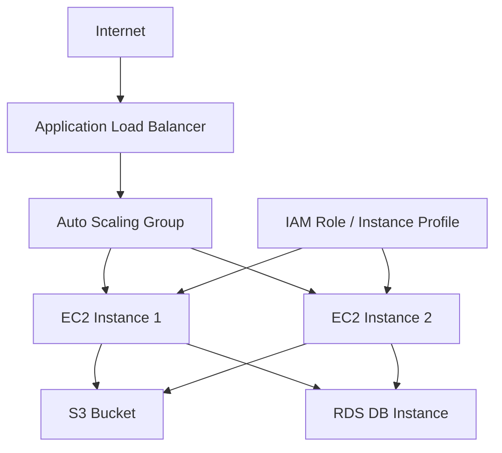
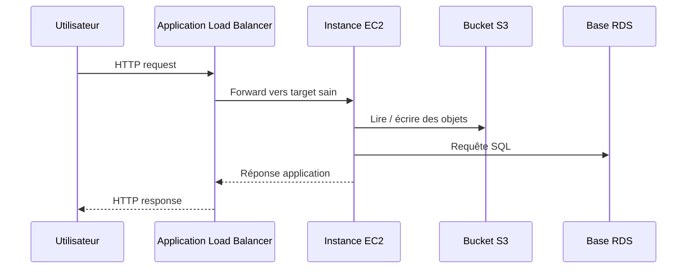
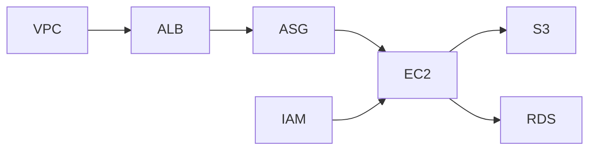

<a id="top"></a>

# AWS CloudFormation — Projet final complet : application web scalable avec VPC, ALB, Auto Scaling, IAM, S3 et RDS

## Table of Contents

| #  | Section                                                     |
| -- | ----------------------------------------------------------- |
| 1  | [Objectif du projet final](#section-1)                      |
| 2  | [Architecture cible](#section-2)                            |
| 3  | [Pourquoi cette architecture est pertinente](#section-3)    |
| 4  | [Composants du projet](#section-4)                          |
| 4a |    ↳ [Réseau](#section-4)                                   |
| 4b |    ↳ [Calcul et scalabilité](#section-4)                    |
| 4c |    ↳ [Données](#section-4)                                  |
| 4d |    ↳ [Sécurité et permissions](#section-4)                  |
| 5  | [Flux de trafic de bout en bout](#section-5)                |
| 6  | [Découpage logique du template](#section-6)                 |
| 7  | [Template final complet](#section-7)                        |
| 8  | [Lecture guidée du projet](#section-8)                      |
| 8a |    ↳ [VPC, subnets et routage](#section-8)                  |
| 8b |    ↳ [ALB, Target Group et Listener](#section-8)            |
| 8c |    ↳ [Launch Template et Auto Scaling Group](#section-8)    |
| 8d |    ↳ [Rôle IAM et accès S3](#section-8)                     |
| 8e |    ↳ [RDS et DB subnet group](#section-8)                   |
| 8f |    ↳ [Outputs utiles](#section-8)                           |
| 9  | [Étapes de déploiement](#section-9)                         |
| 10 | [Vérifications après déploiement](#section-10)              |
| 11 | [Améliorations possibles pour aller plus loin](#section-11) |
| 12 | [Erreurs fréquentes sur ce projet final](#section-12)       |
| 13 | [Résumé des commandes](#section-13)                         |
| 14 | [Conclusion](#section-14)                                   |

---

<a id="section-1"></a>

<details>
<summary>1 - Objectif du projet final</summary>

<br/>

Dans ce projet final, l’objectif est d’assembler les briques les plus importantes vues dans la série dans une architecture cohérente, réaliste et déployable avec CloudFormation : un **VPC**, des **subnets publics et privés**, un **Application Load Balancer**, un **Auto Scaling Group** basé sur un **Launch Template**, un **bucket S3**, un **rôle IAM** pour les instances et une **base RDS** dans un **DB subnet group**. Toutes ces briques sont supportées nativement par CloudFormation, et AWS documente chacune d’elles comme ressource officielle dans la Template Reference. ([AWS Documentation][1])

Ce chapitre joue donc le rôle de synthèse : il ne s’agit plus d’apprendre une seule ressource isolément, mais de comprendre comment les relier proprement dans une architecture d’application web scalable. AWS présente justement CloudFormation comme un service permettant de modéliser et déployer un ensemble de ressources AWS de manière reproductible. ([AWS Documentation][2])

<details>
<summary>Analogie simple pour comprendre</summary>
<br/>

Ce projet final, c'est comme construire un **petit centre commercial** : un terrain clôturé (VPC), des magasins (EC2), un parking avec des places qui s'adaptent au nombre de clients (Auto Scaling), un accueil qui oriente les visiteurs vers le bon magasin (ALB), un gardien qui vérifie les badges (IAM), un entrepôt pour stocker la marchandise (S3) et un fichier clients centralisé (RDS).

</details>

</details>

<p align="right"><a href="#top">↑ Back to top</a></p>

---

<a id="section-2"></a>

<details>
<summary>2 - Architecture cible</summary>

<br/>

L’architecture finale suit un modèle très classique sur AWS : un **ALB public** reçoit le trafic Internet, le distribue vers des instances EC2 dans un **Auto Scaling Group**, ces instances peuvent lire un **bucket S3** grâce à un **rôle IAM**, et l’application échange avec une **base RDS** placée dans des **subnets privés**. AWS documente explicitement l’architecture “scaled and load-balanced application” avec ALB et Auto Scaling, ainsi que le fait qu’une DB instance RDS fonctionne dans un VPC avec un DB subnet group. ([AWS Documentation][1])



</details>

<p align="right"><a href="#top">↑ Back to top</a></p>

---

<a id="section-3"></a>

<details>
<summary>3 - Pourquoi cette architecture est pertinente</summary>

<br/>

Cette architecture est pertinente parce qu’elle sépare clairement les responsabilités : le Load Balancer gère l’entrée du trafic, l’Auto Scaling Group maintient le bon nombre d’instances, S3 sert au stockage objet, et RDS prend en charge les données relationnelles. AWS documente EC2 Auto Scaling comme le service qui garantit qu’un groupe ne descend pas sous sa taille minimale et qu’il peut lancer ou terminer des instances selon les besoins, tandis que RDS est documenté comme la ressource CloudFormation qui crée une DB instance. ([AWS Documentation][3])

Elle est aussi pédagogique, car elle permet de réutiliser presque tous les concepts de la série : réseau, sécurité, permissions IAM, stockage, calcul, base de données, outputs et bonnes pratiques de protection. AWS recommande d’ailleurs de structurer et réutiliser les stacks et templates dans des scénarios réalistes et progressifs. ([AWS Documentation][4])

</details>

<p align="right"><a href="#top">↑ Back to top</a></p>

---

<a id="section-4"></a>

<details>
<summary>4 - Composants du projet</summary>

<br/>

### Réseau

Le projet utilise un VPC, deux subnets publics pour l’ALB et deux subnets privés pour la base. AWS documente la création d’applications load-balanced avec plusieurs subnets, et RDS exige un DB subnet group basé sur au moins deux subnets dans des AZ distinctes. ([AWS Documentation][1])

### Calcul et scalabilité

La couche calcul repose sur un Launch Template et un Auto Scaling Group, conformément aux recommandations AWS, qui précisent qu’un Auto Scaling Group doit aujourd’hui privilégier les **Launch Templates**. ([AWS Documentation][5])

### Données

Le projet inclut un bucket S3 et une DB instance RDS. AWS précise qu’un bucket S3 est créé dans la même région que la stack CloudFormation, et qu’une DB instance RDS peut être créée via `AWS::RDS::DBInstance`. ([AWS Documentation][6])

### Sécurité et permissions

Les instances utilisent un IAM role via un instance profile pour accéder à S3, ce qui évite de stocker des clés longues durées sur les machines. AWS recommande justement l’usage de credentials temporaires et de rôles IAM pour les workloads. ([AWS Documentation][7])

</details>

<p align="right"><a href="#top">↑ Back to top</a></p>

---

<a id="section-5"></a>

<details>
<summary>5 - Flux de trafic de bout en bout</summary>

<br/>

Le trafic HTTP arrive sur l’Application Load Balancer, passe par un listener, est envoyé vers un target group, puis atteint les instances EC2 saines du groupe Auto Scaling. AWS documente cette logique dans le walkthrough de création d’une application “scaled and load-balanced” ainsi que dans la doc des Auto Scaling Groups avec CloudFormation. ([AWS Documentation][1])

L’application sur EC2 peut ensuite accéder à S3 grâce au rôle IAM attaché à l’instance profile, et à RDS grâce au security group base de données qui n’accepte que le trafic autorisé depuis les instances applicatives. AWS documente séparément le rôle IAM pour les workloads, la bucket resource S3 et la DB instance RDS. ([AWS Documentation][6])



</details>

<p align="right"><a href="#top">↑ Back to top</a></p>

---

<a id="section-6"></a>

<details>
<summary>6 - Découpage logique du template</summary>

<br/>

Même si ce chapitre montre un projet final dans un seul template pour des raisons pédagogiques, AWS recommande dans ses bonnes pratiques de découper les stacks monolithiques et d’extraire des composants réutilisables quand le projet grandit. En production, on séparerait donc souvent ce projet en stacks réseau, sécurité, calcul et données, ou en nested stacks. ([AWS Documentation][4])

Pour l’apprentissage, garder une version unifiée permet cependant de voir les dépendances entre les ressources dans un seul fichier et de comprendre la logique globale avant de modulariser. Cette approche est cohérente avec l’objectif d’un projet final de synthèse. ([AWS Documentation][2])

</details>

<p align="right"><a href="#top">↑ Back to top</a></p>

---

<a id="section-7"></a>

<details>
<summary>7 - Template final complet</summary>

<br/>

```yaml
AWSTemplateFormatVersion: '2010-09-09'
Description: Projet final complet CloudFormation - ALB + ASG + IAM + S3 + RDS

Parameters:
  AmiId:
    Type: String
    Description: AMI pour les instances web

  KeyPairName:
    Type: AWS::EC2::KeyPair::KeyName
    Description: Paire de cles EC2

  DbUsername:
    Type: String
    Description: Utilisateur administrateur RDS

  DbPassword:
    Type: String
    NoEcho: true
    Description: Mot de passe administrateur RDS

  BucketNameParam:
    Type: String
    Description: Nom du bucket S3

Resources:
  MonVPC:
    Type: AWS::EC2::VPC
    Properties:
      CidrBlock: 10.0.0.0/16
      EnableDnsSupport: true
      EnableDnsHostnames: true
      Tags:
        - Key: Name
          Value: final-project-vpc

  PublicSubnetA:
    Type: AWS::EC2::Subnet
    Properties:
      VpcId: !Ref MonVPC
      CidrBlock: 10.0.1.0/24
      MapPublicIpOnLaunch: true
      Tags:
        - Key: Name
          Value: public-subnet-a

  PublicSubnetB:
    Type: AWS::EC2::Subnet
    Properties:
      VpcId: !Ref MonVPC
      CidrBlock: 10.0.2.0/24
      MapPublicIpOnLaunch: true
      Tags:
        - Key: Name
          Value: public-subnet-b

  PrivateSubnetA:
    Type: AWS::EC2::Subnet
    Properties:
      VpcId: !Ref MonVPC
      CidrBlock: 10.0.11.0/24
      Tags:
        - Key: Name
          Value: private-subnet-a

  PrivateSubnetB:
    Type: AWS::EC2::Subnet
    Properties:
      VpcId: !Ref MonVPC
      CidrBlock: 10.0.12.0/24
      Tags:
        - Key: Name
          Value: private-subnet-b

  MonInternetGateway:
    Type: AWS::EC2::InternetGateway

  MonIGWAttachment:
    Type: AWS::EC2::VPCGatewayAttachment
    Properties:
      VpcId: !Ref MonVPC
      InternetGatewayId: !Ref MonInternetGateway

  PublicRouteTable:
    Type: AWS::EC2::RouteTable
    Properties:
      VpcId: !Ref MonVPC

  DefaultPublicRoute:
    Type: AWS::EC2::Route
    DependsOn: MonIGWAttachment
    Properties:
      RouteTableId: !Ref PublicRouteTable
      DestinationCidrBlock: 0.0.0.0/0
      GatewayId: !Ref MonInternetGateway

  PublicSubnetARouteAssoc:
    Type: AWS::EC2::SubnetRouteTableAssociation
    Properties:
      SubnetId: !Ref PublicSubnetA
      RouteTableId: !Ref PublicRouteTable

  PublicSubnetBRouteAssoc:
    Type: AWS::EC2::SubnetRouteTableAssociation
    Properties:
      SubnetId: !Ref PublicSubnetB
      RouteTableId: !Ref PublicRouteTable

  LoadBalancerSG:
    Type: AWS::EC2::SecurityGroup
    Properties:
      GroupDescription: Autorise HTTP depuis Internet vers l ALB
      VpcId: !Ref MonVPC
      SecurityGroupIngress:
        - IpProtocol: tcp
          FromPort: 80
          ToPort: 80
          CidrIp: 0.0.0.0/0

  InstanceSG:
    Type: AWS::EC2::SecurityGroup
    Properties:
      GroupDescription: Autorise HTTP seulement depuis l ALB
      VpcId: !Ref MonVPC
      SecurityGroupIngress:
        - IpProtocol: tcp
          FromPort: 80
          ToPort: 80
          SourceSecurityGroupId: !Ref LoadBalancerSG
        - IpProtocol: tcp
          FromPort: 22
          ToPort: 22
          CidrIp: 0.0.0.0/0

  DatabaseSG:
    Type: AWS::EC2::SecurityGroup
    Properties:
      GroupDescription: Autorise MySQL depuis les instances app
      VpcId: !Ref MonVPC
      SecurityGroupIngress:
        - IpProtocol: tcp
          FromPort: 3306
          ToPort: 3306
          SourceSecurityGroupId: !Ref InstanceSG

  AppBucket:
    Type: AWS::S3::Bucket
    DeletionPolicy: Retain
    Properties:
      BucketName: !Ref BucketNameParam
      VersioningConfiguration:
        Status: Enabled
      Tags:
        - Key: Project
          Value: final-project
        - Key: ManagedBy
          Value: CloudFormation

  AppRole:
    Type: AWS::IAM::Role
    Properties:
      AssumeRolePolicyDocument:
        Version: "2012-10-17"
        Statement:
          - Effect: Allow
            Principal:
              Service:
                - ec2.amazonaws.com
            Action:
              - sts:AssumeRole
      Policies:
        - PolicyName: ReadWriteAppBucket
          PolicyDocument:
            Version: "2012-10-17"
            Statement:
              - Effect: Allow
                Action:
                  - s3:ListBucket
                Resource: !GetAtt AppBucket.Arn
              - Effect: Allow
                Action:
                  - s3:GetObject
                  - s3:PutObject
                Resource: !Sub "${AppBucket.Arn}/*"

  AppInstanceProfile:
    Type: AWS::IAM::InstanceProfile
    Properties:
      Roles:
        - !Ref AppRole

  ApplicationLoadBalancer:
    Type: AWS::ElasticLoadBalancingV2::LoadBalancer
    Properties:
      Scheme: internet-facing
      Type: application
      Subnets:
        - !Ref PublicSubnetA
        - !Ref PublicSubnetB
      SecurityGroups:
        - !Ref LoadBalancerSG

  AppTargetGroup:
    Type: AWS::ElasticLoadBalancingV2::TargetGroup
    Properties:
      Port: 80
      Protocol: HTTP
      VpcId: !Ref MonVPC
      TargetType: instance
      HealthCheckPath: /

  AppListener:
    Type: AWS::ElasticLoadBalancingV2::Listener
    Properties:
      LoadBalancerArn: !Ref ApplicationLoadBalancer
      Port: 80
      Protocol: HTTP
      DefaultActions:
        - Type: forward
          TargetGroupArn: !Ref AppTargetGroup

  AppLaunchTemplate:
    Type: AWS::EC2::LaunchTemplate
    Properties:
      LaunchTemplateData:
        ImageId: !Ref AmiId
        InstanceType: t3.micro
        KeyName: !Ref KeyPairName
        IamInstanceProfile:
          Name: !Ref AppInstanceProfile
        SecurityGroupIds:
          - !Ref InstanceSG
        UserData:
          Fn::Base64: !Sub |
            #!/bin/bash
            yum update -y
            yum install -y httpd awscli
            systemctl enable httpd
            systemctl start httpd
            echo "<h1>Projet final CloudFormation</h1>" > /var/www/html/index.html
            echo "<p>Stack: ${AWS::StackName}</p>" >> /var/www/html/index.html
            echo "<p>Bucket: ${BucketNameParam}</p>" >> /var/www/html/index.html

  AppAutoScalingGroup:
    Type: AWS::AutoScaling::AutoScalingGroup
    Properties:
      MinSize: "2"
      MaxSize: "4"
      DesiredCapacity: "2"
      VPCZoneIdentifier:
        - !Ref PublicSubnetA
        - !Ref PublicSubnetB
      LaunchTemplate:
        LaunchTemplateId: !Ref AppLaunchTemplate
        Version: !GetAtt AppLaunchTemplate.LatestVersionNumber
      TargetGroupARNs:
        - !Ref AppTargetGroup
      HealthCheckType: ELB
      HealthCheckGracePeriod: 120

  AppScalingPolicyCPU:
    Type: AWS::AutoScaling::ScalingPolicy
    Properties:
      AutoScalingGroupName: !Ref AppAutoScalingGroup
      PolicyType: TargetTrackingScaling
      TargetTrackingConfiguration:
        PredefinedMetricSpecification:
          PredefinedMetricType: ASGAverageCPUUtilization
        TargetValue: 50.0

  AppDbSubnetGroup:
    Type: AWS::RDS::DBSubnetGroup
    Properties:
      DBSubnetGroupDescription: Subnets prives pour la base
      SubnetIds:
        - !Ref PrivateSubnetA
        - !Ref PrivateSubnetB

  AppDatabase:
    Type: AWS::RDS::DBInstance
    DeletionPolicy: Snapshot
    Properties:
      Engine: mysql
      DBInstanceClass: db.t3.micro
      AllocatedStorage: 20
      MasterUsername: !Ref DbUsername
      MasterUserPassword: !Ref DbPassword
      DBName: appdb
      DBSubnetGroupName: !Ref AppDbSubnetGroup
      VPCSecurityGroups:
        - !Ref DatabaseSG
      PubliclyAccessible: false

Outputs:
  LoadBalancerDNS:
    Description: DNS public de l ALB
    Value: !GetAtt ApplicationLoadBalancer.DNSName

  BucketName:
    Description: Nom du bucket S3
    Value: !Ref AppBucket

  BucketArn:
    Description: ARN du bucket S3
    Value: !GetAtt AppBucket.Arn

  DatabaseEndpoint:
    Description: Endpoint RDS
    Value: !GetAtt AppDatabase.Endpoint.Address

  DatabasePort:
    Description: Port RDS
    Value: !GetAtt AppDatabase.Endpoint.Port

  AutoScalingGroupName:
    Description: Nom de l ASG
    Value: !Ref AppAutoScalingGroup
```

Ce template utilise exclusivement des ressources officiellement documentées par AWS : `AWS::S3::Bucket`, `AWS::RDS::DBInstance`, `AWS::EC2::LaunchTemplate`, `AWS::AutoScaling::AutoScalingGroup`, `AWS::ElasticLoadBalancingV2::LoadBalancer` et les composants associés. AWS documente aussi `DeletionPolicy` pour S3 et RDS, ainsi que les snippets de création d’applications load-balanced avec Auto Scaling. ([AWS Documentation][6])

<details>
<summary>En résumé très simple</summary>
<br/>

- Ce template fait **tout d'un coup** : réseau + serveurs + load balancer + auto scaling + permissions + stockage + base de données.
- C'est la **synthèse de tous les chapitres précédents** réunis dans un seul fichier CloudFormation.
- En production, on découperait ce template en plusieurs stacks (nested stacks, chapitre 10).

</details>

</details>

<p align="right"><a href="#top">↑ Back to top</a></p>

---

<a id="section-8"></a>

<details>
<summary>8 - Lecture guidée du projet</summary>

<br/>

### VPC, subnets et routage

Le VPC et les subnets définissent le terrain de jeu réseau du projet. Les deux subnets publics servent à l’ALB et aux instances applicatives, tandis que les deux subnets privés alimentent le DB subnet group de RDS. AWS documente que le DB subnet group doit contenir au moins deux subnets dans deux AZ différentes, et que les applications load-balanced utilisent plusieurs subnets. ([AWS Documentation][1])

### ALB, Target Group et Listener

L’Application Load Balancer reçoit le trafic, le listener écoute sur le port 80, et le target group représente les instances saines qui reçoivent les requêtes. AWS documente séparément le load balancer, le target group et le listener dans ELBv2 et dans le walkthrough de déploiement scalable. ([AWS Documentation][1])

### Launch Template et Auto Scaling Group

Le Launch Template définit la configuration commune des instances, et l’Auto Scaling Group garantit qu’il y a toujours entre 2 et 4 instances en service, avec une cible CPU moyenne de 50 %. AWS documente cette logique avec `AWS::EC2::LaunchTemplate`, `AWS::AutoScaling::AutoScalingGroup` et `AWS::AutoScaling::ScalingPolicy`. ([AWS Documentation][5])

### Rôle IAM et accès S3

Le rôle IAM attaché à l’instance profile permet aux instances EC2 de lire et écrire dans le bucket S3 sans stocker de credentials dans la machine. AWS recommande de ne pas embarquer de credentials dans les templates et de privilégier les mécanismes IAM adaptés. ([AWS Documentation][7])

### RDS et DB subnet group

La base RDS MySQL est créée dans le DB subnet group privé et n’est pas publiquement accessible. AWS documente la propriété `PubliclyAccessible` pour `AWS::RDS::DBInstance`, l’usage des VPC security groups, ainsi que l’endpoint de connexion retourné en attribut. ([AWS Documentation][8])

### Outputs utiles

Les outputs exposent le DNS de l’ALB, le nom et l’ARN du bucket, et l’endpoint/port de la base. AWS documente la section `Outputs` comme le mécanisme standard pour renvoyer des valeurs utiles après déploiement. ([AWS Documentation][2])

</details>

<p align="right"><a href="#top">↑ Back to top</a></p>

---

<a id="section-9"></a>

<details>
<summary>9 - Étapes de déploiement</summary>

<br/>

Pour déployer ce projet, il faut préparer une **AMI valide**, une **paire de clés EC2**, un **nom de bucket** disponible, puis lancer la stack avec les paramètres nécessaires. AWS documente le déploiement des stacks CloudFormation depuis la console ou la CLI, et précise qu’un bucket S3 est créé dans la même région que la stack. ([AWS Documentation][9])

Dans un contexte réel, il est prudent de valider le template, puis de créer un change set avant exécution, surtout pour une stack qui mélange calcul, stockage et base de données. AWS recommande explicitement cette pratique dans ses bonnes pratiques CloudFormation. ([AWS Documentation][4])

</details>

<p align="right"><a href="#top">↑ Back to top</a></p>

---

<a id="section-10"></a>

<details>
<summary>10 - Vérifications après déploiement</summary>

<br/>

Après le déploiement, il faut vérifier que le DNS public de l’ALB répond, que les instances du target group passent les health checks, que le bucket S3 existe bien avec le versioning activé, et que l’endpoint RDS est disponible. AWS documente séparément les ressources ALB/ASG, le bucket S3 et les endpoints RDS comme sources d’état et de connexion utiles. ([AWS Documentation][1])

Il est aussi utile de relire les événements CloudFormation pour confirmer que la stack s’est bien terminée en `CREATE_COMPLETE` sans warnings inattendus. AWS recommande la lecture des événements comme source principale d’analyse lorsqu’une opération de stack se déroule ou échoue. ([AWS Documentation][4])

</details>

<p align="right"><a href="#top">↑ Back to top</a></p>

---

<a id="section-11"></a>

<details>
<summary>11 - Améliorations possibles pour aller plus loin</summary>

<br/>

Ce projet final peut encore être amélioré avec du HTTPS sur l’ALB, du NAT pour donner un accès sortant contrôlé aux subnets privés, des policies IAM plus fines, une modularisation en nested stacks, ou une intégration dans un pipeline CI/CD. AWS documente toutes ces directions : bonnes pratiques de structuration des stacks, livraison continue avec CodePipeline, et architectures load-balanced/scalables plus riches. ([AWS Documentation][4])

On pourrait aussi séparer le projet en plusieurs stacks par domaine — réseau, sécurité, calcul et données — ce qui correspond aux bonnes pratiques AWS de découpage des stacks monolithiques. ([AWS Documentation][4])

</details>

<p align="right"><a href="#top">↑ Back to top</a></p>

---

<a id="section-12"></a>

<details>
<summary>12 - Erreurs fréquentes sur ce projet final</summary>

<br/>

Les erreurs les plus fréquentes sur ce type de projet sont : oublier qu’un bucket S3 ne peut être supprimé que s’il est vide, oublier qu’une DB instance RDS a besoin d’un DB subnet group cohérent, oublier qu’un Auto Scaling Group moderne doit préférer un Launch Template, ou croire qu’un change set garantit à lui seul le succès du déploiement. AWS documente explicitement chacun de ces points dans ses références et bonnes pratiques. ([AWS Documentation][6])

Une autre erreur fréquente est de tout laisser dans un seul énorme template en production sans modularisation. AWS recommande au contraire de découper les stacks monolithiques quand elles grossissent. ([AWS Documentation][4])

</details>

<p align="right"><a href="#top">↑ Back to top</a></p>

---

<a id="section-13"></a>

<details>
<summary>13 - Résumé des commandes</summary>

<br/>

```bash
# Valider le template
aws cloudformation validate-template \
  --template-body file://projet-final.yaml

# Créer la stack
aws cloudformation create-stack \
  --stack-name projet-final-cloudformation \
  --template-body file://projet-final.yaml \
  --capabilities CAPABILITY_IAM \
  --parameters \
    ParameterKey=AmiId,ParameterValue=ami-xxxxxxxxxxxxxxxxx \
    ParameterKey=KeyPairName,ParameterValue=ma-cle-ssh \
    ParameterKey=DbUsername,ParameterValue=admin \
    ParameterKey=DbPassword,ParameterValue=motdepasse123 \
    ParameterKey=BucketNameParam,ParameterValue=mon-bucket-final-unique-12345

# Décrire la stack
aws cloudformation describe-stacks \
  --stack-name projet-final-cloudformation

# Voir les ressources
aws cloudformation describe-stack-resources \
  --stack-name projet-final-cloudformation

# Supprimer la stack
aws cloudformation delete-stack \
  --stack-name projet-final-cloudformation
```

AWS documente `validate-template` dans la CLI CloudFormation, ainsi que le cycle standard create/describe/delete pour les stacks. Le flag `CAPABILITY_IAM` est nécessaire quand la stack crée des ressources IAM. ([AWS Documentation][9])

</details>

<p align="right"><a href="#top">↑ Back to top</a></p>

---

<a id="section-14"></a>

<details>
<summary>14 - Conclusion</summary>

<br/>

Ce projet final montre comment CloudFormation permet de relier plusieurs services AWS dans une architecture unique, cohérente et reproductible : **réseau**, **ALB**, **Auto Scaling**, **IAM**, **S3** et **RDS**. AWS présente précisément CloudFormation comme le service qui permet de modéliser et de provisionner ce type d’ensemble de ressources à partir d’un template. ([AWS Documentation][2])

Autrement dit, si tu maîtrises ce chapitre, tu ne sais plus seulement “créer une ressource CloudFormation” : tu sais construire une **application web AWS complète** avec une vraie logique d’architecture. C’est exactement la transition entre l’apprentissage ressource par ressource et le raisonnement d’architecte infrastructure. ([AWS Documentation][1])



<details>
<summary>En résumé très simple</summary>
<br/>

- Vous avez maintenant vu comment déployer une **vraie architecture de production** avec un seul fichier CloudFormation.
- Ce template couvre le réseau, le calcul, le stockage, la base de données et les permissions — tout ce qu'il faut pour une app web scalable.
- En vrai, on découperait ce template en **nested stacks** (chapitre 10) pour plus de modularité.

</details>

</details>

<p align="right"><a href="#top">↑ Back to top</a></p>


[1]: https://docs.aws.amazon.com/AWSCloudFormation/latest/UserGuide/walkthrough-autoscaling.html?utm_source=chatgpt.com "Create a scaled and load-balanced application"
[2]: https://docs.aws.amazon.com/AWSCloudFormation/latest/UserGuide/Welcome.html?utm_source=chatgpt.com "What is CloudFormation?"
[3]: https://docs.aws.amazon.com/autoscaling/ec2/userguide/what-is-amazon-ec2-auto-scaling.html?utm_source=chatgpt.com "What is Amazon EC2 Auto Scaling?"
[4]: https://docs.aws.amazon.com/AWSCloudFormation/latest/UserGuide/best-practices.html?utm_source=chatgpt.com "CloudFormation best practices"
[5]: https://docs.aws.amazon.com/autoscaling/ec2/userguide/creating-auto-scaling-groups-with-cloudformation.html?utm_source=chatgpt.com "Create Auto Scaling groups with AWS CloudFormation"
[6]: https://docs.aws.amazon.com/AWSCloudFormation/latest/TemplateReference/aws-resource-s3-bucket.html?utm_source=chatgpt.com "AWS::S3::Bucket - AWS CloudFormation"
[7]: https://docs.aws.amazon.com/AWSCloudFormation/latest/UserGuide/security-best-practices.html?utm_source=chatgpt.com "Security best practices for CloudFormation"
[8]: https://docs.aws.amazon.com/AWSCloudFormation/latest/TemplateReference/aws-resource-rds-dbinstance.html?utm_source=chatgpt.com "AWS::RDS::DBInstance - AWS CloudFormation"
[9]: https://docs.aws.amazon.com/AWSCloudFormation/latest/UserGuide/GettingStarted.html?utm_source=chatgpt.com "Getting started with CloudFormation - AWS Documentation"
