<a id="top"></a>

# Lab 13.1 — Automatiser les déploiements de code avec un pipeline CI/CD

## Table des matières

| #  | Section                                                                                          |
| -- | ------------------------------------------------------------------------------------------------ |
| 1  | [Vue d'ensemble du lab](#section-1)                                                              |
| 2  | [Concepts clés : CodeCommit, CodePipeline, CI/CD](#section-2)                                    |
| 3  | [Architecture avant et après le lab](#section-3)                                                 |
| 4  | [Tâche 1 — Préparer l'environnement de développement](#section-4)                               |
| 5  | [Tâche 2 — Créer un dépôt CodeCommit](#section-5)                                               |
| 6  | [Tâche 3 — Créer un pipeline pour automatiser les mises à jour](#section-6)                      |
| 7  | [Tâche 4 — Cloner le dépôt dans VS Code IDE](#section-7)                                        |
| 8  | [Tâche 5 — Explorer l'intégration Git dans VS Code](#section-8)                                  |
| 9  | [Tâche 6 — Pousser le code du site café vers CodeCommit](#section-9)                             |
| 10 | [Résumé des commandes](#section-10)                                                              |
| 11 | [Erreurs fréquentes](#section-11)                                                                |
| 12 | [Conclusion](#section-12)                                                                        |

---

<a id="section-1"></a>

<details>
<summary>1 — Vue d'ensemble du lab</summary>

<br/>

Dans ce lab, vous allez créer un **dépôt AWS CodeCommit** et un **pipeline AWS CodePipeline**. Le pipeline sera configuré pour **déployer automatiquement** les mises à jour du site web du café dès qu'un changement est poussé dans le dépôt.

### Objectifs d'apprentissage

À la fin de ce lab, vous serez capable de :

- Créer un nouveau dépôt CodeCommit
- Cloner et mettre à jour un dépôt CodeCommit
- Créer un pipeline avec CodePipeline

### Durée estimée

Environ **60 minutes**.

### Scénario

Frank veut un processus fiable pour suivre les changements de code et mettre à jour le site automatiquement. Sofía doit centraliser le code du site et ajouter du contrôle de version. Mateo, un consultant AWS, suggère d'utiliser **CodeCommit** pour le versioning et **CodePipeline** pour l'automatisation des déploiements vers S3.

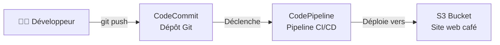

<details>
<summary>Analogie simple pour comprendre</summary>
<br/>

Imaginez une **pizzeria**. Avant, quand le chef modifiait une recette, il devait manuellement aller changer l'affiche du menu dans la vitrine. Avec un pipeline CI/CD, c'est comme si le chef écrivait la nouvelle recette dans un cahier partagé (CodeCommit), et qu'un assistant automatique (CodePipeline) se chargeait immédiatement d'imprimer le nouveau menu et de le mettre en vitrine (S3). Le chef n'a plus qu'à écrire — tout le reste se fait tout seul.

</details>

</details>

<p align="right"><a href="#top">↑ Retour en haut</a></p>

---

<a id="section-2"></a>

<details>
<summary>2 — Concepts clés : CodeCommit, CodePipeline, CI/CD</summary>

<br/>

### Qu'est-ce que CI/CD ?

**CI/CD** signifie **Continuous Integration / Continuous Delivery** (Intégration Continue / Livraison Continue). C'est une pratique DevOps qui automatise les étapes entre un changement de code et sa mise en production.

| Terme | Signification |
|-------|---------------|
| **CI** (Intégration Continue) | Chaque changement de code est automatiquement testé et validé |
| **CD** (Livraison Continue) | Le code validé est automatiquement déployé en production |

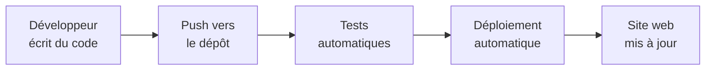

---

### AWS CodeCommit

**CodeCommit** est un service AWS de contrôle de version basé sur Git. C'est l'équivalent AWS de GitHub ou GitLab, mais hébergé et managé par AWS.

**Caractéristiques :**
- Dépôts Git privés, sécurisés et scalables
- Chiffrement en transit et au repos
- Intégration native avec les autres services AWS
- Pas de limite de taille de dépôt

---

### AWS CodePipeline

**CodePipeline** est un service d'orchestration CI/CD. Il automatise les étapes de build, test et déploiement à chaque changement de code.

**Caractéristiques :**
- Détection automatique des changements dans le dépôt source
- Étapes configurables (Source → Build → Test → Deploy)
- Intégration avec CodeCommit, S3, CloudFormation, ECS, Lambda, etc.
- Artefacts stockés dans un bucket S3 dédié

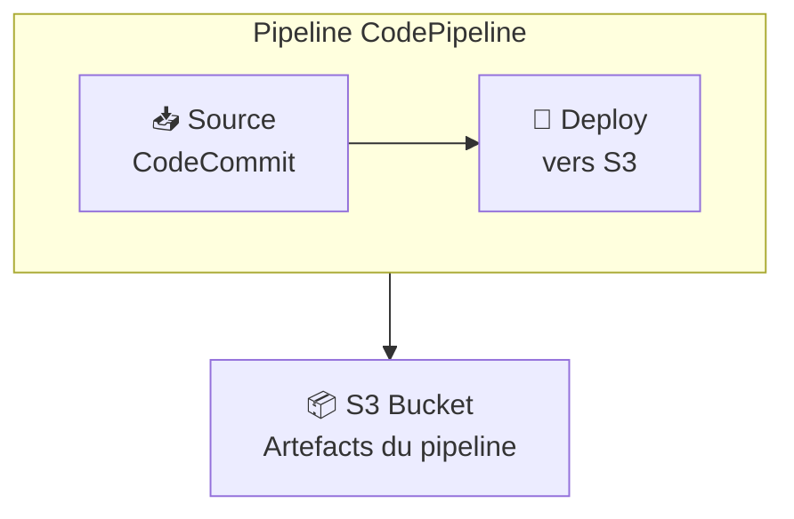

<details>
<summary>Analogie simple pour comprendre</summary>
<br/>

- **CodeCommit** = le **cahier de recettes** partagé de l'équipe. Chaque cuisinier peut y écrire, et on garde l'historique de toutes les modifications.
- **CodePipeline** = le **tapis roulant de l'usine**. Dès qu'une nouvelle recette arrive dans le cahier, le tapis roulant se met en marche : il récupère la recette, la vérifie, et la livre automatiquement au restaurant (le site web).

</details>

<details>
<summary>En résumé très simple</summary>
<br/>

- **CodeCommit** = là où on stocke le code (comme GitHub, mais AWS)
- **CodePipeline** = le robot qui déploie automatiquement quand le code change
- **CI/CD** = plus besoin de copier-coller les fichiers à la main, tout se fait automatiquement

</details>

</details>

<p align="right"><a href="#top">↑ Retour en haut</a></p>

---

<a id="section-3"></a>

<details>
<summary>3 — Architecture avant et après le lab</summary>

<br/>

### Avant le lab

Au début du lab, le développeur utilise le VS Code IDE sur une instance EC2 pour modifier les fichiers et les envoyer manuellement dans le bucket S3 qui héberge le site web.

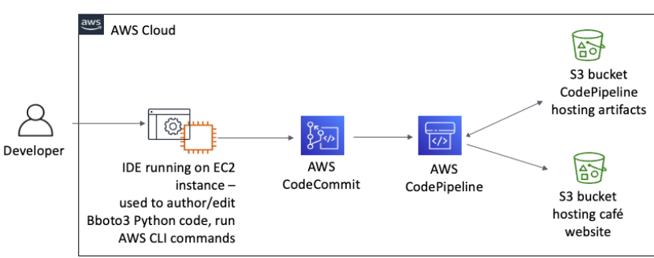

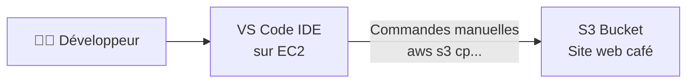

**Problèmes de cette approche :**
- Pas de contrôle de version
- Processus manuel et sujet aux erreurs
- Impossible de collaborer facilement
- Pas de traçabilité des changements

---

### Après le lab

À la fin du lab, un dépôt CodeCommit centralise le code et un pipeline CodePipeline automatise le déploiement.

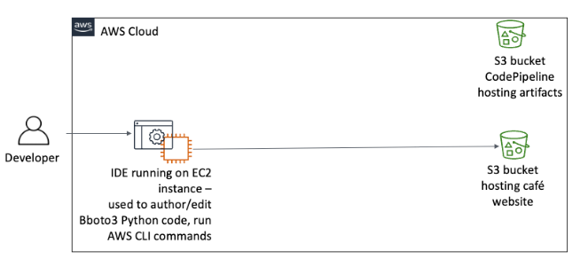

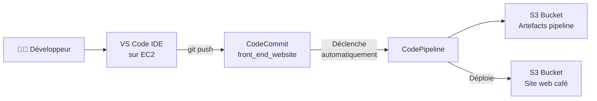

**Avantages de la nouvelle architecture :**
- Code versionné et centralisé
- Déploiement automatique à chaque push
- Historique complet des changements (commits)
- Possibilité de revenir en arrière
- Collaboration facilitée entre développeurs

<details>
<summary>En résumé très simple</summary>
<br/>

- **Avant** : le développeur copie les fichiers à la main vers S3 → risque d'erreur, pas d'historique
- **Après** : le développeur fait `git push` et le pipeline fait le reste tout seul → fiable, tracé, automatique

</details>

</details>

<p align="right"><a href="#top">↑ Retour en haut</a></p>

---

<a id="section-4"></a>

<details>
<summary>4 — Tâche 1 : Préparer l'environnement de développement</summary>

<br/>

### Ce qu'on fait dans cette étape

On prépare l'IDE de travail (VS Code sur EC2) en téléchargeant les fichiers nécessaires et en vérifiant que les outils sont installés.

---

### Étapes

#### 1. Se connecter au VS Code IDE

- Récupérer l'URL et le mot de passe dans les détails du lab
- Ouvrir l'URL dans un navigateur
- Entrer le mot de passe

#### 2. Vérifier que les stacks CloudFormation sont prêtes

- Ouvrir la console **CloudFormation**
- Vérifier que les 3 stacks ont le statut **CREATE_COMPLETE**
- Si ce n'est pas le cas, attendre (environ 12 minutes)

#### 3. Télécharger et extraire les fichiers du lab

```bash
wget https://aws-tc-largeobjects.s3.us-west-2.amazonaws.com/CUR-TF-200-ACCDEV-2-91558/13-lab-ci-cd/code.zip -P /home/ec2-user/environment

unzip code.zip
```

#### 4. Exécuter le script de setup

Ce script installe la version 2 de l'AWS CLI et recrée l'architecture des labs précédents (S3 café, DynamoDB, API Gateway, Elastic Beanstalk).

```bash
chmod +x ./resources/setup.sh && ./resources/setup.sh
```

Quand le script demande :
- **Adresse IP** : entrer votre IPv4 publique (trouvable sur [whatismyipaddress.com](https://whatismyipaddress.com))
- **Email** : entrer un email auquel vous avez accès

#### 5. Vérifier les outils

```bash
aws --version
pip3 show boto3
```

<details>
<summary>En résumé très simple</summary>
<br/>

- On prépare notre espace de travail (IDE + fichiers + outils)
- Le script de setup recrée tout ce qu'on avait fait dans les labs précédents
- On vérifie que AWS CLI v2 et boto3 sont bien installés

</details>

</details>

<p align="right"><a href="#top">↑ Retour en haut</a></p>

---

<a id="section-5"></a>

<details>
<summary>5 — Tâche 2 : Créer un dépôt CodeCommit</summary>

<br/>

### Pourquoi un dépôt CodeCommit ?

Quand un développeur gère son code uniquement en local, il est difficile de :
- Suivre et gérer les changements
- Collaborer avec d'autres développeurs
- Revenir en arrière en cas de problème

CodeCommit résout ces problèmes en fournissant un dépôt Git centralisé, sécurisé et managé par AWS.

---

### Étape 1 : Créer le dépôt

1. Ouvrir la console **CodeCommit**
2. Choisir **Create repository**
3. Configurer :
   - **Repository name** : `front_end_website`
   - **Description** : `Repository for the cafe website front end`
4. Choisir **Create**

---

### Étape 2 : Créer un fichier de test

1. Dans le dépôt, choisir **Create file**
2. Coller le code HTML suivant :

```html
<!DOCTYPE html>
<html>
    <head>
        <title>Test page</title>
    </head>
    <body>
        <h1>
           This is a sample HTML page.
        </h1>
    </body>
</html>
```

3. Configurer le commit :
   - **File name** : `test.html`
   - **Author name** : votre nom
   - **Email** : le même email que dans la tâche 1
   - **Commit message** : `This is my first commit.`
4. Choisir **Commit changes**

---

### Étape 3 : Vérifier le commit

1. Dans le menu de gauche → **Repositories** → **Commits**
2. Cliquer sur le lien du commit ID
3. On voit : l'auteur, le message, la date, le fichier ajouté

---

### Étape 4 : Ajouter un commentaire

1. Dans la section `test.html`, survoler le **+** à la ligne 4
2. Cliquer sur l'icône de commentaire
3. Entrer : `I must add a better title at some point.`
4. Cliquer **Save**

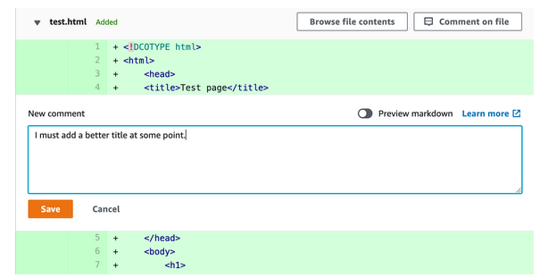

<details>
<summary>Analogie simple pour comprendre</summary>
<br/>

Créer un dépôt CodeCommit, c'est comme ouvrir un **Google Docs partagé** pour le code. Au lieu que chacun ait sa propre copie sur sa clé USB, tout le monde travaille sur le même document centralisé. On peut voir qui a modifié quoi, quand, et laisser des commentaires — exactement comme dans Google Docs.

</details>

</details>

<p align="right"><a href="#top">↑ Retour en haut</a></p>

---

<a id="section-6"></a>

<details>
<summary>6 — Tâche 3 : Créer un pipeline pour automatiser les mises à jour</summary>

<br/>

### Ce qu'on fait dans cette étape

On crée un pipeline CodePipeline qui :
1. **Détecte** les changements dans le dépôt CodeCommit
2. **Récupère** le code modifié
3. **Déploie** automatiquement vers le bucket S3 du site web

---

### Comprendre le fichier de configuration du pipeline

Le fichier `cafe_website_front_end_pipeline.json` définit le pipeline en 3 parties principales :

#### 1. Le rôle IAM

```json
"pipeline": {
  "roleArn": "arn:aws:iam::<ACCOUNT_ID>:role/RoleForCodepipeline",
```

Le pipeline a besoin de permissions pour accéder à CodeCommit et S3.

#### 2. L'étape Source (CodeCommit)

```json
{
  "name": "Source",
  "actions": [{
    "actionTypeId": {
      "category": "Source",
      "provider": "CodeCommit"
    },
    "configuration": {
      "RepositoryName": "front_end_website",
      "BranchName": "main"
    }
  }]
}
```

Le pipeline surveille la branche `main` du dépôt `front_end_website`.

#### 3. L'étape Deploy (S3)

```json
{
  "name": "Deploy",
  "actions": [{
    "actionTypeId": {
      "category": "Deploy",
      "provider": "S3"
    },
    "configuration": {
      "BucketName": "<NOM_DU_BUCKET_SITE>",
      "Extract": "true",
      "CacheControl": "max-age=14"
    }
  }]
}
```

Le code est extrait et déployé dans le bucket S3 du site avec un cache de 14 secondes.

#### 4. Le stockage des artefacts

```json
"artifactStore": {
  "type": "S3",
  "location": "codepipeline-us-east-1-<ACCOUNT_ID>-website"
}
```

Les artefacts intermédiaires du pipeline sont stockés dans un bucket S3 séparé.

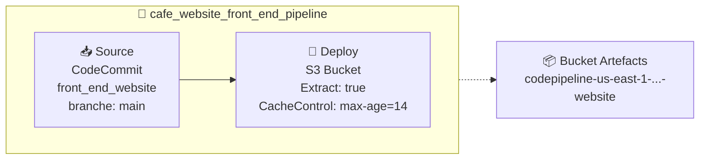

---

### Étapes pratiques

#### 1. Mettre à jour le fichier JSON

- Remplacer `<FMI_1>` par votre **Account ID** :

```bash
aws sts get-caller-identity
```

- Remplacer `<FMI_2>` par le nom du **bucket contenant s3bucket** :

```bash
aws s3 ls
```

- Sauvegarder le fichier

#### 2. Créer le pipeline

```bash
cd ~/environment/resources
aws codepipeline create-pipeline --cli-input-json file://cafe_website_front_end_pipeline.json
```

#### 3. Vérifier dans la console

1. Ouvrir la console **CodePipeline**
2. Cliquer sur **cafe_website_front_end_pipeline**
3. Vérifier que les deux étapes (Source et Deploy) affichent **Succeeded**

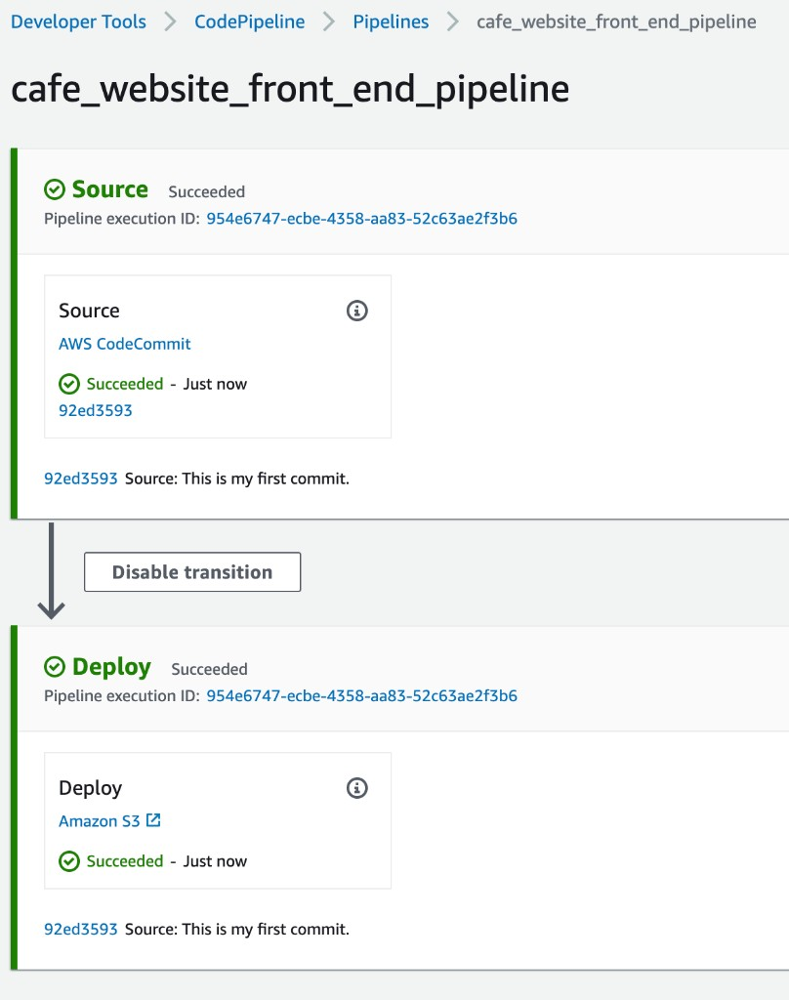

#### 4. Tester le déploiement automatique

```bash
aws cloudfront list-distributions --query DistributionList.Items[0].DomainName --output text
```

Ouvrir dans le navigateur : `https://<cloudfront_domain>/test.html`

La page affiche **"This is a sample HTML page."** — le pipeline fonctionne !

<details>
<summary>Analogie simple pour comprendre</summary>
<br/>

Le fichier JSON du pipeline, c'est comme le **plan de montage d'une chaîne de production**. On y définit : d'où viennent les matériaux (Source = CodeCommit), où on les livre (Deploy = S3), et où stocker les pièces intermédiaires (artefacts). Une fois le plan créé, la chaîne tourne toute seule à chaque nouveau push.

</details>

<details>
<summary>En résumé très simple</summary>
<br/>

- On configure un fichier JSON qui décrit les étapes du pipeline
- Le pipeline a 2 étapes : **Source** (récupérer le code) → **Deploy** (envoyer vers S3)
- On crée le pipeline avec une seule commande AWS CLI
- Dès que le pipeline est créé, il se déclenche automatiquement

</details>

</details>

<p align="right"><a href="#top">↑ Retour en haut</a></p>

---

<a id="section-7"></a>

<details>
<summary>7 — Tâche 4 : Cloner le dépôt dans VS Code IDE</summary>

<br/>

### Pourquoi cloner ?

Modifier du code directement dans la console CodeCommit n'est pas pratique. En clonant le dépôt dans l'IDE, on peut :
- Éditer les fichiers avec un vrai éditeur de code
- Utiliser les outils Git intégrés
- Travailler hors ligne et synchroniser ensuite

---

### Étapes

#### 1. Récupérer l'URL de clone

1. Console **CodeCommit** → dépôt **front_end_website**
2. Colonne **Clone URL** → choisir **Clone HTTPS(GRC)**
3. L'URL ressemble à : `codecommit::us-east-1://front_end_website`

#### 2. Cloner le dépôt

```bash
cd ~/environment
git clone codecommit::us-east-1://front_end_website
```

Résultat attendu :

```
Cloning into 'front_end_website'...
remote: Counting objects: 3, done.
Unpacking objects: 100% (3/3), 290 bytes | 290.00 KiB/s, done
```

Le dossier `front_end_website` apparaît maintenant dans l'explorateur de fichiers de l'IDE.

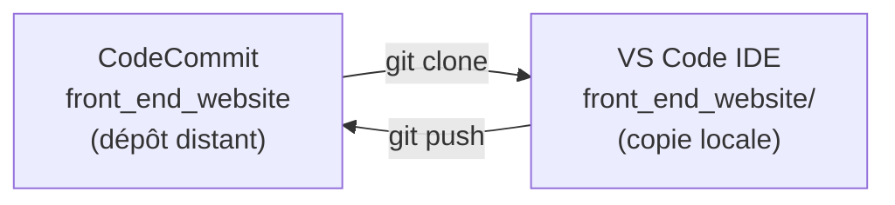

<details>
<summary>En résumé très simple</summary>
<br/>

- **git clone** = télécharger une copie du dépôt sur votre machine
- Vous pouvez maintenant modifier les fichiers dans VS Code au lieu de la console web
- Les deux copies (locale et distante) restent synchronisées grâce à Git

</details>

</details>

<p align="right"><a href="#top">↑ Retour en haut</a></p>

---

<a id="section-8"></a>

<details>
<summary>8 — Tâche 5 : Explorer l'intégration Git dans VS Code</summary>

<br/>

### Ce qu'on fait dans cette étape

On apprend à utiliser l'intégration Git de VS Code pour gérer le dépôt sans taper de commandes.

---

### 1. Explorer la gestion des branches

- En bas à gauche de l'IDE, l'icône **Branch** indique la branche active (`main`)
- En haut, les trois points (**...**) à droite de **SOURCE CONTROL** donnent accès aux options Git

---

### 2. Modifier un fichier

1. Dans l'explorateur, ouvrir `front_end_website/test.html`
2. **Modifier le titre** (ligne 4) :

```html
<title>Best test page ever.</title>
```

3. **Sauvegarder** le fichier
4. Le chiffre **1** apparaît à côté de l'icône Branch → un changement attend d'être commité

---

### 3. Commiter et pousser

On peut aussi le faire en ligne de commande :

```bash
cd ~/environment/front_end_website
git status
```

**Avec l'interface VS Code :**

1. Cliquer sur l'icône **Branch** (Source Control)
2. Dans **Message**, entrer : `Updated the title`
3. Sur le bouton **Commit**, cliquer sur la flèche **▼**
4. Choisir **Commit & Push** → **Yes**

---

### 4. Vérifier dans CodeCommit

1. Console **CodeCommit** → **front_end_website** → **Commits**
2. Le dernier commit montre la différence :
   - Ligne **rouge** (avec `-`) = ancien contenu
   - Ligne **verte** (avec `+`) = nouveau contenu

---

### 5. Vérifier le déploiement automatique

Retourner sur l'onglet `test.html` dans le navigateur et rafraîchir. Le titre de l'onglet a changé pour **"Best test page ever."** — le pipeline a automatiquement déployé la modification !

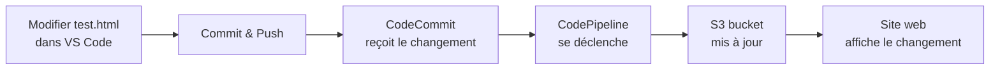

<details>
<summary>Analogie simple pour comprendre</summary>
<br/>

C'est exactement comme **sauvegarder un document Word dans OneDrive**. Vous modifiez le fichier sur votre PC (VS Code), vous cliquez "enregistrer et synchroniser" (Commit & Push), et la version en ligne (CodeCommit) se met à jour. La différence, c'est qu'en plus, un robot (CodePipeline) détecte le changement et met à jour le site web automatiquement.

</details>

</details>

<p align="right"><a href="#top">↑ Retour en haut</a></p>

---

<a id="section-9"></a>

<details>
<summary>9 — Tâche 6 : Pousser le code du site café vers CodeCommit</summary>

<br/>

### Ce qu'on fait dans cette étape

On remplace le fichier de test par le vrai code du site web du café, puis on vérifie que le pipeline déploie tout automatiquement.

---

### Étapes

#### 1. Supprimer le fichier test

Dans l'explorateur VS Code, supprimer `front_end_website/test.html`.

#### 2. Copier le vrai code du site

```bash
cd ~/environment
cp -r ./resources/website/* front_end_website
```

#### 3. Supprimer l'ancien dossier website

```bash
rm -r ./resources/website
```

Le dossier `front_end_website` contient maintenant tous les fichiers du site café (HTML, CSS, JS, images...).

#### 4. Commiter et pousser

1. Cliquer sur l'icône **Branch** (Source Control)
2. Message : `Providing the website`
3. **Commit & Push** → **Yes**

#### 5. Vérifier le site

1. Dans le navigateur, aller à `https://<cloudfront_domain>` (sans `/test.html`)
2. Le site web du café s'affiche !

#### 6. Vérifier le cache-control

1. Sur le site, ouvrir les **DevTools** du navigateur (clic droit → Inspecter)
2. Onglet **Network** → rafraîchir la page
3. Cliquer sur `pastries.js` → onglet **Headers**
4. Dans **Response Headers**, vérifier : `cache-control: max-age=14`

Cela confirme que le pipeline a bien appliqué la configuration de cache définie dans le JSON.

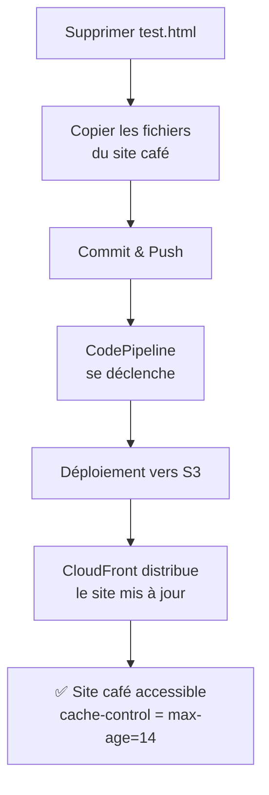

<details>
<summary>En résumé très simple</summary>
<br/>

- On remplace le fichier test par le vrai site web
- Un seul `git push` suffit pour déployer tout le site
- Le pipeline s'occupe de tout : extraction, copie vers S3, configuration du cache
- Le site est accessible via CloudFront immédiatement après

</details>

</details>

<p align="right"><a href="#top">↑ Retour en haut</a></p>

---

<a id="section-10"></a>

<details>
<summary>10 — Résumé des commandes</summary>

<br/>

```bash
# Télécharger les fichiers du lab
wget https://aws-tc-largeobjects.s3.us-west-2.amazonaws.com/CUR-TF-200-ACCDEV-2-91558/13-lab-ci-cd/code.zip -P /home/ec2-user/environment
unzip code.zip

# Exécuter le script de setup
chmod +x ./resources/setup.sh && ./resources/setup.sh

# Vérifier AWS CLI et boto3
aws --version
pip3 show boto3

# Trouver votre Account ID
aws sts get-caller-identity

# Lister les buckets S3
aws s3 ls

# Créer le pipeline
cd ~/environment/resources
aws codepipeline create-pipeline --cli-input-json file://cafe_website_front_end_pipeline.json

# Trouver le domaine CloudFront
aws cloudfront list-distributions --query DistributionList.Items[0].DomainName --output text

# Cloner le dépôt
cd ~/environment
git clone codecommit::us-east-1://front_end_website

# Voir le statut des fichiers
cd ~/environment/front_end_website
git status

# Copier le code du site dans le dépôt
cd ~/environment
cp -r ./resources/website/* front_end_website

# Supprimer l'ancien dossier
rm -r ./resources/website
```

</details>

<p align="right"><a href="#top">↑ Retour en haut</a></p>

---

<a id="section-11"></a>

<details>
<summary>11 — Erreurs fréquentes</summary>

<br/>

### 1. Erreur lors de la création du pipeline

**Cause probable :** mauvais Account ID ou mauvais nom de bucket dans le fichier JSON.

**Solution :** vérifier avec `aws sts get-caller-identity` et `aws s3 ls`, corriger les placeholders, relancer la commande.

---

### 2. Le pipeline échoue à l'étape Source

**Cause probable :** le nom du dépôt ou de la branche ne correspond pas.

**Solution :** vérifier que le dépôt s'appelle bien `front_end_website` et que la branche est `main`.

---

### 3. Le pipeline échoue à l'étape Deploy

**Cause probable :** le rôle IAM `RoleForCodepipeline` n'a pas les permissions suffisantes sur le bucket S3.

**Solution :** vérifier les permissions du rôle dans la console IAM.

---

### 4. Le site ne se met pas à jour après un push

**Causes possibles :**
- Le pipeline est encore en cours d'exécution (vérifier dans la console CodePipeline)
- Le cache CloudFront retient l'ancienne version (attendre ou invalider le cache)
- Le `cache-control: max-age=14` signifie que le navigateur peut mettre en cache pendant 14 secondes

---

### 5. `git clone` échoue

**Cause probable :** le helper `git-remote-codecommit` n'est pas installé ou l'URL est incorrecte.

**Solution :** vérifier que l'URL commence bien par `codecommit::` et que le package `git-remote-codecommit` est installé :

```bash
pip3 install git-remote-codecommit
```

---

### 6. `cache-control` affiche `max-age=0` au lieu de `14`

**Cause :** le pipeline n'a pas encore terminé le déploiement.

**Solution :** attendre quelques secondes, rafraîchir la page et vérifier à nouveau.

</details>

<p align="right"><a href="#top">↑ Retour en haut</a></p>

---

<a id="section-12"></a>

<details>
<summary>12 — Conclusion</summary>

<br/>

### Ce qu'on a accompli dans ce lab

Dans ce lab, on a mis en place un **workflow CI/CD complet** pour le site web du café :

1. **CodeCommit** — dépôt Git centralisé pour le code du site
2. **CodePipeline** — pipeline automatisé qui déploie vers S3 à chaque push
3. **VS Code IDE** — environnement de développement avec intégration Git
4. **S3 + CloudFront** — hébergement et distribution du site web

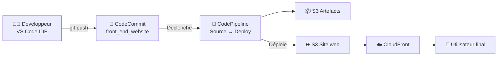

### Ce que ça change pour le café

| Avant | Après |
|-------|-------|
| Mise à jour manuelle | Déploiement automatique |
| Pas de contrôle de version | Historique complet des commits |
| Risque d'erreur humaine | Processus fiable et reproductible |
| Un seul développeur | Collaboration facilitée |
| Pas de traçabilité | Logs de commits et commentaires |

### Compétences acquises

- Créer un dépôt CodeCommit
- Configurer un pipeline CodePipeline via JSON
- Cloner un dépôt et gérer le code avec Git
- Commiter et pousser des changements
- Vérifier le déploiement automatique

<details>
<summary>Analogie finale</summary>
<br/>

Avant ce lab, Sofía était comme une **factrice** : à chaque changement du site, elle devait prendre les fichiers, marcher jusqu'à la boîte aux lettres (le bucket S3) et les déposer à la main. Maintenant, elle a installé un **système de tubes pneumatiques** (le pipeline) : elle met le code dans le tube (git push), et il arrive automatiquement à destination. Elle peut se concentrer sur l'amélioration du site au lieu de perdre du temps sur la livraison.

</details>

### Pour aller plus loin

Ce lab a couvert un pipeline simple à deux étapes (Source → Deploy). Dans un vrai projet, on ajouterait :
- **Étape Build** — compiler le code, minifier les fichiers CSS/JS
- **Étape Test** — exécuter des tests automatiques
- **Approbation manuelle** — demander une validation avant le déploiement en production
- **Notifications SNS** — envoyer des alertes en cas d'échec

</details>

<p align="right"><a href="#top">↑ Retour en haut</a></p>
